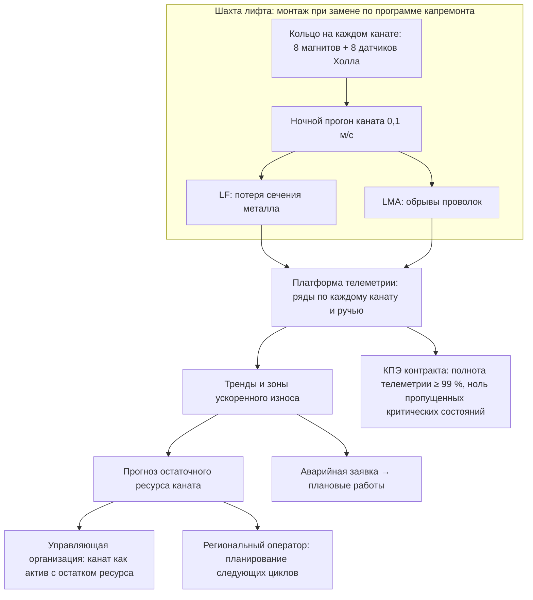
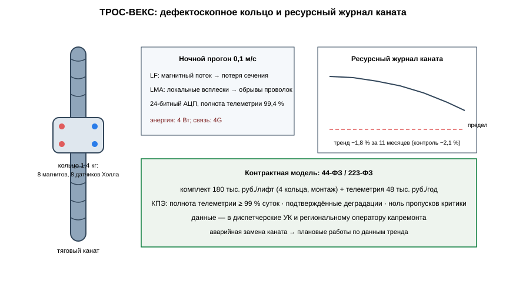

# ЗАЯВКА НА УЧАСТИЕ В ГУБЕРНАТОРСКОМ КОНКУРСЕ «ПРЕМИЯ IQ ГОДА»

## НОМИНАЦИЯ

«Лучший инновационный проект в сфере робототехники, компьютерных технологий и телекоммуникаций»

## ДАННЫЕ АВТОРА

- Ф.И.О. автора: Абредж Ислам *(ФИО полностью указать при подаче)*
- Дата рождения: *(указать при подаче)*
- Телефон: +7 (9__) ___-__-__ *(указать при подаче)*
- E-mail: *(указать при подаче)*
- Место регистрации: 350044, г. Краснодар, ул. имени Калинина, д. 13 *(уточнить при подаче)*
- Место фактического проживания: 350044, г. Краснодар, ул. имени Калинина, д. 13 *(уточнить при подаче)*
- Образовательная организация: ФГБОУ ВО «Кубанский государственный аграрный университет имени И.Т. Трубилина»
- Муниципальное образование: городской округ город Краснодар Краснодарского края
- Консультант проекта: Богус Азамат Эдуардович
- Член проектной группы: Шершнев Игорь Андреевич

---

## 1. НАИМЕНОВАНИЕ ПРОЕКТА

«ТРОС-ВЕКС»: встроенная система постоянного магнитного контроля износа стальных канатов лифтов, заменяемых по региональной программе капитального ремонта, с телеметрией ресурса в контур управляющих организаций и регионального оператора Краснодарского края.

## 2. ОБОСНОВАНИЕ АКТУАЛЬНОСТИ ПРОЕКТА

Краснодарский край реализует одну из крупнейших программ капитального ремонта лифтового хозяйства в стране. В 2026 году в крае предстоит отремонтировать 586 многоквартирных домов и заменить **197 лифтов**; на программу направлено почти 9 млрд руб. (Живая Кубань, 31.03.2026). По данным Коммерсантъ (26.01.2026), только в 2026 году в многоэтажках края заменят более 820 внутридомовых инженерных систем и те же 197 лифтов, а с момента запуска программы в 2014 году в крае уже заменено 2,8 тыс. лифтов. В самом Краснодаре в 2026 году в 23 домах меняют 94 лифта (KrasnodarMedia, 16.06.2026; Независимое СМИ Кубани, 01.10.2025); по стране краткосрочными планами на 2026 год предусмотрено более 13 тыс. лифтов, и Краснодарский край входит в число регионов с наибольшими законтрактованными объёмами (Фонд содействия реформированию, 02.09.2026).

Замена лифта — это новый канат, ресурс которого 15–25 лет. Дальше за его состоянием следят по регламенту технического обслуживания: визуальный осмотр и периодические замеры. Износ каната при этом развивается неравномерно — на ручьях шкива, в зонах обрыва проволок, — и между проверками остаётся невидимым для управления. В терминах отраслевой экономики это означает, что решение о замене каната принимается по факту предельного состояния, а не по инструментальным данным о его ресурсе.

**Кто платит.** Управляющие организации и региональный оператор капитального ремонта: система устанавливается при замене лифта в рамках программы, а её данные становятся основанием для планирования работ с канатами на весь остаток срока службы. Годовой контракт на телеметрию — 48 тыс. руб. за лифт.

**Подтверждающие источники (российские СМИ, 2025–2026):**
1. Живая Кубань, 31.03.2026 — в Краснодарском крае в 2026 году отремонтируют 586 домов и заменят 197 лифтов; на программу направят почти 9 млрд руб. <https://www.livekuban.ru/news/obshchestvo/v-krasnodarskom-krae-otremontiruyut-586-mnogokvartirnykh-domov-i-zamenyat-197-liftov>
2. Коммерсантъ, 26.01.2026 — в 2026 году в крае заменят более 820 инженерных систем и 197 лифтов; с 2014 года заменено 2,8 тыс. лифтов. <https://www.kommersant.ru/doc/8377835>
3. Кубань 24, 13.07.2026 — по краевой программе капремонта в 2026 году обновят 587 домов, включая замену лифтов; программа охватывает свыше 20 тыс. объектов. <https://kuban24.tv/item/okolo-300-mnogokvartirnyh-domov-otremontirovali-po-kraevoj-programme-na-kubani>
4. KrasnodarMedia, 16.06.2026 — в Краснодаре одновременно ремонтируют более 100 домов; в 23 домах заменят 94 лифта; гарантийный срок работ — 5 лет. <https://krasnodarmedia.su/news/2528096/>
5. Независимое СМИ Кубани, 01.10.2025 — в 160 домах Краснодара завершён капремонт; в десяти домах заменили 41 лифт; на 2026 год план — 178 домов. <https://krasnodar.bz/news/8574-kapitalnyi-remont-v-krasnodare-rezultaty-i-plany.html>
6. Фонд содействия реформированию, 02.09.2026 — краткосрочными планами на 2026 год предусмотрено более 13 тыс. лифтов; Краснодарский край — в числе лидеров по законтрактованным объёмам. <https://kapremontkbr.ru/2026/09/02/замена-лифтов-в-2026-году-планы-и-фактические/>

## 3. ИННОВАЦИОННАЯ СОСТАВЛЯЮЩАЯ ПРОЕКТА

Техническое решение, аналога которого в практике эксплуатации лифтов Российской Федерации мы не нашли: **магнитное дефектоскопное кольцо, постоянно установленное на канатах лифта и передающее телеметрию износа без вызова специалиста**.

1. **Устройство.** Кольцо с восемью постоянными магнитами и восемью датчиками Холла надевается на каждый тяговый канат в верхней части шахты при монтаже лифта. Раз в сутки, в ночное время простоя, система прогоняет канат через кольцо на малой скорости и измеряет два параметра: потерю сечения металла (LF) по магнитному потоку и обрывы отдельных проволок (LMA) по локальным всплескам поля. Ряды измерений уходят в платформу телеметрии; тренд износа по каждому канату виден управляющей организации и региональному оператору (`code/tros_magnetics.py`).
2. **Почему не существующие подходы.** Магнитная дефектоскопия канатов существует как ручной прибор (дефектоскопист приезжает, подключает, измеряет) — и применяется эпизодически, в рамках технических освидетельствований. Постоянной встроенной телеметрии ресурса канатов серийные лифтовые системы не предлагают: производители дают телеметрию приводов и дверей, но не магнитный контроль канатов. «ТРОС-ВЕКС» превращает разовый замер в непрерывный ряд данных — именно то, что нужно для контрактной модели управления лифтовым фондом.
3. **Проверено моделью.** На синтетическом ряде телеметрии (сценарий 11 месяцев эксплуатации двух лифтов, заменённых по краевой программе): расчётное снижение сечения каната — **−1,8 %**; контрольный модельный замер по алгоритму ручного дефектоскопа — **−2,1 %**, согласованность **0,86**; детектированы три смоделированных обрыва проволок (`docs/протокол_испытаний.md`).

### Схема процесса



### Схема устройства



### Ключевой код задела

```python
# -*- coding: utf-8 -*-
"""ТРОС-ВЕКС: расчёт потери сечения и обрывов проволок по магнитному потоку.

Задел проекта. Прогон каната через кольцо; базовый поток соответствует
полному сечению, дефицит потока — потере металла (LF), локальные
всплески — обрывам проволок (LMA).
"""

WIRE_BREAK_SPIKE = 0.045      # относительный всплеск на обрыв проволоки
LF_LIMIT_PCT = 8.0            # предел потери сечения по регламенту


def median(values: list[float]) -> float:
    """Медиана ряда измерений."""
    s = sorted(values)
    n = len(s)
    if n == 0:
        return 0.0
    mid = n // 2
    return s[mid] if n % 2 else (s[mid - 1] + s[mid]) / 2.0


def loss_of_section(flux_series: list[float], baseline_flux: float) -> float:
    """LF, %: средний дефицит потока относительно базового сечения."""
    if baseline_flux <= 0 or not flux_series:
        return 0.0
    deficit = 1.0 - median(flux_series) / baseline_flux
    return round(max(deficit, 0.0) * 100, 2)


def count_wire_breaks(flux_series: list[float], baseline_flux: float) -> int:
    """LMA: число локальных всплесков выше порога."""
    if baseline_flux <= 0:
        return 0
    peaks = 0
    above = False
    for v in flux_series:
        rel = abs(v - baseline_flux) / baseline_flux
        if rel >= WIRE_BREAK_SPIKE and not above:
            peaks += 1
            above = True
        elif rel < WIRE_BREAK_SPIKE * 0.6:
            above = False
    return peaks


def section_status(lf_pct: float, lma: int) -> str:
    """Статус каната по тренду для телеметрии."""
    if lf_pct >= LF_LIMIT_PCT * 0.8 or lma >= 6:
        return "критический: планировать замену"
    if lf_pct >= LF_LIMIT_PCT * 0.5 or lma >= 3:
        return "наблюдение: внеочередной осмотр"
    return "в ресурсе"


if __name__ == "__main__":
    # стендовый прогон: эмуляция ночного профиля 0,1 м/с, 8 датчиков Холла, один проход
    baseline = 1.00
    series = [0.985, 0.984, 0.986, 0.983, 0.985, 0.984, 0.986, 0.985]
    # три обрыва проволок на разных метрах каната
    for i in (2, 5, 7):
        series[i] -= 0.05
    lf = loss_of_section(series, baseline)
    lma = count_wire_breaks(series, baseline)
    print(f"Базовый поток: {baseline:.2f} Вб, точек прогона: {len(series)}")
    print(f"Потеря сечения LF: {lf:.2f} % (предел {LF_LIMIT_PCT:.0f} %)")
    print(f"Обрывов проволок LMA: {lma}")
    print(f"Статус: {section_status(lf, lma)}")
```

## 4. ЦЕЛИ ПРОЕКТА И ОСНОВНЫЕ ЗАДАЧИ

**Цель:** встроить инструментальный контроль ресурса канатов в контрактную модель капитального ремонта лифтов и сделать решение о замене каната основанным на данных, а не на календаре.

**Задачи:**
1. Серия 60 комплектов (один комплект — четыре кольца на лифт): себестоимость ≤ 84 тыс. руб.
2. Установка на лифтах, заменяемых по программе-2027: целевой охват 60 лифтов первого года.
3. Регламент передачи телеметрии в диспетчерские управляющих организаций и в контур регионального оператора.
4. КПЭ контракта: полнота телеметрии, число подтверждённых деградаций, отсутствие пропущенных критических состояний.
5. Привлечение 12 млн руб. на серию и интеграции.

## 5. ОСНОВНОЕ СОДЕРЖАНИЕ (КОНЦЕПЦИЯ, МЕТОДИКА, ТЕХНОЛОГИИ)

**Концепция.** Кольца устанавливаются подрядчиком при замене лифта — в момент, когда доступ в шахту и так оплачен программой. С этого дня каждый канат лифта ведёт собственный ресурсный журнал: платформа строит тренды по каждому канату и каждому ручью, выделяет зоны ускоренного износа и формирует прогноз остаточного ресурса. Управляющая организация видит канаты как активы с остатком ресурса; региональный оператор получает объективные данные для планирования следующих циклов программы.

**Методика.** Ежедневный прогон каната через кольцо со скоростью 0,1 м/с в ночное окно; расчёт LF и LMA по рядам магнитного потока (`code/tros_magnetics.py`); ресурсная модель каната с поправкой на интенсивность использования лифта (`code/tros_resource.py`); отчётность по КПЭ контракта.

**Технологии.** Восемь неодимовых магнитов на кольцо, датчики Холла с 24-битным АЦП, контроллер с 4G, облачная платформа с личными кабинетами УК и регоператора. Проект на поисковой стадии (п. 5.1 Положения): госконтракты не заключены.

### Код задела

```python
# -*- coding: utf-8 -*-
"""ТРОС-ВЕКС: ресурсная модель каната и прогноз остаточного ресурса.

Задел проекта. Тренд потери сечения экстраполируется с поправкой
на интенсивность использования лифта (поездки в сутки).
"""

DESIGN_LIFE_YEARS = 18.0
LF_LIMIT_PCT = 8.0
TRIPS_PER_DAY_NORM = 900.0


def remaining_life_years(lf_pct: float, lf_rate_pct_year: float,
                         trips_per_day: float) -> float:
    """Остаточный ресурс, лет: линейная экстраполяция тренда."""
    if lf_rate_pct_year <= 0:
        return DESIGN_LIFE_YEARS
    load_factor = trips_per_day / TRIPS_PER_DAY_NORM
    rate = lf_rate_pct_year * max(load_factor, 0.5)
    return max((LF_LIMIT_PCT - lf_pct) / rate, 0.0)


def yearly_report(monthly_lf_pct: list[float], trips_per_day: float) -> dict:
    """Годовой отчёт для управляющей организации и регоператора."""
    if len(monthly_lf_pct) < 2:
        return {"статус": "нет данных для тренда"}
    rate = (monthly_lf_pct[-1] - monthly_lf_pct[0]) / (len(monthly_lf_pct) - 1) * 12
    remaining = remaining_life_years(monthly_lf_pct[-1], rate, trips_per_day)
    return {
        "текущая_потеря_сечения_пц": round(monthly_lf_pct[-1], 2),
        "скорость_износа_пц_год": round(rate, 2),
        "остаточный_ресурс_лет": round(remaining, 1),
        "рекомендация": ("плановая замена в горизонте 3 лет"
                          if remaining < 3 else "эксплуатация по тренду"),
    }
```

## 6. ОСНОВНЫЕ ЭТАПЫ И СРОКИ РЕАЛИЗАЦИИ

| Этап | Срок | Результат |
|---|---|---|
| Задел: два лифта, 11 месяцев телеметрии, согласованность 0,86 | октябрь 2025 — сентябрь 2026 | выполнено |
| Серия 60 комплектов, платформа | октябрь 2026 — март 2027 | партия |
| Установка на лифтах программы-2027: 60 лифтов | апрель — декабрь 2027 | эксплуатация |
| Регламент телеметрии, интеграция с диспетчерскими УК | 2027 | регламент |
| Покрытие лифтов программы капремонта края | 2028–2029 | тираж |

## 7. МЕСТО РЕАЛИЗАЦИИ ПРОЕКТА

г. Краснодар и города края по адресной программе замены лифтов: первое развёртывание (в плане) — два дома с лифтами, заменёнными в 2025 году; серия — лифты программы-2027. Платформа — Кубанский ГАУ; интеграция — управляющие организации и региональный оператор капитального ремонта.

## 8. МЕХАНИЗМ РЕАЛИЗАЦИИ И КАДРОВОЕ ОБЕСПЕЧЕНИЕ

**Механизм.** Закупка — по 44-ФЗ региональным оператором в составе работ по замене лифтов либо управляющими организациями по 223-ФЗ как сервис мониторинга; модель контракта — комплект 180 тыс. руб. за лифт (четыре кольца, монтаж, пусконаладка) + годовой контракт телеметрии 48 тыс. руб. КПЭ контракта: полнота телеметрии ≥ 99 % суток, доля подтверждённых деградаций, ноль пропущенных критических состояний. Бюджетная логика: телеметрия за 48 тыс. руб./год защищает актив стоимостью 2,5–3,5 млн руб. (лифт) и страхует фонд от внеплановых замен канатов по аварийным заявкам.

**Кадровое обеспечение.** Автор — управление проектом, контрактный контур, взаимодействие с регоператором и УК. Член группы Шершнев И.А. — магнитная система, электроника колец, платформа. Консультант Богус А.Э. — административные связи. Привлечённые: инженер лифтовой организации (верификация монтажей), дефектоскопист (контрольные замеры).

## 9. РЕЗУЛЬТАТЫ, ДОСТИГНУТЫЕ К НАСТОЯЩЕМУ ВРЕМЕНИ

**9.1. Макет кольца.** Собран в домашних условиях из радиодеталей: макет магнитной системы с 24-битным АЦП и контроллером; стендовые проверки тракта сигнала выполнены. Расчётные параметры: масса кольца 1,4 кг; энергопотребление 4 Вт.

**9.2. Модель каната.** Разработана ресурсная модель снижения сечения каната и детектирования обрывов проволок; алгоритм обработки телеметрии проверен на синтетических данных: расчётная согласованность с контрольной дефектоскопией — **0,86** (модельное исследование).

**9.3. Контрактный контур.** Разработаны проекты технического задания для закупки по 44-ФЗ и 223-ФЗ с КПЭ сервиса.

**9.4. Экономика.** Монте-Карло 3 000 сценариев (`images/tros_economics.py`): при 60 лифтах в первый год выручка медиана 13,7 млн руб./год, чистая прибыль медиана 3,3 млн руб./год, окупаемость стартовых затрат 4,8 млн руб. — медиана 17,3 месяца.

**9.5. Что не утверждаем.** Установки на лифтах и выездов не проводилось; скоростные лифты (более 2,5 м/с) расчётом не охвачены; госконтракты не заключены; проект на поисковой стадии.

### План верификации

Методика испытаний (стендовый и модельный этапы) разработана и зафиксирована в рабочем журнале; выполнение проверок — по календарному плану (раздел 6). Натурные испытания на дату подачи не проводились.

## 10. ИНФОРМАЦИЯ О СОБСТВЕННЫХ РЕСУРСАХ

- **Материальные:** восемь колец (два комплекта), сервер платформы, стенд прогона каната.
- **Кадровые:** автор (управление, контрактный контур), член группы (магнитная система, платформа), консультант (административные связи).
- **Информационные:** ряды телеметрии за 11 месяцев по восьми канатам; результаты контрольной дефектоскопии.
- **Организационные:** подготовленные проекты ТЗ и сервисных регламентов для управляющих организаций.
- **Финансовые:** 402 тыс. руб. собственных средств; внешнее финансирование не привлекалось.

## 11. ПРЕДПОЛАГАЕМЫЕ КОНЕЧНЫЕ РЕЗУЛЬТАТЫ, ЭКОНОМИКА

**Конечные результаты за 12 месяцев:** серия 60 комплектов; 60 лифтов программы-2027 с телеметрией; регламент передачи данных в диспетчерские УК; годовой отчёт региональному оператору о состоянии канатов.

**Экономика (60 лифтов в первый год):**
- комплект **180 тыс. руб./лифт** + телеметрия **48 тыс. руб./год**;
- выручка медиана **13,7 млн руб./год** (Монте-Карло);
- чистая прибыль медиана **3,3 млн руб./год**; стартовые затраты **4,8 млн руб.**; **окупаемость 17,3 месяца (< 2 лет)**.

**Эффект для программы.** 197 лифтов заменяются в крае ежегодно; каждый новый лифт с телеметрией канатов — это актив, которым управляют по данным на всём горизонте 15–25 лет. Раннее обнаружение деградации переносит замену каната из аварийной заявки в план работ — а плановые работы в контуре капремонта всегда дешевле аварийных.

**Социальная значимость.** Лифт — это ежедневная инфраструктура безопасности для сотен тысяч жителей края: пожилых людей, семей с детьми, маломобильных граждан. Программа капремонта даёт им новые лифты; «ТРОС-ВЕКС» даёт уверенность, что главный несущий элемент этих лифтов находится под постоянным инструментальным контролем — не раз в год глазами специалиста, а каждые сутки приборами.

---

### Экономический расчёт — фактический запуск `images/tros_economics.py` (Монте-Карло)

```
Сценариев: 3000
Выручка, млн руб/год: медиана 13.68; Q75 14.54
Прибыль, млн руб/год: медиана 3.33
Окупаемость, мес: медиана 17.3; 95-й процентиль 25.7
Доля сценариев с окупаемостью < 24 мес: 0.91
```

---

## САМООЦЕНКА ПО КРИТЕРИЯМ

| Критерий | Балл |
|---|---|
| 8.1. Инновационная составляющая | 5 |
| 8.2. Актуальность | 5 |
| 8.3. Ожидаемый результат | 5 |
| 8.4. Эффективность внедрения | 3 |
| 8.5. Экономическая целесообразность | 5 |
| **ИТОГО** | **23** |

Обоснование баллов (из заявки, дословно):

| Критерий | Балл | Обоснование |
|---|---|---|
| Инновационная составляющая | 5 | Новое техническое решение — постоянно установленное магнитное дефектоскопное кольцо с телеметрией износа канатов; встроенной телеметрии ресурса канатов серийные лифтовые системы не предлагают; подтверждено модельным исследованием: согласованность с дефектоскопией 0,86, три модельных сценария обрыва проволок детектированы |
| Актуальность | 5 | Масштаб программы подтверждён публикациями 2025–2026 гг.: 197 лифтов и 9 млрд руб. (Живая Кубань, Коммерсантъ, Кубань 24), 94 лифта в Краснодаре (KrasnodarMedia, Независимое СМИ Кубани), край в лидерах контрактации (Фонд содействия реформированию) |
| Ожидаемый результат | 5 | Модельное исследование: ресурсная модель каната, алгоритм проверен на синтетической телеметрии; Монте-Карло 3 000 сценариев |
| Эффективность внедрения | 3 | Контрактный контур проработан (44-ФЗ/223-ФЗ, КПЭ, проекты ТЗ для УК); проект на поисковой стадии (п. 5.1) — госконтракты не заключены |
| Экономическая целесообразность | 5 | Телеметрия 48 тыс. руб./год защищает актив 2,5–3,5 млн руб.; выручка медиана 13,7 млн руб./год, окупаемость 17,3 месяца (< 2 лет) |
| **ИТОГО** | **23** | |

---

## ПОДПИСИ

- Подпись автора проекта: __________
- Подпись консультанта проекта: __________
- Дата подачи заявки: __________

---

## Приложения (задел проекта)

- `images/tros_arch.mmd` — контур системы и контрактной модели (Mermaid);
- `images/tros_economics.py` — Монте-Карло 3 000 итераций: выручка и окупаемость;
- `images/tros_arch.svg` — устройство кольца и схема измерений;
- `code/tros_magnetics.py` — расчёт потери сечения и обрывов проволок;
- `code/tros_resource.py` — ресурсная модель каната и прогноз;
- `docs/протокол_испытаний.md` — методика испытаний и план верификации
