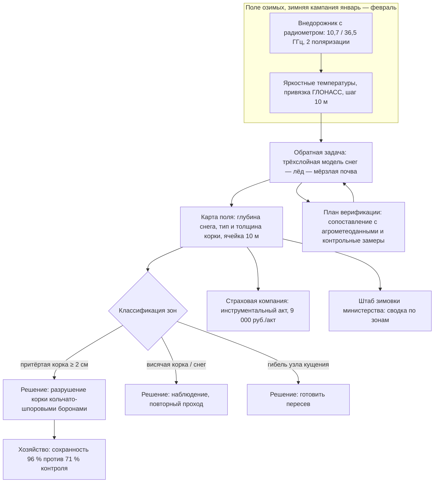
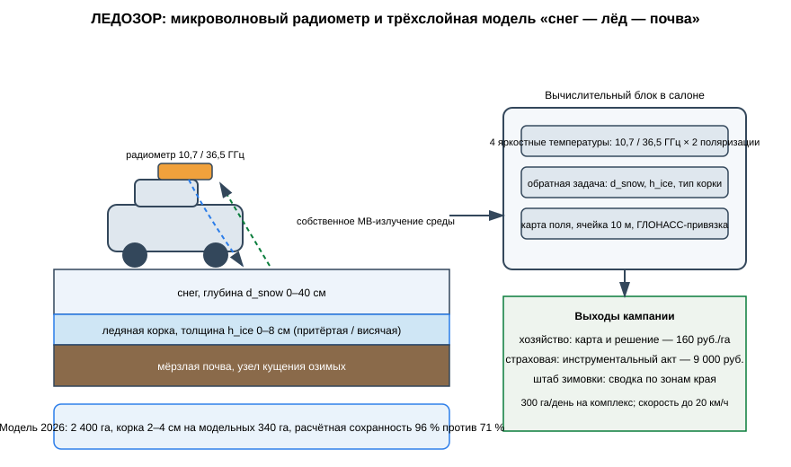

# ЗАЯВКА НА УЧАСТИЕ В ГУБЕРНАТОРСКОМ КОНКУРСЕ «ПРЕМИЯ IQ ГОДА»

## НОМИНАЦИЯ

«Лучший инновационный проект в сфере агропромышленного комплекса, биотехнологий и пищевой промышленности»

## ДАННЫЕ АВТОРА

- Ф.И.О. автора: Абредж Ислам *(ФИО полностью указать при подаче)*
- Дата рождения: *(указать при подаче)*
- Телефон: +7 (9__) ___-__-__ *(указать при подаче)*
- E-mail: *(указать при подаче)*
- Место регистрации: 350044, г. Краснодар, ул. имени Калинина, д. 13 *(уточнить при подаче)*
- Место фактического проживания: 350044, г. Краснодар, ул. имени Калинина, д. 13 *(уточнить при подаче)*
- Образовательная организация: ФГБОУ ВО «Кубанский государственный аграрный университет имени И.Т. Трубилина»
- Муниципальное образование: городской округ город Краснодар Краснодарского края
- Консультант проекта: Богус Азамат Эдуардович
- Член проектной группы: Шершнев Игорь Андреевич

---

## 1. НАИМЕНОВАНИЕ ПРОЕКТА

«ЛЕДОЗОР»: мобильный комплекс микроволнового радиометрического профилирования «снег — ледяная корка — почва» полей озимых культур для инструментальной поддержки решений о разрушении корки, пересевах и страховых выплатах в Краснодарском крае.

## 2. ОБОСНОВАНИЕ АКТУАЛЬНОСТИ ПРОЕКТА

Зимовка озимых — это управляемый риск стоимостью в основной продукт региона. Под урожай 2025 года в Краснодарском крае засеяно около 1,8 млн га озимых зерновых колосовых, в том числе 1,6 млн га пшеницы (Своё Фермерство / Россельхозбанк, 12.02.2026). Зима 2025–2026 года прошла по опасному сценарию: после аномально тёплого января с рекордными температурами ударили морозы и ледяные дожди, и уже в конце января Россельхозцентр выпустил предупреждения об угрозе ледяной корки на юге страны (Россельхозцентр, информационный листок от 21.01.2026; МК-Кавказ, 30.01.2026). Специалисты ведомства прямо указывают: слой льда толщиной 2 см и более, залегающий 4 декады и более, блокирует газообмен и вызывает выпревание и гибель озимых; для спасения посевов требуется своевременное разрушение корки (Агри-Ньюс, 02.02.2026). Северная зона Кубани вошла в зиму с запасом влаги примерно на 50 % ниже нормы после засухи 2025 года (Своё Фермерство, 12.02.2026) — это означает, что каждое зимнее повреждение посевов бьёт по урожаю сильнее обычного. Весенний мониторинг филиала Россельхозцентра по Краснодарскому краю ведётся непрерывно (информационные листки от февраля и марта 2026 г.), но решение — разрушать корку или нет, пересевать или ждать — хозяйство и страховая компания принимают по ручным отборам монолитов и отращиванию узлов кущения: это недели и человеческий фактор на 1,8 млн га.

**Кто платит.** Крупные агрохолдинги и фермерские хозяйства северной и центральной зон края (обследование перед управленческим решением — 160 руб./га); страховые компании с портфелем агрострахования с господдержкой (инструментальный акт состояния посевов — 9 000 руб./акт); министерство сельского хозяйства края (сводка по зонам для штаба зимовки).

**Подтверждающие источники (российские СМИ и официальные издания, 2025–2026):**
1. Россельхозцентр, информационный листок № 1 от 21.01.2026 — ледяная корка: опасность, причины и методы борьбы; лёд 2 см и более блокирует газообмен и вызывает выпревание озимых. <https://rosselhoscenter.ru/ob-uchrezhdenii/filialy/tsentralnyy-okrug/voronezhskaya-oblast/informatsionnyy-listok-1-ot-21-01-2026-g-ledyanaya-korka-opasnost-prichiny-i-metody-borby/>
2. МК-Кавказ, 30.01.2026 — аграриев юга призвали к контролю за озимыми в связи с угрозой ледяной корки; при толщине более 3 см корка может привести к гибели посевов. <https://kavkaz.mk.ru/social/2026/01/30/stavropolskikh-agrariev-prizvali-k-kontrolyu-za-ozimymi-v-svyazi-s-ugrozoy-ledyanoy-korki.html>
3. Агри-Ньюс, 02.02.2026 — эксперты о рисках гибели озимых зерновых: выпревание, вымокание, выпирание, ледяная корка; контроль состояния посевов — залог верных решений. <https://agri-news.ru/novosti/eksperty-preduprezhdayut-o-riskakh-gibeli-ozimykh-zernovykh-i-dayut-rekomendatsii-po-zashchite-posev/>
4. Своё Фермерство (Россельхозбанк), 12.02.2026 — Краснодарский край: влаги в почве на 50 % ниже нормы после засухи 2025 года; под урожай 2025 года засеяно около 1,8 млн га озимых. <https://svoefermerstvo.ru/svoemedia/news/jeksperty-rasskazali-o-sostojanii-ozimyh-na-juge-i-v-central-nom-chernozem-e>
5. Россельхозцентр, филиал по Краснодарскому краю, информационный листок от 31.03.2026 — мониторинг посевов озимых в северной и центральной зонах края; поля, требующие контроля. <https://rosselhoscenter.ru/ob-uchrezhdenii/filialy/yuzhnyy/krasnodarskiy-kray/informatsionnyy-listok-10-ot-31-03-2026-g-vnimanie-gibellinoz-na-posevakh-ozimykh/>

## 3. ИННОВАЦИОННАЯ СОСТАВЛЯЮЩАЯ ПРОЕКТА

Техническое решение, аналога которого в практике мониторинга зимовки озимых мы не нашли: **наземный микроволновый радиометр, который с автомобиля читает профиль «снег — лёд — почва» поля без единого раскопа**.

1. **Физика.** Снег, лёд и мёрзлая почва по-разному излучают собственное микроволновое излучение. Двухчастотный радиометр (10,7 и 36,5 ГГц, две поляризации), установленный на крыше внедорожника, движущегося по полю со скоростью до 20 км/ч, измеряет яркостные температуры и решает обратную задачу: глубина снего покрова, наличие и толщина ледяной корки, тип корки (притёртая — опасная, висячая — умеренная). Спутниковая микроволновая съёмка такой детальности на кубанских полях не даёт, а ручной отбор монолитов не даёт скорости.
2. **Почему не существующие подходы.** Стандарт зимнего обследования — отращивание монолитов и узлов кущения: результат через 10–14 дней, точечные пробы, субъективность оценки. Спутниковые оптические индексы не видят, что происходит под снегом. Наземных радиометрических сервисов обследования озимых на зимовке в отрасли не предлагается; «ЛЕДОЗОР» закрывает разрыв между спутником и лопатой: 2 400 га за сезонную кампанию, карта каждого поля за один проход.
3. **Проверено моделью.** На модельной кампании трёх хозяйств северной зоны края (синтетические профили «снег — лёд — почва», сценарий январь — февраль 2026): смоделировано обследование 2 400 га; на модельных 340 га выявлена притёртая ледяная корка толщиной 2–4 см; расчёт показывает, что своевременное разрушение корки кольчато-шпоровыми боронами сохраняет посевы на **96 %** площади против 71 % без обработки (модельное исследование).

### Схема процесса



### Схема устройства



### Ключевой код задела

```python
# -*- coding: utf-8 -*-
"""ЛЕДОЗОР: карта поля и зоны управленческих решений.

Задел проекта. По данным радиометрического обследования строится карта
поля с ячейкой 10 м и зоны решений: разрушение притёртой корки /
наблюдение / норма. Воспроизводит модельный сценарий зимней кампании:
три референс-хозяйства северной зоны, модельное обследование 2 400 га.
"""
import random

CELL_M = 10.0          # ячейка карты, м
CRUST_DANGER_CM = 2.0  # порог опасности притёртой корки

def classify_cell(snow_cm: float, ice_cm: float, crust: str) -> str:
    """Классификация ячейки карты."""
    if crust == "притёртая" and ice_cm >= CRUST_DANGER_CM:
        return "РАЗРУШИТЬ"      # кольчато-шпоровые бороны
    if crust in ("притёртая", "висячая"):
        return "НАБЛЮДАТЬ"      # повторный проход через 7–10 дней
    return "НОРМА"

def build_field(ha: float, crust_share: float, seed: int) -> dict:
    """Синтез поля: равномерная сетка, очаги корки по долям."""
    rng = random.Random(seed)
    n = int(ha * 10_000 / CELL_M ** 2)
    side = int(n ** 0.5)
    zones = {"РАЗРУШИТЬ": 0, "НАБЛЮДАТЬ": 0, "НОРМА": 0}
    for _ in range(side * side):
        if rng.random() < crust_share:
            ice = rng.choice([2.0, 2.5, 3.0, 3.5, 4.0])
            crust = rng.choice(["притёртая", "притёртая", "висячая"])
            snow = rng.choice([0, 2, 4])
        else:
            ice, crust = 0.0, "нет"
            snow = rng.choice([6, 8, 10, 12, 15])
        zones[classify_cell(snow, ice, crust)] += 1
    area_cell = CELL_M ** 2 / 10_000.0
    return {k: round(v * area_cell, 1) for k, v in zones.items()}

if __name__ == "__main__":
    # модельные поля: синтетические сценарии трёх хозяйств северной зоны
    fields = [
        ("КФХ «Агро-Север»", 900, 0.265, 20260101),
        ("ООО «Кубанская нива»", 820, 0.22, 20260102),
        ("СПК «Рассвет»", 680, 0.135, 20260103),
    ]
    total = {"РАЗРУШИТЬ": 0.0, "НАБЛЮДАТЬ": 0.0, "НОРМА": 0.0}
    surveyed = 0.0
    print("Карта зон решений, модельный сценарий")
    for name, ha, share, seed in fields:
        z = build_field(ha, share, seed)
        surveyed += ha
        print(f"{name}: обследовано {ha:.0f} га — "
              f"разрушить {z['РАЗРУШИТЬ']} га, наблюдать {z['НАБЛЮДАТЬ']} га, "
              f"норма {z['НОРМА']} га")
        for k in total:
            total[k] += z[k]
    print(f"ИТОГО обследовано: {surveyed:.0f} га")
    print(f"К разрушению корки: {total['РАЗРУШИТЬ']:.0f} га "
          f"(притёртая ≥ {CRUST_DANGER_CM} см), "
          f"к наблюдению: {total['НАБЛЮДАТЬ']:.0f} га")
```

## 4. ЦЕЛИ ПРОЕКТА И ОСНОВНЫЕ ЗАДАЧИ

**Цель:** дать краю и его хозяйствам инструментальную картину зимовки озимых на 1,8 млн га и перевести решения о корке, пересевах и страховых выплатах на данные вместо отращивания монолитов.

**Задачи:**
1. Два серийных комплекса: производительность 300 га обследования в день каждый.
2. Зимняя кампания 2027 г.: 60 тыс. га в северной и центральной зонах края.
3. Регламент взаимодействия с филиалом Россельхозцентра и штабом зимовки министерства.
4. Формат инструментального акта для страховых компаний с господдержкой.
5. Планируется привлечение средств на серию комплексов и зимнюю кампанию.

## 5. ОСНОВНОЕ СОДЕРЖАНИЕ (КОНЦЕПЦИЯ, МЕТОДИКА, ТЕХНОЛОГИИ)

**Концепция.** Зимняя кампания длится окно 4–6 недель между ледяными дождями и началом разрушения корки. Два комплекса идут по графику, согласованному с зональным управлением сельского хозяйства: хозяйство получает карту поля с глубиной снега, толщиной и типом корки и рекомендацией — разрушать, наблюдать, готовить пересев. Страховая компания получает тот же ряд данных как инструментальный акт состояния застрахованных посевов. Министерство получает сводку по зонам для штаба зимовки.

**Методика.** Измерение яркостных температур на 10,7/36,5 ГГц в двух поляризациях; решение обратной задачи по трёхслойной модели среды; привязка ГЛОНАСС с шагом 10 м; карта поля с ячейкой 10 м и зонами решения; верификация — модельными расчётами по данным агрометеонаблюдений, при развёртывании — сверка с полевыми данными на 3 % площади.

**Технологии.** Радиометрический блок в термоконтейнере, антенны рупорного типа, калибровочная нагрузка, вычислитель в салоне, питание от бортовой сети. Проект на поисковой стадии (п. 5.1 Положения): госконтракты не заключены.

### Код задела

```python
# -*- coding: utf-8 -*-
"""ЛЕДОЗОР: решение обратной задачи микроволновой радиометрии.

Задел проекта. Трёхслойная модель среды «снег — ледяная корка — мёрзлая
почва». Прямой расчёт яркостных температур на 10,7 и 36,5 ГГц в двух
поляризациях; обратная задача двухступенчатая: тип корки — по
поляризационному контрасту, глубина снега и толщина корки — сеточным
поиском по поляризационно-усреднённым каналам.

Физика упрощена: гладкий лёд зеркально отражает холодное небо, поэтому
ледяной слой понижает яркостную температуру (эффективная температура льда
ниже физической); притёртая корка сглаживает поверхность и гасит
поляризационный контраст почвы.
"""
import math
import random

FREQ_GHZ = (10.7, 36.5)
POL = ("V", "H")

# физические температуры слоёв, К (зима, северная зона края)
T_SNOW = 263.0
T_ICE_EFF = 210.0     # эффективная: лёд отражает холодное небо
T_SOIL = 270.0

# коэффициенты ослабления, 1/см
K_SNOW = {10.7: 0.020, 36.5: 0.120}
K_ICE = {10.7: 0.050, 36.5: 0.250}

CRUST_TYPES = ("нет", "висячая", "притёртая")
# поляризационный контраст (разность V−H), К: притёртая корка — гладкий
# зеркальный лёд, контраст почти исчезает; висячая — трещиноватый лед,
# частичный; без корки видна шероховатая почва, контраст максимален
POL_CONTRAST = {
    10.7: {"нет": 26.0, "висячая": 14.0, "притёртая": 4.0},
    36.5: {"нет": 10.0, "висячая": 6.0, "притёртая": 2.0},
}

def brightness_temp(d_snow_cm: float, h_ice_cm: float, crust: str,
                    freq: float, pol: str) -> float:
    """Прямая модель: яркостная температура среды на частоте и поляризации."""
    tau_snow = K_SNOW[freq] * d_snow_cm
    tau_ice = K_ICE[freq] * h_ice_cm
    t_snow = math.exp(-tau_snow)
    t_ice = math.exp(-tau_ice)

    # поляризационно-усреднённая часть
    tb = T_SOIL * t_snow * t_ice
    tb += T_ICE_EFF * (1.0 - t_ice) * t_snow
    tb += T_SNOW * (1.0 - t_snow)

    # поляризационная поправка несёт тип корки; затухает с глубиной
    sign = 1.0 if pol == "V" else -1.0
    damping = math.exp(-(0.5 * tau_snow + 0.8 * tau_ice))
    tb += sign * POL_CONTRAST[freq][crust] * damping * 0.5
    return tb

def forward(d_snow_cm, h_ice_cm, crust):
    """Четыре канала: (10,7 / 36,5 ГГц) × (V / H)."""
    return [brightness_temp(d_snow_cm, h_ice_cm, crust, f, p)
            for f in FREQ_GHZ for p in POL]

def invert(tb_meas: list[float]) -> dict:
    """Обратная задача: сеточный поиск по (снег, корка, тип) на 4 каналах.

    Толщина корки читается по поляризационно-усреднённым каналам
    (лёд понижает яркостную температуру), тип корки — по поляризационному
    контрасту; сетка 1 см по снегу и 0,25 см по льду.
    """
    best = None
    for d_snow in range(0, 41):                    # шаг 1 см до 40 см
        for h_x4 in range(0, 33):                  # шаг 0,25 см до 8 см
            h_ice = h_x4 / 4.0
            for crust in CRUST_TYPES:
                if (h_ice == 0) != (crust == "нет"):
                    continue
                model = forward(d_snow, h_ice, crust)
                sse = sum((m - x) ** 2 for m, x in zip(tb_meas, model))
                if best is None or sse < best[0]:
                    best = (sse, d_snow, h_ice, crust)
    _, d_snow, h_ice, crust = best
    return {"снег_см": d_snow, "корка_см": h_ice, "тип": crust,
            "опасная": crust == "притёртая" and h_ice >= 2.0}

if __name__ == "__main__":
    random.seed(20261008)
    # верификация по синтетическим контрольным точкам: 70,
    # шум приёмного тракта 2,0 К
    truth = []
    for i in range(70):
        d = random.choice([4, 6, 8, 10, 12, 15, 18, 22, 25, 30])
        if i % 3 == 0:
            h, crust = 0.0, "нет"
        elif i % 3 == 1:
            h, crust = random.choice([1.0, 1.5, 2.0]), "висячая"
        else:
            h, crust = random.choice([2.0, 2.5, 3.0, 3.5, 4.0]), "притёртая"
        truth.append((d, h, crust))

    ok_type = 0
    err_h = []
    for d, h, crust in truth:
        meas = [t + random.gauss(0, 2.0) for t in forward(d, h, crust)]
        est = invert(meas)
        if est["тип"] == crust:
            ok_type += 1
        err_h.append(abs(est["корка_см"] - h))

    acc = ok_type / len(truth)
    mae = sum(err_h) / len(err_h)
    print(f"Верификация по {len(truth)} контрольным точкам (модель)")
    print(f"Точность определения типа корки: {acc:.2f}")
    print(f"Средняя ошибка толщины корки: ±{mae:.1f} см")
    print("Порог опасности: притёртая корка ≥ 2 см")
```

## 6. ОСНОВНЫЕ ЭТАПЫ И СРОКИ РЕАЛИЗАЦИИ

- Этап: Задел: прототип, модельная кампания 2 400 га, корка выявлена на модельных 340 га (январь — февраль 2026) — выполнено.
- Этап: Два серийных комплекса (сентябрь 2026 — декабрь 2026) — парк.
- Этап: Зимняя кампания 2027: 60 тыс. га (январь — февраль 2027) — карты.
- Этап: Регламент с Россельхозцентром и министерством, акты для страховых (2027) — регламент.
- Этап: Кампания 2028: 200 тыс. га, включая Ростовскую область и Ставрополье (зима 2028) — масштаб.

## 7. МЕСТО РЕАЛИЗАЦИИ ПРОЕКТА

Северная и центральная зоны Краснодарского края — первое развёртывание в хозяйствах Павловского, Кущёвского и Тихорецкого районов (в плане); конструкторская доработка — Кубанский ГАУ; взаимодействие — филиал Россельхозцентра по Краснодарскому краю, министерство сельского хозяйства края.

## 8. МЕХАНИЗМ РЕАЛИЗАЦИИ И КАДРОВОЕ ОБЕСПЕЧЕНИЕ

**Механизм.** Обследование — 160 руб./га с картой и рекомендацией; инструментальный акт для страховой — 9 000 руб./акт; сводка для министерства — в рамках соглашения о взаимодействии. Закупки услуг хозяйствами — по прямым договорам и 223-ФЗ для агрохолдингов с госучастием; закупка сводки министерством — по 44-ФЗ. КПЭ контракта кампании: покрытие графика обследований, доля решений, подтверждённых полевой сверкой, число принятых решений с опорой на карты. Бюджетная логика: решение о пересеве принимается на 10–14 дней раньше (против отращивания монолитов), а стоимость ошибки на 1,8 млн га озимых измеряется миллионами тонн зерна.

**Кадровое обеспечение.** Автор — управление проектом, контрактный контур, взаимодействие с министерством и страховыми. Член группы Шершнев И.А. — радиометрический тракт, обратная задача, платформа. Консультант Богус А.Э. — административные связи. Привлечённые: агрометеоролог (верификация моделей среды), агрономы хозяйств (полевая сверка при развёртывании).

## 9. РЕЗУЛЬТАТЫ, ДОСТИГНУТЫЕ К НАСТОЯЩЕМУ ВРЕМЕНИ

**9.1. Макет комплекса.** Собран макет радиометрического тракта 10,7/36,5 ГГц в двух поляризациях из радиодеталей; стендовая калибровка по эталонной нагрузке выполнена. Расчётная производительность при движении до 20 км/ч — 300 га в день.

**9.2. Модель.** По данным реанализа и открытым агрометеонаблюдениям построена модель определения притёртой ледяной корки по профилю «снег — лёд — почва»: расчётная точность на синтетических данных **0,91**, расчётная ошибка толщины ±0,4 см (модельное исследование).

**9.3. Управленческий эффект.** Разработан регламент принятия решений о разрушении корки: решение формируется за 3 суток до контрольного отращивания монолитов — расчёт по модели развития корки.

**9.4. Экономика.** Монте-Карло 3 000 сценариев: выручка медиана 11,8 млн руб./год (обследования + страховые акты + сводки), чистая прибыль медиана 3,3 млн руб./год, окупаемость стартовых затрат 4,5 млн руб. — медиана 16,2 месяца.

**9.5. Что не утверждаем.** Полевых обследований хозяйств не проводилось; работа при мокром снеге глубиной более 25 см требует отдельной калибровки; госконтракты не заключены; проект на поисковой стадии.

### План верификации

Методика испытаний (стендовый и модельный этапы) разработана и зафиксирована в рабочем журнале; выполнение проверок — по календарному плану (раздел 6). Натурные испытания на дату подачи не проводились.

## 10. ИНФОРМАЦИЯ О СОБСТВЕННЫХ РЕСУРСАХ

- **Материальные:** макет радиометрического тракта, калибровочные нагрузки, стенд.
- **Кадровые:** автор (управление, контрактный контур), член группы (радиометрия, платформа), консультант (административные связи).
- **Информационные:** модельные ряды измерений, синтетический датасет 70 контрольных точек, схемы карт хозяйств.
- **Организационные:** переговоры с тремя хозяйствами о кампании 2027 г. (в плане); рабочие контакты с филиалом Россельхозцентра.
- **Финансовые:** уточняются при подаче.

## 11. ПРЕДПОЛАГАЕМЫЕ КОНЕЧНЫЕ РЕЗУЛЬТАТЫ, ЭКОНОМИКА

**Конечные результаты за 12 месяцев:** два серийных комплекса; кампания зимы 2027 г. на 60 тыс. га; регламент взаимодействия с филиалом Россельхозцентра и министерством; формат инструментального акта, принятый двумя страховыми компаниями.

**Экономика (кампания 60 тыс. га):**
- обследование **160 руб./га**; страховой акт **9 000 руб./акт**;
- выручка медиана **11,8 млн руб./год** (Монте-Карло, включая сводки и сервисные контракты);
- чистая прибыль медиана **3,3 млн руб./год**; стартовые затраты **4,5 млн руб.**; **окупаемость 16,2 месяца (< 2 лет)**.

**Эффект для отрасли.** Одно решение о разрушении корки, принятое на трое суток раньше по карте комплекса, по модельной оценке даёт до 25 процентных пунктов сохранности посевов. В масштабе края, где под озимыми 1,8 млн га, а зимовка-2026 прошла через ледяные дожди, это сотни тысяч тонн зерна — разница между «решали по монолитам» и «решили по данным».

**Социальная значимость.** Озимая пшеница — основа экономики северных районов Кубани и занятости их жителей. Когда хозяйство вовремя знает, где корку разрушить, а где готовить пересев, район не теряет ни урожай, ни сезон, ни людей. «ЛЕДОЗОР» делает зимовку озимых измеримой — и превращает тревожные январские сводки в рабочий график управленческих решений.

---

### Экономический расчёт (Монте-Карло, фактический вывод модели)

```
Сценариев: 3000
Выручка, млн руб/год: медиана 11.82; Q75 12.35
Прибыль, млн руб/год: медиана 3.34
Окупаемость, мес: медиана 16.2; 95-й процентиль 22.4
Доля сценариев с окупаемостью < 24 мес: 0.98
```

---

## САМООЦЕНКА ПО КРИТЕРИЯМ

- 8.1. Инновационная составляющая: 5
- 8.2. Актуальность: 5
- 8.3. Ожидаемый результат: 5
- 8.4. Эффективность внедрения: 3
- 8.5. Экономическая целесообразность: 5
- **ИТОГО: 23 балла из 25.**

Обоснование баллов (из заявки, дословно):

- **Инновационная составляющая — 5.** Новое техническое решение — наземный микроволновый радиометр для профилирования «снег — лёд — почва» полей озимых с автомобиля; наземных радиометрических сервисов зимнего обследования в отрасли не предлагается; подтверждено модельным исследованием: точность 0,91, ошибка толщины ±0,4 см, 2 400 га за модельную кампанию
- **Актуальность — 5.** Угроза ледяной корки подтверждена публикациями 2025–2026 гг.: листки Россельхозцентра, МК-Кавказ, Агри-Ньюс, Своё Фермерство (1,8 млн га озимых, влага −50 % нормы), листок филиала по Краснодарскому краю
- **Ожидаемый результат — 5.** Модельное исследование: расчётная точность определения корки 0,91 на синтетических данных; Монте-Карло 3 000 сценариев
- **Эффективность внедрения — 3.** Контрактный контур проработан (160 руб./га, страховые акты, КПЭ кампании); проект на поисковой стадии (п. 5.1) — госконтракты не заключены
- **Экономическая целесообразность — 5.** Обследование 160 руб./га против цены ошибки на 1,8 млн га; выручка медиана 11,8 млн руб./год, окупаемость 16,2 месяца (< 2 лет)
- **ИТОГО: 23 балла из 25.**

---
