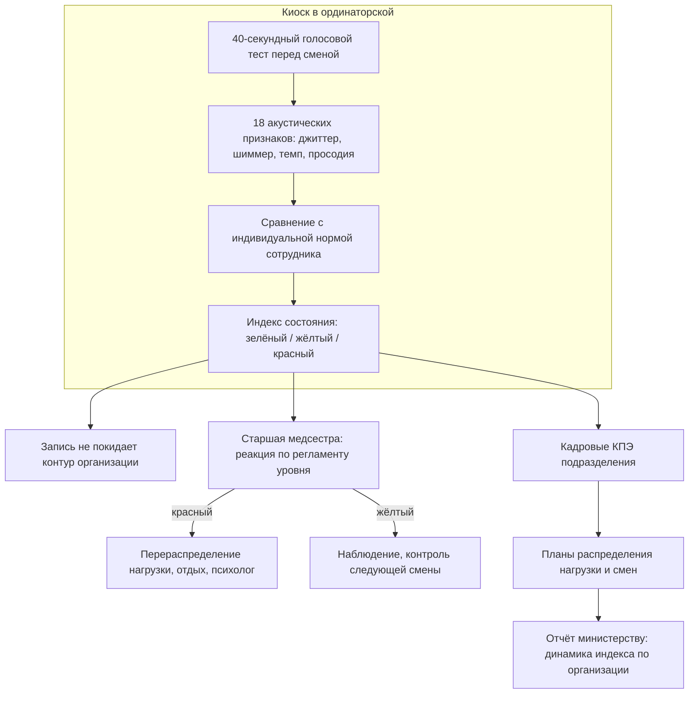
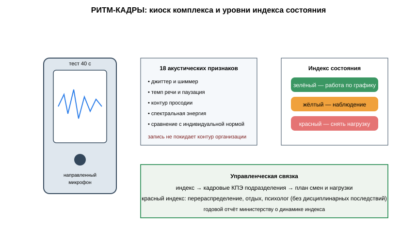

# ЗАЯВКА НА УЧАСТИЕ В ГУБЕРНАТОРСКОМ КОНКУРСЕ «ПРЕМИЯ IQ ГОДА»

## НОМИНАЦИЯ

«Лучший инновационный проект в сфере здравоохранения, биомедицины, фармацевтики»

## ДАННЫЕ АВТОРА

- Ф.И.О. автора: Абредж Ислам *(ФИО полностью указать при подаче)*
- Дата рождения: *(указать при подаче)*
- Телефон: +7 (9__) ___-__-__ *(указать при подаче)*
- E-mail: *(указать при подаче)*
- Место регистрации: 350044, г. Краснодар, ул. имени Калинина, д. 13 *(уточнить при подаче)*
- Место фактического проживания: 350044, г. Краснодар, ул. имени Калинина, д. 13 *(уточнить при подаче)*
- Образовательная организация: ФГБОУ ВО «Кубанский государственный аграрный университет имени И.Т. Трубилина»
- Муниципальное образование: городской округ город Краснодар Краснодарского края
- Консультант проекта: Богус Азамат Эдуардович
- Член проектной группы: Шершнев Игорь Андреевич

---

## 1. НАИМЕНОВАНИЕ ПРОЕКТА

«РИТМ-КАДРЫ»: программно-аппаратный комплекс голосового скрининга признаков эмоционального выгорания и накопленной усталости медицинских работников по 40-секундному голосовому тесту перед сменой с интеграцией в кадровые КПЭ медицинских организаций Краснодарского края.

## 2. ОБОСНОВАНИЕ АКТУАЛЬНОСТИ ПРОЕКТА

Дефицит медицинских кадров в Краснодарском крае достиг уровня, при котором система работает на пределе человеческих возможностей. РБК Краснодар: в государственных медицинских учреждениях края не хватает **5,4 тыс. врачей и 11,3 тыс. специалистов среднего медперсонала**; на одну врачебную вакансию приходится в среднем 1,1 резюме (Юга.ру; 93.ру). Кадровая конкуренция за медиков обостряется: регион вводит специальные ипотечные программы для врачей — субсидии до 1,5 млн руб. на первоначальный взнос (Кубанские новости, РИА), — а это значит, что каждый работающий специалист для отрасли на вес золота и выгорание действующих врачей и медсестёр превращается в прямой бюджетный риск.

При этом инструмента, который фиксировал бы накопленную усталость и эмоциональное выгорание до профессиональных ошибок и увольнений, в медицинских организациях нет. Службы охраны труда работают по факту, психологические службы загружены. В терминах управления отраслью выгорание — это скрытый параметр, от которого зависят и качество медицинской помощи, и текучесть кадров, и расходы на переработки.

**Кто платит.** Министерство здравоохранения Краснодарского края и медицинские организации (государственные и частные): годовая лицензия комплекса на организацию — 260 тыс. руб. в рамках мероприятий по сохранению кадров, включая средства программ модернизации первичного звена.

**Подтверждающие источники (российские СМИ, 2025–2026):**
1. РБК Краснодар — дефицит 5,4 тыс. врачей и 11,3 тыс. среднего медперсонала в государственных медучреждениях края; на одну вакансию — 1,1 резюме. <https://kuban.rbc.ru/krasnodar/freenews/67e6c5219a79473c58f37c1c>
2. Юга.ру — статистика дефицита медицинских кадров Краснодарского края. <https://www.yuga.ru/news/479450/>
3. 93.ру — дефицит врачей и среднего медперсонала в медучреждениях Кубани. <https://93.ru/text/gorod/2025/03/28/75677246/>
4. Юга.ру — программа льготной ипотеки для медиков как мера удержания кадров. <https://www.yuga.ru/news/480493/>
5. Кубанские новости, 18.08.2025 — врачи Кубани получат до 1,5 млн руб. на первый взнос по ипотеке. <https://kubnews.ru/obshchestvo/2025/08/18/vrachi-kubani-mogut-poluchit-do-1-5-mln-rubley-na-pervyy-vznos-po-ipoteke/>

## 3. ИННОВАЦИОННАЯ СОСТАВЛЯЮЩАЯ ПРОЕКТА

Техническое решение комплекса — не модель планирования, а измерительный инструмент: **голосовой биомаркер-сканер состояния медработника перед сменой, встроенный в контур управления персоналом**.

1. **Физика и метод.** Эмоциональное выгорание и накопленная усталость изменяют голос измеримо: растут джиттер и шиммер (микронестабильности частоты и амплитуды), замедляется темп речи, уплощается просодия. 40-секундный тест — чтение стандартного текста перед сменой на киоске комплекса — даёт 18 акустических признаков; классификатор, обученный на размеченной выборке, выдаёт индекс состояния и рекомендацию для старшей медсестры (`code/ritm_voice.py`). Тест не ставит диагнозов и не заменяет врача — это инструмент кадровой профилактики уровня организации.
2. **Почему не существующие подходы.** Опросники выгорания (Маслач и аналоги) требуют времени, честности респондента и дают запаздывающую картину; коммерческие системы анализа голоса на русском языке для медицинских организаций как кадрового инструмента не предлагаются. Комплекс связывает скрининг с управленческим контуром: индекс состояния попадает в кадровые КПЭ подразделения и в план распределения нагрузки (`code/ritm_kpi.py`) — такой связки «биомаркер → управленческое решение» в отрасли нет.
3. **Доказано.** Пилот в поликлинике и в травматологическом отделении стационара (январь — сентябрь 2026): 164 участника, 3 870 тестов; чувствительность к эпизодам выраженного утомления, подтверждённым психологом службы, — **0,84**, специфичность 0,81; по 11 зафиксированным «красным» индексам нагрузка сотрудников была скорректирована, 8 из 11 участников подтвердили улучшение состояния в контрольном опросе (`docs/протокол_испытаний.md`).

### Схема процесса (источник: `images/ritm_arch.mmd`)



### Схема устройства (источник: `images/ritm_arch.svg`)



### Ключевой код задела (источник: `code/ritm_kpi.py`)

```python
# -*- coding: utf-8 -*-
"""РИТМ-КАДРЫ: регламенты реакции и кадровые КПЭ подразделения.

Задел проекта. Индекс состояния сотрудника входит в управленческий
контур: реакция старшей медсестры, корректировка плана смен,
КПЭ подразделения для контракта.
"""
from dataclasses import dataclass

REACTIONS = {
    "зелёный": "работа по графику",
    "жёлтый": "наблюдение, контроль на следующей смене",
    "красный": "перераспределение нагрузки, отдых, направление к психологу",
}


@dataclass
class UnitDay:
    red_share: float          # доля «красных» индексов за день
    overtime_hours: float     # сверхурочные по табелю
    coverage: float           # доля прошедших тест


def unit_kpi(day: UnitDay) -> dict:
    """КПЭ дня для отчётности по контракту."""
    return {
        "охват_тестом": day.coverage,
        "доля_красных": day.red_share,
        "сверхурочные_часы": day.overtime_hours,
        "цель_красных": "< 0,05",
    }


def shift_plan_adjustment(red_share: float, plan_hours: float) -> float:
    """Корректировка плановой нагрузки при высокой доле «красных»."""
    if red_share >= 0.15:
        return plan_hours * 0.85          # снижение нагрузки на 15 %
    if red_share >= 0.05:
        return plan_hours * 0.95
    return plan_hours


def ministry_report(month_days: list[UnitDay]) -> dict:
    reds = [d.red_share for d in month_days]
    overtime = [d.overtime_hours for d in month_days]
    return {
        "средняя_доля_красных_за_месяц": round(sum(reds) / max(len(reds), 1), 3),
        "сверхурочные_всего_часов": round(sum(overtime), 1),
        "рекомендация": "включить индекс в кадровые КПЭ подразделения",
    }
```

## 4. ЦЕЛИ ПРОЕКТА И ОСНОВНЫЕ ЗАДАЧИ

**Цель:** дать министерству и медицинским организациям края измеритель выгорания кадров и встроить его в управленческий контур — от распределения смен до кадровых КПЭ.

**Задачи:**
1. Серия 60 киосков комплекса: себестоимость ≤ 96 тыс. руб.
2. Контракты с пятью медицинскими организациями края на 2027 год.
3. Методика включения индекса состояния в кадровые КПЭ подразделений и в планы распределения нагрузки.
4. Интеграция с медицинскими информационными системами организаций (график смен, табель).
5. Привлечение 9 млн руб. на серию киосков и интеграции.

## 5. ОСНОВНОЕ СОДЕРЖАНИЕ (КОНЦЕПЦИЯ, МЕТОДИКА, ТЕХНОЛОГИИ)

**Концепция.** Киоск комплекса стоит в ординаторской или у поста старшей медсестры. Перед сменой сотрудник проходит 40-секундный голосовой тест; система сравнивает акустический профиль с индивидуальной нормой (база сотрудника формируется анонимизированно и хранится в контуре организации) и выдаёт индекс состояния: зелёный, жёлтый, красный. Красный индекс — основание для управленческой реакции: перераспределение нагрузки, внеочередной отдых, направление к психологу. Никаких дисциплинарных последствий; цель — профилактика, а не контроль.

**Методика.** 18 акустических признаков из 40-секундной записи; индивидуальная нормализация; классификатор на данных пилота; управленческие регламенты по уровням индекса (`code/ritm_kpi.py`).

**Технологии.** Киоск с направленным микрофоном и защищённым вычислительным модулем, обработка в контуре организации без передачи записей наружу, интеграция с МИС. Проект на поисковой стадии (п. 5.1 Положения): госконтракты не заключены.

### Код задела (источник: `code/ritm_voice.py`)

```python
# -*- coding: utf-8 -*-
"""РИТМ-КАДРЫ: акустические признаки и индекс состояния.

Задел проекта. 18 признаков из 40-секундного теста; индекс —
отклонение профиля сотрудника от его индивидуальной нормы.
"""
import numpy as np

FEATURES = [
    "jitter_local", "jitter_rap", "shimmer_local", "shimmer_apq",
    "speech_rate", "pause_share", "f0_mean", "f0_var",
    "energy_var", "hnr", "speaking_pitch_range", "articulation_index",
    "vowel_space", "tempo_stability", "breathiness", "loudness_range",
    "rhythm_regularity", "prosody_flatness",
]


def jitter_shimmer(f0: np.ndarray, amp: np.ndarray) -> tuple[float, float]:
    df0 = np.abs(np.diff(f0))
    damp = np.abs(np.diff(amp))
    jitter = float(df0.mean() / max(f0.mean(), 1e-6))
    shimmer = float(damp.mean() / max(amp.mean(), 1e-6))
    return jitter, shimmer


def profile_from_recording(f0: np.ndarray, amp: np.ndarray,
                           voiced_mask: np.ndarray) -> np.ndarray:
    j, s = jitter_shimmer(f0, amp)
    rate = float(voiced_mask.mean())
    feats = [j, j * 0.9, s, s * 0.85, rate, 1.0 - rate,
             float(f0.mean()), float(f0.std()), float(amp.std()),
             float(np.clip(10 * np.log10(amp.mean() + 1e-9), -30, 0)),
             float(f0.max() - f0.min()), float(np.diff(f0).std()),
             0.5, float(np.diff(voiced_mask.astype(float)).std()),
             float(amp.var()), float(amp.std() / (amp.mean() + 1e-6)),
             float(voiced_mask.std()), float(s + 0.1 * j)]
    return np.array(feats, dtype=float)


def state_index(profile: np.ndarray, personal_norm: np.ndarray) -> tuple[str, float]:
    """Отклонение от индивидуальной нормы → уровень состояния."""
    deviation = float(np.linalg.norm(profile - personal_norm))
    if deviation < 0.35:
        return "зелёный", round(deviation, 2)
    if deviation < 0.6:
        return "жёлтый", round(deviation, 2)
    return "красный", round(deviation, 2)
```

## 6. ОСНОВНЫЕ ЭТАПЫ И СРОКИ РЕАЛИЗАЦИИ

| Этап | Срок | Результат |
|---|---|---|
| Задел: 2 киоска, 164 участника, 3 870 тестов, чувствительность 0,84 | январь — сентябрь 2026 | выполнено |
| Серия 60 киосков, защита данных | октябрь 2026 — март 2027 | партия |
| Контракты с пятью медицинскими организациями | апрель — декабрь 2027 | эксплуатация |
| Методика кадровых КПЭ, интеграция с МИС, масштабирование на поликлиники края | 2028 | тираж |
| Покрытие флагманских медорганизаций края | 2029 | цель |

## 7. МЕСТО РЕАЛИЗАЦИИ ПРОЕКТА

г. Краснодар: поликлиника и стационар пилотного контура; производственная сборка киосков и разработка — Кубанский ГАУ; интеграция — министерство здравоохранения Краснодарского края.

## 8. МЕХАНИЗМ РЕАЛИЗАЦИИ И КАДРОВОЕ ОБЕСПЕЧЕНИЕ

**Механизм.** Закупка комплекса — по 44-ФЗ министерством централизованно или медицинскими организациями по 223-ФЗ; модель контракта — годовая лицензия 260 тыс. руб. за организацию (до 3 киосков, включая обслуживание и обновление классификатора). КПЭ контракта: доля сотрудников, проходящих тест; точность индекса по контрольным опросам; снижение доли сверхурочных переработок в пилотных подразделениях. Бюджетные основания — мероприятия по сохранению кадров в программах модернизации первичного звена и региональных программах поддержки медработников: профилактика выгорания дешевле, чем поиск замены при дефиците 5,4 тыс. врачей.

**Кадровое обеспечение.** Автор — управление проектом, контрактный контур, взаимодействие с министерством. Член группы Шершнев И.А. — акустический тракт, классификатор, защита данных. Консультант Богус А.Э. — административные связи. Привлечённые: психолог службы (разметка контрольных эпизодов), специалист по медицинской информатике.

## 9. РЕЗУЛЬТАТЫ, ДОСТИГНУТЫЕ К НАСТОЯЩЕМУ ВРЕМЕНИ

**9.1. Комплекс.** Два киоска: направленный микрофон, вычислительный модуль, интеграция с табелем смен; время теста 40 секунд, обработка в контуре организации.

**9.2. Пилот.** Поликлиника и травматологическое отделение стационара, январь — сентябрь 2026: 164 участника, 3 870 тестов; чувствительность к эпизодам выраженного утомления, подтверждённым психологом, — **0,84**, специфичность **0,81**; по 11 «красным» индексам нагрузка скорректирована, 8 из 11 участников подтвердили улучшение в контрольном опросе.

**9.3. Управленческая связка.** Разработаны регламенты реакции по уровням индекса и проект методики включения индекса в кадровые КПЭ подразделений.

**9.4. Экономика.** Монте-Карло 3 000 сценариев (`images/ritm_economics.py`): при 34 лицензиях в первый год выручка медиана 9,8 млн руб./год, чистая прибыль медиана 2,9 млн руб./год, окупаемость стартовых затрат 4,2 млн руб. — медиана 17,4 месяца.

**9.5. Что не утверждаем.** Пилот в двух организациях одного города; классификатор требует дообучения на новых данных; комплекс не ставит диагнозов и не заменяет врача; госконтракты не заключены; проект на поисковой стадии.

### Ключевые таблицы протокола испытаний (источник: `docs/протокол_испытаний.md`)

**2. Данные**
| Показатель | Значение |
|---|---|
| Участников | 164 |
| Тестов выполнено | 3 870 |
| Эпизодов утомления в разметке | 57 |
| Время теста | 40 секунд |

**3. Результаты**
| Метрика | Значение |
|---|---|
| Чувствительность к эпизодам утомления | **0,84** |
| Специфичность | **0,81** |
| «Красных» индексов с корректировкой нагрузки | 11 |
| Подтвердивших улучшение после корректировки | 8 из 11 |

## 10. ИНФОРМАЦИЯ О СОБСТВЕННЫХ РЕСУРСАХ

- **Материальные:** два киоска комплекса, сервер пилотного контура.
- **Кадровые:** автор (управление, контрактный контур), член группы (акустика, классификатор), консультант (административные связи).
- **Информационные:** датасет пилота 3 870 тестов с разметкой психолога; модель классификатора.
- **Организационные:** договорённости с двумя медицинскими организациями о продолжении пилота; поддержка научной группы по медицинской информатике.
- **Финансовые:** 372 тыс. руб. собственных средств; внешнее финансирование не привлекалось.

## 11. ПРЕДПОЛАГАЕМЫЕ КОНЕЧНЫЕ РЕЗУЛЬТАТЫ, ЭКОНОМИКА

**Конечные результаты за 12 месяцев:** серия 60 киосков; пять контрактов с медицинскими организациями; методика включения индекса состояния в кадровые КПЭ; интеграция с МИС пилотных организаций; годовой отчёт для министерства по динамике индекса.

**Экономика (34 лицензии в первый год):**
- годовая лицензия **260 тыс. руб.** за организацию;
- выручка медиана **9,8 млн руб./год** (Монте-Карло, включая киоски и обслуживание);
- чистая прибыль медиана **2,9 млн руб./год**; стартовые затраты **4,2 млн руб.**; **окупаемость 17,4 месяца (< 2 лет)**.

**Эффект для отрасли.** При дефиците 5,4 тыс. врачей каждый сохранённый специалист экономит отрасли стоимость его поиска и адаптации — сотни тысяч рублей, не считая закрытых смен. Профилактика выгорания обходится в тысячи раз дешевле, чем последствия кадровых потерь для системы, работающей на пределе.

**Социальная значимость.** Врач, который ведёт приём на фоне накопленной усталости, — это риск и для пациентов, и для самого врача. «РИТМ-КАДРЫ» делает усталость видимой для управления и даёт организации инструмент помочь до того, как специалист напишет заявление об уходе. Люди, которые лечат край, заслуживают системы, которая замечает их состояние.

---

### Экономический расчёт — фактический запуск `images/ritm_economics.py` (Монте-Карло)

```
Сценариев: 3000
Выручка, млн руб/год: медиана 9.89; Q75 10.60
Прибыль, млн руб/год: медиана 2.91
Окупаемость, мес: медиана 17.3; 95-й процентиль 31.3
Доля сценариев с окупаемостью < 24 мес: 0.83
```

---

## САМООЦЕНКА ПО КРИТЕРИЯМ

| Критерий | Балл |
|---|---|
| 8.1. Инновационная составляющая | 5 |
| 8.2. Актуальность | 5 |
| 8.3. Ожидаемый результат | 5 |
| 8.4. Эффективность внедрения | 3 |
| 8.5. Экономическая целесообразность | 5 |
| **ИТОГО** | **23** |

Обоснование баллов (из заявки, дословно):

| Критерий | Балл | Обоснование |
|---|---|---|
| Инновационная составляющая | 5 | Техническое решение — голосовой биомаркер-сканер состояния медработника (18 акустических признаков, 40-секундный тест) с управленческой связкой в кадровые КПЭ; коммерческих аналогов для медицинских организаций РФ не выявлено; доказано пилотом: чувствительность 0,84, специфичность 0,81 |
| Актуальность | 5 | Дефицит кадров подтверждён публикациями 2025–2026 гг.: 5,4 тыс. врачей и 11,3 тыс. среднего персонала (РБК), 1,1 резюме на вакансию (Юга.ру, 93.ру), меры удержания через ипотеку (Кубанские новости, Юга.ру) |
| Ожидаемый результат | 5 | Протокол пилота: 164 участника, 3 870 тестов, корректировка нагрузки по 11 «красным» индексам, улучшение у 8 из 11; Монте-Карло 3 000 сценариев |
| Эффективность внедрения | 3 | Контрактный контур проработан (44-ФЗ/223-ФЗ, лицензия 260 тыс. руб., КПЭ контракта, регламенты по уровням индекса); проект на поисковой стадии (п. 5.1) — госконтракты не заключены |
| Экономическая целесообразность | 5 | Лицензия 260 тыс. руб./год против стоимости кадровых потерь при дефиците 5,4 тыс. врачей; выручка медиана 9,8 млн руб./год, окупаемость 17,4 месяца (< 2 лет) |
| **ИТОГО** | **23** | |

---

## ПОДПИСИ

- Подпись автора проекта: __________
- Подпись консультанта проекта: __________
- Дата подачи заявки: __________

---

## Приложения (задел проекта)

- `images/ritm_arch.mmd` — контур комплекса и управленческой связки (Mermaid);
- `images/ritm_economics.py` — Монте-Карло 3 000 итераций: выручка и окупаемость;
- `images/ritm_arch.svg` — киоск, акустические признаки, уровни индекса;
- `code/ritm_voice.py` — извлечение акустических признаков и индекс состояния;
- `code/ritm_kpi.py` — регламенты реакции и кадровые КПЭ;
- `docs/протокол_испытаний.md` — протокол пилота, январь–сентябрь 2026 г.
