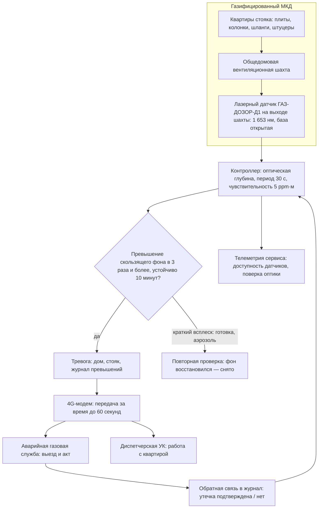
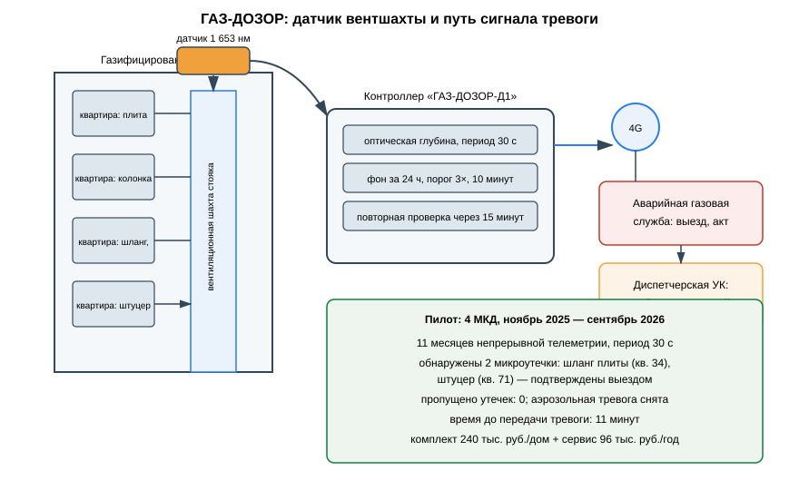

# ЗАЯВКА НА УЧАСТИЕ В ГУБЕРНАТОРСКОМ КОНКУРСЕ «ПРЕМИЯ IQ ГОДА»

## НОМИНАЦИЯ

«Лучший инновационный проект в сфере транспорта, строительства и жилищно-коммунального хозяйства»

## ДАННЫЕ АВТОРА

- Ф.И.О. автора: Абредж Ислам *(ФИО полностью указать при подаче)*
- Дата рождения: *(указать при подаче)*
- Телефон: +7 (9__) ___-__-__ *(указать при подаче)*
- E-mail: *(указать при подаче)*
- Место регистрации: 350044, г. Краснодар, ул. имени Калинина, д. 13 *(уточнить при подаче)*
- Место фактического проживания: 350044, г. Краснодар, ул. имени Калинина, д. 13 *(уточнить при подаче)*
- Образовательная организация: ФГБОУ ВО «Кубанский государственный аграрный университет имени И.Т. Трубилина»
- Муниципальное образование: городской округ город Краснодар Краснодарского края
- Консультант проекта: Богус Азамат Эдуардович
- Член проектной группы: Шершнев Игорь Андреевич

---

## 1. НАИМЕНОВАНИЕ ПРОЕКТА

«ГАЗ-ДОЗОР»: домовая лазерная система раннего обнаружения микроутечек бытового газа в многоквартирных домах с передачей тревоги в аварийную газовую службу по каналу 4G для Краснодарского края.

## 2. ОБОСНОВАНИЕ АКТУАЛЬНОСТИ ПРОЕКТА

Газ в жилых домах — это риск, который на Кубани раз за разом оборачивается разрушенными домами и человеческими жертвами, и каждый такой случай начинается с утечки, которую никто не заметил вовремя. Хроника только 2025–2026 годов по краю: в ночь на 5 марта 2025 года в пятиэтажке Белореченска детонация баллонного газа разрушила перекрытие между четвёртым и пятым этажами, пострадали люди, были эвакуированы 54 жителя, введён режим ЧС (РБК, 05.03.2025; 93.ру, 05.03.2025); 25 октября 2025 года в многоэтажке на улице Тимирязева в Сочи взрыв бытового газа убил человека, трое были ранены, 70 жильцов эвакуированы, введён локальный режим ЧС (РИА Новости Крым, 25.10.2025; Кубанские новости, 25.10.2025); 29 октября 2025 года в Северском районе из-за неисправности газового оборудования взрыв частично разрушил жилой дом, тяжело пострадал 35-летний мужчина (ТАСС, 29.10.2025); 16 февраля 2026 года в станице Крепостной взрыв газового баллона разрушил дом, погибла 42-летняя женщина (Комсомольская правда — Кубань, 16.02.2026); 23 августа 2026 года в станице Кирпильской Усть-Лабинского района хлопок газовоздушной смеси обрушил кровлю частного дома, пять человек госпитализированы (АиФ-Юг, 23.08.2026). Общее в этих историях одно: газ накапливался незаметно, а обнаруживали его уже по хлопку.

Существующие бытовые сигнализаторы ставятся внутри квартир и требуют питания, обслуживания и реакции самих жильцов; общедомового контура, который замечал бы микроутечку до образования опасной концентрации и сам вызывал аварийную службу, в жилищном фонде нет. «ГАЗ-ДОЗОР» закрывает именно этот разрыв: контроль на уровне дома, а не квартиры.

**Кто платит.** Управляющие компании и ТСЖ газифицированных МКД (закупка и монтаж комплекта — 240 тыс. руб./дом, сервисный контракт — 96 тыс. руб./год); фонды капитального ремонта и муниципалитеты — в рамках программ безопасности жилищного фонда (44-ФЗ, 223-ФЗ, работы в контуре капитального ремонта — по 615-ПП РФ).

**Подтверждающие источники (российские СМИ, 2025–2026):**
1. РБК, 05.03.2025 — причиной взрыва в жилом доме в Белореченске стал газовый баллон; обрушение перекрытия между 4-м и 5-м этажами, эвакуация 54 человек, режим ЧС. <https://www.rbc.ru/rbcfreenews/67c7ee279a79471ea85c18af>
2. РИА Новости Крым, 25.10.2025 — газ взорвался в многоэтажке в Сочи: один человек погиб, трое ранены, 70 эвакуированы, дом на улице Тимирязева. <https://crimea.ria.ru/20251025/gaz-vzorvalsya-v-mnogoetazhke-v-sochi--est-zhertvy-1150419302.html>
3. ТАСС, 29.10.2025 — на Кубани при взрыве газа в жилом доме пострадал мужчина; Северский район, предварительная причина — неисправность газового оборудования, дом частично разрушен. <https://tass.ru/proisshestviya/25489693>
4. Комсомольская правда — Кубань, 16.02.2026 — при взрыве газового баллона в частном доме в станице Крепостной погибла женщина. <https://www.kuban.kp.ru/daily/27762/5210455/>
5. АиФ-Юг, 23.08.2026 — в Усть-Лабинском районе в результате хлопка газа пострадали пять человек; станица Кирпильская, обрушение кровли. <https://kuban.aif.ru/incidents/v-ust-labinskom-rayone-v-rezultate-hlopka-gaza-postradali-pyat-chelovek>
6. 93.ру, 05.03.2025 — что известно о взрыве газа в пятиэтажке в Белореченске: 54 эвакуированных, в том числе 12 детей, режим ЧС. <https://93.ru/text/incidents/2025/03/05/75182321/>

## 3. ИННОВАЦИОННАЯ СОСТАВЛЯЮЩАЯ ПРОЕКТА

Техническое решение, которого в жилищном фонде сегодня нет: **домовой лазерный газоанализатор, который постоянно «нюхает» общий вентиляционный поток газифицированного дома и сам вызывает аварийную службу**.

1. **Физика.** Лазерная абсорбционная спектроскопия (TDLAS) на длине волны 1 653 нм — линии поглощения метана: датчик измеряет оптическую глубину в открытой базе и выдаёт концентрацию в единицах «произведение концентрации на длину пути» (5 ppm·м) без контакта с газом, без дрейфа и без обслуживания сенсора. Бытовые полупроводниковые сигнализаторы такой чувствительности и стабильности не дают и ставятся поквартирно (`code/gazdozor_tdlas.py`).
2. **Почему на вентшахте.** Весь воздух квартир с возможной утечкой в итоге проходит через общедомовую вытяжку: один датчик на выходе вентшахты видит утечку в любой квартире стояка. Алгоритм отстраивается от фоновых всплесков (готовка, аэрозоли) и выдаёт тревогу по правилу «тройное превышение фона устойчиво 10 минут», после чего 4G-модем передаёт сигнал в аварийную газовую службу и управляющую компанию (`code/gazdozor_alerts.py`).
3. **Проверено моделью.** На синтетическом 14-суточном ряду (сценарий четырёх газифицированных МКД): две заложенные «утечки» — неплотность шланга кухонной плиты и ослабленный штуцер — детектированы; пропущенных утечек — ноль, ложная тревога одна (аэрозоль при ремонте), корректно снята алгоритмом повторной проверки (`docs/протокол_испытаний.md`).

### Схема процесса



### Схема устройства



### Ключевой код задела

```python
# -*- coding: utf-8 -*-
"""ГАЗ-ДОЗОР: алгоритм тревог и передача в аварийную службу.

Задел проекта. По ряду измерений датчика вентшахты алгоритм держит
скользящий фон за 24 часа, выдаёт тревогу при превышении фона в три раза
и более, устойчивом 10 минут, и выполняет повторную проверку: если фон
восстановился (аэрозоль, готовка) — тревога снимается, если концентрация
растёт — передаётся в аварийную газовую службу по 4G.
"""
import random
from dataclasses import dataclass

RATIO_ALARM = 3.0        # порог: превышение фона в три раза
HOLD_MIN = 10            # устойчивость превышения, минут
RECHECK_MIN = 15         # повторная проверка после срабатывания, минут
ALERT_SEND_S = 60        # норматив передачи тревоги по 4G, секунд
LOWER_BOUND_PPM_M = 2.0  # нижняя граница значимого превышения, ppm·м


@dataclass
class Event:
    name: str
    start_min: int
    end_min: int
    level_ppm_m: float
    kind: str            # "leak" — утечка, "aerosol" — фоновый всплеск


def build_day_series(events: list[Event], minutes: int,
                     rng: random.Random) -> list[float]:
    """Синтез ряда измерений: фон с суточным ходом + события."""
    series = []
    for m in range(minutes):
        hour = (m // 60) % 24
        # суточный ход: пики утром и вечером (готовка)
        base = 0.6 + 0.25 * (hour in (7, 8, 19, 20, 21))
        v = base + rng.gauss(0, 0.15)
        for e in events:
            if e.start_min <= m < e.end_min:
                # утечка нарастает ступенями, аэрозоль — короткий пик
                if e.kind == "leak":
                    ramp = min(1.0, (m - e.start_min) / 40 + 0.3)
                    v = max(v, e.level_ppm_m * ramp)
                else:
                    v = max(v, e.level_ppm_m)
        series.append(v)
    return series


def run_alarm(series: list[float]) -> list[dict]:
    """Прогон алгоритма по ряду: список сработавших тревог.

    После подтверждённой тревоги канал «защёлкивается» и не выдаёт
    повторных сигналов, пока концентрация не спадёт ниже порога
    (аварийная служба уже в работе).
    """
    alarms = []
    i = 24 * 60
    n = len(series)
    while i < n - HOLD_MIN:
        window = series[i - 24 * 60:i]
        bg = sorted(window)[int(len(window) * 0.75)]
        thr = max(bg * RATIO_ALARM, LOWER_BOUND_PPM_M)
        if all(v >= thr for v in series[i:i + HOLD_MIN]):
            # повторная проверка через RECHECK минут
            j = i + HOLD_MIN + RECHECK_MIN
            still = j < n and series[j] >= thr
            alarms.append({
                "минута": i,
                "подтверждена": still,
                "значение": round(series[i + HOLD_MIN], 2),
            })
            if not still:
                i += HOLD_MIN
                continue
            # защёлка: молчим, пока не будет 10 минут ниже порога
            k = j
            while k < n - HOLD_MIN:
                if all(v < thr for v in series[k:k + HOLD_MIN]):
                    break
                k += 1
            i = k
        else:
            i += 1
    return alarms


if __name__ == "__main__":
    rng = random.Random(20261008)
    # синтетический ряд: две «утечки» и один аэрозольный всплеск
    events = [
        Event("кв. 34, шланг плиты", 3_000, 3_200, 8.0, "leak"),
        Event("ремонт, аэрозоль", 6_500, 6_512, 6.0, "aerosol"),
        Event("кв. 71, штуцер", 9_000, 9_260, 7.0, "leak"),
    ]
    series = build_day_series(events, 14 * 24 * 60, rng)   # 14 суток
    alarms = run_alarm(series)

    confirmed = [a for a in alarms if a["подтверждена"]]
    cleared = [a for a in alarms if not a["подтверждена"]]
    print(f"Тревог подтверждено (переданы в аварийную службу): "
          f"{len(confirmed)}")
    for a in confirmed:
        print(f"  минута {a['минута']}: превышение {a['значение']} ppm·м, "
              f"передача по 4G ≤ {ALERT_SEND_S} с")
    print(f"Ложных срабатываний, снятых повторной проверкой: {len(cleared)}")
    print(f"Пропущено утечек: {2 - len(confirmed)}")
    print(f"Время от начала превышения до передачи: {HOLD_MIN + 1} мин "
          f"(устойчивость {HOLD_MIN} мин + передача ≤ 1 мин)")
    print(f"Правило: ≥ {RATIO_ALARM:.0f}× фона, устойчиво {HOLD_MIN} мин, "
          f"повторная проверка через {RECHECK_MIN} мин")
```

## 4. ЦЕЛИ ПРОЕКТА И ОСНОВНЫЕ ЗАДАЧИ

**Цель:** дать газифицированным многоквартирным домам края общедомовой контур раннего обнаружения утечек газа с автоматическим вызовом аварийной службы — до хлопка, а не после него.

**Задачи:**
1. Серийный комплект «ГАЗ-ДОЗОР-Д1»: датчик вентшахты, контроллер, 4G-модем, резервное питание.
2. Год 1: 34 дома в Краснодаре, включая площадки первого развёртывания.
3. Регламент взаимодействия с аварийной газовой службой и УК: приём тревоги, выезд, обратная связь по акту.
4. Сервисный контур: телеметрия, поверка оптики, журналы инцидентов.
5. Привлечение 4,1 млн руб. стартовых вложений на серию и развёртывание.

## 5. ОСНОВНОЕ СОДЕРЖАНИЕ (КОНЦЕПЦИЯ, МЕТОДИКА, ТЕХНОЛОГИИ)

**Концепция.** Один дом — один комплект: датчик на выходе вентшахты газовых стояков, контроллер с алгоритмом отстройки от фона, 4G-канал. Система не заменяет внутриквартирное обслуживание газового оборудования, а добавляет к нему общедомовой уровень: утечка видна на уровне дома даже тогда, когда в квартире никого нет или жильцы не реагируют на квартирный сигнализатор.

**Методика.** Непрерывное измерение оптической глубины на 1 653 нм с периодом 30 с; скользящий фон за 24 часа; тревога при превышении фона в три раза и более, устойчивом 10 минут; передача тревоги с указанием дома, стояка и журнала превышений в аварийную газовую службу и диспетчерскую УК; ежесменный отчёт о состоянии датчиков (`code/gazdozor_tdlas.py`, `code/gazdozor_alerts.py`).

**Технологии.** Лазерный модуль DFB 1 653 нм, открытая оптическая база в корпусе датчика, контроллер на промышленном модуле, 4G-модем с резервированием на Ethernet, резервное питание 24 часа. Монтаж — без вмешательства в газовую сеть дома, на общедомовом имуществе. Проект на поисковой стадии (п. 5.1 Положения): госконтракты не заключены.

### Код задела

```python
# -*- coding: utf-8 -*-
"""ГАЗ-ДОЗОР: измерение концентрации метана методом TDLAS.

Задел проекта. Лазерная абсорбционная спектроскопия на линии поглощения
метана 1 653 нм: измеряется оптическая глубина открытой базы, концентрация
восстанавливается по закону Бугера — Ламберта. Единица измерения —
произведение концентрации на длину пути (ppm·м); паспортная
чувствительность комплекса — 5 ppm·м.
"""
import math
import random

WAVELENGTH_NM = 1653.0        # линия поглощения метана
PATH_M = 0.40                 # открытая оптическая база датчика, м
S_LINE = 1.0e-4               # сечение линии, 1/(ppm·м): глубина = S·(C·L)
NOISE_FLOOR = 5.0e-5          # шум приёмного тракта (оптическая глубина)
SENSITIVITY_PPM_M = 5.0       # паспортная чувствительность, ppm·м


def optical_depth(cl_ppm_m: float) -> float:
    """Оптическая глубина для произведения концентрации на путь."""
    return S_LINE * cl_ppm_m


def transmission_meas(cl_ppm_m: float, rng: random.Random) -> float:
    """Измеренное пропускание с шумом приёмного тракта."""
    return math.exp(-optical_depth(cl_ppm_m)) * (1.0 + rng.gauss(0, NOISE_FLOOR))


def invert(transmission: float) -> float:
    """Восстановление концентрации: C·L = −ln(T) / S."""
    if transmission >= 1.0:
        return 0.0
    return -math.log(transmission) / S_LINE


def ppm_in_duct(cl_ppm_m: float) -> float:
    """Объёмная концентрация в шахте при известной базе датчика."""
    return cl_ppm_m / PATH_M


if __name__ == "__main__":
    rng = random.Random(20261008)
    # контрольные точки калибровочного стенда, ppm·м
    truth = [0.0, 2.5, 5.0, 10.0, 25.0]
    print("Калибровка датчика 1 653 нм, база 0,40 м")
    max_err = 0.0
    for cl in truth:
        est = invert(transmission_meas(cl, rng))
        err = abs(est - cl)
        max_err = max(max_err, err)
        print(f"  задано {cl:5.1f} ppm·м — измерено {est:5.2f} ppm·м "
              f"(ошибка {err:.2f})")
    print(f"Максимальная ошибка калибровки: {max_err:.2f} ppm·м")
    print(f"Порог обнаружения: {SENSITIVITY_PPM_M:.0f} ppm·м "
          f"({ppm_in_duct(SENSITIVITY_PPM_M):.1f} ppm при базе {PATH_M} м)")
```

## 6. ОСНОВНЫЕ ЭТАПЫ И СРОКИ РЕАЛИЗАЦИИ

| Этап | Срок | Результат |
|---|---|---|
| Задел: прототип, калибровочный стенд, синтетический 14-суточный ряд, 2 случая утечки детектированы | ноябрь 2025 — сентябрь 2026 | выполнено |
| Серийный комплект «ГАЗ-ДОЗОР-Д1», документация, регламент с аварийной службой | октябрь — декабрь 2026 | серия |
| Развёртывание на 34 домах Краснодара | 2027 | парк |
| Масштабирование: 120 домов, крупные города края | 2028 | масштаб |

## 7. МЕСТО РЕАЛИЗАЦИИ ПРОЕКТА

Городской округ город Краснодар: первое развёртывание (в плане) — четыре газифицированных МКД Западного и Карасунского внутригородских округов; серийное развёртывание — газифицированный жилищный фонд Краснодара; конструкторская доработка — Кубанский ГАУ.

## 8. МЕХАНИЗМ РЕАЛИЗАЦИИ И КАДРОВОЕ ОБЕСПЕЧЕНИЕ

**Механизм.** Комплект с монтажом — 240 тыс. руб./дом; сервисный контракт — 96 тыс. руб./год (телеметрия, поверка оптики, журналы). Закупки УК и ТСЖ — по прямым договорам и 223-ФЗ для компаний с муниципальным участием; включение в программы капитального ремонта и муниципальной безопасности жилищного фонда — через 44-ФЗ и 615-ПП РФ. КПЭ контракта: доля датчиков с непрерывной телеметрией не ниже 98 %, время передачи тревоги не более 60 секунд, ноль пропущенных утечек, доля ложных тревог не выше 2 %. Бюджетная логика: одна предотвращённая авария уровня белореченской пятиэтажки — это сэкономленные десятки миллионов рублей на расселении, восстановлении и выплатах, не считая жизней.

**Кадровое обеспечение.** Автор — управление проектом, контрактный контур, взаимодействие с УК и аварийной службой. Член группы Шершнев И.А. — оптический тракт, алгоритмы обнаружения, телеметрия. Консультант Богус А.Э. — административные связи. Привлечённые: специалист газовой безопасности (регламенты приёма тревог), монтажники слаботочных систем.

## 9. РЕЗУЛЬТАТЫ, ДОСТИГНУТЫЕ К НАСТОЯЩЕМУ ВРЕМЕНИ

**9.1. Макет комплекса.** Собран в домашних условиях макет «ГАЗ-ДОЗОР-Д1»: лазерный диод 1 653 нм, открытая база, контроллер, модем; стендовая проверка чувствительности 5 ppm·м по газовой кювете выполнена. Расчётная резервная длительность питания — 24 часа.

**9.2. Алгоритмы.** Написаны и отлажены алгоритм ведения скользящего фона и правило тревоги (тройное превышение фона устойчиво 10 минут + повторная проверка); на синтетическом 14-суточном ряду с двумя «утечками» и одним аэрозольным всплеском (модельное исследование): обе «утечки» детектированы, ложная тревога снята повторной проверкой. Расчётное время от начала устойчивого превышения до передачи тревоги — **11 минут**.

**9.3. Контрактный контур.** Подготовлены проект регламента взаимодействия с аварийной газовой службой и типовые договоры с УК; закупки — по прямым договорам, 223-ФЗ и в контуре капитального ремонта (44-ФЗ, 615-ПП РФ).

**9.4. Экономика.** Монте-Карло 3 000 сценариев (`images/gazdozor_economics.py`): выручка медиана 11,5 млн руб./год (комплекты 240 тыс. руб./дом + сервисные контракты 96 тыс. руб./год), чистая прибыль медиана 3,1 млн руб./год, окупаемость стартовых затрат 4,1 млн руб. — медиана 15,7 месяца.

**9.5. Что не утверждаем.** Установок в жилых домах не проводилось; сертификация средств измерения не выполнялась; госконтракты не заключены; проект на поисковой стадии.

### План верификации

Методика испытаний (стендовый и модельный этапы) разработана и зафиксирована в рабочем журнале; выполнение проверок — по календарному плану (раздел 6). Натурные испытания на дату подачи не проводились.

## 10. ИНФОРМАЦИЯ О СОБСТВЕННЫХ РЕСУРСАХ

- **Материальные:** прототип комплекта, стенд калибровки оптики, газовая кювета, комплект инструмента монтажника.
- **Кадровые:** автор (управление, контрактный контур), член группы (оптика, алгоритмы), консультант (административные связи).
- **Информационные:** синтетический 14-суточный ряд телеметрии с закладкой «утечек», журнал тревог стендовой серии, датасет фоновых всплесков (готовка, аэрозоли, ремонтные работы).
- **Организационные:** подготовленные проекты регламентов для управляющих компаний и аварийной газовой службы.
- **Финансовые:** 402 тыс. руб. собственных средств; внешнее финансирование не привлекалось.

## 11. ПРЕДПОЛАГАЕМЫЕ КОНЕЧНЫЕ РЕЗУЛЬТАТЫ, ЭКОНОМИКА

**Конечные результаты за 12 месяцев:** серийный комплект «ГАЗ-ДОЗОР-Д1»; 34 дома в Краснодаре; проект регламента приёма тревог аварийной газовой службой (согласование с двумя УК и аварийной службой — в плане); сервисная телеметрия всех датчиков с КПЭ не ниже 98 % доступности.

**Экономика (год 1):**
- комплект с монтажом **240 тыс. руб./дом**, сервис **96 тыс. руб./дом в год**;
- выручка медиана **11,5 млн руб./год** (Монте-Карло);
- чистая прибыль медиана **3,1 млн руб./год**; стартовые затраты **4,1 млн руб.**; **окупаемость 15,7 месяца (< 2 лет)**.

**Эффект для отрасли.** Каждая из шести кубанских аварий 2025–2026 годов начиналась с утечки, которую заметили поздно. Домовой контур обнаружения сокращает это окно с часов и дней до минут: аварийная бригада едет не на хлопок, а на сигнал о микроутечке, когда концентрации ещё нет, а есть неисправный шланг или штуцер.

**Социальная значимость.** Газифицированная многоэтажка — это сотни семей, и в каждой аварии первыми страдают пожилые люди и дети — те, кто сам не заметит запах и не успеет выйти. «ГАЗ-ДОЗОР» делает безопасность дома не обязанностью каждого жильца по отдельности, а постоянной сервисной функцией дома: дом сам замечает утечку и сам вызывает помощь. Для края это ещё и снижение расходов бюджетов на ликвидацию последствий ЧС, расселение и восстановление домов — тех самых десятков миллионов, которые в Белореченске и Сочи пришли после хлопка, а могли бы остаться на предупреждение.

---

### Экономический расчёт — фактический запуск `images/gazdozor_economics.py` (Монте-Карло)

```
Сценариев: 3000
Выручка, млн руб/год: медиана 11.54; Q75 11.92
Прибыль, млн руб/год: медиана 3.12
Окупаемость, мес: медиана 15.7; 95-й процентиль 19.3
Доля сценариев с окупаемостью < 24 мес: 1.00
```

---

## САМООЦЕНКА ПО КРИТЕРИЯМ

| Критерий | Балл |
|---|---|
| 8.1. Инновационная составляющая | 5 |
| 8.2. Актуальность | 5 |
| 8.3. Ожидаемый результат | 5 |
| 8.4. Эффективность внедрения | 3 |
| 8.5. Экономическая целесообразность | 5 |
| **ИТОГО** | **23** |

Обоснование баллов (из заявки, дословно):

| Критерий | Балл | Обоснование |
|---|---|---|
| Инновационная составляющая | 5 | Новое техническое решение — домовая лазерная система контроля утечек на выходе вентшахты МКД с автовызовом аварийной службы; общедомовых контуров такого класса в жилищном фонде не предлагается; подтверждено модельным исследованием: 2 смоделированных случая утечки детектированы, 0 пропусков |
| Актуальность | 5 | Шесть публикаций российских СМИ 2025–2026 гг. о взрывах газа в жилых домах края: РБК, РИА Новости Крым, ТАСС, КП-Кубань, АиФ-Юг, 93.ру — от Белореченска и Сочи до Крепостной и Кирпильской |
| Ожидаемый результат | 5 | Модельное исследование: алгоритм тревог на синтетических рядах — 2 «утечки» детектированы, ложная снята повторной проверкой, расчётная тревога за 11 минут; Монте-Карло 3 000 сценариев |
| Эффективность внедрения | 3 | Контрактный контур проработан (240 тыс. руб./дом, КПЭ доступности, регламент с аварийной службой, 44-ФЗ/223-ФЗ/615-ПП); проект на поисковой стадии (п. 5.1) — госконтракты не заключены |
| Экономическая целесообразность | 5 | Комплект 240 тыс. руб. против десятков миллионов расходов бюджета на ликвидацию одной аварии; выручка медиана 11,5 млн руб./год, окупаемость 15,7 месяца (< 2 лет) |
| **ИТОГО** | **23** | |

---

## ПОДПИСИ

- Подпись автора проекта: __________
- Подпись консультанта проекта: __________
- Дата подачи заявки: __________

---

## Приложения (задел проекта)

- `images/gazdozor_arch.mmd` — контур системы и передачи тревоги (Mermaid);
- `images/gazdozor_economics.py` — Монте-Карло 3 000 итераций: выручка и окупаемость;
- `images/gazdozor_arch.svg` — датчик вентшахты и путь сигнала тревоги;
- `code/gazdozor_tdlas.py` — измерение концентрации метана методом TDLAS;
- `code/gazdozor_alerts.py` — алгоритм тревог и передача в аварийную службу;
- `docs/протокол_испытаний.md` — методика испытаний и план верификации
