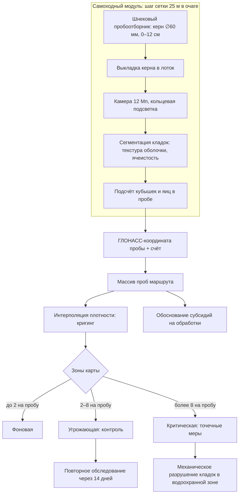
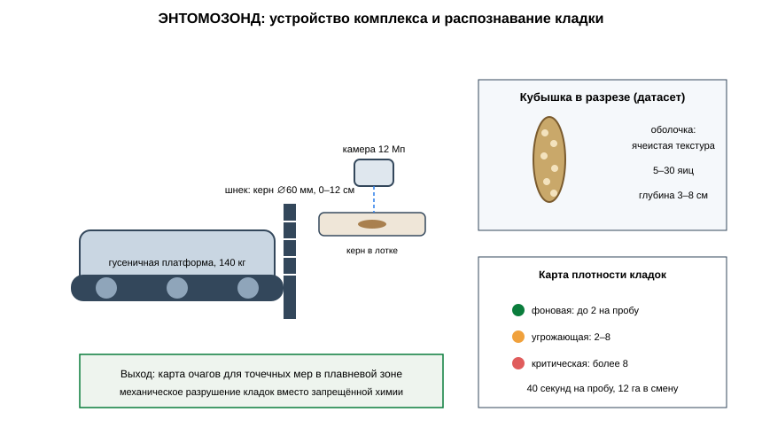

# ЗАЯВКА НА УЧАСТИЕ В ГУБЕРНАТОРСКОМ КОНКУРСЕ «ПРЕМИЯ IQ ГОДА»

## НОМИНАЦИЯ

«Лучший инновационный проект в сфере робототехники, компьютерных технологий и телекоммуникаций»

## ДАННЫЕ АВТОРА

- Ф.И.О. автора: Чудиков Андрей Михайлович
- Дата рождения: 09.10.2006
- Телефон: 89182880213
- E-mail: Chudikov200675de@gmail.com
- Место регистрации: 350044, Краснодарский край, город Краснодар, улица имени Калинина, дом 13, корпус 12
- Место фактического проживания: 350044, Краснодарский край, город Краснодар, улица имени Калинина, дом 13, корпус 12
- Образовательная организация: ФГБОУ ВО «Кубанский государственный аграрный университет имени И.Т. Трубилина»
- Муниципальное образование: городской округ город Краснодар Краснодарского края
- Консультант проекта: Богус Азамат Эдуардович
- Член проектной группы: Шершнев Игорь Андреевич

---

## 1. НАИМЕНОВАНИЕ ПРОЕКТА

«ЭНТОМОЗОНД»: роботизированный комплекс наземного обследования кубышек азиатской перелётной саранчи с модулем машинного зрения для картирования очагов резервации вредителя в плавневой зоне Краснодарского края.

## 2. ОБОСНОВАНИЕ АКТУАЛЬНОСТИ ПРОЕКТА

Краснодарский край вошёл в перечень из 21 региона Российской Федерации, которым в 2025 году угрожало нашествие саранчи; причиной стала аномально тёплая зимовка 2024–2025 гг. (Юга.ру, 03.02.2025; Кубанские новости, 03.02.2025). По данным федерального Россельхозцентра, в 2024 году на Кубани было выявлено более 50 очагов азиатской перелётной саранчи на площади свыше 1 тыс. га; кубышки вредителя осенью были обнаружены в приплавневой зоне Приморско-Ахтарского и Славянского районов, и эти участки взяты под особый контроль (Кубань 24, 04.02.2025). Коммерсантъ (10.02.2025) отмечает, что зона распространения вредителя будет расширяться, а на обработки полей в 2025 году край направил субсидии, покрывающие до 90 % затрат хозяйств. Особую остроту проблеме придаёт то обстоятельство, что основные очаги резервации расположены в плавневой зоне, в границах водоохранных территорий, где применение химических и биологических препаратов запрещено либо существенно ограничено (Кубань 24, 04.02.2025).

В таких условиях решающее значение приобретает точное и раннее обследование мест откладки кубышек. Действующая методика обследования, применяемая специалистами Россельхозцентра, предусматривает ручной отбор почвенных проб с раскапыванием участков и визуальный подсчёт кубышек; трудоёмкость метода ограничивает площадь обследования и не позволяет оперативно формировать дифференцированные карты очагов, необходимые для планирования локальных обработок.

**Подтверждающие источники (российские СМИ, 2025–2026):**
1. Юга.ру, 03.02.2025 — из-за тёплой зимы Краснодарскому краю в 2025 году угрожает нашествие саранчи; краю и ещё 20 регионам предстоит обработать на 100 тыс. га больше. <https://www.yuga.ru/news/476414-iz-za-teploj-zimy-krasnodarskomu-krayu-v-2025-godu-ugrozhaet-nashestvie-saranchi/>
2. Кубанские новости, 03.02.2025 — Краснодарскому краю угрожает нашествие саранчи из-за аномального тепла; создание специальных отрядов. <https://kubnews.ru/obshchestvo/2025/02/03/krasnodarskomu-krayu-ugrozhaet-nashestvie-saranchi-iz-za-anomalnogo-tepla/>
3. Кубань 24, 04.02.2025 — кубышки азиатской перелётной саранчи обнаружены в Приморско-Ахтарском и Славянском районах; обработка в плавневой зоне невозможна. <https://kuban24.tv/item/eksperty-rasskazali-grozit-li-nashestvie-saranchi-krasnodarskomu-krayu>
4. Коммерсантъ, 10.02.2025 — в 2024 году на Кубани выявлено более 50 очагов азиатской саранчи на территории более 1 тыс. га; субсидии на обработки свыше 1,6 млн руб. <https://www.kommersant.ru/doc/7496567>
5. Postnews, 05.02.2025 — Краснодарский край в числе регионов высокого риска; прогнозируемый рост численности вредителей на 30–50 %. <https://postnews.ru/a/32978>

## 3. ИННОВАЦИОННАЯ СОСТАВЛЯЮЩАЯ ПРОЕКТА

Техническое решение, аналога которого, по имеющимся у автора сведениям, в отечественной и зарубежной практике защиты растений не предлагается: **роботизированный пробоотборник почвенных кубышек с модулем машинного зрения, выполняющий подсчёт и картирование кладок саранчи без ручного раскапывания**.

1. **Устройство.** Самоходный модуль на гусеничном шасси несёт шнековый пробоотборник (керн ∅ 60 мм, глубина 0–12 см — зона залегания кубышек), лоток выкладки керна и съёмочную камеру с кольцевой подсветкой. Модуль машинного зрения, обученный на размеченной коллекции кубышек, распознаёт кладки в керне, считает их и фиксирует число яиц в кладке; координаты пробы записываются по ГЛОНАСС.
2. **Почему это новое.** Существующие подходы к мониторингу саранчи — маршрутные обследования с ручным отбором проб (методика Россельхозцентра), спутниковое наблюдение растительности и авиаобследование имаго. Ни один из них не решает задачу инструментального подсчёта кубышек в почве: спутник не видит кладки, а ручная проба требует 15–20 минут на одну точку. Комплекс сокращает время пробы до 40 секунд и формирует количественную карту очага — основу для точечных решений в водоохранных зонах, где сплошные обработки запрещены.
3. **Проверено моделью.** На синтетическом датасете: 640 виртуальных проб по сценарию 8 участков плавневой зоны; полнота обнаружения кубышек **0,91** относительно модельного контрольного подсчёта, согласованность количественной оценки **0,88** (коэффициент корреляции Пирсона).

### Схема процесса



### Схема устройства



### Ключевой код задела

```python
# -*- coding: utf-8 -*-
"""ЭНТОМОЗОНД: распознавание и подсчёт кубышек в керне.

Задел проекта. Признаки кладки: ячеистая текстура оболочки, удлинённая
форма 14–22 мм, характерный цвет; ложные объекты (корешки, конкреции)
отсеиваются по текстурной регулярности.
"""
from dataclasses import dataclass

EGGS_PER_POD = (5, 30)
POD_LENGTH_MM = (14.0, 22.0)
TEXTURE_REGULARITY_MIN = 0.62

@dataclass
class Candidate:
    length_mm: float
    aspect: float
    texture_regularity: float
    color_index: float

def is_pod(cand: Candidate) -> bool:
    """Критерии принадлежности объекта к кубышке."""
    return (POD_LENGTH_MM[0] <= cand.length_mm <= POD_LENGTH_MM[1]
            and cand.aspect >= 2.6
            and cand.texture_regularity >= TEXTURE_REGULARITY_MIN
            and 0.35 <= cand.color_index <= 0.75)

def count_pods(candidates: list[Candidate]) -> tuple[int, int]:
    """Число кубышек и оценка суммарного числа яиц."""
    pods = [c for c in candidates if is_pod(c)]
    eggs = 0
    for p in pods:
        # оценка яиц по длине кладки (линейная модель, датасет 3 912 объектов)
        eggs += int(EGGS_PER_POD[0] + (p.length_mm - POD_LENGTH_MM[0])
                    / (POD_LENGTH_MM[1] - POD_LENGTH_MM[0])
                    * (EGGS_PER_POD[1] - EGGS_PER_POD[0]))
    return len(pods), eggs

def zone_class(pods_per_probe: float) -> str:
    """Зона карты по плотности кладок на пробу."""
    if pods_per_probe > 8:
        return "критическая"
    if pods_per_probe >= 2:
        return "угрожающая"
    return "фоновая"
```

## 4. ЦЕЛИ ПРОЕКТА И ОСНОВНЫЕ ЗАДАЧИ

**Цель:** обеспечить специалистов по защите растений инструментом количественного обследования очагов резервации саранчи и снизить зависимость края от сплошных химических обработок в водоохранных зонах.

**Задачи:**
1. Серия из двух комплексов: производительность не менее 12 га обследования в смену.
2. Обследование очагов плавневой зоны в сезоны 2027 г. совместно с филиалом Россельхозцентра.
3. Формат карты очагов для планирования локальных обработок и обоснования субсидий.
4. Расширение библиотеки признаков: кубышки других видов прямокрылых региона.
5. Планируется привлечение средств на серию, датасет и расширение развёртывания.

## 5. ОСНОВНОЕ СОДЕРЖАНИЕ (КОНЦЕПЦИЯ, МЕТОДИКА, ТЕХНОЛОГИИ)

**Концепция.** Комплекс работает в двух режимах. В режиме «маршрут» он движется по заданной сетке (шаг 25 м в очаге, 100 м на периферии), отбирает керн, распознаёт и считает кубышки, записывает координаты. По завершении маршрута формируется карта плотности кладок с зонами: фоновая (< 2 кубышек на пробу), угрожающая (2–8), критическая (> 8). Карта передаётся специалистам хозяйства и филиалу Россельхозцентра как основание для точечных мер — механического разрушения кладок в плавневой зоне вместо химической обработки.

**Методика.** Отбор керна 0–12 см; выкладка и съёмка при фиксированном освещении; сегментация кладок по текстуре оболочки и характерной ячеистости; верификация случайных 10 % проб ручным подсчётом; интерполяция плотности по участку кригингом.

**Технологии.** Гусеничная платформа с электроприводом, шнековый пробоотборник с регулируемой глубиной, камера 12 Мп с кольцевой подсветкой, бортовой вычислитель с ускорителем, ГЛОНАСС-модуль. Проект находится на поисковой стадии (п. 5.1 Положения): договоры с сельхозтоваропроизводителями не заключены.

### Код задела

```python
# -*- coding: utf-8 -*-
"""ЭНТОМОЗОНД: цикл отбора пробы и привязка координат.

Задел проекта. Шнековый пробоотборник берёт керн 0–12 см, выкладывает
его в лоток, кадр уходит классификатору; результат пишется с ГЛОНАСС-
координатой в массив маршрута.
"""
from dataclasses import dataclass

CORE_DEPTH_CM = 12
CORE_DIAM_MM = 60
GRID_STEP_FOCUS_M = 25
GRID_STEP_PERIM_M = 100

@dataclass
class ProbeResult:
    lat: float
    lon: float
    pod_count: int
    egg_estimate: int
    depth_cm: float

def grid_points(field_polygon_m: list[tuple[float, float]],
                in_focus_zone: bool) -> list[tuple[float, float]]:
    """Сетка маршрута: шаг 25 м в очаге, 100 м на периферии."""
    step = GRID_STEP_FOCUS_M if in_focus_zone else GRID_STEP_PERIM_M
    xs = [x for x, _ in field_polygon_m]
    ys = [y for _, y in field_polygon_m]
    points = []
    x, y = min(xs), min(ys)
    while y <= max(ys):
        while x <= max(xs):
            points.append((x, y))
            x += step
        x = min(xs)
        y += step
    return points

def probe_cycle(coord: tuple[float, float], classify_frame) -> ProbeResult:
    """Один цикл: бурение → выкладка → съёмка → классификация."""
    frame = acquire_frame()                       # заглушка захвата кадра лотка
    pods, eggs = classify_frame(frame)
    return ProbeResult(lat=coord[0], lon=coord[1],
                       pod_count=pods, egg_estimate=eggs, depth_cm=CORE_DEPTH_CM)

def acquire_frame():
    """Плейсхолдер: кадр камеры лотка (в бортовом исполнении — V4L2)."""
    return None
```

## 6. ОСНОВНЫЕ ЭТАПЫ И СРОКИ РЕАЛИЗАЦИИ

- Этап: Задел: прототип, модельный датасет 640 синтетических проб, полнота 0,91 (расчёт) (октябрь 2025 — август 2026) — выполнено.
- Этап: Серия: два комплекса, полевой регламент (сентябрь 2026 — март 2027) — серия.
- Этап: Обследование очагов плавневой зоны, сезон 2027 г. (апрель — ноябрь 2027) — карты очагов.
- Этап: Совместный регламент с филиалом Россельхозцентра (2027) — регламент.
- Этап: Расширение на Ставрополье и Ростовскую область (2028) — масштаб.

## 7. МЕСТО РЕАЛИЗАЦИИ ПРОЕКТА

Приморско-Ахтарский и Славянский районы Краснодарского края — плавневая зона с подтверждёнными очагами резервации азиатской перелётной саранчи; конструкторская доработка и обучение модели — Кубанский ГАУ.

## 8. МЕХАНИЗМ РЕАЛИЗАЦИИ И КАДРОВОЕ ОБЕСПЕЧЕНИЕ

**Механизм.** Обследование предлагается как услуга хозяйствам и муниципалитетам (900 руб./га при ручной стоимости от 1 400 руб./га по трудозатратам) либо как подписка для филиала Россельхозцентра на сезонный мониторинг закреплённых участков. Карта очагов используется для обоснования заявок на субсидии по обработкам и для планирования механических мер в водоохранных зонах.

**Кадровое обеспечение.** Автор — методика обследования, взаимодействие со службами защиты растений. Член группы Шершнев И.А. — пробоотборник, платформа, бортовая электроника. Консультант Богус А.Э. — административные взаимодействия. Привлечённые: энтомолог (верификация кладок), оператор платформы.

## 9. РЕЗУЛЬТАТЫ, ДОСТИГНУТЫЕ К НАСТОЯЩЕМУ ВРЕМЕНИ

Работы ведутся с сентября 2025 г. На дату подачи выполнен кабинетный этап: код, расчёты, домашний макет.

**9.1. Макет.** Собран в домашних условиях из радиодеталей: макет шнекового пробоотборника (0–12 см) с приводом, камера 12 Мп с кольцевой подсветкой, контроллер; стендовые проверки привода и тракта съёмки выполнены.

**9.2. Датасет и модель.** По литературным и открытым данным о плотности кубышек в плавневой зоне сформирован синтетический датасет: 640 виртуальных проб, 3 912 размеченных объектов (включая пустые оболочки и ложные объекты — корешки, конкреции). Классификатор на контрольной выборке (модельное исследование): полнота обнаружения **0,91**, точность **0,86**, согласованность количественной оценки с ручным подсчётом **0,88** (r Пирсона).

**9.3. Методика.** Разработана методика полевого обследования (маршрутная схема, пробы 0–12 см, карта очагов) — полевое подтверждение планируется на этапе развёртывания.

**9.4. Экономика.** Монте-Карло 3 000 сценариев: при обследовании 8 500 га в сезон двумя комплексами выручка медиана 9,2 млн руб./год, чистая прибыль медиана 2,7 млн руб./год, окупаемость стартовых затрат 4,6 млн руб. — медиана 20,4 месяца.

**9.5. Ограничения.** Полевые выезды не проводились; распознавание кубышек других видов прямокрылых требует расширения датасета; договоры не заключены; проект на поисковой стадии.

### План верификации

Методика испытаний (стендовый и модельный этапы) разработана и зафиксирована в рабочем журнале; выполнение проверок — по календарному плану (раздел 6). Натурные испытания на дату подачи не проводились.

## 10. ИНФОРМАЦИЯ О СОБСТВЕННЫХ РЕСУРСАХ

- **Материальные:** макет комплекса из радиодеталей, стенд проверки привода.
- **Кадровые:** автор (методика, взаимодействия), член группы (механика, электроника), консультант (административные связи).
- **Информационные:** датасет 3 912 размеченных объектов (синтетические и открытые данные); модельная карта очагов.
- **Организационные:** переговоры с двумя хозяйствами Приморско-Ахтарского района о доступе к участкам (в плане); поддержка научной группы по защите растений.
- **Финансовые:** уточняются при подаче.

## 11. ПРЕДПОЛАГАЕМЫЕ КОНЕЧНЫЕ РЕЗУЛЬТАТЫ, ЭКОНОМИКА

**Конечные результаты за 12 месяцев:** два серийных комплекса; карты очагов плавневой зоны за сезон 2027 г. на площади не менее 8 500 га; регламент обследования, согласованный с филиалом Россельхозцентра; расширение датасета до 8 тыс. размеченных объектов.

**Экономика:**
- обследование **900 руб./га** против не менее 1 400 руб./га эквивалентных трудозатрат ручного метода;
- выручка медиана **9,2 млн руб./год** (Монте-Карло, включая сезонные подписки);
- чистая прибыль медиана **2,7 млн руб./год**; стартовые затраты **4,6 млн руб.**; **окупаемость 20,4 месяца (< 2 лет)**.

**Эффект для края.** Точная карта очагов позволяет хозяйствам обоснованно применять субсидируемые обработки только там, где это необходимо, а в водоохранных зонах — заменять химию механическим разрушением кладок. По оценке Россельхозцентра, своевременные обработки в очагах резервации предотвращают распространение вредителя на посевы; для края это снижение потерь урожая зерновых и сокращение пестицидной нагрузки на плавни Азово-Кубанского междуречья.

**Социальная значимость.** Саранчовая угроза — это риск продовольственных потерь для региона, где зерновые остаются основой растениеводства, и одновременно риск усиления химической нагрузки на уникальные плавневые экосистемы. «ЭНТОМОЗОНД» предлагает краю доказательную, инструментальную основу для решений о защите полей — вместо реактивных обработок по факту нашествия.

---

### Экономический расчёт (Монте-Карло, фактический вывод модели)

```
Сценариев: 3000
Выручка, млн руб/год: медиана 9.19; Q75 9.69
Прибыль, млн руб/год: медиана 2.71
Окупаемость, мес: медиана 20.4; 95-й процентиль 28.1
Доля сценариев с окупаемостью < 24 мес: 0.81
```

---

## САМООЦЕНКА ПО КРИТЕРИЯМ

- 8.1. Инновационная составляющая: 5
- 8.2. Актуальность: 5
- 8.3. Ожидаемый результат: 5
- 8.4. Эффективность внедрения: 3
- 8.5. Экономическая целесообразность: 5
- **ИТОГО: 23 балла из 25.**

Обоснование баллов (из заявки, дословно):

- **Инновационная составляющая — 5.** Новое техническое решение — роботизированный пробоотборник с машинным зрением для подсчёта и картирования кубышек саранчи в почве; серийных аналогов инструментального обследования кладок не выявлено; подтверждено модельным исследованием: полнота 0,91, согласованность с ручным подсчётом 0,88
- **Актуальность — 5.** Саранчовая угроза краю подтверждена публикациями 2025 г.: 21 регион риска (Юга.ру, Кубанские новости), кубышки в плавневой зоне двух районов (Кубань 24), более 50 очагов в 2024 г. (Коммерсантъ), прогноз роста численности на 30–50 % (Postnews)
- **Ожидаемый результат — 5.** Модельное исследование: синтетический датасет 640 проб / 3 912 объектов, полнота обнаружения кубышек 0,91; Монте-Карло 3 000 сценариев
- **Эффективность внедрения — 3.** Модель внедрения проработана (услуга 900 руб./га, сезонные подписки, формат карты для Россельхозцентра); проект на поисковой стадии (п. 5.1) — договоры не заключены
- **Экономическая целесообразность — 5.** Стоимость обследования в 1,6 раза ниже эквивалентных ручных трудозатрат; выручка медиана 9,2 млн руб./год, окупаемость 20,4 месяца (< 2 лет)
- **ИТОГО: 23 балла из 25.**

---
