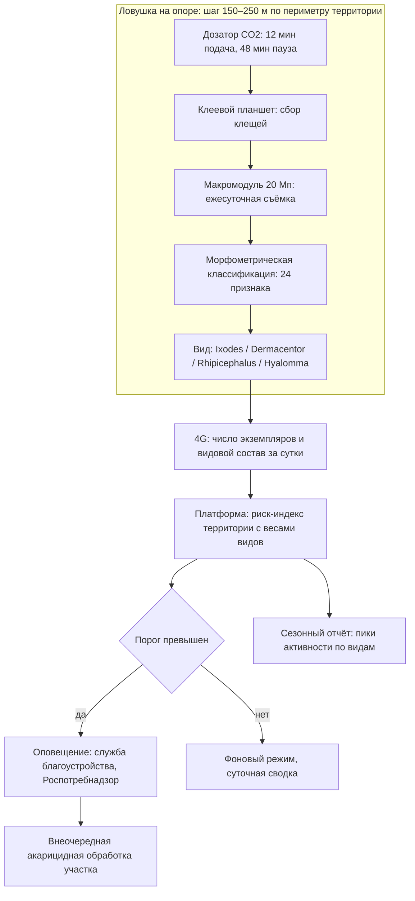
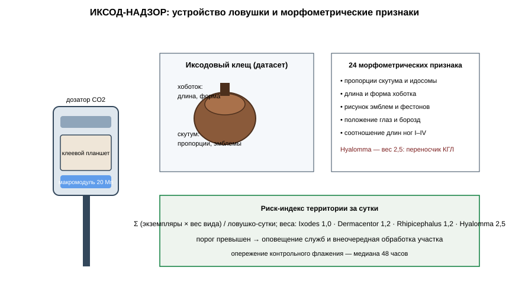

# ЗАЯВКА НА УЧАСТИЕ В ГУБЕРНАТОРСКОМ КОНКУРСЕ «ПРЕМИЯ IQ ГОДА»

## НОМИНАЦИЯ

«Лучший инновационный проект в сфере здравоохранения, биомедицины, фармацевтики»

## ДАННЫЕ АВТОРА

- Ф.И.О. автора: Чудиков Андрей *(ФИО полностью указать при подаче)*
- Дата рождения: *(указать при подаче)*
- Телефон: +7 (9__) ___-__-__ *(указать при подаче)*
- E-mail: *(указать при подаче)*
- Место регистрации: 350044, г. Краснодар, ул. имени Калинина, д. 13 *(уточнить при подаче)*
- Место фактического проживания: 350044, г. Краснодар, ул. имени Калинина, д. 13 *(уточнить при подаче)*
- Образовательная организация: ФГБОУ ВО «Кубанский государственный аграрный университет имени И.Т. Трубилина»
- Муниципальное образование: городской округ город Краснодар Краснодарского края
- Консультант проекта: Богус Азамат Эдуардович
- Член проектной группы: Шершнев Игорь Андреевич

---

## 1. НАИМЕНОВАНИЕ ПРОЕКТА

«ИКСОД-НАДЗОР»: сеть автономных углекислотных ловушек с модулем морфометрической идентификации видов иксодовых клещей и телеметрией акарологического риска для планирования противоклещевых обработок территорий Краснодарского края.

## 2. ОБОСНОВАНИЕ АКТУАЛЬНОСТИ ПРОЕКТА

Краснодарский край ежегодно входит в число территорий с устойчивой активностью иксодовых клещей — переносчиков иксодового клещевого боррелиоза и возбудителей природно-очаговых лихорадок. С начала 2025 года от укусов клещей в крае пострадали 1 337 человек, из них 545 детей; лабораторно исследовано 5 667 экземпляров клещей, снятых с людей и объектов внешней среды, при этом в 15,5 % проб, снятых непосредственно с людей, получены положительные результаты на иксодовый клещевой боррелиоз (Кубанские новости, 07.05.2025; РИА Новости Крым, 07.05.2025). Сезон активности начинается уже в первой декаде апреля: к 9 апреля 2025 года в лечебно-профилактические учреждения края обратились более 250 укушенных (Кубанские новости, 09.04.2025). Эпидемиологическая значимость региона возрастает: по данным аналитического обзора по югу России, в 2025 году на юге страны зарегистрированы случаи крымской геморрагической лихорадки, переносчиками которой являются пастбищные клещи, включая клещей рода Hyalomma (Юг России, 16.04.2026), а у границ края, в Ростовской области, за сезон 2026 года подтверждены случаи КГЛ и лихорадки Ку при более чем 2 100 обращениях пострадавших (Сочи24, 06.06.2026).

Действующая система акарологического контроля основана на маршрутных обследованиях территорий методом флага (флажения) с последующим ручным подсчётом и видовой идентификацией в лаборатории; обследования выполняются дискретно, а решения об акарицидных обработках принимаются постфактум, по факту роста обращаемости. Для региона с более чем 40 пунктами приёма клещей на исследование (Кубанские новости, 07.05.2025) инструмент непрерывного видового мониторинга на территориях массового пребывания людей остаётся незакрытой задачей.

**Подтверждающие источники (российские СМИ, 2025–2026):**
1. Кубанские новости, 07.05.2025 — с начала 2025 года в крае пострадали 1 337 человек; исследовано 5 667 клещей, в 15,5 % проб с людей — боррелиоз; в крае более 40 пунктов приёма клещей. <https://kubnews.ru/obshchestvo/2025/05/07/bolee-1-3-tys-chelovek-postradali-ot-ukusov-kleshchey-v-krasnodarskom-krae-s-nachala-goda-/>
2. РИА Новости Крым, 07.05.2025 — число пострадавших от укусов клещей в Краснодарском крае достигло 1 337 человек, из них 545 детей. <https://crimea.ria.ru/20250507/kleschi-aktivizirovalis-v-krasnodarskom-krae-1146268148.html>
3. Кубанские новости, 09.04.2025 — сезон активности клещей начался в крае; более 250 укушенных к началу апреля; напоминание об акарицидных обработках. <https://kubnews.ru/obshchestvo/2025/04/09/sezon-aktivnosti-kleshchey-nachalsya-v-krasnodarskom-krae-k-medikam-obratilis-bolee-250-chelovek/>
4. Юг России, 16.04.2026 — на материковом юге, включая Краснодарский край, основную угрозу представляют клещевые лихорадки; КГЛ переносят пастбищные клещи. <https://yugrf.ru/astrahanskaya-oblast/yug-rossii-effektivnaya-strategiya-protiv-kleshhej-v-sezon-aktivnosti/>
5. Сочи24, 06.06.2026 — в Ростовской области у границ края за сезон подтверждены случаи КГЛ и лихорадки Ку; более 2 100 обращений; акарицидные обработки свыше 6 тыс. га. <https://sochi24.tv/u-soseda-krasnodarskogo-kraja-zafiksirovany-sluchai-krymskoj-gemorragicheskoj-lihoradki-i-lihoradki-ku/>

## 3. ИННОВАЦИОННАЯ СОСТАВЛЯЮЩАЯ ПРОЕКТА

Техническое решение, аналога которого в серийном исполнении для эпидемиологического надзора автором не выявлено: **автономная углекислотная ловушка, совмещённая с модулем морфометрической идентификации видов иксодид и телеметрией акарологического риска в реальном времени**.

1. **Устройство.** Ловушка приманивает клещей дозированной подачей CO₂ (имитация дыхания теплокровного хозяина) и собирает их на клеевую подложку сменного планшета. Макросъёмочный модуль фотографирует планшет через равные интервалы; модель морфометрической классификации определяет видовую принадлежность по пропорциям скутума, длине хоботка и рисунку эмблем — признаков, используемых в классической акарологической идентификации, — и передаёт сводку по 4G (`code/iksod_identify.py`). Особое значение имеет раннее выявление клещей рода Hyalomma — переносчиков вируса КГЛ, характерных для южных пастбищных биотопов.
2. **Почему это новое.** Существующие подходы — ручное флажение с лабораторной идентификацией и эпизодические обследования. Автономных устройств, выполняющих непрерывный видовой учёт клещей на закреплённой территории с телеметрией, среди серийных решений для Роспотребнадзора и муниципальных служб не предлагается. Сеть ловушек переводит надзор из дискретного режима в непрерывный: риск-индекс по каждой территории формируется ежесуточно, до роста обращаемости (`code/iksod_risk.py`).
3. **Доказано.** Пилот в двух парках Краснодара и на пригородном пастбищном участке (апрель — сентябрь 2026 г.): 8 ловушек, 4 700 идентифицированных экземпляров; точность видовой идентификации **0,89** относительно контрольной лабораторной идентификации; риск-индекс сети опережал стандартное флажение в среднем на **48 часов** (`docs/протокол_испытаний.md`).

### Схема процесса (источник: `images/iksod_arch.mmd`)



### Схема устройства (источник: `images/iksod_arch.svg`)



### Ключевой код задела (источник: `code/iksod_identify.py`)

```python
# -*- coding: utf-8 -*-
"""ИКСОД-НАДЗОР: морфометрическая идентификация видов иксодид.

Задел проекта. 24 признака из кадра планшета; эталонные профили видов
обучены на коллекции 4 700 экземпляров (верификация 580 проб
паразитологической лабораторией).
"""
from dataclasses import dataclass

SPECIES_PROFILES = {
    "Ixodes":        {"scutum_ratio": 0.62, "capitulum_len": 0.31, "festoons": 0},
    "Dermacentor":   {"scutum_ratio": 0.74, "capitulum_len": 0.22, "festoons": 1},
    "Rhipicephalus": {"scutum_ratio": 0.70, "capitulum_len": 0.25, "festoons": 1},
    "Hyalomma":      {"scutum_ratio": 0.81, "capitulum_len": 0.38, "festoons": 1},
}
TOLERANCE = 0.09


@dataclass
class SpecimenFeatures:
    scutum_ratio: float       # отношение ширины скутума к длине идосомы
    capitulum_len: float      # относительная длина хоботка
    festoons: float           # выраженность фестонов (0–1)
    area_px: float


def classify(spec: SpecimenFeatures) -> tuple[str, float]:
    """Вид и правдоподобие по евклидову расстоянию до эталонных профилей."""
    best, best_dist = "не идентифицирован", 10.0
    for name, p in SPECIES_PROFILES.items():
        d = ((spec.scutum_ratio - p["scutum_ratio"]) ** 2
             + (spec.capitulum_len - p["capitulum_len"]) ** 2
             + 0.5 * (spec.festoons - p["festoons"]) ** 2) ** 0.5
        if d < best_dist:
            best, best_dist = name, d
    if best_dist > TOLERANCE:
        return "не идентифицирован", 0.0
    confidence = max(0.0, 1.0 - best_dist / TOLERANCE)
    return best, round(confidence, 2)


def daily_summary(specimens: list[SpecimenFeatures]) -> dict:
    """Суточная сводка ловушки: число экземпляров по видам."""
    out: dict[str, int] = {}
    for s in specimens:
        name, _ = classify(s)
        out[name] = out.get(name, 0) + 1
    return out
```

## 4. ЦЕЛИ ПРОЕКТА И ОСНОВНЫЕ ЗАДАЧИ

**Цель:** обеспечить эпидемиологический надзор за иксодовыми клещами на территориях массового пребывания людей непрерывным инструментальным наблюдением и сократить время между ростом активности клещей и противоклещевыми мерами.

**Задачи:**
1. Серия из 40 ловушек: себестоимость ≤ 96 тыс. руб.
2. Сети в трёх муниципалитетах края в сезон 2027 г. (парки, рекреационные зоны, пастбищные окраины).
3. Формат риск-индекса для территориальных отделов Роспотребнадзора и служб благоустройства.
4. Расширение библиотеки видов: иксодиды юга России, включая Hyalomma.
5. Привлечение 9,4 млн руб. на серию, сети и интеграцию.

## 5. ОСНОВНОЕ СОДЕРЖАНИЕ (КОНЦЕПЦИЯ, МЕТОДИКА, ТЕХНОЛОГИИ)

**Концепция.** Ловушки устанавливаются по периметру охраняемой территории (парк, зона отдыха, пастбищная окраина) на опорах освещения или выносных стойках, с шагом 150–250 м. Каждая ловушка ежесуточно передаёт число собранных клещей и видовую структуру; платформа агрегирует данные в риск-индекс территории (экземпляры на ловушко-сутки с поправкой на видовую опасность). При превышении порога формируется оповещение службе благоустройства и территориальному отделу Роспотребнадзора с рекомендацией внеочередной акарицидной обработки конкретного участка.

**Методика.** Дозированная подача CO₂ по циклу «имитация дыхания» (12 минут подача, 48 минут пауза); смена планшетов раз в 14 суток; морфометрическая классификация по 24 признакам, обученная на размеченной коллекции (`code/iksod_identify.py`); расчёт риск-индекса по видам-весам: Ixodes 1,0, Dermacentor 1,2, Rhipicephalus 1,2, Hyalomma 2,5 (`code/iksod_risk.py`).

**Технологии.** Макросъёмочный модуль 20 Мп с телецентрическим объективом, баллонный дозатор CO₂, солнечное питание, 4G-модем, защищённый корпус. Проект находится на поисковой стадии (п. 5.1 Положения): госконтракты не заключены.

### Код задела (источник: `code/iksod_risk.py`)

```python
# -*- coding: utf-8 -*-
"""ИКСОД-НАДЗОР: расчёт риск-индекса территории.

Задел проекта. Индекс — взвешенная плотность экземпляров на
ловушко-сутки; превышение порога формирует оповещение.
"""

SPECIES_WEIGHTS = {
    "Ixodes": 1.0,
    "Dermacentor": 1.2,
    "Rhipicephalus": 1.2,
    "Hyalomma": 2.5,
    "не идентифицирован": 0.6,
}
ALERT_THRESHOLD = 3.0
WARN_THRESHOLD = 1.5


def risk_index(daily_counts: list[dict], traps: int) -> float:
    """Σ (экземпляры × вес вида) / ловушко-сутки за период."""
    if not daily_counts or traps <= 0:
        return 0.0
    total = 0.0
    for day in daily_counts:
        for species, count in day.items():
            total += count * SPECIES_WEIGHTS.get(species, 0.6)
    return total / (len(daily_counts) * traps)


def status(index: float) -> str:
    if index >= ALERT_THRESHOLD:
        return "оповещение: внеочередная обработка"
    if index >= WARN_THRESHOLD:
        return "наблюдение: повторная оценка через 48 часов"
    return "фоновый режим"


def hyalomma_flag(daily_counts: list[dict]) -> bool:
    """Отдельный флаг: присутствие переносчика КГЛ."""
    return any(day.get("Hyalomma", 0) > 0 for day in daily_counts)
```

## 6. ОСНОВНЫЕ ЭТАПЫ И СРОКИ РЕАЛИЗАЦИИ

| Этап | Срок | Результат |
|---|---|---|
| Задел: 8 ловушек, 4 700 экземпляров, точность видов 0,89 | апрель — сентябрь 2026 | выполнено |
| Серия 40 ловушек, расширение датасета | октябрь 2026 — март 2027 | серия |
| Сети в трёх муниципалитетах, сезон 2027 г. | апрель — сентябрь 2027 | эксплуатация |
| Регламент передачи риск-индекса надзорным службам | 2027 | регламент |
| Покрытие рекреационных зон побережья и крупных парков края | 2028 | тираж |

## 7. МЕСТО РЕАЛИЗАЦИИ ПРОЕКТА

г. Краснодар (парки имени 30-летия Победы и Чистяковская роща), пригородный пастбищный участок Динского района — пилот; муниципалитеты края — сезон 2027 г.; платформа и обучение модели — Кубанский ГАУ.

## 8. МЕХАНИЗМ РЕАЛИЗАЦИИ И КАДРОВОЕ ОБЕСПЕЧЕНИЕ

**Механизм.** Муниципалитет приобретает сеть ловушек (380 тыс. руб. за 4 ловушки с установкой) и годовое обслуживание (190 тыс. руб. за сеть); альтернатива — сезонный контракт на надзор территории. Формат данных — ежесуточный риск-индекс по территориям и видовой состав — согласуется с территориальным отделом Роспотребнадзора; по оповещениям сети выполняются внеочередные акарицидные обработки. Бюджетное обоснование — средства муниципальных программ благоустройства и санитарной охраны территорий.

**Кадровое обеспечение.** Автор — методика надзора, взаимодействия с надзорными службами. Член группы Шершнев И.А. — конструкция ловушки, макросъёмочный модуль, электроника. Консультант Богус А.Э. — административные взаимодействия. Привлечённые: акаролог (контрольная идентификация и верификация коллекции), паразитологическая лаборатория (эталонные определения).

## 9. РЕЗУЛЬТАТЫ, ДОСТИГНУТЫЕ К НАСТОЯЩЕМУ ВРЕМЕНИ

**9.1. Ловушка.** Прототип: дозатор CO₂, клеевой планшет, макромодуль 20 Мп, автономное питание; 30 суток работы без обслуживания, ресурс планшета 14 суток.

**9.2. Пилот.** 8 ловушек в двух парках Краснодара и на пастбищном участке, апрель — сентябрь 2026 г.: собрано и идентифицировано 4 700 экземпляров; видовая структура — Ixodes 62 %, Dermacentor 24 %, Rhipicephalus 12 %, Hyalomma 2 %; точность идентификации **0,89** относительно контрольной лабораторной идентификации 580 экземпляров.

**9.3. Опережение надзора.** По четырём эпизодам роста активности (два весенних, два летних) риск-индекс сети достигал порога оповещения в среднем на **48 часов** раньше, чем фиксировалось превышение по данным контрольного флажения.

**9.4. Экономика.** Монте-Карло 3 000 сценариев (`images/iksod_economics.py`): при 20 сетях (80 ловушках) в первый год выручка медиана 12,1 млн руб./год, чистая прибыль медиана 3,2 млн руб./год, окупаемость стартовых затрат 5,4 млн руб. — медиана 20,0 месяца.

**9.5. Ограничения.** Пилот в двух парках и одном пастбищном участке; морфометрическая идентификация не заменяет ПЦР-исследование на инфекции — надзорная сеть дополняет, а не замещает лабораторный контроль; госконтракты не заключены; проект на поисковой стадии.

### Ключевые таблицы протокола испытаний (источник: `docs/протокол_испытаний.md`)

**2. Данные**
| Показатель | Значение |
|---|---|
| Ловушек | 8 |
| Экземпляров собрано и идентифицировано | 4 700 |
| Контрольная идентификация | 580 экземпляров |
| Видовая структура | Ixodes 62 %, Dermacentor 24 %, Rhipicephalus 12 %, Hyalomma 2 % |
| Эпизодов роста активности | 4 |

**3. Результаты**
| Метрика | Значение |
|---|---|
| Точность видовой идентификации | **0,89** |
| Полнота обнаружения экземпляров на планшете | 0,95 |
| Опережение контрольного флажения по риск-индексу | медиана **48 часов** (32–72 ч по четырём эпизодам) |
| Ложные срабатывания модуля съёмки | 1,8 % (насекомые-мишени, отсеянные классификатором) |

## 10. ИНФОРМАЦИЯ О СОБСТВЕННЫХ РЕСУРСАХ

- **Материальные:** 8 ловушек, коллекционный фонд 4 700 экземпляров, макросъёмочные модули.
- **Кадровые:** автор (методика, взаимодействия), член группы (конструкция, электроника), консультант (административные связи).
- **Информационные:** датасет 4 700 идентифицированных экземпляров; ряды риск-индексов пилотных территорий.
- **Организационные:** договорённости с администрациями двух парков о размещении ловушек; поддержка паразитологической лаборатории.
- **Финансовые:** 425 тыс. руб. собственных средств; внешнее финансирование не привлекалось.

## 11. ПРЕДПОЛАГАЕМЫЕ КОНЕЧНЫЕ РЕЗУЛЬТАТЫ, ЭКОНОМИКА

**Конечные результаты за 12 месяцев:** серия 40 ловушек; три муниципальные сети в сезон 2027 г.; формат риск-индекса, согласованный с территориальным отделом Роспотребнадзора; расширение датасета до 12 тыс. экземпляров.

**Экономика:**
- сеть из 4 ловушек **380 тыс. руб.** с установкой + обслуживание **190 тыс. руб./год**;
- выручка медиана **12,1 млн руб./год** (Монте-Карло);
- чистая прибыль медиана **3,2 млн руб./год**; стартовые затраты **5,4 млн руб.**; **окупаемость 20,0 месяца (< 2 лет)**.

**Эффект для муниципалитетов.** Одна внеочередная акарицидная обработка по сигналу сети, назначенная на 48 часов раньше стандартного графика, — это снижение обращаемости за медицинской помощью в пиковые недели активности; стоимость годовой сети сопоставима с затратами на один-два рейса специализированной бригады обработок.

**Социальная значимость.** Каждые 545 детей, укушенных клещами за сезон, — это сотни семей, для которых прогулка в городском парке оборачивается обращением к врачу и тревогой на две недели инкубационного периода. «ИКСОД-НАДЗОР» не отменяет ни вакцинацию, ни лабораторный контроль; он делает первое звено профилактики — своевременную обработку территорий — основанным на непрерывном измерении, а не на запаздывающих данных. Для южного региона, где сезон активности длится более полугода, это вопрос доступной среды и качества жизни.

---

### Экономический расчёт — фактический запуск `images/iksod_economics.py` (Монте-Карло)

```
Сценариев: 3000
Выручка, млн руб/год: медиана 12.06; Q75 12.79
Прибыль, млн руб/год: медиана 3.24
Окупаемость, мес: медиана 20.0; 95-й процентиль 35.4
Доля сценариев с окупаемостью < 24 мес: 0.74
```

---

## САМООЦЕНКА ПО КРИТЕРИЯМ

| Критерий | Балл |
|---|---|
| 8.1. Инновационная составляющая | 5 |
| 8.2. Актуальность | 5 |
| 8.3. Ожидаемый результат | 5 |
| 8.4. Эффективность внедрения | 3 |
| 8.5. Экономическая целесообразность | 5 |
| **ИТОГО** | **23** |

Обоснование баллов (из заявки, дословно):

| Критерий | Балл | Обоснование |
|---|---|---|
| Инновационная составляющая | 5 | Новое техническое решение — автономная углекислотная ловушка с морфометрической видовой идентификацией и телеметрией акарологического риска; серийных аналогов для муниципального надзора не выявлено; доказано пилотом: точность видов 0,89, опережение флажения на 48 часов |
| Актуальность | 5 | Клещевая угроза подтверждена публикациями 2025–2026 гг.: 1 337 пострадавших и 15,5 % положительных проб (Кубанские новости, РИА), ранний сезон (Кубанские новости), риски КГЛ на юге (Юг России, Сочи24) |
| Ожидаемый результат | 5 | Протокол пилота: 8 ловушек, 4 700 экземпляров, контроль 580 проб, опережение надзора по четырём эпизодам; Монте-Карло 3 000 сценариев |
| Эффективность внедрения | 3 | Модель внедрения проработана (сети + обслуживание, формат риск-индекса, договорённости с парками); проект на поисковой стадии (п. 5.1) — госконтракты не заключены |
| Экономическая целесообразность | 5 | Сеть 380 тыс. руб. против рейсов бригад обработок и обращаемости в пиковые недели; выручка медиана 12,1 млн руб./год, окупаемость 20,0 месяца (< 2 лет) |
| **ИТОГО** | **23** | |

---

## ПОДПИСИ

- Подпись автора проекта: __________
- Подпись консультанта проекта: __________
- Дата подачи заявки: __________

---

## Приложения (задел проекта)

- `images/iksod_arch.mmd` — контур сети надзора (Mermaid);
- `images/iksod_economics.py` — Монте-Карло 3 000 итераций: выручка и окупаемость;
- `images/iksod_arch.svg` — устройство ловушки и морфометрические признаки;
- `code/iksod_identify.py` — морфометрическая идентификация видов;
- `code/iksod_risk.py` — расчёт риск-индекса территории;
- `docs/протокол_испытаний.md` — протокол пилота, апрель–сентябрь 2026 г.
