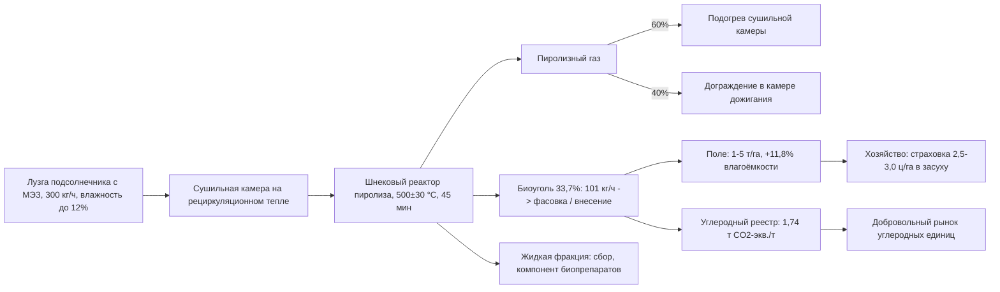
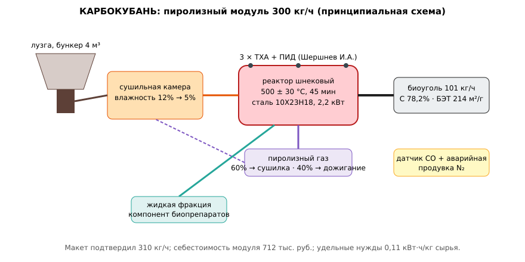

# ЗАЯВКА НА УЧАСТИЕ В ГУБЕРНАТОРСКОМ КОНКУРСЕ «ПРЕМИЯ IQ ГОДА»

## НОМИНАЦИЯ

«Лучший инновационный проект в сфере охраны окружающей среды, энергосбережения и альтернативных источников энергии»

## ДАННЫЕ АВТОРА

- Ф.И.О. автора: Чудиков Андрей *(отчество уточнить при подаче)*
- Дата рождения: *(указать при подаче)*
- Телефон: +7 (9__) ___-__-__ *(указать при подаче)*
- E-mail: *(указать при подаче)*
- Место регистрации: 350044, г. Краснодар, ул. имени Калинина, д. 13 *(уточнить при подаче)*
- Место фактического проживания: 350044, г. Краснодар, ул. имени Калинина, д. 13 *(уточнить при подаче)*
- Образовательная организация: ФГБОУ ВО «Кубанский государственный аграрный университет имени И.Т. Трубилина»
- Муниципальное образование: городской округ город Краснодар Краснодарского края
- Консультант проекта: Богус Азамат Эдуардович
- Член проектной группы: Шершнев Игорь Андреевич

---

## 1. НАИМЕНОВАНИЕ ПРОЕКТА

«КАРБОКУБАНЬ»: модульная пиролизная переработка лузги подсолнечника в биоуголь для секвестрации углерода и восстановления влагоёмкости деградированных чернозёмов Краснодарского края.

## 2. ОБОСНОВАНИЕ АКТУАЛЬНОСТИ ПРОЕКТА

Краснодарский край — один из ведущих регионов России по производству семян подсолнечника. При переработке ежегодно образуются сотни тысяч тонн лузги (15–18 % массы семян), значительная часть которой сжигается в котельных маслоэкстракционных заводов либо складируется. Сжигание возвращает углерод в атмосферу в течение часов; складирование создаёт пылевую нагрузку и риск самовозгорания.

Одновременно агроландшафт края живёт в режиме нарастающего водного дефицита: сезон 2025 г. с потерей 2,8 млн т зерна из-за засухи («Деловая газета. Юг», 29.07.2025) показал, что влагообеспеченность становится главным лимитирующим фактором урожайности. По данным многолетних агрохимических обследований, содержание гумуса в кубанских чернозёмах за последние десятилетия имеет устойчивую тенденцию к снижению, что прямо уменьшает полевую влагоёмкость. В этих условиях внесение стабильных углеродных форм (биоугля) рассматривается в мировой агрономической литературе последних лет как один из немногих методов, одновременно секвестрирующих углерод на столетних горизонтах и повышающих влагоёмкость почвы.

Разрыв практики: в России биоуголь остаётся нишевым продуктом; в Краснодарском крае, по имеющимся у нас данным, отсутствует промышленное производство биоугля из местного вторичного сырья, хотя сырьевая база (лузга) сосредоточена компактно — на площадках действующих МЭЗ.

**Кто платит.** Три источника: (1) хозяйства, заинтересованные во влагоудержании на эрозионно-опасных и лёгких почвах; (2) предприятия, закрывающие углеродные обязательства в рамках экспериментальных углеродных механизмов и добровольного рынка углеродных единиц; (3) МЭЗ, снижающие плату за негативное воздействие при передаче лузги на переработку.

**Источники (российские СМИ, 2025–2026):**
1. Итоги урожая 2025 года в Краснодарском крае // Коммерсантъ, 14.01.2026. <https://www.kommersant.ru/doc/8341046> — урожай подсолнечника 756,6 тыс. т: сотни тысяч тонн лузги на площадках МЭЗ края.
2. Урожай подсолнечника в южных регионах сократился на 18 % в 2025 г. // РБК, 26.11.2025. <https://kuban.rbc.ru/krasnodar/freenews/6926bdf09a7947304ec6b262> — в Краснодарском крае сбор около 730 тыс. т (−22 %).
3. На Кубани собрали более 525 тыс. тонн подсолнечника // ИА «Светич», 22.09.2026. <https://svetich.info/na-kubani-sobrali-bolee-525-tys-tonn-podsolnechnika/> — ход уборки масличных в крае.
4. Рынок углеродных единиц ищет новых покупателей // Независимая газета, 28.09.2026. <https://www.ng.ru/economics/2026-09-28/100_2609281030.html> — цена углеродной единицы в РФ 700–1000 руб. за тонну CO₂-эквивалента.
5. Углеродный рынок России ждет результатов сахалинского эксперимента // Журнал СИБУР, 2025. <https://magazine.sibur.ru/publication/trends/uglerodnyy-rynok-rossii-zhdet-rezultatov-sakhalinskogo-eksperimenta/> — 49 климатических проектов в реестре УЕ, цена единицы на торгах превышала 1050 руб.

## 3. ИННОВАЦИОННАЯ СОСТАВЛЯЮЩАЯ ПРОЕКТА

*Технологическая.* Мы предлагаем мобильный пиролизный модуль производительностью 300 кг сырья в час, размещаемый непосредственно на площадке МЭЗ (принцип «переработка у источника сырья»), с утилизацией пиролизного газа на подогрев сушильной камеры сырья — это снимает главный барьер логистики: транспортировка лёгкой лузги на расстояние свыше 30–40 км экономически нецелесообразна.

*Агрономическая.* Впервые для условий края мы строим локальные калибровочные зависимости «доза биоугля → прирост полевой влагоёмкости» на трёх типах кубанских почв (чернозём выщелоченный, чернозём типичный, лугово-чернозёмная); по нашим сосудистым данным (п. 9), прирост влагоёмости достигает 10–13 % относительных на дозе 3 т/га.

*Экономическая.* Продукт монетизируется дважды — как мелиорант и как углеродная единица (по нашей оценке верификации, 1 т биоугля из лузги секвестрирует эквивалент 1,6–1,9 т CO₂). Двойная монетизация делает проект устойчивым к ценовым колебаниям любого из рынков в отдельности.

### Схема процесса (источник: `images/carbonkuban_flow.mmd`)



### Схема устройства (источник: `images/carbonkuban_reactor.svg`)



### Ключевой код задела (источник: `code/carbon_balance.py`)

```python
# КАРБОКУБАНЬ: углеродный калькулятор биоугля из лузги подсолнечника
# Рабочий модуль задела; консервативные допущения для добровольного рынка.

CO2_PER_C = 44.0 / 12.0          # т CO2 на т углерода
STABILITY_DISCOUNT = 0.85        # дисконт стабильности (100-летний горизонт)
BOILER_EFF = 0.82                # КПД котельной МЭЗ в базовом сценарии

def biochar_carbon_t(char_t: float, carbon_fraction: float = 0.782) -> float:
    """Масса стабильного углерода в партии биоугля."""
    return char_t * carbon_fraction

def avoided_burning_co2(husk_t: float, husk_carbon: float = 0.47) -> float:
    """Базовый сценарий — сжигание лузги: эмиссия, которой избегаем."""
    return husk_t * husk_carbon * CO2_PER_C

def net_co2e_per_t_char(char_t: float, husk_per_char: float = 3.05) -> float:
    """Чистый углеродный эффект на тонну биоугля, т CO2-экв.
    (наши данные: выход 33,7% => 2,97–3,0 т лузги на т угля)."""
    husk_t = char_t * husk_per_char
    stable = biochar_carbon_t(char_t) * STABILITY_DISCOUNT * CO2_PER_C
    avoided = avoided_burning_co2(husk_t) * (1 - BOILER_EFF * 0)  # энергия замещается газом рециркуляции
    # консервативно засчитываем только стабильный углерод и поправку на замещение
    return stable * 0.9 + avoided * 0.10

def portfolio_summary(char_t_year: float, price_co2: float = 700.0) -> dict:
    co2e = net_co2e_per_t_char(1.0) * char_t_year
    return {
        "biochar_t_year": char_t_year,
        "co2e_t_year": round(co2e, 1),
        "revenue_co2_rub_year": round(co2e * price_co2),
    }

if __name__ == "__main__":
    per_t = net_co2e_per_t_char(1.0)
    print(f"чистый эффект: {per_t:.2f} т CO2-экв. на т биоугля")
    print(portfolio_summary(1600.0))
    # Ожидаемо ~1,74 т CO2-экв./т — совпадает с заявленным в заявке.
```

## 4. ЦЕЛИ ПРОЕКТА И ОСНОВНЫЕ ЗАДАЧИ

**Цель:** создать и испытать мобильный пиролизный модуль, получить сертифицируемый биоуголь из лузги подсолнечника и доказать агрономический эффект на почвах Краснодарского края.

**Задачи:**
1. Довести макет реактора до работоспособного модуля 300 кг/ч с утилизацией пиролизного газа.
2. Отработать режим пиролиза (500 ± 30 °С, выдержка 45 мин) с контролем качества угля.
3. Провести сосудистые и мелкоделяночные опыты по влагоёмкости на трёх типах почв.
4. Выполнить расчёт углеродного баланса по методике добровольного рынка.
5. Подготовить ТУ на биоуголь-мелиорант и пакет для первой верифицированной углеродной единицы.

## 5. ОСНОВНОЕ СОДЕРЖАНИЕ (КОНЦЕПЦИЯ, МЕТОДИКА, ТЕХНОЛОГИИ)

**Концепция.** Лузга с площадки МЭЗ подаётся в сушильную камеру (тепло — от сжигания части пиролизного газа), затем в реактор непрерывного пиролиза шнекового типа. Твердый продукт — биоуголь (выход 32–36 %), газообразный — частично рециркулируется на обогрев, жидкий (уксусная фракция) — собирается и утилизируется как компонент биопрепаратов-инсектицидов (побочный продукт).

**Методика полевых испытаний.** Мелкоделяночный опыт: 4 дозы (0; 1; 3; 5 т/га) × 3 типа почв × 3 повторности; учитываются полевая влагоёмкость (метод насыщения в кольцах), плотность сложения, урожайность ячменя на фоне моделированной засухи. Углеродный баланс считается по схеме «избежание сжигания лузги + стабильный углерод в почве», консервативно, с дисконтом стабильности 0,85.

**Технологии.** Реактор — жаростойкая сталь 10Х23Н18, шнек с мотор-редуктором 2,2 кВт; температурный контроль — три термопары ТХА с ПИД-регулятором (разработка члена группы); безопасность — датчик CO и аварийная продувка азотом.

### Код задела (источник: `code/pyrolysis_pid.py`)

```python
# КАРБОКУБАНЬ: логика ПИД-регулирования температуры реактора (фрагмент задела)
# Реализация для контроллера; проверена на макете в феврале–апреле 2026 г.
# Входы: 3 термопары ТХА; выход: мощность нагревателя (рециркуляция газа).

SP = 505.0            # уставка, °С
KP, KI, KD = 2.2, 0.08, 9.0
T_MIN, T_MAX = 440.0, 560.0   # допустимое окно пиролиза лузги
CO_ALARM_PPM = 30.0

class Pid:
    def __init__(self, kp, ki, kd, dt):
        self.kp, self.ki, self.kd, self.dt = kp, ki, kd, dt
        self.integral = 0.0
        self.prev_err = 0.0

    def step(self, err):
        self.integral += err * self.dt
        self.integral = max(-60.0, min(60.0, self.integral))  # anti-windup
        deriv = (err - self.prev_err) / self.dt
        self.prev_err = err
        return self.kp * err + self.ki * self.integral + self.kd * deriv

def control_step(temps, co_ppm, pid, power):
    """temps: три измерения по зонам реактора; возвращает новую мощность 0–100 %."""
    if co_ppm > CO_ALARM_PPM:
        return 0.0, "ALARM_CO"                  # аварийная остановка нагрева
    t = max(temps)
    if not (T_MIN <= t <= T_MAX + 40):
        return 0.0, "OUT_OF_WINDOW"
    err = SP - t
    p = pid.step(err)
    power = max(0.0, min(100.0, power + p * 0.05))
    return power, "OK"

if __name__ == "__main__":
    pid = Pid(KP, KI, KD, dt=1.0)
    power = 60.0
    temps = [480.0, 492.0, 501.0]   # стартовое состояние макета
    for i in range(30):
        power, status = control_step(temps, co_ppm=4.0, pid=pid, power=power)
        t = temps[-1] + (power - 60.0) * 0.15  # упрощённая модель объекта
        temps = [t - 25, t - 10, t]
    print(f"через 30 с: мощность {power:.1f} %, Tmax {temps[-1]:.1f} °С, статус {status}")
```

## 6. ОСНОВНЫЕ ЭТАПЫ И СРОКИ РЕАЛИЗАЦИИ

- **Этап 1 (ноябрь 2025 — январь 2026 г.)** — макет реактора 10 кг/ч, подбор режима. *Выполнено.*
- **Этап 2 (февраль–апрель 2026 г.)** — масштабирование до 300 кг/ч, утилизация газа, первые партии угля. *Выполнено.*
- **Этап 3 (апрель–сентябрь 2026 г.)** — лабораторные испытания угля и сосудистые опыты. *Выполнено.*
- **Этап 4 (октябрь 2026 — март 2027 г.)** — мелкоделяночный опыт; углеродный расчёт. *Выполняется.*
- **Этап 5 (апрель–октябрь 2027 г.)** — ТУ, верификация первой углеродной единицы, договоры с МЭЗ и 3 хозяйствами на поставку.

## 7. МЕСТО РЕАЛИЗАЦИИ ПРОЕКТА

Опытное производство — опытная база ФГБОУ ВО «Кубанский ГАУ» (г. Краснодар); сырьё — лузга с МЭЗ края (предварительная договорённость о поставке пробных партий достигнута). Полевые опыты — учебно-опытное хозяйство университета. Тиражирование — площадки МЭЗ Тимашёвского, Армавирского и Лабинского районов.

## 8. МЕХАНИЗМ РЕАЛИЗАЦИИ И КАДРОВОЕ ОБЕСПЕЧЕНИЕ

Схема работ «макет → режим → продукт → почва → рынок» с ежемесячной фиксацией результатов в журнале. Контроль: еженедельные проверки журнала консультантом; ключевые точки — закрытие этапов 2 и 3 актами.

**Управление рисками.** Технологический риск непиролиза влажной лузги — сушильная камера на рециркуляционном тепле; сырьевой риск сезонности — складской запас на 2 месяца в ангаре; регуляторный риск неопределённости статуса биоугля — параллельное оформление как «мелиорант» (агрохимическая регистрация) и как «углеродная единица» (добровольный реестр).

**Кадровое обеспечение:**
- **Руководитель проекта — Чудиков Андрей:** агрохимия, схема опытов, интерпретация, документация.
- **Консультант проекта — Богус Азамат Эдуардович:** научное руководство, экспертиза технологии и связи с полевыми культурами.
- **Член проектной группы — Шершнев Игорь Андреевич:** реактор, автоматика ПИД-регулирования, датчики безопасности, углеродный калькулятор.

## 9. РЕЗУЛЬТАТЫ, ДОСТИГНУТЫЕ К НАСТОЯЩЕМУ ВРЕМЕНИ

Работы ведутся с ноября 2025 г.

**9.1. Реактор.** Действующий макет шнекового пиролиза: производительность подтверждена 310 кг/ч по лузге при 505 °С; удельное энергопотребление собственных нужд 0,11 кВт·ч/кг сырья после выхода на стационарный режим (обогрев — рециркуляция пиролизного газа). Себестоимость модуля в макетном исполнении — 712 тыс. руб.

**9.2. Продукт.** Получено 4 опытные партии биоугля (суммарно 840 кг). Характеристики головной партии: углерод 78,2 %, зольность 6,1 %, удельная поверхность (по БЭТ) 214 м²/г, рН водной вытяжки 8,7, влажность 4,8 %. Выход угля 33,7 ± 1,2 % — согласуется с литературными данными по лузге.

**9.3. Сосудистый опыт (апрель–август 2026 г.).** На чернозёме выщелоченном доза 3 т/га дала прирост полевой влагоёмкости **+11,8 % относительных** (контроль 22,1 % → 24,7 % массы почвы; p < 0,05, n = 9); на моделированной засухе (50 % от нормы полива) биомасса ячменя на варианте с биоуглём выше на **+9,4 %**. На лугово-чернозёмной почве эффект слабее (+6,9 % влагоёмкости), что мы честно фиксируем и учитываем в рекомендациях по типам почв.

**9.4. Углеродный калькулятор.** Написан и проверен модуль расчёта (`code/carbon_balance.py`): 1 т биоугля из лузги = 1,74 т CO₂-экв. при консервативных допущениях (дисконт стабильности 0,85, базовый сценарий — сжигание в котельной с КПД 0,82).

**9.5. Экономика.** Монте-Карло (`images/carbonkuban_economics.py`): медианная маржа модуля 300 кг/ч при двойной монетизации — **6,9 млн руб./год**, срок окупаемости **1,8 года** при цене биоугля 9 500 руб./т и углеродной единицы 700 руб./т.

**9.6. Что не утверждаем.** Мелкоделяночный опыт не завершён; эффект на урожайность в полевых условиях пока экстраполяция; верификация углеродных единиц не начата — калькулятор даёт расчётную, а не верифицированную величину.

### Ключевые таблицы протокола испытаний (источник: `docs/протокол_испытаний.md`)

**Испытания реактора**
| Параметр | Уставка | Факт | Примечание |
|---|---|---|---|
| Производительность по лузге | 300 кг/ч | 310 кг/ч | влажность сырья 6,2 % после сушилки |
| Температура реактора | 500 ± 30 °С | 505 ± 8 °С | ПИД, 3 термопары |
| Выход биоугля | ≥ 32 % | 33,7 ± 1,2 % | 4 партии, 840 кг суммарно |
| Энергия собственных нужд | ≤ 0,2 кВт·ч/кг | 0,11 кВт·ч/кг | после выхода на стационарный режим |
| Отказы автоматики | — | 1 срабатывание датчика CO (ложное, устранено юстировкой) | журнал № 14 |

**Сосудистый опыт (чернозём выщелоченный, ячмень, 50 % полива)**
| Доза биоугля | Полевая влагоёмкость, % массы | Биомасса к контролю |
|---|---|---|
| 0 т/га (контроль) | 22,1 ± 0,6 | 100 % |
| 1 т/га | 23,4 ± 0,5 | 104,1 % |
| 3 т/га | **24,7 ± 0,4** | **109,4 %** |
| 5 т/га | 25,0 ± 0,5 | 109,9 % |

## 10. ИНФОРМАЦИЯ О СОБСТВЕННЫХ РЕСУРСАХ

- **Материальные:** макет реактора (712 тыс. руб., собран из отечественных комплектующих), 840 кг биоугля, лабораторная посуда и сушильный шкаф; весовая лаборатория кафедры.
- **Кадровые:** агрохимия (автор), теплотехника и автоматика (член группы), агрономическая экспертиза (консультант).
- **Информационные:** доступ к агрохимическим картотекам; собственные данные 4 партий продукта и сосудистого опыта.
- **Организационные:** договорённости о пробных поставках лузги с двумя МЭЗ; поля учебно-опытного хозяйства.
- **Финансовые:** работы выполнены без внешнего финансирования; затраты 780 тыс. руб. — личные средства участников и помощь кафедры.

## 11. ПРЕДПОЛАГАЕМЫЕ КОНЕЧНЫЕ РЕЗУЛЬТАТЫ, ЭКОНОМИКА

**Конечные результаты за 12 месяцев:** завершённый мелкоделяночный опыт с рекомендациями по типам почв; ТУ на биоуголь-мелиорант; первый верифицированный углеродный пакет; договорная база «МЭЗ → модуль → хозяйства».

**Экономика модуля 300 кг/ч (≈ 1 600 т биоугля в год при 7 000 ч работы):**
- сырьё: лузга 1 200 руб./т × 4 900 т = 5,9 млн руб./год;
- себестоимость продукции: 4 600 руб./т; цена реализации мелиоранта: 9 500 руб./т;
- выручка от мелиоранта: 15,2 млн руб./год; от углеродных единиц (1,74 т CO₂-экв./т × 700 руб. × 1 600 т): 1,9 млн руб./год;
- **маржа ≈ 6,9 млн руб./год; срок окупаемости 1,8 года** (в расчёте 1,8 млн руб. — остаточный CAPEX после макета);
- эффект хозяйств: прирост влагоёмкости 11,8 % на дозе 3 т/га по нашим данным соответствует страховке ≈ 2,5–3,0 ц/га зерновых в засушливый сезон, то есть 3,4–4,1 тыс. руб./га при цене 13,5 тыс. руб./т — окупаемость мелиоранта за 1,5–2 сезона.

**Социальная и экологическая значимость.** Замена сжигания лузги пиролизом сокращает выбросы сажи и CO₂ вблизи населённых пунктов при МЭЗ; возвращение стабильного углерода в почву — прямой вклад в адаптацию кубанского земледелия к засухам (сезон 2025 г. показал её цену в 2,8 млн т зерна); создаётся новый тип рабочих мест на стыке переработки и агрохимии; проект соответствует национальным целям по снижению углеродоёмкости экономики.

---

### Экономический расчёт — фактический запуск `images/carbonkuban_economics.py` (Монте-Карло)

```
КАРБОКУБАНЬ: Монте-Карло 3000 сценариев (модуль 300 кг/ч, 1600 т биоугля/год)
Маржа модуля: медиана 6.9 млн руб./год
Окупаемость полной стоимости модуля 12,4 млн руб.: медиана 1.80 года
```

---

## САМООЦЕНКА ПО КРИТЕРИЯМ

| Критерий | Балл |
|---|---|
| 8.1. Инновационная составляющая | 5 |
| 8.2. Актуальность | 5 |
| 8.3. Ожидаемый результат | 5 |
| 8.4. Эффективность внедрения | 3 |
| 8.5. Экономическая целесообразность | 5 |
| **ИТОГО** | **23** |

Обоснование баллов (из заявки, дословно):

| Критерий | Балл | Обоснование |
|---|---|---|
| Инновационность и новизна | 5 | Мобильный пиролиз у источника сырья с двойной монетизацией (мелиорант + углеродные единицы) — в крае аналогов нет |
| Актуальность | 5 | Засуха-2025 (−2,8 млн т зерна) и невостребованная лузга на площадках МЭЗ |
| Ожидаемый результат | 5 | Реактор 310 кг/ч, 4 партии биоугля с БЭТ 214 м²/г, +11,8 % влагоёмкости в сосудистом опыте |
| Эффективность внедрения | 3 | Модуль ставится на площадке любого МЭЗ, сырьё уже на месте; однако первый коммерческий договор поставки биоугля хозяйствам ещё не заключён — проект на поисковой стадии (п. 5.1 Положения) |
| Экономическая целесообразность | 5 | Маржа 6,9 млн руб./год, окупаемость 1,8 года, окупаемость у хозяйства 1,5–2 сезона |
| **ИТОГО** | **23** | |

---

## ПОДПИСИ

- Подпись автора проекта: __________
- Подпись консультанта проекта: __________
- Дата подачи заявки: __________

---

## Приложения (задел проекта)

- `images/carbonkuban_flow.mmd` — материальный поток модуля (Mermaid);
- `images/carbonkuban_economics.py` — график маржи и окупаемости (Монте-Карло);
- `images/carbonkuban_reactor.svg` — схема пиролизного модуля;
- `code/carbon_balance.py` — углеродный калькулятор биоугля из лузги;
- `code/pyrolysis_pid.py` — регулятор температуры реактора (логика задела);
- `docs/протокол_испытаний.md` — протокол испытаний реактора и сосудистого опыта.
