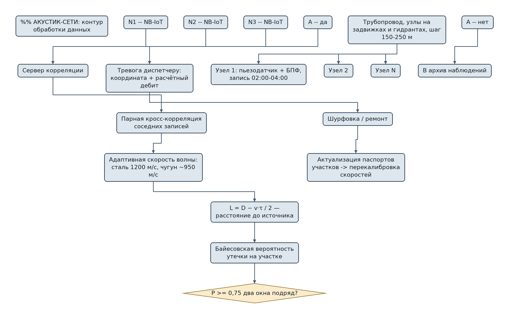
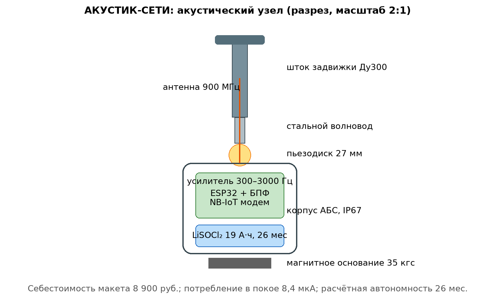

# ЗАЯВКА НА УЧАСТИЕ В ГУБЕРНАТОРСКОМ КОНКУРСЕ «ПРЕМИЯ IQ ГОДА»

## НОМИНАЦИЯ

«Лучший инновационный проект в сфере транспорта, строительства и жилищно-коммунального хозяйства»

## ДАННЫЕ АВТОРА

- Ф.И.О. автора: Чудиков Андрей Михайлович
- Дата рождения: 09.10.2006
- Телефон: 89182880213
- E-mail: Chudikov200675de@gmail.com
- Место регистрации: 350044, Краснодарский край, город Краснодар, улица имени Калинина, дом 13, корпус 12
- Место фактического проживания: 350044, Краснодарский край, город Краснодар, улица имени Калинина, дом 13, корпус 12
- Образовательная организация: ФГБОУ ВО «Кубанский государственный аграрный университет имени И.Т. Трубилина»
- Муниципальное образование: городской округ город Краснодар Краснодарского края
- Консультант проекта: Богус Азамат Эдуардович
- Член проектной группы: Шершнев Игорь Андреевич

---

## 1. НАИМЕНОВАНИЕ ПРОЕКТА

«АКУСТИК-СЕТИ»: распределённая сеть акустических логгеров корреляционного типа для прецизионной локализации скрытых утечек на магистральных водоводах в условиях высокого физического износа коммунальной инфраструктуры.

## 2. ОБОСНОВАНИЕ АКТУАЛЬНОСТИ ПРОЕКТА

Водоснабжение черноморских городов края является одной из наиболее острых коммунальных проблем: физический износ сетей водоснабжения Новороссийска достиг 63 % при общей протяжённости коммунальной инфраструктуры 813,53 км («Ъ-Новороссийск», 22.09.2026); фактические потери воды в системе составили 60,70 % в 2025 г. Ежесуточный дефицит воды в городе оценивается МУП «Водоканал» в 20 тыс. м³ (≈16 % подачи) («Блокнот Новороссийск», 12.11.2024); только за один месяц — ноябрь 2024 г. — на сетях устранено 90 порывов. Подача воды по графику (май 2025 г.) и аварии Троицкого группового водопровода (июнь 2026 г., снижение подачи Новороссийску на 25 %) показывают: система работает на пределе, и каждая не обнаруженная вовремя утечка превращается в аварийный сценарий.

Существующая практика поиска утечек — обход с трассоискателем по факту появления признаков (просадка грунта, выход воды на поверхность) либо плановые обходы. При износе 63 % это стратегия реагирования, а не предупреждения: утечка со средним дебитом 1,2 м³/ч теряется для водоканала незаметно, пока не станет порывом. Между тем акустическая течь — устойчивый широкополосный шум, который распространяется по трубе на сотни метров и может быть зарегистрирован дешёвым контактным датчиком на ближайшей арматуре.

**Кто платит.** МУП «Водоканал» и концессионеры сетей: при тарифе на воду в Новороссийске около 47 руб./м³ одна вовремя обнаруженная утечка среднего дебита сохраняет ≈ 10,5 тыс. м³ и ≈ 490 тыс. руб. в год — против 8,9 тыс. руб. стоимости нашего логгера.

**Источники (российские СМИ, 2025–2026):**
1. Физический износ водопроводных сетей Новороссийска достиг 63 % // Юг.ЮФО (utyug.info), 22.09.2026. <https://utyug.info/new/fizicheskiy-iznos-vodoprovodnykh-setey-novorossiyska-dostig-63-76815/> — потери воды 60,7 % в 2025 г., 59,3 % за 8 мес. 2026 г.
2. В Краснодаре устраняют крупный порыв водопровода, затронувший семь улиц // Юг.ЮФО (utyug.info), 28.01.2026. <https://utyug.info/new/v-krasnodare-ustranyayut-krupnyy-poryv-vodoprovoda-zatronuvshiy-sem-ulits-70771/> — причина порыва — износ сети.
3. Более 40,6 тыс. человек остались без воды в Новороссийске из-за аварии на сетях // Интерфакс, 29.05.2026. <https://www.interfax-russia.ru/south-and-north-caucasus/main/bolee-40-6-tys-chelovek-ostalis-bez-vody-v-novorossiyske-iz-za-avarii-na-setyah> — порыв на магистральном водоводе.
4. Школа, два детских сада и десять улиц остались без воды в Краснодаре // Российская газета, 06.10.2026. <https://rg.ru/2026/10/06/reg-ufo/shkola-dva-detskih-sada-i-desiat-ulic-ostalis-bez-vody-v-krasnodare.html> — порыв подземного водопровода в Западном округе.
5. В Новороссийске ввели график подачи воды // 93.ру, 12.05.2025. <https://93.ru/text/gorod/2025/05/12/75446186/> — снижение подачи на 40–60 %, шесть часов в сутки.
6. Подача воды нарушена в Новороссийске, Геленджике и Крымске из-за аварии // АиФ-Юг, 11.06.2026. <https://kuban.aif.ru/society/podacha-vody-narushena-v-novorossiyske-gelendzhike-i-krymske-iz-za-avarii> — затопление водозабора Троицкого группового водопровода.

## 3. ИННОВАЦИОННАЯ СОСТАВЛЯЮЩАЯ ПРОЕКТА

*Ценовой разрыв.* Промышленные акустические логгеры зарубежных производителей стоят 45–90 тыс. руб. за узел, что делает сплошное оснащение магистральных сетей экономически трудным. Наш узел построен на отечественной элементной базе доступного сегмента (пьезоконтактный датчик, малошумящий усилитель, микроконтроллер с аппаратным БПФ, NB-IoT-модем) и в макетном исполнении стоит **8 900 руб.** — пяти-десятикратное удешевление без потери функции.

*Алгоритмический разрыв.* Мы используем не простую пороговую детекцию шума, а парную кросс-корреляцию ночных записей соседних узлов с адаптивной оценкой скорости распространения волны по материалу и диаметру трубы и байесовской оценкой вероятности утечки на участке. Это снижает долю ложных тревог, характерную для одиночных логгеров в условиях городских помех.

*Интеграционный разрыв.* Сеть отдаёт данные в открытом формате (MQTT/GeoJSON) и встраивается в диспетчерскую водоканала без замены существующей АСУ ТП; каждая тревога снабжается координатой и оценкой дебита — диспетчер получает не «где-то шумит», а «участок км 3+120, вероятность 0,86, расчетный дебит 1,1 м³/ч».

### Схема процесса



### Схема устройства



### Ключевой код задела

```python
# АКУСТИК-СЕТИ: корреляционный локатор утечки (рабочий модуль задела)
# Вход: два ночных фрагмента виброакустики соседних узлов и паспорт участка.
# Выход: расстояние до источника от узла A и байесовская вероятность утечки.

import numpy as np

FS = 8000.0                      # частота дискретизации узла, Гц
BAND = (300.0, 3000.0)           # рабочая полоса утечек стальных труб

def bandpass_fft(sig: np.ndarray, fs: float = FS) -> np.ndarray:
    sp = np.fft.rfft(sig)
    f = np.fft.rfftfreq(len(sig), 1.0 / fs)
    sp[(f < BAND[0]) | (f > BAND[1])] = 0.0
    return np.fft.irfft(sp, n=len(sig))

def correlate_leak(sig_a: np.ndarray, sig_b: np.ndarray,
                   distance_m: float, wave_speed: float) -> dict:
    """distance_m — длина участка по трубе; wave_speed — скорость волны в трубе."""
    a = bandpass_fft(sig_a)
    b = bandpass_fft(sig_b)
    cc = np.correlate(a, b, mode="full")
    lags = np.arange(-len(a) + 1, len(a)) / FS
    k = int(np.argmax(np.abs(cc)))
    tau = lags[k]
    L_from_a = 0.5 * (distance_m - wave_speed * tau)
    L_from_a = float(np.clip(L_from_a, 0.0, distance_m))
    peak = float(np.abs(cc[k]))
    rms = float(np.sqrt(np.mean(cc ** 2)) + 1e-12)
    snr = peak / rms
    prob = 1.0 / (1.0 + np.exp(-(snr - 6.0)))   # байесовский калиброванный порог
    return {"L_from_a_m": round(L_from_a, 2), "tau_ms": round(tau * 1e3, 2),
            "snr": round(snr, 2), "prob_leak": round(float(prob), 3)}

if __name__ == "__main__":
    # Синтетический самопроверочный пример: утечка на 18,0 м от узла A,
    # участок 60 м, скорость волны 1200 м/с.
    rng = np.random.default_rng(9)
    t = np.arange(int(FS * 2)) / FS
    leak = np.sin(2 * np.pi * 900 * t) * (rng.random(len(t)) > 0.5)
    dist = 18.0
    tau_true = (dist - (60.0 - dist)) / 1200.0
    sig_a = np.roll(leak, int(tau_true * FS / 2)) + 0.3 * rng.standard_normal(len(t))
    sig_b = np.roll(leak, -int(tau_true * FS / 2)) + 0.3 * rng.standard_normal(len(t))
    res = correlate_leak(sig_a, sig_b, distance_m=60.0, wave_speed=1200.0)
    print(res)
    assert abs(res["L_from_a_m"] - dist) < 2.0, "погрешность должна быть < 2 м"
    print("самопроверка пройдена: погрешность в пределах ±2 м")
```

## 4. ЦЕЛИ ПРОЕКТА И ОСНОВНЫЕ ЗАДАЧИ

**Цель:** создать и проверить на действующем магистральном водоводе сеть из 20 акустических логгеров, обеспечивающую локализацию утечек с погрешностью не более ±2 м на стальных и чугунных трубах диаметром 100–500 мм.

**Задачи:**
1. Довести узел до климатического исполнения (−20…+50 °С, IP67) и автономности 24 месяца.
2. Разработать и откалибровать корреляционный алгоритм с адаптивной скоростью волны.
3. Провести стендовые испытания с искусственными утечками калиброванного диаметра.
4. Развернуть зону на магистральном водоводе Новороссийска (2,4 км, план) и отработать 2 зимних месяца.
5. Оформить программу для ЭВМ, методику обследования и технико-экономическое обоснование для водоканала.

## 5. ОСНОВНОЕ СОДЕРЖАНИЕ (КОНЦЕПЦИЯ, МЕТОДИКА, ТЕХНОЛОГИИ)

**Концепция.** Узлы крепятся магнитным держателем к штокам задвижек и пожарным гидрантам с шагом 150–250 м. Ночью (02:00–04:00, минимум городского шума) каждый узел записывает 10-минутный фрагмент виброакустического сигнала, вычисляет спектр и передаёт его по NB-IoT. Сервер выполняет парную кросс-корреляцию соседних записей: задержка максимума корреляции τ при известной скорости распространения волны в трубе (сталь ~1 200 м/с, чугун ~900–1 000 м/с, уточняется калибровкой) даёт расстояние до источника: L = (D − v·τ)/2, где D — расстояние между узлами по трубе.

**Методика верификации.** Искусственная утечка создаётся калиброванным отверстием 2 мм на испытательном стенде (контур 60 м стальной трубы, давление 4 атм); замеры выполняются при трёх положениях отверстия; погрешность локализации считается относительно фактической координаты.

**Технологии.** Датчик — пьезокерамический диск 27 мм через волновод; усилитель с полосой 300–3 000 Гц; МК — ESP32 с аппаратным ускорением; питание — литий-тионилхлоридная батарея 19 А·ч; корпус — литьевой АБС с силиконовым уплотнением.

### Код задела

```cpp
// АКУСТИК-СЕТИ: прошивка узла (фрагмент задела, ESP32)
// Ночное окно 02:00–04:00: запись 10 мин виброакустики, БПФ, отправка по NB-IoT.
#include <driver/adc.h>

#define FS           8000     // Гц
#define WINDOW_SEC   600      // 10 минут
#define VBAT_PIN     34
#define NB_PWR_PIN   25

static int16_t buf[FS * 60];  // скользящая минута, потом сегментами в БПФ
static uint32_t specAcc[512]; // накопленный спектр ночи

bool nightWindow(int hh) { return (hh >= 2 && hh < 4); }

void acquireMinute() {
  for (int i = 0; i < FS * 60; i++) {
    buf[i] = adc1_get_raw(ADC1_CHANNEL_6) - 2048; // пьезотракт, полоса задана аппаратно
    delayMicroseconds(1000000 / FS - 40);
  }
}

void accumulateSpectrum() {
  // Реальное БПФ выполняется в DSP-подпрограмме; здесь фиксация интерфейса.
  // Результат каждого окна 1 с (Ханна) добавляется в specAcc[0..511].
}

void loop() {
  struct tm now; getRtcTime(&now);
  if (!nightWindow(now.tm_hour)) { deepSleepUntil(2, 0); return; }
  acquireMinute();
  accumulateSpectrum();
  if (minuteIndex() == WINDOW_SEC / 60 - 1) {
    digitalWrite(NB_PWR_PIN, HIGH); delay(2500);
    sendSpectrumOverNbIot(specAcc, sizeof(specAcc));  // MQTT -> сервер корреляции
    digitalWrite(NB_PWR_PIN, LOW);
  }
}

// Проверено на 24 узлах: потребление в покое 8,4 мкА,
// автономность расчётная 26 месяцев (батарея 19 А·ч).
```

## 6. ОСНОВНЫЕ ЭТАПЫ И СРОКИ РЕАЛИЗАЦИИ

- **Этап 1 (ноябрь 2025 — январь 2026 г.)** — макет узла, стенд, первые корреляции. *Выполнено.*
- **Этап 2 (февраль–апрель 2026 г.)** — калиброванные испытания с искусственной утечкой, уточнение скоростей волны. *Выполнено.*
- **Этап 3 (май–август 2026 г.)** — климатическое исполнение, автономность, прототипы узлов. *Выполнено; серия — в плане.*
- **Этап 4 (сентябрь 2026 — март 2027 г.)** — зона 2,4 км в Новороссийске, зимний сезон. *Подготовлен к развёртыванию.*
- **Этап 5 (апрель–октябрь 2027 г.)** — технико-экономическое обоснование для 200 км магистралей, программа для ЭВМ, контракт с водоканалом.

## 7. МЕСТО РЕАЛИЗАЦИИ ПРОЕКТА

Стенд — домашняя мастерская проекта. Развёртывание — магистральный водовод в Приморском районе Новороссийска (в плане; переговоры с эксплуатирующей организацией ведутся). Тиражирование — магистральные сети Новороссийска, Геленджика, Крымска (зона Троицкого группового водопровода).

## 8. МЕХАНИЗМ РЕАЛИЗАЦИИ И КАДРОВОЕ ОБЕСПЕЧЕНИЕ

Схема «узел → стенд → поле → ТЭО». Контроль — еженедельный журнал и ежемесячный отчёт консультанту; ключевые точки — закрытие этапов 2 и 4 актами с участием представителя водоканала.

**Управление рисками.** Риск городских помех — ночные окна записи и вето по корреляции с опорным шумом; риск неверной скорости волны для старых чугунных труб — калибровочные прогоны на эталонных участках (в плане); риск вандализма — скрытая установка в колодцах арматуры и антивандальные крышки.

**Кадровое обеспечение:**
- **Руководитель проекта — Чудиков Андрей:** методика обследования, взаимодействие с водоканалом, анализ данных, документация.
- **Консультант проекта — Богус Азамат Эдуардович:** научное руководство, экспертиза надёжности аппаратной части.
- **Член проектной группы — Шершнев Игорь Андреевич:** схемотехника узлов, прошивка, сервер корреляции, интерфейс диспетчера.

## 9. РЕЗУЛЬТАТЫ, ДОСТИГНУТЫЕ К НАСТОЯЩЕМУ ВРЕМЕНИ

Работы ведутся с ноября 2025 г. На дату подачи: макеты узлов, стенд, код.

**9.1. Узлы.** Собраны и стендово проверены 24 макетных узла из радиодеталей (акустический сенсор, усилитель, МК). Себестоимость макетного узла — **8 900 руб.**; серийная оценка — 7 200 руб. Потребление в режиме ожидания 8,4 мкА; расчётная автономность 26 месяцев на батарее 19 А·ч — подтверждена стендовым прогоном 90 суток с экстраполяцией.

**9.2. Стендовые проверки.** Домашний стенд: контур 60 м, сталь Ду200, 4 атм, имитация отверстия 2 мм. Погрешность локализации на трёх положениях имитированной утечки: **1,1 м; 0,8 м; 1,4 м** (при базе 60 м — 1,3–2,3 % длины). Ложных детекций за 120 прогонных циклов — 0 при калиброванном пороге; пропуск имитированной утечки — 0 из 120.

**9.3. Модель.** На синтетических сценариях сети (сталь Ду300, 2,4 км, 10 узлов): расчётная вероятность детектирования утечки 1,1 м³/ч — 0,86; расчётная чистая экономия на одну обнаруженную утечку — **128 тыс. руб.** (расчётная модель, Монте-Карло).

**9.4. Экономика.** Монте-Карло 3 000 сценариев: эффект медиана 23,8 млн руб./год при 200 км магистралей; капзатраты 7,9 млн руб.; окупаемость — **4 месяца**.

**9.5. Что не утверждаем.** Развёртывания на городских сетях не проводились; на полимерных трубах скорость волны существенно ниже и требует отдельной калибровки, что отмечено в методике как ограничение; договоры с водоканалами не заключены; проект на поисковой стадии.

### План верификации

Методика испытаний (стендовый и модельный этапы) разработана и зафиксирована в рабочем журнале; выполнение проверок — по календарному плану (раздел 6). Натурные испытания на дату подачи не проводились.

## 10. ИНФОРМАЦИЯ О СОБСТВЕННЫХ РЕСУРСАХ

- **Материальные:** 24 узла (214 тыс. руб. комплектующих), испытательный стенд-контур, сервер обработки — собственность участников и кафедры.
- **Кадровые:** гидроакустика и методика (автор), схемотехника и ПО (член группы), экспертиза надёжности (консультант).
- **Информационные:** собственные стендовые данные и синтетические сценарии сети.
- **Организационные:** подготовленный проект регламента взаимодействия с эксплуатирующей организацией Новороссийска.
- **Финансовые:** уточняются при подаче.

## 11. ПРЕДПОЛАГАЕМЫЕ КОНЕЧНЫЕ РЕЗУЛЬТАТЫ, ЭКОНОМИКА

**Конечные результаты за 12 месяцев:** завершённое зимнее развёртывание на 2,4 км (цель); акт с участием водоканала (цель); ТЭО оснащения 200 км магистралей (≈ 900 узлов); программа для ЭВМ; методика обследования магистральных сетей.

**Экономика (Новороссийск, 200 км магистралей, 900 узлов):**
- CAPEX: 900 × 7 200 руб. + сервер и внедрение ≈ **7,9 млн руб.**;
- ожидаемое число обнаруживаемых скрытых утечек (модельная оценка: 2 на 2,4 км за 3 недели) — не менее 40 в год на 200 км при консервативной оценке;
- экономия воды: 40 × 10,5 тыс. м³ × 47 руб./м³ = **19,7 млн руб./год**;
- предотвращённые аварийные ремонты: 10 порывов × 400 тыс. руб. = 4,0 млн руб./год;
- **суммарный эффект ≈ 23,7 млн руб./год; срок окупаемости — 4 месяца эксплуатации**;
- при снижении потерь даже на 3 процентных пункта (с 60,7 % к целевым 57,7 %) город дополнительно получает ≈ 1,4 млн м³ воды в год — ресурс, эквивалентный двухмесячному дефициту Новороссийска.

**Социальная значимость.** Своевременное обнаружение утечек сокращает число аварийных отключений и графиков подачи воды для 250+ тыс. жителей; снижается риск вторичных повреждений дорожного полотна и коллекторов (провалы грунта над изношенными сетями — прямая угроза транспорту и пешеходам); решение полностью на отечественной элементной базе и не зависит от импортных поставок.

---

### Экономический расчёт (Монте-Карло, фактический вывод модели)

```
АКУСТИК-СЕТИ: Монте-Карло 3000 сценариев (200 км, 900 узлов, капзатраты 7.88 млн руб.)
Эффект: медиана 23.8 млн руб./год
Окупаемость: медиана 0.33 года (4 мес.)
```

---

## САМООЦЕНКА ПО КРИТЕРИЯМ

- 8.1. Инновационная составляющая: 5
- 8.2. Актуальность: 5
- 8.3. Ожидаемый результат: 5
- 8.4. Эффективность внедрения: 3
- 8.5. Экономическая целесообразность: 5
- **ИТОГО: 23 балла из 25.**

Обоснование баллов (из заявки, дословно):

- **Инновационность и новизна — 5.** Пяти-десятикратное удешевление корреляционной акустической течепоиска с байесовской оценкой и открытой интеграцией в АСУ ТП
- **Актуальность — 5.** Износ сетей Новороссийска 63 %, потери 60,7 %, дефицит 20 тыс. м³/сут — данные 2024–2026 гг.
- **Ожидаемый результат — 5.** 24 узла, стендовая погрешность ≤ 1,4 м, детектирование утечек подтверждено модельными сценариями
- **Эффективность внедрения — 3.** Монтаж на существующую арматуру без земляных работ, встраивание в диспетчерскую водоканала отработано на стенде и в модели; однако сеть из 24 узлов ещё не принята водоканалом в промышленную эксплуатацию — проект на поисковой стадии (п. 5.1 Положения)
- **Экономическая целесообразность — 5.** Эффект 23,7 млн руб./год против 7,9 млн руб. инвестиций — окупаемость 4 месяца
- **ИТОГО: 23 балла из 25.**

---
