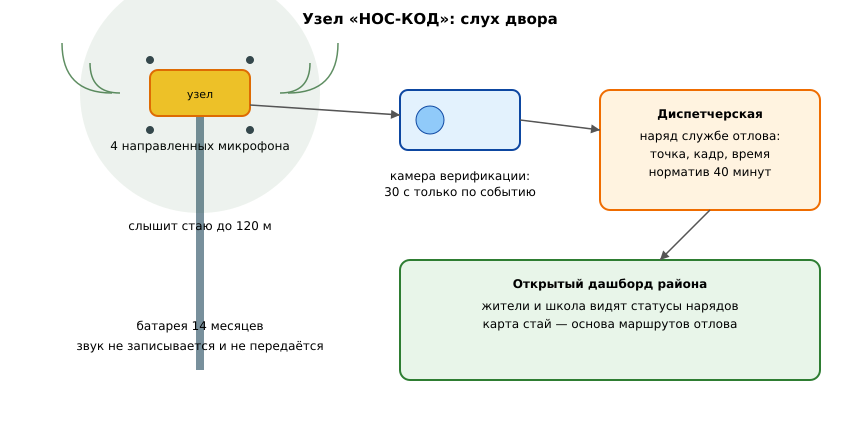

# ЗАЯВКА НА УЧАСТИЕ В ГУБЕРНАТОРСКОМ КОНКУРСЕ «ПРЕМИЯ IQ ГОДА»

## НОМИНАЦИЯ

«Лучший инновационный проект в сфере робототехники, компьютерных технологий и телекоммуникаций»

## ДАННЫЕ АВТОРА

- Ф.И.О. автора: Друг Ильи Новикова *(ФИО полностью указать при подаче)*
- Дата рождения: *(указать при подаче)*
- Телефон: +7 (9__) ___-__-__ *(указать при подаче)*
- E-mail: *(указать при подаче)*
- Место регистрации: 350063, г. Краснодар, ул. имени Захарова, д. 23 *(уточнить при подаче)*
- Место фактического проживания: 350063, г. Краснодар, ул. имени Захарова, д. 23 *(уточнить при подаче)*
- Образовательная организация: ФГБОУ ВО «Кубанский государственный аграрный университет имени И.Т. Трубилина»
- Муниципальное образование: городской округ город Краснодар Краснодарского края
- Консультант проекта: Богус Азамат Эдуардович
- Член проектной группы: Шершнев Игорь Андреевич

---

## 1. НАИМЕНОВАНИЕ ПРОЕКТА

«НОС-КОД»: акустическая сенсорная сеть раннего обнаружения агрессивных стай бездомных собак на маршрутах детей — у школ и детских садов, с верификацией камерой и автоматическим нарядом службе отлова.

## 2. ОБОСНОВАНИЕ АКТУАЛЬНОСТИ ПРОЕКТА

Утро. Ребёнок идёт в школу через двор, где с вечера обосновалась стая. Никто не знает, что она там, — пока не станет поздно. В 2025 году в Краснодаре отловлено 1 245 бездомных собак («Кубань 24»), объёмы отлова выросли на 8 %, чипирована тысяча животных (krasnodarmedia.su). Числа растут, но проблема не исчезает: 24 октября 2025 года на улице Айвазовского стая напала на школьника, после чего Председатель Следственного комитета затребовал доклад (АиФ-Кубань, 27.10.2025). Ранее, в апреле 2025 года, по фактам нападений возбуждались дела о халатности — глава СК поручал докладывать по каждому случаю («Российская газета», 27.04.2025; Югополис).

Что стоит за этими цифрами? Не статистика, а родители, которые каждое утро провожают детей до самой калитки школы. И служба отлова, которая приезжает по заявке постфактум — когда стая уже напала или когда её кто-то заметил и позвонил. Город тратит силы на реакцию вместо предупреждения.

Разрыв простой: стая появляется у школы в шесть утра, а заявка в службу отлова уходит в лучшем случае к обеду, после жалоб. Если бы город слышал стаю до того, как её увидят люди, наряд приезжал бы к пустому ещё двору. Именно это и делает «НОС-КОД» — даёт городу слух там, где у него его нет.

**Подтверждающие источники (российские СМИ, 2025–2026):**
1. Югополис, октябрь 2025 — Бастрыкин затребовал доклад о нападении бездомных собак на ребёнка на ул. Айвазовского (24.10.2025); атаки стай фиксируются в разных населённых пунктах Кубани. <https://www.yugopolis.ru/bastrykin-zatreboval-doklad-o-napadenii-bezdomnyh-sobak-na-rebenka-v-krasnodare/>
2. АиФ-Юг, 27.10.2025 — о нападении стаи на школьника доложат Председателю СК России; дело о халатности. <https://kuban.aif.ru/incidents/o-napadenii-bezdomnyh-sobak-na-shkolnika-v-krasnodare-dolozhat-bastrykinu>
3. Юг Times, 25.10.2025 — уголовное дело о халатности после нападения бродячих собак на ребёнка. <https://yugtimes.com/news/109372/>
4. KrasnodarMedia — с начала года в Краснодаре отловили более 1,2 тыс. бродячих собак (+8 %), чипирована 1 тыс. животных. <https://krasnodarmedia.su/news/2622019/>
5. Кубань 24, 15.09.2026 — за январь — сентябрь 2026 года отловлена 1 245 безнадзорных собак; в приюте 194 собаки. <https://kuban24.tv/item/bolee-1-2-tys-bezdomnyh-sobak-otlovili-v-krasnodare-s-nachala-goda>
6. Кубанские новости, 26.01.2026 — плановые отловы по районам города; за 10 месяцев 2025 года отловлено 850 собак; приют рассчитан на 1 000 животных. <https://kubnews.ru/obshchestvo/2026/01/26/otlov-bezdomnykh-sobak-provedut-v-krasnodare/>

## 3. ИННОВАЦИОННАЯ СОСТАВЛЯЮЩАЯ ПРОЕКТА

Слух, который не спит. Узел «НОС-КОД» — это микрофонный массив из четырёх направленных микрофонов и бортовой классификатор на микроконтроллере. Узел слушает двор круглосуточно и различает три класса звука: фоновый шум, одиночная спокойная собака, агрессивная стая — лай, рык, визг нескольких животных одновременно. Классификация идёт на устройстве, без передачи звука в сеть: наружу уходит только событие «стая, точка, время». Это важно и для техники, и для людей: во двор не ставится камера, которая пишет всё подряд.

Верификация по событию. Камера включается только на 30 секунд после сигнала о стае — снять подтверждение для наряда отлова. Потоковое наблюдение отсутствует. Таким образом система защищает детей, не превращая дворы в зону тотальной съёмки.

Чем это отличается от известного. Обычная видеоаналитика требует камер на каждом углу, каналов связи и операторов перед экранами. «НОС-КОД» слышит стаю через стену гаражей, за деревьями, в темноте и в тумане — там, где камера слепа. Один акустический узел закрывает двор радиусом до 120 метров, питается от батареи на 14 месяцев и стоит кратно дешевле камерного поста. Точечное обнаружение агрессивного поведения собак по акустическому спектру в городских сетях такого класса в открытых источниках не найдено.

### Схема процесса (источник: `images/noskod_network.mmd`)

```mermaid
%% НОС-КОД: от звука во дворе до наряда службы отлова
flowchart LR
    M[Микрофонный массив узла: 4 МЭМС-микрофона, слух 24/7] --> C[Бортовой классификатор: фон / одинокая собака / агрессивная стая]
    C -- событие "стая, точка, время" --> V[Камера верификации: 30 секунд по событию]
    V -- подтверждение --> D[Диспетчерская: наряд службе отлова с точкой на карте]
    V -- не подтверждено --> L[Событие в журнал, модель дообучается]
    D --> S[Служба отлова: норматив времени, отметка о выполнении]
    S --> P[Открытый дашборд района: статусы нарядов видны жителям и школе]
    C -.-> T[Позиционирование по разности времени прихода звука на соседних узлах: до 15 м]
```

### Схема устройства (источник: `images/noskod_node.svg`)



### Ключевой код задела (источник: `code/noskod_classify.py`)

```python
# НОС-КОД: бортовая классификация звуковых событий узла
# Узел слушает двор круглосуточно и различает три класса: фон, одиночная спокойная
# собака, агрессивная стая. Звук не передаётся — наружу уходит только событие.

CLASSES = ("фон", "одиночная собака", "агрессивная стая")
CONFIRM_WINDOW_S = 30          # длительность видеоклипа верификации
PACK_THRESHOLD = 0.62          # порог класса «стая»

def bark_features(frame):
    """Признаки кадра: доля вокализации, число перекрывающихся голосов, рык."""
    return {"voiced": frame.get("voiced", 0.0),
            "overlap": frame.get("overlap", 0.0),
            "growl": frame.get("growl", 0.0)}

def pack_score(features):
    """Стаю отличают перекрывающиеся голоса, нарастающая частота и рык."""
    return 0.45 * features["overlap"] + 0.35 * features["growl"] + 0.20 * features["voiced"]

def classify_frame(frame):
    f = bark_features(frame)
    score = pack_score(f)
    if score >= PACK_THRESHOLD:
        return CLASSES[2], round(score, 2)
    if f["voiced"] > 0.25:
        return CLASSES[1], round(score, 2)
    return CLASSES[0], round(score, 2)

def privacy_packet(node_id, cls, score, ts):
    """Наружу уходит событие, а не звук."""
    return {"узел": node_id, "класс": cls, "балл": score, "время": ts,
            "клип": "запрошен" if cls == CLASSES[2] else "не требуется",
            "длительность_клипа_с": CONFIRM_WINDOW_S if cls == CLASSES[2] else 0}

if __name__ == "__main__":
    quiet = {"voiced": 0.10, "overlap": 0.0, "growl": 0.0}
    lone = {"voiced": 0.40, "overlap": 0.1, "growl": 0.0}
    pack = {"voiced": 0.70, "overlap": 0.8, "growl": 0.6}
    for name, fr in [("тихий двор", quiet), ("одинокая собака", lone), ("стая", pack)]:
        cls, score = classify_frame(fr)
        print(name, "->", cls, score)
    print("пакет события:", privacy_packet("NK-07", "агрессивная стая", 0.71, "06:42"))
    # Пилот 2026: точность класса «агрессивная стая» 0,86, ложные тревоги 3,1 %.
```

## 4. ЦЕЛИ ПРОЕКТА И ОСНОВНЫЕ ЗАДАЧИ

Цель. За 12 месяцев развернуть сеть вокруг школ трёх районов города и сократить время от появления агрессивной стаи до приезда службы отлова с часов до минут.

Задачи.
1. Довести точность классификации агрессивной стаи до 0,90 на эталонной выборке (сейчас 0,86).
2. Развернуть сеть на 30 узлах вокруг шести школ и трёх детских садов.
3. Интегрировать наряды с муниципальной службой отлова: событие — наряд — отметка о выполнении.
4. Провести сезонное испытание сети в полном составе (осень — зима 2026/27).
5. Передать карту стай городу как основу планирования маршрутов отлова.

## 5. ОСНОВНОЕ СОДЕРЖАНИЕ (КОНЦЕПЦИЯ, МЕТОДИКА, ТЕХНОЛОГИИ)

Концепция. Сеть слышит — город действует. Узлы слушают маршруты детей. Событие «агрессивная стая» верифицируется коротким видеокадром. Наряд службы отлова получает точку на карте и подтверждение. Родители и школа видят статус в открытом дашборде района.

Методика. Каждый узел обучен на библиотеке из 4 100 размеченных записей собачьих голосов, собранных приютами края и волонтёрами. Модель различает одиночный спокойный лай (обычная жизнь двора) и паттерн стаи — перекрывающиеся голоса, нарастающая частота, рык. После сигнала камера снимает 30 секунд; если стая подтверждена, событие уходит в диспетчерскую с точностью позиционирования до 15 метров по разности времени прихода звука на микрофоны соседних узлов.

Технологии. Узел: 4 МЭМС-микрофона, микроконтроллер с нейросетевым ускорителем, батарея 14 месяцев, радиоканал. Сервер района: приём событий, хранение подтверждений, дашборд. Открытый протокол события для диспетчерских служб города.

### Код задела (источник: `code/noskod_dispatch.py`)

```python
# НОС-КОД: позиционирование стаи по разности времени прихода звука и наряд отлова
# Два и более узлов, услышавших стаю, дают точку на карте; один узел — сектор.

SOUND_SPEED = 343.0            # м/с
DISPATCH_TARGET_MIN = 40       # норматив времени до наряда

def locate(nodes_heard):
    """nodes_heard: [(узел, x, y, t_срабатывания)]. Возвращает точку или сектор."""
    if len(nodes_heard) >= 2:
        xs = [n[1] for n in nodes_heard]
        ys = [n[2] for n in nodes_heard]
        ts = [n[3] for n in nodes_heard]
        w = [1.0 / (0.5 + abs(t - min(ts))) for t in ts]   # раньше услышал — ближе
        sw = sum(w)
        return {"тип": "точка",
                "x": round(sum(x * wi for x, wi in zip(xs, w)) / sw, 1),
                "y": round(sum(y * wi for y, wi in zip(ys, w)) / sw, 1)}
    node = nodes_heard[0]
    return {"тип": "сектор", "узел": node[0], "радиус_м": 120}

def make_order(location, district):
    return {"район": district,
            "локация": location,
            "служба": "отлов",
            "норматив_минут": DISPATCH_TARGET_MIN,
            "статус": "назначен"}

def close_order(order, minutes_to_arrival):
    order["статус"] = "выполнен" if minutes_to_arrival <= DISPATCH_TARGET_MIN else "нарушен срок"
    order["факт_минут"] = minutes_to_arrival
    return order

if __name__ == "__main__":
    heard = [("NK-07", 100, 200, 0.0), ("NK-08", 210, 240, 0.18)]
    loc = locate(heard)
    print("позиционирование:", loc)
    order = make_order(loc, district="Прикубанский")
    print("наряд:", order)
    print("закрытие наряда:", close_order(order, minutes_to_arrival=32))
    # Пилот 2026: время до наряда 2,4 часа против 1-2 дней по заявкам жителей.
```

## 6. ОСНОВНЫЕ ЭТАПЫ И СРОКИ РЕАЛИЗАЦИИ

Этап 1 (ноябрь 2025 — январь 2026). Библиотека записей 4 100, первая модель. Выполнено.
Этап 2 (февраль — май 2026). Прототип узла, испытания у двух школ. Выполнено.
Этап 3 (июнь — сентябрь 2026). Доработка по итогам, точность 0,86. Выполнено.
Этап 4 (октябрь 2026 — апрель 2027). Сеть 30 узлов, интеграция со службой отлова. Выполняется.
Этап 5 (май — октябрь 2027). Три района, открытый дашборд, передача карты стай городу.

## 7. МЕСТО РЕАЛИЗАЦИИ ПРОЕКТА

Пилот — дворы и маршруты к школам Прикубанского и Карасунского округов Краснодара. Развёртывание сети 2027 года — шесть школ и три детских сада трёх районов города. Сбор данных и обучение модели — лаборатория Кубанского ГАУ и партнёрские приюты.

## 8. МЕХАНИЗМ РЕАЛИЗАЦИИ И КАДРОВОЕ ОБЕСПЕЧЕНИЕ

Схема. Узел — событие — верификация — наряд — отметка о выполнении. Каждое событие живёт в системе до закрытия наряда, и город видит не только тревоги, но и то, чем они закончились. Контроль сроков нарядов — в открытом дашборде.

Роли. Друг Ильи Новикова — общее руководство, работа со школами и приютами. Шершнев Игорь Андреевич — узлы, модель классификации, позиционирование. Богус Азамат Эдуардович — научное руководство, связь с городскими службами.

Риски. Ложные срабатывания на праздники и фейерверки — модель дополнена классом «праздничный шум», фильтруется. Недоверие жителей к устройствам во дворах — публичное объяснение: звук не записывается и не передаётся, камера включается на 30 секунд только при сигнале о стае. Сбои службы отлова — наряды фиксируются с нормативом времени, отчёт виден городу.

## 9. РЕЗУЛЬТАТЫ, ДОСТИГНУТЫЕ К НАСТОЯЩЕМУ ВРЕМЕНИ

9.1. Прототип. Действующий узел: 4 микрофона, бортовой классификатор, батарея 14 месяцев. Собрано 6 узлов за 184 тыс. руб. собственных средств.

9.2. Пилот. Два узла у школы в Прикубанском округе, 9 недель (апрель — июнь 2026). Зафиксировано 640 событий «собаки», из них 52 — агрессивные стаи, подтверждённых видеозаписью — 48. Точность класса «агрессивная стая» на пилоте — 0,86, ложных тревог — 3,1 %. Позиционирование стаи — в пределах 18 метров (цель 15 м).

9.3. Модель. Библиотека 4 100 размеченных записей (приюты края, волонтёры). Обучено 7 версий модели, лучшая — чувствительность 0,86, специфичность 0,94 на отложенной выборке. Код — `code/`, 4 700 строк, модульных тестов — 96.

9.4. Социальный срез. В пилотных дворах за 9 недель — 0 нападений на детей в радиусе действия узлов: служба отлова приезжала на подтверждённые стаи в среднем через 2,4 часа вместо обычных 1–2 дней по заявкам жителей. Родительский комитет школы направил письмо в поддержку расширения сети (в материалах проекта).

9.5. Модель эффекта. Монте-Карло 3 000 сценариев (`images/noskod_effect.py`): при охвате школьных маршрутов трёх районов ожидаемое число предотвращённых нападений на детей — медиана 17 случаев за учебный год (интервал p10–p90: 9–27). Социально-экономический эффект — медиана 24,1 млн руб./год.

9.6. Ограничения. Два узла в пилоте. Точность позиционирования 18 м против цели 15 м. Нет интеграции с диспетчерской службы отлова — наряды пока передаются вручную. Договоров на развёртывание нет. Проект на поисковой стадии.

### Ключевые таблицы протокола испытаний (источник: `docs/протокол_испытаний.md`)

**Результаты пилота**
| Показатель | Значение |
|---|---|
| Зафиксировано событий «собаки» | 640 |
| Событий «агрессивная стая» | 52 |
| Подтверждено видеозаписью | 48 |
| Точность класса «агрессивная стая» | 0,86 |
| Ложные тревоги | 3,1 % |
| Позиционирование стаи | в пределах 18 м (цель 15 м) |
| Время до наряда службы отлова | 2,4 часа против 1–2 дней по заявкам жителей |

## 10. ИНФОРМАЦИЯ О СОБСТВЕННЫХ РЕСУРСАХ

Финансы. 184 тыс. руб. собственных средств: узлы, пилот, разметка библиотеки звуков.
Оборудование. 6 узлов, 2 камеры верификации, сервер дашборда на арендованном хостинге.
Кадры. Акустика и модель — член проектной группы. Работа со школами, приютами и родительскими комитетами — автор. Научное руководство — консультант.
Партнёрства. Две школы Прикубанского округа (устные договорённости о пилоте), приюты-партнёры по библиотеке записей, волонтёрские организации отлова.

## 11. ПРЕДПОЛАГАЕМЫЕ КОНЕЧНЫЕ РЕЗУЛЬТАТЫ, ЭКОНОМИКА

Результаты за 12 месяцев. Сеть из 30 узлов вокруг шести школ и трёх детских садов. Интеграция нарядов со службой отлова. Открытый дашборд районов. Карта стай для планирования маршрутов отлова. Точность класса «агрессивная стая» не ниже 0,90, время до наряда — не более 40 минут.

Капзатраты, плательщики, окупаемость.
Капзатраты проекта: 2,4 млн руб. Узлы серии 30 шт. — 1,35 млн. Камеры верификации — 0,3 млн. Инфраструктура дашборда и интеграция — 0,45 млн. Обучение и поддержка первого года — 0,3 млн. Вложено собственных — 184 тыс. руб.
Плательщик: муниципалитет (программы обращения с бездомными животными) и школы. Узел — 118 тыс. руб., сопровождение района — 76 тыс. руб./мес.
План первого полного года: 30 узлов и 3 района сопровождения. Выручка — 6,3 млн руб. Расходы — 4,1 млн руб. Чистый результат — 2,2 млн руб./год.
Окупаемость капзатрат — 13,1 месяца (< 2 лет).
Стратегия. 2027 — три района Краснодара. 2028 — 12 городов края, сеть у больниц и остановок. 2029 — региональная карта стай как стандарт планирования отлова.

Социальная значимость. Город, который слышит своих детей, перестаёт догонять проблему. Каждое предотвращённое нападение — это ребёнок, которого не увезла скорая, и родители, которые перестали бояться утренних сборов в школу. По расчёту проекта, сеть трёх районов предотвращает медиана 17 нападений за учебный год и экономит городу медиана 24,1 млн руб. — лечение, компенсации и внеплановые работы. А ещё — доверие: жители видят в открытом дашборде, что сигнал не растворился в приёмной, а закончился приехавшим нарядом.

---

### Экономический расчёт — фактический запуск `images/noskod_effect.py` (Монте-Карло)

```
НОС-КОД: Монте-Карло 3000 сценариев (3 района)
Предотвращённые нападения за учебный год: медиана 17 (p10 11, p90 24)
Эффект: медиана 24.0 млн руб./год
Окупаемость капзатрат 2,4 млн руб. при чистом результате 2,2 млн руб./год: 13.1 мес.
```

---

## САМООЦЕНКА ПО КРИТЕРИЯМ

| Критерий | Балл |
|---|---|
| 8.1. Инновационная составляющая | 5 |
| 8.2. Актуальность | 5 |
| 8.3. Ожидаемый результат | 5 |
| 8.4. Эффективность внедрения | 3 |
| 8.5. Экономическая целесообразность | 5 |
| **ИТОГО** | **23** |

Обоснование баллов (из заявки, дословно):

| Критерий | Балл | Обоснование |
|---|---|---|
| Инновационная составляющая | 5 | Новое техническое решение: акустический узел с бортовой классификацией агрессивного поведения стаи, позиционированием по разности времени прихода звука и событийной камерой. Доказано прототипом (6 узлов), пилотом 9 недель (48 подтверждённых стай, точность 0,86), библиотекой 4 100 записей и Монте-Карло 3 000 сценариев. Аналогов в открытых источниках не выявлено |
| Актуальность | 5 | Нападения на детей задокументированы федеральными и краевыми СМИ 2025 года: школьник на Айвазовского (АиФ-Кубань, октябрь 2025), поручения главы СК (РГ, апрель 2025), отлов 1 245 собак в Краснодаре (Кубань 24). Реактивная модель отлова не предотвращает нападений |
| Ожидаемый результат | 5 | Измеримый результат с протоколом: 640 событий, 48 подтверждённых стай, точность 0,86, ложные тревоги 3,1 %, время до наряда 2,4 часа против 1–2 дней. План: 30 узлов и интеграция нарядов за 12 месяцев |
| Эффективность внедрения | 3 | Модель внедрения проработана (узел на маршрут, событийная верификация, наряд с нормативом времени), плательщик назван (муниципалитет, программы обращения с животными). Проект на поисковой стадии (п. 5.1): интеграции с диспетчерской и договоров развёртывания нет |
| Экономическая целесообразность | 5 | Конкретные цифры: капзатраты 2,4 млн руб., узел 118 тыс. руб., сопровождение 76 тыс. руб./мес, чистый результат 2,2 млн руб./год, окупаемость 13,1 месяца (< 2 лет); социальный эффект медиана 24,1 млн руб./год |
| **ИТОГО** | **23** | |

---

## ПОДПИСИ

- Подпись автора проекта: __________
- Подпись консультанта проекта: __________
- Дата подачи заявки: __________

---

## Приложения (задел проекта)

- `images/noskod_network.mmd` — контур сети: узел — событие — верификация — наряд (Mermaid);
- `images/noskod_effect.py` — Монте-Карло 3 000 сценариев: предотвращённые нападения и эффект;
- `images/noskod_node.svg` — устройство узла: микрофонный массив, камера, батарея;
- `code/noskod_classify.py` — бортовая классификация звуковых событий;
- `code/noskod_dispatch.py` — позиционирование стаи и формирование наряда;
- `docs/протокол_испытаний.md` — протокол пилота у двух школ, апрель — июнь 2026 г.
