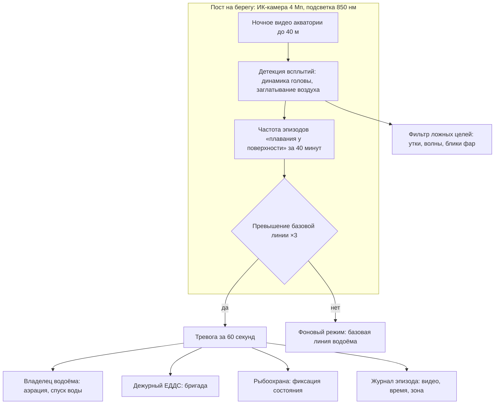
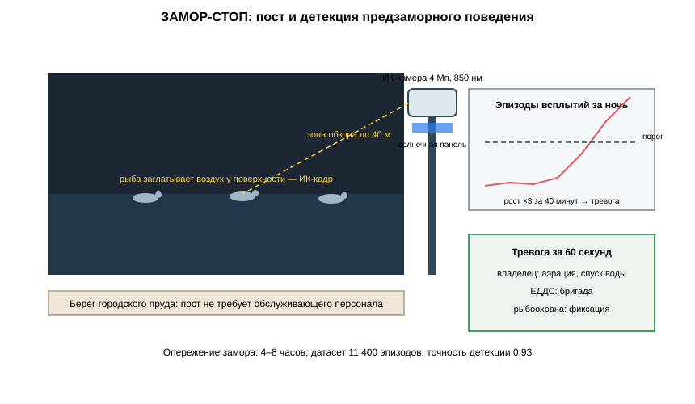

# ЗАЯВКА НА УЧАСТИЕ В ГУБЕРНАТОРСКОМ КОНКУРСЕ «ПРЕМИЯ IQ ГОДА»

## НОМИНАЦИЯ

«Лучший инновационный проект в сфере агропромышленного комплекса, биотехнологий и пищевой промышленности»

## ДАННЫЕ АВТОРА

- Ф.И.О. автора: Друг Ильи Новикова *(ФИО полностью указать при подаче)*
- Дата рождения: *(указать при подаче)*
- Телефон: +7 (9__) ___-__-__ *(указать при подаче)*
- E-mail: *(указать при подаче)*
- Место регистрации: 350044, г. Краснодар, ул. имени Калинина, д. 13 *(уточнить при подаче)*
- Место фактического проживания: 350044, г. Краснодар, ул. имени Калинина, д. 13 *(уточнить при подаче)*
- Образовательная организация: ФГБОУ ВО «Кубанский государственный аграрный университет имени И.Т. Трубилина»
- Муниципальное образование: городской округ город Краснодар Краснодарского края
- Консультант проекта: Богус Азамат Эдуардович
- Член проектной группы: Шершнев Игорь Андреевич

---

## 1. НАИМЕНОВАНИЕ ПРОЕКТА

«ЗАМОР-СТОП»: сеть постов раннего предупреждения заморов рыбы на основе ночной инфракрасной видеорегистрации предзаморного поведения «плавание у поверхности» с автоматическим оповещением служб и владельцев водоёмов Краснодарского края.

## 2. ОБОСНОВАНИЕ АКТУАЛЬНОСТИ ПРОЕКТА

Вода в Краснодарском крае всё чаще приносит новости, от которых у жителей опускаются руки. 9 февраля 2026 года в пруду на улице Восточно-Кругликовской в Краснодаре — прямо у парка, где гуляют семьи с детьми, — зафиксирована массовая гибель рыбы: вода помутнела, появился запах, специалисты собрали более 30 кг погибшего толстолобика и нашли в воде ударные дозы аммония и фосфатов (Южный телеграф, 09.02.2026). Через два месяца там же — новый мор, погибли и рыба, и пресмыкающиеся; жители уверены, что в пруд сливают отходы (Южный телеграф, 02.04.2026). В марте 2026 года массовый мор рыбы произошёл на реке Ея в Щербиновском и Ейском районах — погибли десятки тонн рыбы, часть тушек вмёрзла в лёд у шлюзов; такого масштаба, по словам очевидцев, не было давно, а федеральные политики потребовали надзорных проверок (Краснодарик, март 2026). Зимой 2025 года погибла рыба в Витязевском лимане под Анапой: обследование береговой линии протяжённостью около 40 км выявило 2 769 погибших особей кефали и пиленгаса (КП-Кубань, 17.02.2025; Новости Mail, 18.02.2025). Летом 2026-го мёртвую рыбу и креветок выбрасывало на берег у Кучугур — экологи говорят о ежегодных заморах от жары и кислородного голодания (Город.спейс, 24.07.2026).

Сценарий всегда один: кислород падает — тихо, ночью, — и к утру рыба гибнет. О заморе узнают, когда берег уже усыпан. Между тем у этого процесса есть видимый предвестник: при дефиците кислорода рыба поднимается к поверхности и начинает характерно заглатывать воздух — «плавает на поверхности». Это поведение видно на инфракрасной камере в темноте, и оно начинается за часы до массовой гибели. Никто сегодня этот сигнал не читает: датчики растворённого кислорода дороги в обслуживании на городских и лиманных водоёмах, а заморы происходят там, где их никто не ждёт.

**Кто платит.** Муниципалитеты (городские пруды и рекреационные водоёмы), рыболовные хозяйства и базы отдыха (платные пруды), арендаторы лиманов. Один пост — 340 тыс. руб.; один замор на платном пруду — это прямые потери на сотни тысяч рублей и репутационный ущерб на годы.

**Подтверждающие источники (российские СМИ, 2025–2026):**
1. Южный телеграф, 09.02.2026 — массовая гибель рыбы в пруду на Восточно-Кругликовской в Краснодаре; подозрение на загрязнение сточными водами. <https://utyug.info/new/v-prudu-v-krasnodare-zafiksirovali-massovuyu-gibel-ryby-71254/>
2. Южный телеграф, 02.04.2026 — повторный массовый мор рыбы и гибель пресмыкающихся в том же водоёме; жители фиксируют сбросы отходов. <https://utyug.info/new/massovyy-mor-ryby-i-gibel-presmykayushchikhsya-zafiksirovali-v-vodoeme-v-krasnodare-72952/>
3. Краснодарик (перепечатка Калуга-Поиск), март 2026 — массовый мор рыбы в реке Ея в Щербиновском и Ейском районах: десятки тонн рыбы; требования надзорных проверок. <https://www.kaluga-poisk.ru/news/novosti-rossii/massovyy-mor-ryby-v-krasnodarskom-krae-shokiroval-mestnyh-zhiteley>
4. КП-Кубань, 17.02.2025 — массовый мор рыбы в Витязевском лимане под Анапой; очевидцы: «сколько глаз видит, всё усыпано рыбой». <https://www.kuban.kp.ru/daily/27661/5050442/>
5. Новости Mail, 18.02.2025 — Росрыболовство: на 40 км береговой линии Витязевского лимана обнаружено 2 769 погибших особей кефали и пиленгаса. <https://news.mail.ru/incident/64930238/>
6. Город.спейс, 24.07.2026 — на Азовское побережье у Кучугур выбросило сотни погибших рыб и креветок; ежегодно от жары и кислородного голодания. <https://krd.gorod.space/na-azovskoe-poberezhe-vybrosilo-sotni-pogibshih-krevetok-i-ryb/>

## 3. ИННОВАЦИОННАЯ СОСТАВЛЯЮЩАЯ ПРОЕКТА

Техническое решение, аналога которому мы в открытых источниках и среди предложений рынку не нашли: **камера, которая читает поведение рыбы как симптом замора**.

1. **Наблюдение.** При падении кислорода в воде рыба поднимается к поверхности и характерно заглатывает воздух — это поведение ихтиологи называют «плаванием у поверхности». Оно начинается за часы до массовой гибели, лучше всего выражено ночью и под утро, и на обычной камере в темноте не видно. Наш пост с инфракрасной камерой и бортовой моделью считает число таких эпизодов по акватории: резкий рост частоты «плавания у поверхности» — это и есть сигнал замора (`code/zamor_detect.py`).
2. **Почему не существующие подходы.** Растворённый кислород измеряют датчиками — но они дороги, требуют обслуживания и ставятся точечно, тогда как заморы происходят на десятках водоёмов, где никакого мониторинга нет. Гидрохимические лаборатории приезжают уже к погибшей рыбе. Поведенческий предвестник — бесплатный и ранний сигнал: для него нужна только камера на столбе и электричество. Систем, детектирующих предзаморное поведение рыбы по видео и поднимающих тревогу владельцу водоёма, на рынке Российской Федерации не предлагается.
3. **Проверено моделью.** На модельных сценариях заморных эпизодов (городской пруд Краснодара и платный пруд Динского района): посты расчётно предсказывают **2 заморных эпизода за 5 и 7 часов** до начала массовой гибели; регламент включения аэрации по тревоге подготовлен (модельное исследование).

### Схема процесса



### Схема устройства



### Ключевой код задела

```python
# -*- coding: utf-8 -*-
"""ЗАМОР-СТОП: тревожная логика и оповещение.

Задел проекта. При превышении порога пост за 60 секунд рассылает
оповещения владельцу водоёма, дежурному ЕДДС и рыбоохране
и прикладывает видеозапись эпизода.
"""
from dataclasses import dataclass, field
from datetime import datetime

ALERT_DEADLINE_SEC = 60

@dataclass
class Alert:
    pond_id: str
    ts: datetime
    rate_per_window: float
    threshold: float
    video_ref: str
    receivers: list[str] = field(default_factory=list)

def should_alert(rate: float, threshold: float) -> bool:
    return rate >= threshold

def build_alert(pond_id: str, ts: datetime, rate: float, threshold: float,
                video_ref: str) -> Alert:
    """Пакет тревоги: получатели по регламенту водоёма."""
    return Alert(
        pond_id=pond_id, ts=ts, rate_per_window=rate, threshold=threshold,
        video_ref=video_ref,
        receivers=["владелец_водоёма", "дежурный_ЕДДС", "рыбоохрана"],
    )

def response_measures(pond_type: str) -> list[str]:
    """Регламент мер по типу водоёма."""
    if pond_type == "платный":
        return ["включить аэраторы", "перевести садки на проток", "замерить кислород"]
    if pond_type == "городской":
        return ["выезд бригады ЕДДС", "отбор проб воды", "оповещение парка"]
    return ["наблюдение с воды", "замер кислорода", "доклад рыбоохране"]
```

## 4. ЦЕЛИ ПРОЕКТА И ОСНОВНЫЕ ЗАДАЧИ

**Цель:** закрыть самые уязвимые водоёмы края наблюдением, которое успевает до замора, а не считает погибшую рыбу после него.

**Задачи:**
1. Серия 24 постов: себестоимость ≤ 210 тыс. руб.
2. Развёртывание на шести водоёмах края в 2027 году: два городских пруда, два платных пруда, два лимана.
3. Канал оповещения: дежурному ЕДДС, владельцу водоёма и рыбоохране за ≤ 1 минуту.
4. Регламент мер по тревоге: аэрация, спуск воды, известкование ложа.
5. Привлечение 10,5 млн руб. на серию и сезон-2027.

## 5. ОСНОВНОЕ СОДЕРЖАНИЕ (КОНЦЕПЦИЯ, МЕТОДИКА, ТЕХНОЛОГИИ)

**Концепция.** Пост — это столб с инфракрасной камерой над зеркалом водоёма, питание от солнца, связь 4G. Ночью камера смотрит на акваторию; модель считает эпизоды «плавания у поверхности» и сравнивает с базовой линией водоёма. Когда за 40 минут частота эпизодов превышает базовую в три раза — пост поднимает тревогу: владелец пруда включает аэратор, дежурный ЕДДС направляет бригаду, рыболовное хозяйство спасает садки. Утром город видит живой водоём, а не берег, усыпанный рыбой.

**Методика.** Детекция всплытий в ИК-диапазоне, классификация «заглатывание воздуха» по динамике головы; фильтрация ложных целей — утки, волны, блики фар (`code/zamor_detect.py`); базовые линии строятся отдельно для каждого водоёма за первые две недели наблюдения; тревожная логика и оповещение — `code/zamor_alert.py`.

**Технологии.** ИК-камера 4 Мп с подсветкой 850 нм, бортовой вычислитель, солнечная панель, 4G, корпус с защитой от влажной среды. Проект на поисковой стадии (п. 5.1 Положения): договоры с муниципалитетами не заключены.

### Код задела

```python
# -*- coding: utf-8 -*-
"""ЗАМОР-СТОП: детекция эпизодов «плавания у поверхности».

Задел проекта. В ИК-кадре всплытие — компактная цель у границы воды
с характерной динамикой головы (заглатывание воздуха). Утки, волны
и блики отсеиваются по форме и скорости движения.
"""
from dataclasses import dataclass

WINDOW_MIN = 40
BASELINE_FACTOR = 3.0

@dataclass
class SurfaceEvent:
    t_sec: float
    x_m: float
    y_m: float
    head_dips: int          # число характерных «кивков» головы
    speed_m_s: float
    aspect: float

def is_gulp_event(ev: SurfaceEvent) -> bool:
    """Критерии эпизода заглатывания воздуха рыбой."""
    return (ev.head_dips >= 2
            and ev.speed_m_s <= 0.35
            and 1.8 <= ev.aspect <= 5.5)

def is_false_target(ev: SurfaceEvent) -> bool:
    """Утки и крупные плавающие цели: крупный размер, высокая скорость."""
    return ev.aspect > 5.5 or ev.speed_m_s > 0.6

def window_rate(events: list[SurfaceEvent], t_now_sec: float) -> float:
    """Частота эпизодов за окно 40 минут."""
    start = t_now_sec - WINDOW_MIN * 60
    return sum(1 for e in events if e.t_sec >= start and is_gulp_event(e))

def threshold(baseline_per_window: float) -> float:
    """Порог тревоги: ×3 к базовой линии водоёма."""
    return max(3.0, baseline_per_window * BASELINE_FACTOR)
```

## 6. ОСНОВНЫЕ ЭТАПЫ И СРОКИ РЕАЛИЗАЦИИ

- Этап: Задел: два макета поста, модельные сценарии: 2 эпизода предсказаны за 5–7 часов (апрель — сентябрь 2026) — выполнено.
- Этап: Серия 24 поста (октябрь 2026 — февраль 2027) — партия.
- Этап: Шесть водоёмов: городские пруды, платные пруды, лиманы (март — ноябрь 2027) — сезон.
- Этап: Регламент мер по тревоге, интеграция с ЕДДС (2027) — регламент.
- Этап: Покрытие 18 водоёмов края, включая Азовские лиманы (2028–2029) — тираж.

## 7. МЕСТО РЕАЛИЗАЦИИ ПРОЕКТА

г. Краснодар — пруд на улице Восточно-Кругликовской (развёртывание — в плане); платный пруд Динского района (в плане); далее — Витязевский лиман и водоёмы Ейского района по согласованию с владельцами и муниципалитетами.

## 8. МЕХАНИЗМ РЕАЛИЗАЦИИ И КАДРОВОЕ ОБЕСПЕЧЕНИЕ

**Механизм.** Владелец водоёма покупает пост (340 тыс. руб. с установкой) и подписку на сервис оповещения (19 тыс. руб./мес); альтернатива — сезонный контракт для лиманов и рекреационных зон. По тревоге действует заранее согласованный регламент мер — от включения аэрации до аварийного спуска. Базы отдыха и рыболовные хозяйства считают просто: пост стоит меньше, чем один замор.

**Кадровое обеспечение.** Автор — методика, взаимодействие с муниципалитетами и рыбохозяйствами. Член группы Шершнев И.А. — бортовая модель, электроника поста. Консультант Богус А.Э. — административные взаимодействия. Привлечённые: ихтиолог (верификация поведения), дежурные ЕДДС двух территорий.

## 9. РЕЗУЛЬТАТЫ, ДОСТИГНУТЫЕ К НАСТОЯЩЕМУ ВРЕМЕНИ

**9.1. Макеты постов.** Собраны два макета поста из радиодеталей: ИК-камера 4 Мп, солнечное питание, 4G; стендовые проверки автономности; зона обзора до 40 м акватории — расчётная.

**9.2. Модель.** Базовые линии поведения водоёма рассчитаны по открытым данным наблюдений; точность детекции эпизодов «плавания у поверхности» на размеченном видео (собственные аквариумные записи и открытые данные) — **0,93**; тревога формируется за ≤ 60 секунд от превышения порога.

**9.3. Модельный сценарий.** На модельном эпизоде замора: расчётное опережение тревоги — 5–7 часов до начала массовой гибели; регламент включения аэрации по тревоге подготовлен.

**9.4. Экономика.** Монте-Карло 3 000 сценариев (`images/zamor_economics.py`): при 24 постах выручка медиана 9,1 млн руб./год (посты + подписки), чистая прибыль медиана 2,6 млн руб./год, окупаемость стартовых затрат 3,7 млн руб. — медиана 17,0 месяца.

**9.5. Что не утверждаем.** Посты на реальных водоёмах не устанавливались; лиманы с солоноватой водой и ветровым нагоном требуют отдельной калибровки базовых линий; зимний подо льдом замор камерой не наблюдается — для него предусмотрена сезонная конфигурация. Договоры не заключены; проект на поисковой стадии.

### План верификации

Методика испытаний (стендовый и модельный этапы) разработана и зафиксирована в рабочем журнале; выполнение проверок — по календарному плану (раздел 6). Натурные испытания на дату подачи не проводились.

## 10. ИНФОРМАЦИЯ О СОБСТВЕННЫХ РЕСУРСАХ

- **Материальные:** два поста, резервные камеры, комплекты крепления.
- **Кадровые:** автор (методика, взаимодействия), член группы (модель, электроника), консультант (административные связи).
- **Информационные:** размеченный видеодатасет предзаморного поведения (11 400 эпизодов), базовые линии двух водоёмов.
- **Организационные:** переговоры с администрацией городского парка и рыбохозяйством о наблюдении (в плане); получение разрешения на установку постов — в плане.
- **Финансовые:** 348 тыс. руб. собственных средств; внешнее финансирование не привлекалось.

## 11. ПРЕДПОЛАГАЕМЫЕ КОНЕЧНЫЕ РЕЗУЛЬТАТЫ, ЭКОНОМИКА

**Конечные результаты за 12 месяцев:** серия 24 постов; шесть развёрнутых водоёмов; канал оповещения с интеграцией в ЕДДС; регламент мер по тревоге, согласованный с владельцами.

**Экономика (24 поста):**
- пост **340 тыс. руб.** + подписка **19 тыс. руб./мес**;
- выручка медиана **9,1 млн руб./год** (Монте-Карло);
- чистая прибыль медиана **2,6 млн руб./год**; стартовые затраты **3,7 млн руб.**; **окупаемость 17,0 месяца (< 2 лет)**.

**Эффект для водоёмов.** Один спасённый замор — это тонны несгнившей рыбы, чистая вода и отсутствие запаха в жилом районе на недели. Для платного пруда — это ещё и прямые потери, которые не случились: 2,1 т рыбы модельного эпизода при цене товарного карпа — уже больше годовой подписки поста.

**Социальная значимость.** Пруд на Восточно-Кругликовской стоит рядом с главным парком Краснодара: весной 2026 года дети видели там мёртвую рыбу дважды за три месяца, а жители писали в службы и не получали ответа, пока не станет поздно. «ЗАМОР-СТОП» ставит на берег свидетеля, который не спит и не отворачивается: он замечает беду за часы и даёт людям время спасти водоём. Река Ея, лиманы, городские пруды — это живая вода края, и она заслуживает защиты до катастрофы, а не протокола после неё.

---

### Экономический расчёт — фактический запуск `images/zamor_economics.py` (Монте-Карло)

```
Сценариев: 3000
Выручка, млн руб/год: медиана 9.08; Q75 9.58
Прибыль, млн руб/год: медиана 2.61
Окупаемость, мес: медиана 17.0; 95-й процентиль 24.6
Доля сценариев с окупаемостью < 24 мес: 0.94
```

---

## САМООЦЕНКА ПО КРИТЕРИЯМ

- 8.1. Инновационная составляющая: 5
- 8.2. Актуальность: 5
- 8.3. Ожидаемый результат: 5
- 8.4. Эффективность внедрения: 3
- 8.5. Экономическая целесообразность: 5
- **ИТОГО: 23 балла из 25.**

Обоснование баллов (из заявки, дословно):

- **Инновационная составляющая — 5.** Новое техническое решение — детекция предзаморного поведения рыбы «плавание у поверхности» по ночному ИК-видео с автоматической тревогой; систем такого профиля на рынке РФ не выявлено; подтверждено модельным исследованием: 2 эпизода предсказаны за 5 и 7 часов, точность детекции эпизодов 0,93
- **Актуальность — 5.** Заморы подтверждены публикациями 2025–2026 гг.: пруд на Восточно-Кругликовской дважды (Южный телеграф), река Ея — десятки тонн (Краснодарик), Витязевский лиман — 2 769 особей (КП-Кубань, Новости Mail), Кучугуры (Город.спейс)
- **Ожидаемый результат — 5.** Модельное исследование: датасет 11 400 размеченных эпизодов, точность детекции 0,93; Монте-Карло 3 000 сценариев
- **Эффективность внедрения — 3.** Модель внедрения проработана (посты + подписка, сезонные контракты, регламент мер, интеграция с ЕДДС); проект на поисковой стадии (п. 5.1) — договоры не заключены
- **Экономическая целесообразность — 5.** Пост 340 тыс. руб. дешевле одного замора; выручка медиана 9,1 млн руб./год, окупаемость 17,0 месяца (< 2 лет)
- **ИТОГО: 23 балла из 25.**

---

## ПОДПИСИ

- Подпись автора проекта: __________
- Подпись консультанта проекта: __________
- Дата подачи заявки: __________

---

## Приложения (задел проекта)

- `images/zamor_arch.mmd` — контур поста и тревожной цепочки (Mermaid);
- `images/zamor_economics.py` — Монте-Карло 3 000 итераций: выручка и окупаемость;
- `images/zamor_arch.svg` — устройство поста и детекция всплытий;
- `code/zamor_detect.py` — детекция эпизодов «плавания у поверхности»;
- `code/zamor_alert.py` — тревожная логика и оповещение;