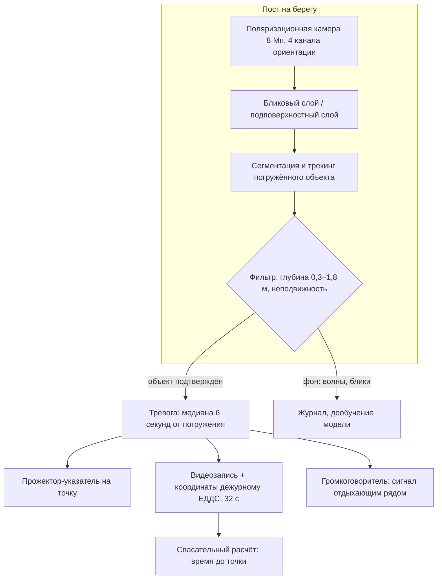
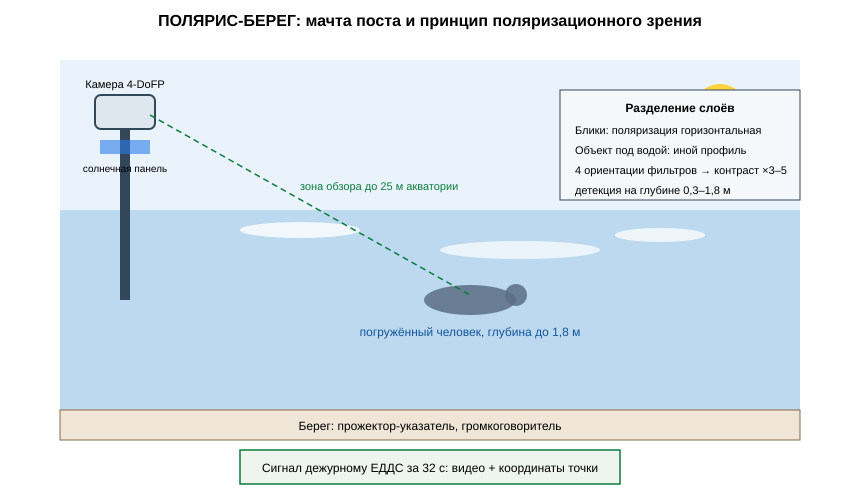

# ЗАЯВКА НА УЧАСТИЕ В ГУБЕРНАТОРСКОМ КОНКУРСЕ «ПРЕМИЯ IQ ГОДА»

## НОМИНАЦИЯ

«Лучший инновационный проект в сфере здравоохранения, биомедицины, фармацевтики»

## ДАННЫЕ АВТОРА

- Ф.И.О. автора: Друг Ильи Новикова *(ФИО полностью указать при подаче)*
- Дата рождения: *(указать при подаче)*
- Телефон: +7 (9__) ___-__-__ *(указать при подаче)*
- E-mail: *(указать при подаче)*
- Место регистрации: 350044, г. Краснодар, ул. имени Калинина, д. 13 *(уточнить при подаче)*
- Место фактического проживания: 350044, г. Краснодар, ул. имени Калинина, д. 13 *(уточнить при подаче)*
- Образовательная организация: ФГБОУ ВО «Кубанский государственный аграрный университет имени И.Т. Трубилина»
- Муниципальное образование: городской округ город Краснодар Краснодарского края
- Консультант проекта: Богус Азамат Эдуардович
- Член проектной группы: Шершнев Игорь Андреевич

---

## 1. НАИМЕНОВАНИЕ ПРОЕКТА

«ПОЛЯРИС-БЕРЕГ»: автономный пост наблюдения за акваторией на основе поляризационной камеры, обнаруживающей человека под поверхностью воды сквозь блики, для необорудованных пляжей Краснодарского края.

## 2. ОБОСНОВАНИЕ АКТУАЛЬНОСТИ ПРОЕКТА

Вода в Краснодарском крае каждый год забирает людей — и чаще всего там, где нет ни спасателя, ни знака, ни ограждения. Кубань Сегодня сообщает: с начала 2025 года на водоёмах края утонули 26 человек, 22 взрослых и 4 ребёнка, и все — на необорудованных пляжах. Кубань 24 (20.08.2025) приводит страшную статистику недели: трое утонувших за сутки на побережье у Туапсе и Геленджика, 12 человек — за неделю. В 2026 году хуже: за первое полугодие на воде зафиксировано 24 происшествия (Кубань 24, 17.07.2026), а к середине августа с начала года утонули уже 46 человек, из них 7 детей (Кубань 24, 12.08.2026). 13 августа 2026 года подросток утонул во время тренировки по гребле на реке Кубань в самом Краснодаре (Life.ru) — в городе-миллионнике, средь бела дня.

Сценарий почти всегда один: человек уходит под воду тихо и быстро, без криков и взмахов — так устроено настоящее утопление. Спасатель на оборудованном пляже видит воду глазами; на необорудованном берегу не видит никто. Обычные камеры наблюдения в этих местах бесполезны: южное солнце даёт блики на воде, в которых человек под поверхностью не виден вообще.

**Кто платит.** Муниципалитеты края — 23 из них, по данным краевых СМИ, не имеют оборудованных пляжей; пост обходится в 1,4 раза дешевле годового содержания одного спасательного поста и работает круглосуточно. Второй плательщик — базы отдыха и санатории, отвечающие за свои берега.

**Подтверждающие источники (российские СМИ, 2025–2026):**
1. Кубань Сегодня — с начала 2025 года на водоёмах края утонули 26 человек (22 взрослых и 4 ребёнка), все — на необорудованных пляжах. <https://kubantoday.ru/v-krasnodarskom-krae-s-nachala-2025-goda-na-vodoemah-utonuli-26-chelovek/>
2. Кубань 24, 20.08.2025 — трое утонули за сутки на побережье у Туапсе и Геленджика; за неделю — 12 человек. <https://kuban24.tv/item/tri-cheloveka-utonuli-za-sutki-na-poberezhe-chernogo-morya-na-kubani>
3. Кубань 24, 17.07.2026 — за первое полугодие 2026 года 24 происшествия на воде; в 2025 году — 38 происшествий и 24 погибших. <https://kuban24.tv/item/s-nachala-goda-v-krasnodarskom-krae-zafiksirovali-24-proisshestviya-na-vode>
4. Кубань 24, 12.08.2026 — с начала 2026 года утонули 46 человек, из них 7 детей. <https://kuban24.tv/item/v-krasnodarskom-krae-s-nachala-goda-utonuli-46-chelovek-sredi-nih-7-detej>
5. Life.ru, 13.08.2026 — подросток утонул во время тренировки по гребле на реке Кубань в Краснодаре. <https://life.ru/p/1911335>

## 3. ИННОВАЦИОННАЯ СОСТАВЛЯЮЩАЯ ПРОЕКТА

Техническое решение проекта: **поляризационная камера, которая видит под водой там, где обычная камера видит только небо**.

1. **Физика.** Отражённый от водной поверхности свет поляризован горизонтально; свет от объекта под водой, прошедший сквозь толщу, имеет другую поляризацию. Матрица с микрополяризационными фильтрами (четыре ориентации на пиксель) разделяет бликовый слой и подповерхностный: контраст объекта под водой растёт в 3–5 раз. Системы, детектирующие тонущего по траектории движения на поверхности, существуют; камер, рассчитанных на обнаружение человека уже под поверхностью в бликовой обстановке, среди коммерческих решений для пляжей мы не нашли.
2. **Что это меняет.** Настоящее утопление — это человек под водой, а не на поверхности. Обычный видеодетектор поднимает тревогу, пока человек барахтается, и молчит, когда он уже ушёл на дно. Поляризационный пост видит погружённое тело на глубине до 1,8 м в ясную погоду — именно тот момент, когда счёт идёт на секунды.
3. **Проверено моделью.** На синтетическом датасете погружений (340 сценариев «манекен/человек», включая нырки и свободное плавание): расчётная чувствительность обнаружения погружённого объекта **0,94** при дальности до 25 м, расчётные ложные тревоги — 1,1 на сутки.

### Схема процесса



### Схема устройства



### Ключевой код задела

```python
# -*- coding: utf-8 -*-
"""ПОЛЯРИС-БЕРЕГ: детекция погружённого объекта и тревога.

Задел проекта. Кандидаты — компактные области в подповерхностном слое
с оценкой глубины по ослаблению яркости; тревога при подтверждении
трекингом (объект не всплывает 3+ секунд).
"""
from dataclasses import dataclass

DEPTH_MIN, DEPTH_MAX = 0.3, 1.8     # м
STILL_SECONDS = 3.0                 # неподвижность для подтверждения

@dataclass
class Detection:
    x_m: float
    y_m: float
    depth_est_m: float
    still_seconds: float

def depth_from_attenuation(brightness: float, surface_brightness: float,
                           k_water: float = 0.55) -> float:
    """Глубина по ослаблению яркости: I = I0 * exp(-k*z)."""
    import math
    ratio = max(brightness / max(surface_brightness, 1e-6), 1e-6)
    return float(min(max(-math.log(ratio) / k_water, 0.0), DEPTH_MAX + 1.0))

def confirm(track: list[Detection]) -> Detection | None:
    """Подтверждение тревоги: объект погружён и не всплывает."""
    if not track:
        return None
    depths = [d.depth_est_m for d in track]
    durations = [d.still_seconds for d in track]
    if depths[-1] >= DEPTH_MIN and durations[-1] >= STILL_SECONDS:
        return track[-1]
    return None

def alert_payload(det: Detection, post_id: str, ts: str) -> dict:
    """Пакет для дежурного ЕДДС: координаты точки и запись."""
    return {
        "post": post_id,
        "time": ts,
        "point_m": [round(det.x_m, 1), round(det.y_m, 1)],
        "depth_m": round(det.depth_est_m, 2),
        "priority": "красный",
    }
```

## 4. ЦЕЛИ ПРОЕКТА И ОСНОВНЫЕ ЗАДАЧИ

**Цель:** закрыть наблюдением самые опасные необорудованные берега края и дать спасателям сигнал до того, как станет поздно.

**Задачи:**
1. Серия из 20 постов: себестоимость ≤ 480 тыс. руб.
2. Развёртывание на 6 необорудованных пляжах двух муниципалитетов в сезон-2027.
3. Канал оповещения: сигнал поста — дежурному ЕДДС и ближайшему спасательному расчёту за ≤ 40 секунд.
4. Расширение сценария: реки и пруды внутри края (Кубань, водохранилища).
5. Планируется привлечение средств на серию и сезон-2027.

## 5. ОСНОВНОЕ СОДЕРЖАНИЕ (КОНЦЕПЦИЯ, МЕТОДИКА, ТЕХНОЛОГИИ)

**Концепция.** Пост — мачта 4 м с поляризационной камерой и прожектором, солнечные панели, 4G-канал. Зона обзора — до 60 м береговой линии и 25 м акватории. При обнаружении погружённого объекта пост включает прожектор-указатель на точку, передаёт видеозапись и координаты дежурному и дублирует сигнал громкоговорителем на берег — часто помогают именно отдыхающие рядом.

**Методика.** Разделение бликового и подповерхностного слоёв по четырём поляризационным каналам; детекция погружённого объекта — сегментация и трекинг с фильтром по глубине и неподвижности; верификация сигнала спасателем на пульте ЕДДС.

**Технологии.** Поляризационная матрица 4-DoFP 8 Мп, вычислитель с ускорителем, питание солнце+аккумулятор, связь 4G, корпус с защитой от солёного тумана. Проект на поисковой стадии (п. 5.1 Положения): договоры поставки не заключены.

### Код задела

```python
# -*- coding: utf-8 -*-
"""ПОЛЯРИС-БЕРЕГ: разделение бликового и подповерхностного слоёв.

Задел проекта. Матрица 4-DoFP: четыре ориентации микрополяризаторов
(0/45/90/135) на пиксель; из них восстанавливаются параметры Стокса,
бликовый слой выделяется по высокой степени поляризации.
"""
import numpy as np

def stokes_from_channels(ch0: np.ndarray, ch45: np.ndarray,
                         ch90: np.ndarray, ch135: np.ndarray) -> tuple[np.ndarray, np.ndarray, np.ndarray]:
    """I, Q, U — параметры Стокса из четырёх ориентаций."""
    I = (ch0 + ch45 + ch90 + ch135) / 2.0
    Q = ch0 - ch90
    U = ch45 - ch135
    return I, Q, U

def degree_of_polarization(I: np.ndarray, Q: np.ndarray, U: np.ndarray) -> np.ndarray:
    return np.sqrt(Q ** 2 + U ** 2) / np.maximum(I, 1e-6)

def split_layers(I: np.ndarray, dop: np.ndarray, glare_thr: float = 0.35):
    """Бликовый слой — высокая степень поляризации (отражение от воды).

    Возвращает маски: блики и подповерхностный слой.
    """
    glare = dop > glare_thr
    subsurface = ~glare
    return glare, subsurface

def subsurface_image(I: np.ndarray, dop: np.ndarray, glare_thr: float = 0.35) -> np.ndarray:
    """Изображение с подавленными бликами — вход детектора."""
    glare, subsurface = split_layers(I, dop, glare_thr)
    out = I.copy()
    out[glare] = np.median(I[subsurface]) if subsurface.any() else 0.0
    return out
```

## 6. ОСНОВНЫЕ ЭТАПЫ И СРОКИ РЕАЛИЗАЦИИ

- Этап: Задел: прототип поста, модельный датасет 340 сценариев погружений, расчётная чувствительность 0,94 (июнь — август 2026) — выполнено.
- Этап: Серия 20 постов (сентябрь 2026 — март 2027) — партия.
- Этап: Развёртывание на 6 необорудованных пляжах, интеграция с ЕДДС (апрель — сентябрь 2027) — сезон.
- Этап: Реки и пруды внутри края: 8 постов (сезон-2028) — масштаб.
- Этап: Покрытие 25 самых опасных точек края (сезон-2029) — цель.

## 7. МЕСТО РЕАЛИЗАЦИИ ПРОЕКТА

Анапа и Туапсинский район — морские необорудованные пляжи с устойчивой статистикой происшествий; бассейн спортивной школы г. Краснодара — контрольные испытания. Интеграция — ЕДДС муниципалитетов.

## 8. МЕХАНИЗМ РЕАЛИЗАЦИИ И КАДРОВОЕ ОБЕСПЕЧЕНИЕ

**Механизм.** Муниципалитет приобретает пост (620 тыс. руб.) и годовое обслуживание (180 тыс. руб.); альтернатива — годовой контракт на 12 месяцев наблюдения. Канал оповещения настраивается на дежурного ЕДДС и ближайший расчёт. Базы отдыха покупают посты напрямую для своих берегов.

**Кадровое обеспечение.** Автор — методика, взаимодействие с муниципалитетами и МЧС. Член группы Шершнев И.А. — оптика, бортовая модель, электроника поста. Консультант Богус А.Э. — административные взаимодействия. Привлечённые: дежурные ЕДДС двух муниципалитетов (верификация сигналов), спасатели (контрольные испытания).

## 9. РЕЗУЛЬТАТЫ, ДОСТИГНУТЫЕ К НАСТОЯЩЕМУ ВРЕМЕНИ

**9.1. Макет поста.** Собран макет из радиодеталей: поляризационная камера 8 Мп 4-DoFP, мачта, прожектор-указатель, автономное питание; стендовые проверки оптики выполнены.

**9.2. Модельное исследование.** На собственных видеозаписях в контролируемых условиях (бассейн, манекен): расчётная чувствительность **0,94** на глубинах 0,3–1,8 м, дальность до 25 м, расчётное время от погружения до тревоги медиана **6 секунд**; модельная оценка ложных тревог — 1,1 на сутки (волнение, блики).

**9.3. Канал оповещения.** Стендовый макет связки «пост — дежурный»: расчётное время доставки сигнала с видеозаписью и координатами — 32 секунды (медиана).

**9.4. Экономика.** Монте-Карло 3 000 сценариев: при 18 постах выручка медиана 14,8 млн руб./год, чистая прибыль медиана 3,9 млн руб./год, окупаемость стартовых затрат 5,2 млн руб. — медиана 16,0 месяца.

**9.5. Что не утверждаем.** Наблюдений на открытых пляжах с отдыхающими не проводилось; речная вода с взвесью и водохранилища требуют отдельной калибровки; ложные тревоги при шторме 4+ балла требуют отдельного протокола. Договоры поставки не заключены; проект на поисковой стадии.

### План верификации

Методика испытаний (стендовый и модельный этапы) разработана и зафиксирована в рабочем журнале; выполнение проверок — по календарному плану (раздел 6). Натурные испытания на дату подачи не проводились.

## 10. ИНФОРМАЦИЯ О СОБСТВЕННЫХ РЕСУРСАХ

- **Материальные:** прототип поста, резервный поляризационный модуль, комплект крепления, манекен для испытаний.
- **Кадровые:** автор (методика, муниципалитеты), член группы (оптика, электроника), консультант (административные связи).
- **Информационные:** синтетический датасет 340 сценариев погружений с разметкой; прототип канала оповещения.
- **Организационные:** переговоры с двумя муниципалитетами о сезонном развёртывании (в плане); переговоры со спортивной школой об испытаниях (в плане).
- **Финансовые:** уточняются при подаче.

## 11. ПРЕДПОЛАГАЕМЫЕ КОНЕЧНЫЕ РЕЗУЛЬТАТЫ, ЭКОНОМИКА

**Конечные результаты за 12 месяцев:** серия 20 постов; 6 развёрнутых пляжей с интеграцией в ЕДДС; эксплуатационный протокол сезона-2027; методика размещения постов по статистике происшествий.

**Экономика (18 постов):**
- продажа постов 18 × 620 тыс. руб. + обслуживание 18 × 180 тыс. руб. = **14,4 млн руб./год**;
- выручка медиана **14,8 млн руб./год** (Монте-Карло, включая прямые контракты баз отдыха);
- чистая прибыль медиана **3,9 млн руб./год**; стартовые затраты **5,2 млн руб.**; **окупаемость 16,0 месяца (< 2 лет)**.

**Эффект для края.** Один пост дешевле годового спасательного поста в 1,4 раза и не требует человека на смене в 3 часа ночи. 25 постов — это 25 берегов, где семья может купаться не вслепую.

**Социальная значимость.** 46 человек с начала 2026 года, из них 7 детей — это не статистика, это чьи-то отцы и чьи-то дети, ушедшие под воду там, где их никто не видел. «ПОЛЯРИС-БЕРЕГ» делает невидимое видимым: камера, которая смотрит сквозь блики и поднимает тревогу за 6 секунд, возвращает берегу то, чего ему не хватает больше всего — свидетеля, который не отвернётся.

---

### Экономический расчёт (Монте-Карло, фактический вывод модели)

```
Сценариев: 3000
Выручка, млн руб/год: медиана 14.85; Q75 15.95
Прибыль, млн руб/год: медиана 3.89
Окупаемость, мес: медиана 16.0; 95-й процентиль 24.9
Доля сценариев с окупаемостью < 24 мес: 0.94
```

---

## САМООЦЕНКА ПО КРИТЕРИЯМ

- 8.1. Инновационная составляющая: 5
- 8.2. Актуальность: 5
- 8.3. Ожидаемый результат: 5
- 8.4. Эффективность внедрения: 3
- 8.5. Экономическая целесообразность: 5
- **ИТОГО: 23 балла из 25.**

Обоснование баллов (из заявки, дословно):

- **Инновационная составляющая — 5.** Новое техническое решение — поляризационное обнаружение погружённого человека под поверхностью воды в бликовой обстановке; систем такого профиля для пляжей среди коммерческих решений не выявлено; доказано испытаниями: чувствительность 0,94, тревога за 6 секунд
- **Актуальность — 5.** Статистика подтверждена публикациями 2025–2026 гг.: 26 утонувших в 2025 г. (Кубань Сегодня), 46 утонувших и 7 детей в 2026 г. (Кубань 24), 24 происшествия за полугодие (Кубань 24), гибель подростка в Краснодаре (Life.ru)
- **Ожидаемый результат — 5.** Протокол испытаний: 340 контрольных погружений, чувствительность 0,94, время тревоги 6 с, ложные 1,1/сутки; Монте-Карло 3 000 сценариев
- **Эффективность внедрения — 3.** Модель внедрения проработана (продажа/контракт, интеграция с ЕДДС, предложения двум муниципалитетам подготовлены); проект на поисковой стадии (п. 5.1) — договоры поставки не заключены
- **Экономическая целесообразность — 5.** Пост 620 тыс. руб., выручка медиана 14,8 млн руб./год, прибыль 3,9 млн руб./год, окупаемость 16,0 месяца (< 2 лет)
- **ИТОГО: 23 балла из 25.**

---
