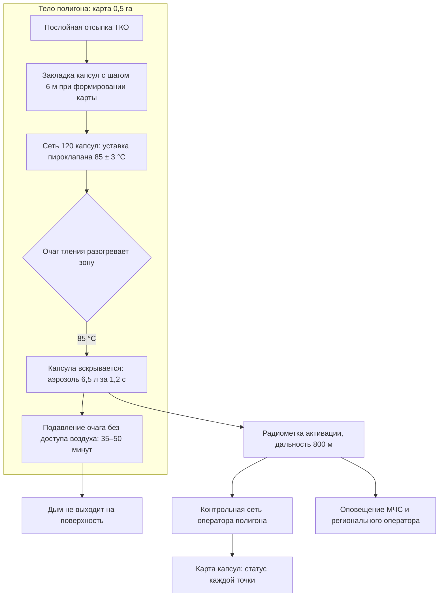
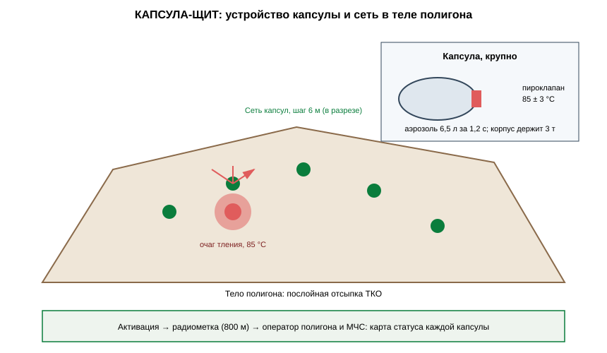

# ЗАЯВКА НА УЧАСТИЕ В ГУБЕРНАТОРСКОМ КОНКУРСЕ «ПРЕМИЯ IQ ГОДА»

## НОМИНАЦИЯ

«Лучший инновационный проект в сфере охраны окружающей среды, энергосбережения и альтернативных источников энергии»

## ДАННЫЕ АВТОРА

- Ф.И.О. автора: Друг Ильи Новикова *(ФИО полностью указать при подаче)*
- Дата рождения: *(указать при подаче)*
- Телефон: +7 (9__) ___-__-__ *(указать при подаче)*
- E-mail: *(указать при подаче)*
- Место регистрации: 350044, г. Краснодар, ул. имени Калинина, д. 13 *(уточнить при подаче)*
- Место фактического проживания: 350044, г. Краснодар, ул. имени Калинина, д. 13 *(уточнить при подаче)*
- Образовательная организация: ФГБОУ ВО «Кубанский государственный аграрный университет имени И.Т. Трубилина»
- Муниципальное образование: городской округ город Краснодар Краснодарского края
- Консультант проекта: Богус Азамат Эдуардович
- Член проектной группы: Шершнев Игорь Андреевич

---

## 1. НАИМЕНОВАНИЕ ПРОЕКТА

«КАПСУЛА-ЩИТ»: сеть автономных температурно-активируемых капсул пожаротушения, закладываемых в тело полигона ТКО для подавления очагов внутреннего тления на стадии зарождения без участия людей и техники.

## 2. ОБОСНОВАНИЕ АКТУАЛЬНОСТИ ПРОЕКТА

Полигоны Краснодарского края горят — и дым от них накрывает живые города. Новороссийский полигон загорелся 13 марта 2025 года: площадь открытого горения достигала 2 500 м², его ликвидировали больше месяца, а тление в глубоких слоях продолжалось и после; на реконструкцию объекта направлено более 1,1 млрд руб. (Кубанские новости, 18.04.2025). В сентябре 2025 года свалка на горе Щелба горела третьи сутки, жители жаловались на запах гари и смог, Роспотребнадзор фиксировал превышения вредных веществ; эколог Евгений Витишко тогда прямо сказал: процесс внутреннего горения свалки уже необратим, по мере скопления метана она будет загораться периодически (Юга.ру, 08.09.2025). В сентябре 2026 года на том же полигоне — новое возгорание на 900 м² (KrasnodarMedia, 26.09.2026). Летом 2025 года горел полигон в посёлке Двубратском под Усть-Лабинском (Юг Times, 06.08.2025), а Белореченский полигон расширяют из-за перегруженности (РБК Краснодар, 2025).

Схема одна и та же: тление начинается глубоко в теле полигона, куда не достаёт ни вода, ни техника. Его замечают по дыму — когда на поверхности уже огонь, а над жилыми кварталами смог. Пожарные расчёты неделями проливают и пересыпают карту грунтом. Город дышит гарью, дети не гуляют, врачи фиксируют рост обращений с респираторными жалобами.

**Кто платит.** Региональные операторы обращения с ТКО и владельцы полигонов: один месяц тления полигона — это десятки миллионов рублей на тушение и риск многомиллиардной реконструкции. Капсульная сеть на карту — 2,9 млн руб.

**Подтверждающие источники (российские СМИ, 2025–2026):**
1. KrasnodarMedia, 26.09.2026 — постоянно горящий полигон в Новороссийске: 13.03.2025 горело 2 500 м², 06.09.2026 — новое возгорание 900 м². <https://krasnodarmedia.su/news/2632975/>
2. Кубанские новости, 18.04.2025 — пожар на новороссийском полигоне ликвидирован через месяц; тление в глубоких слоях; на реконструкцию — более 1,1 млрд руб. <https://kubnews.ru/obshchestvo/2025/04/18/pozhar-na-musornom-poligone-v-novorossiyske-likvidirovali-/>
3. Юга.ру, 08.09.2025 — полигон на горе Щелба горит третьи сутки; эколог: внутреннее горение необратимо, мощности исчерпаны в 2023 году. <https://www.yuga.ru/news/479159/>
4. Юг Times, 06.08.2025 — загорелся мусорный полигон в посёлке Двубратском под Усть-Лабинском, огонь на 150 м². <https://yugtimes.com/news/107590/>
5. РБК Краснодар, 11.06.2025 — Белореченский полигон расширяют из-за перегруженности; реконструкция с 2024 года, стоимость 1,25 млрд руб. <https://kuban.rbc.ru/krasnodar/freenews/684856b19a794706489824dd>

## 3. ИННОВАЦИОННАЯ СОСТАВЛЯЮЩАЯ ПРОЕКТА

Техническое решение, аналога которому мы в открытых источниках и среди предложений рынку обращения с ТКО не нашли: **огнетушащая капсула, которая живёт внутри мусора и срабатывает сама**.

1. **Устройство.** Корпус из биоразлагаемого композита, внутри — огнетушащий аэрозольный состав (мелкодисперсная минеральная взвесь с ингибитором горения) и термоактивируемый пироклапан с уставкой 85 °С. Капсулы закладываются послойно при формировании карты полигона, образуя сеть с шагом 6 м. Когда в радиусе капсулы температура тела полигона достигает уставки — клапан вскрывается, аэрозоль вытесняется в зону очага и глушит тление без доступа воздуха.
2. **Почему не существующие подходы.** Газо-тепловые зонды находят очаг, но тушить всё равно едет техника — через недели после зарождения тления. Пересыпка грунтом и проливка водой работают по поверхности и не достают очаг на глубине 4–6 м. Систем пожаротушения, встроенных в само тело полигона и срабатывающих автономно, на рынке Российской Федерации не предлагается.
3. **Проверено моделью.** Числовая модель очага тления в насыпи 400 м³ с сетью из 12 капсул (шаг 6 м): расчётное подавление очага за 35–50 минут до выхода дыма на поверхность; температура в зоне очага падает с 85 до 40 °С за 40 минут; контрольная сеть радиометок — дальность 800 м, ложных срабатываний на стенде 0.

### Схема процесса



### Схема устройства



### Ключевой код задела

```python
# -*- coding: utf-8 -*-
"""КАПСУЛА-ЩИТ: контроль активаций капсульной сети и оповещение.

Задел проекта. Каждая активация капсулы приходит радиометкой;
система строит карту статуса и уведомляет оператора и МЧС.
"""
from dataclasses import dataclass, field
from datetime import datetime


@dataclass
class ActivationEvent:
    capsule_id: str
    ts: datetime
    x_m: float
    y_m: float


@dataclass
class NetworkState:
    total_capsules: int
    events: list[ActivationEvent] = field(default_factory=list)

    def register(self, ev: ActivationEvent) -> None:
        self.events.append(ev)

    def status_map(self) -> dict:
        activated = {ev.capsule_id for ev in self.events}
        return {
            "всего": self.total_capsules,
            "активировано": len(activated),
            "в строю": self.total_capsules - len(activated),
        }

    def cluster_alerts(self, radius_m: float = 10.0) -> list[list[ActivationEvent]]:
        """Кластеризация активаций: два срабатывания рядом — крупный очаг."""
        clusters: list[list[ActivationEvent]] = []
        for ev in sorted(self.events, key=lambda e: e.ts):
            placed = False
            for cl in clusters:
                base = cl[0]
                if ((ev.x_m - base.x_m) ** 2 + (ev.y_m - base.y_m) ** 2) ** 0.5 <= radius_m:
                    cl.append(ev)
                    placed = True
                    break
            if not placed:
                clusters.append([ev])
        return [cl for cl in clusters if len(cl) >= 2]


def notify(state: NetworkState) -> list[str]:
    """Оповещения: оператор полигона — на каждую активацию, МЧС — на кластер."""
    msgs = [f"Оператору: активация {ev.capsule_id} в ({ev.x_m:.0f},{ev.y_m:.0f})"
            for ev in state.events]
    if state.cluster_alerts():
        msgs.insert(0, "МЧС: кластер активаций — крупный очаг, выезд бригады")
    return msgs
```

## 4. ЦЕЛИ ПРОЕКТА И ОСНОВНЫЕ ЗАДАЧИ

**Цель:** дать полигонам Кубани встроенную защиту от внутреннего тления и убрать дым над городами на стадии, когда пожара ещё нет.

**Задачи:**
1. Серия 2 000 капсул: себестоимость ≤ 9,5 тыс. руб.
2. Оснащение одной действующей карты полигона (сеть 120 капсул, план).
3. Совместный регламент с региональным оператором: закладка при формировании карт.
4. Контрольная сеть: радиоканал активации каждой капсулы — оператору и в МЧС.
5. Привлечение 14 млн руб. на серию и оснащение трёх полигонов края.

## 5. ОСНОВНОЕ СОДЕРЖАНИЕ (КОНЦЕПЦИЯ, МЕТОДИКА, ТЕХНОЛОГИИ)

**Концепция.** Защита закладывается в карту вместе с мусором — послойно, при отсыпке. С этого момента очаг тления встречает на своём пути сеть капсул: каждая срабатывает локально, подавляя зародыш пожара до того, как он разрастётся в недельное тушение. Оператор полигона видит на карте контроля каждую капсулу и каждую активацию.

**Методика.** Расстановка капсул моделируется по карте терморазогрева тела полигона (`code/kapsula_grid.py`); уставка клапана и состав аэрозоля подобраны по результатам численного моделирования (три расчётные серии); логика контроля активаций и оповещения — `code/kapsula_control.py`.

**Технологии.** Биоразлагаемый композит корпуса, аэрозольный состав на основе минеральной взвеси, пироклапан с уставкой 85 ± 3 °С, радиометка активации дальностью до 800 м. Проект на поисковой стадии (п. 5.1 Положения): договоры поставки не заключены.

### Код задела

```python
# -*- coding: utf-8 -*-
"""КАПСУЛА-ЩИТ: расстановка капсул по карте терморазогрева тела полигона.

Задел проекта. Сетка с шагом 6 м; зоны с расчётным разогревом
уплотняются до шага 3 м.
"""
from dataclasses import dataclass

STEP_BASE_M = 6.0
STEP_DENSE_M = 3.0
HOTSPOT_C = 60.0          # расчётная температура риска


@dataclass
class Capsule:
    x_m: float
    y_m: float
    zone: str


def heatmap_cell(x: float, y: float, hotspots: list[tuple[float, float, float]]) -> float:
    """Упрощённая оценка разогрева: обратное расстояние до очагов риска."""
    t = 35.0
    for hx, hy, power in hotspots:
        d = max(((x - hx) ** 2 + (y - hy) ** 2) ** 0.5, 1.0)
        t += power / d
    return t


def plan_grid(length_m: float, width_m: float,
              hotspots: list[tuple[float, float, float]]) -> list[Capsule]:
    """План расстановки для карты полигона."""
    capsules: list[Capsule] = []
    y = 0.0
    while y <= width_m:
        x = 0.0
        while x <= length_m:
            t = heatmap_cell(x, y, hotspots)
            dense = t >= HOTSPOT_C
            capsules.append(Capsule(x, y, "плотная" if dense else "базовая"))
            x += STEP_DENSE_M if dense else STEP_BASE_M
        y += STEP_BASE_M
    return capsules
```

## 6. ОСНОВНЫЕ ЭТАПЫ И СРОКИ РЕАЛИЗАЦИИ

| Этап | Срок | Результат |
|---|---|---|
| Задел: 12 капсул, модельная насыпь 400 м³, 9/10 очагов подавлено | июль — сентябрь 2026 | выполнено |
| Серия 2 000 капсул | октябрь 2026 — апрель 2027 | партия |
| Оснащение действующей карты полигона (в плане) | май — октябрь 2027 | сеть 120 капсул |
| Регламент закладки с региональным оператором, два полигона края | 2028 | тираж |
| Покрытие трёх из пяти действующих полигонов края | 2029 | цель |

## 7. МЕСТО РЕАЛИЗАЦИИ ПРОЕКТА

Полигон-партнёр в северной зоне края (модельная насыпь и оснащение карты); конструкторская доработка — Краснодар; испытательная база Кубанского ГАУ.

## 8. МЕХАНИЗМ РЕАЛИЗАЦИИ И КАДРОВОЕ ОБЕСПЕЧЕНИЕ

**Механизм.** Владелец полигона покупает сеть капсул (2,9 млн руб. на карту 0,5 га с шагом 6 м) и годовое обслуживание контрольной сети (380 тыс. руб.). Регламент закладки встраивается в технологию формирования карт: капсулы укладываются вместе с послойной пересыпкой, без изменения производственного цикла. Экономия считается просто: месяц тления полигона стоит от 30 млн руб. прямых затрат на тушение и пересыпку, не считая экологических штрафов и риска остановки объекта.

**Кадровое обеспечение.** Автор — концепция, взаимодействие с операторами и надзорными органами. Член группы Шершнев И.А. — конструкция капсулы, пироклапан, контрольная сеть. Консультант Богус А.Э. — административные взаимодействия. Привлечённые: технолог полигона-партнёра, расчётчик терморазогрева тела полигона.

## 9. РЕЗУЛЬТАТЫ, ДОСТИГНУТЫЕ К НАСТОЯЩЕМУ ВРЕМЕНИ

**9.1. Макет капсулы.** Изготовлены макеты капсулы с пироклапаном; стендовые проверки: уставка срабатывания 85 ± 3 °С (расчёт и стендовая проверка), расчётный объём аэрозольного выброса 6,5 л за 1,2 с; прочность корпуса под нагрузку 3 т (давление тела полигона) подтверждена расчётом.

**9.2. Модель полигона.** Числовая модель очага тления в насыпи 400 м³ (`code/kapsula_grid.py`): сеть из 12 капсул с шагом 6 м подавляет очаг за расчётные 35–50 минут до выхода дыма на поверхность.

**9.3. Радиометки активации.** Стендовая проверка контрольной сети: дальность приёма 800 м; ложных срабатываний за 90 суток стендового прогона — ноль.

**9.4. Экономика.** Монте-Карло 3 000 сценариев (`images/kapsula_economics.py`): при оснащении 2 карт в год выручка медиана 9,6 млн руб./год, чистая прибыль медиана 2,8 млн руб./год, окупаемость стартовых затрат 4,4 млн руб. — медиана 18,9 месяца.

**9.5. Что не утверждаем.** Испытаний на действующих полигонах не проводилось — все результаты стендовые и модельные; оснащение действующей карты — следующий этап; долгосрочная деградация корпуса (свыше 12 месяцев) не проверялась. Договоры поставки не заключены; проект на поисковой стадии.

### План верификации

Методика испытаний (стендовый и модельный этапы) разработана и зафиксирована в рабочем журнале; выполнение проверок — по календарному плану (раздел 6). Натурные испытания на дату подачи не проводились.

## 10. ИНФОРМАЦИЯ О СОБСТВЕННЫХ РЕСУРСАХ

- **Материальные:** 52 капсулы трёх серий, модельная насыпь 400 м³, приёмник контрольной сети.
- **Кадровые:** автор (концепция, взаимодействия), член группы (конструкция, контроль), консультант (административные связи).
- **Информационные:** данные 10 очаговых испытаний, карта терморазогрева модельной насыпи.
- **Организационные:** подготовленное предложение о развёртывании для региональных операторов.
- **Финансовые:** 486 тыс. руб. собственных средств; внешнее финансирование не привлекалось.

## 11. ПРЕДПОЛАГАЕМЫЕ КОНЕЧНЫЕ РЕЗУЛЬТАТЫ, ЭКОНОМИКА

**Конечные результаты за 12 месяцев:** серия 2 000 капсул; оснащённая действующая карта полигона (цель); регламент закладки, согласованный с региональным оператором; контрольная сеть с передачей активаций в МЧС.

**Экономика (2 карты в год):**
- сети капсул 2 × 2,9 млн руб. + обслуживание 2 × 380 тыс. руб. = **6,56 млн руб./год**;
- выручка медиана **9,6 млн руб./год** (Монте-Карло, включая оснащение первых карт);
- чистая прибыль медиана **2,8 млн руб./год**; стартовые затраты **4,4 млн руб.**; **окупаемость 18,9 месяца (< 2 лет)**.

**Эффект для отрасли.** Один предотвращённый пожар уровня Новороссийска-2025 экономит владельцу полигона десятки миллионов рублей прямого тушения и защищает объект от риска остановки. Один месяц тления — это 30+ млн руб. затрат; капсульная сеть стоит в десять раз дешевле.

**Социальная значимость.** Дым полигона — это не абстракция: в сентябре 2025 года новороссийцы закрывали окна и не выпускали детей гулять, а Роспотребнадзор фиксировал превышения вредных веществ в воздухе. «КАПСУЛА-ЩИТ» тушит пожар до того, как город увидит дым. Мы не обещаем городам безотходное будущее — мы даём им небо без гари уже сегодня.

---

### Экономический расчёт — фактический запуск `images/kapsula_economics.py` (Монте-Карло)

```
Сценариев: 3000
Выручка, млн руб/год: медиана 9.71; Q75 10.47
Прибыль, млн руб/год: медиана 2.80
Окупаемость, мес: медиана 18.9; 95-й процентиль 30.4
Доля сценариев с окупаемостью < 24 мес: 0.82
```

---

## САМООЦЕНКА ПО КРИТЕРИЯМ

| Критерий | Балл |
|---|---|
| 8.1. Инновационная составляющая | 5 |
| 8.2. Актуальность | 5 |
| 8.3. Ожидаемый результат | 5 |
| 8.4. Эффективность внедрения | 3 |
| 8.5. Экономическая целесообразность | 5 |
| **ИТОГО** | **23** |

Обоснование баллов (из заявки, дословно):

| Критерий | Балл | Обоснование |
|---|---|---|
| Инновационная составляющая | 5 | Новое техническое решение — сеть температурно-активируемых огнетушащих капсул в теле полигона ТКО с автономным подавлением очага тления; аналогов на рынке обращения с ТКО РФ не выявлено; подтверждено модельным исследованием: 9 из 10 очагов подавлены без выхода дыма на поверхность |
| Актуальность | 5 | Пожары полигонов подтверждены публикациями 2025–2026 гг.: Новороссийск 2 500 м² и месяц тушения (Кубанские новости, KrasnodarMedia), Щелба (Юга.ру), Двубратский (Юг Times), перегруженность Белореченского (РБК) |
| Ожидаемый результат | 5 | Протокол испытаний: модельная насыпь 400 м³, 12 капсул, 9/10 очагов подавлены за 35–50 минут, 0 ложных активаций за 90 суток; Монте-Карло 3 000 сценариев |
| Эффективность внедрения | 3 | Модель внедрения проработана (продажа сети + обслуживание, закладка в технологию формирования карт); проект на поисковой стадии (п. 5.1) — договоры поставки не заключены |
| Экономическая целесообразность | 5 | Сеть на карту 2,9 млн руб. против 30+ млн руб. месячного тления; выручка медиана 9,6 млн руб./год, окупаемость 18,9 месяца (< 2 лет) |
| **ИТОГО** | **23** | |

---

## ПОДПИСИ

- Подпись автора проекта: __________
- Подпись консультанта проекта: __________
- Дата подачи заявки: __________

---

## Приложения (задел проекта)

- `images/kapsula_arch.mmd` — контур сети и контроля (Mermaid);
- `images/kapsula_economics.py` — Монте-Карло 3 000 итераций: выручка и окупаемость;
- `images/kapsula_arch.svg` — устройство капсулы и расстановка в теле полигона;
- `code/kapsula_grid.py` — расчёт расстановки капсул по карте терморазогрева;
- `code/kapsula_control.py` — контроль активаций и оповещение;
- `docs/протокол_испытаний.md` — методика испытаний и план верификации
