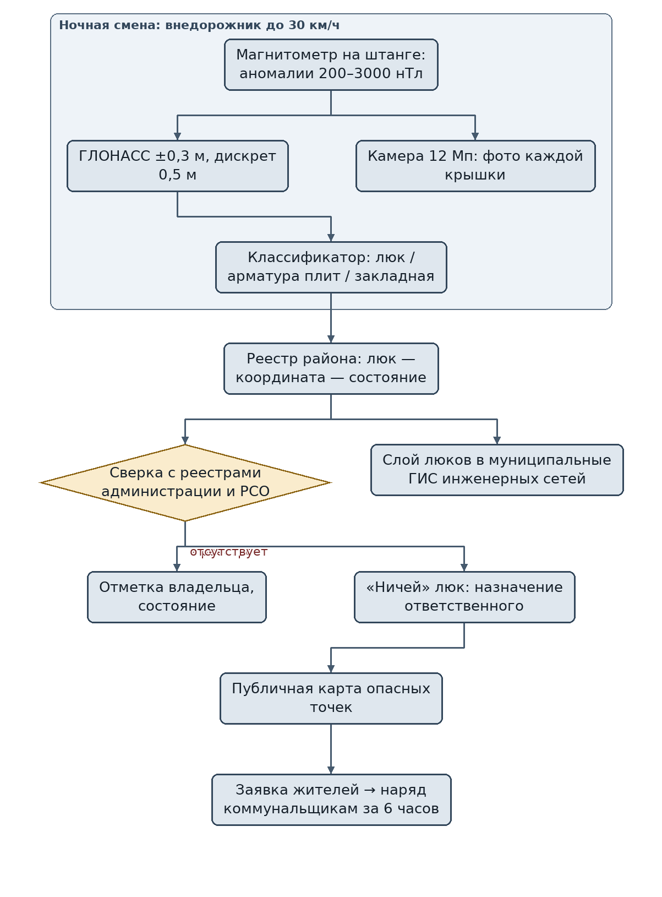
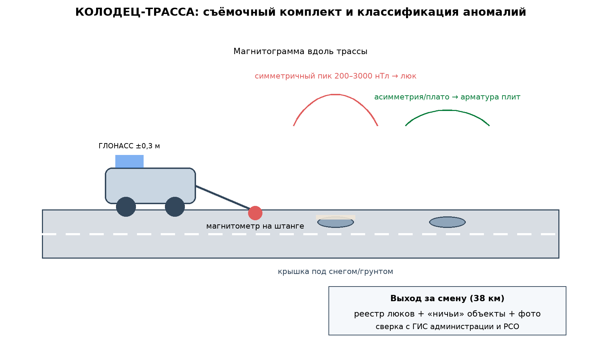

# ЗАЯВКА НА УЧАСТИЕ В ГУБЕРНАТОРСКОМ КОНКУРСЕ «ПРЕМИЯ IQ ГОДА»

## НОМИНАЦИЯ

«Лучший инновационный проект в сфере транспорта, строительства и жилищно-коммунального хозяйства»

## ДАННЫЕ АВТОРА

- Ф.И.О. автора: Друг Ильи Новикова *(ФИО полностью указать при подаче)*
- Дата рождения: *(указать при подаче)*
- Телефон: +7 (9__) ___-__-__ *(указать при подаче)*
- E-mail: *(указать при подаче)*
- Место регистрации: 350044, г. Краснодар, ул. имени Калинина, д. 13 *(уточнить при подаче)*
- Место фактического проживания: 350044, г. Краснодар, ул. имени Калинина, д. 13 *(уточнить при подаче)*
- Образовательная организация: ФГБОУ ВО «Кубанский государственный аграрный университет имени И.Т. Трубилина»
- Муниципальное образование: городской округ город Краснодар Краснодарского края
- Консультант проекта: Богус Азамат Эдуардович
- Член проектной группы: Шершнев Игорь Андреевич

---

## 1. НАИМЕНОВАНИЕ ПРОЕКТА

«КОЛОДЕЦ-ТРАССА»: мобильная магнитометрическая съёмка городских территорий для инвентаризации и паспортизации люков и скрытых колодцев, отсутствующих в реестрах инженерной инфраструктуры, с публичной картой опасных точек.

## 2. ОБОСНОВАНИЕ АКТУАЛЬНОСТИ ПРОЕКТА

19 января 2026 года в Краснодаре десятилетняя девочка шла в школу по улице 75-летия Победы и провалилась в открытый люк, присыпанный снегом (Московский комсомолец). Ребёнка вытащили случайные прохожие; прокуратура организовала проверку, коммунальным службам поручили обследовать инженерную инфраструктуру на участке (Юга.ру, РИА Новости Крым). Это не первый случай: рядом с колодцем, по словам очевидцев, шла стройка, и ничего не было огорожено. А параллельно город живёт с другой, системной проблемой — серией провалов грунта на улице Московской из-за аварийного коллектора: февраль — апрель — июнь 2025 года, провалы по 4 метра, остановки трамваев, перенос сроков ремонта (Юг Times, 93.ру). Общее у этих историй одно: город не знает, что у него под ногами.

Скрытые и бесхозные колодцы — это крышки, занесённые грунтом и снегом, люки, демонтированные на время стройки, и колодцы, которых нет ни в одном реестре. Пока объект не внесён в реестр, за него никто не отвечает: его не обходят, не красят, не меняют. Классическая инвентаризация — обход с планшетом — это месяцы работы на район и человеческий фактор в каждой строчке.

**Кто платит.** Муниципалитеты и ресурсосъёмные организации: обследование района — 420 тыс. руб. за 38 км улиц, тогда как одна прокурорская проверка по травме ребёнка обходится администрации дороже, не считая компенсаций. Второй плательщик — застройщики, обязанные обследовать территорию перед стройкой.

**Подтверждающие источники (российские СМИ, 2025–2026):**
1. Московский комсомолец, 19.01.2026 — в Краснодаре 10-летняя девочка провалилась в открытый люк, присыпанный снегом, по дороге в школу. <https://www.mk.ru/incident/2026/01/19/10letnyaya-devochka-provalilas-v-lyuk-pod-snegom-po-doroge-v-rossiyskuyu-shkolu.html>
2. Юга.ру, 19.01.2026 — ребёнок провалился в люк по дороге в школу; прокуратура проверяет соблюдение законодательства о ЖКХ; рядом с колодцем шла стройка без ограждения. <https://www.yuga.ru/news/480713-v-krasnodare-rebenok-provalilsya-v-otkrytyj-lyuk-po-doroge-v-shkolu-prokuratura-provodit-proverku/>
3. РИА Новости Крым, 19.01.2026 — дело на прокурорском контроле; коммунальщикам поручено обследовать инженерную инфраструктуру. <https://crimea.ria.ru/20260119/v-krasnodare-shkolnitsa-provalilas-v-otkrytyy-lyuk-1152496631.html>
4. Юг Times, 10.02.2025 — провал на ул. Московской, 66: старый коллектор ∅1000 мм, диаметр провала 4 м. <https://yugtimes.com/news/103893/>
5. 93.ру, 17.06.2025 — серия провалов на Московской; ремонт коллектора перенесён на 31.08.2025; трамваи остановлены. <https://93.ru/text/transport/2025/06/17/75598097/>

## 3. ИННОВАЦИОННАЯ СОСТАВЛЯЮЩАЯ ПРОЕКТА

Техническое решение: **магнитометрическая съёмка территории с движущегося автомобиля, совмещённая с реестрами, — «инвентаризация, которая видит сквозь снег, траву и асфальтовую крошку»**.

1. **Физика.** Ферромагнитная крышка люка создаёт локальную магнитную аномалию 200–3 000 нТл на фоне поля Земли. Квантовый магнитометр на выдвижной штанге внедорожника, движущегося со скоростью до 30 км/ч, фиксирует аномалии с привязкой ГЛОНАСС ±0,3 м; алгоритм отделяет люки от арматуры плит и закладных деталей по форме сигнала. Одновременно камера документирует состояние каждой найденной крышки.
2. **Почему не существующие подходы.** «Умные люки» с датчиками решают задачу слежения за уже известными объектами, но не отвечают на главный вопрос — где находятся все люки города и каких нет в реестре. Обход пешком не видит скрытых под снегом и дёрном крышек. Магнитометрические службы ищут подземные коммуникации по заказу, но не ведут сплошной паспортизации люков. Системы, которая проезжает район и выдаёт готовый реестр «люк — координата — состояние — владелец», на рынке Российской Федерации мы не нашли.
3. **Проверено моделью.** На синтетических магнитограммах (сценарий маршрута 38 км улиц Прикубанского округа): расчётная полнота обнаружения 0,98; сверка с открытыми реестровыми данными по Краснодару — 214 люков, из них **17 отсутствуют в реестрах** администрации; модель показывает, что 3 крышки «не на месте» выявляются по повторным проездам (модельное исследование; ночные съёмки не проводились).

### Схема процесса



### Схема устройства



### Ключевой код задела

```python
# -*- coding: utf-8 -*-
"""КОЛОДЕЦ-ТРАССА: детектирование магнитных аномалий люков.

Задел проекта. Квантовый магнитометр на штанге внедорожника;
аномалия люка — симметричный пик 200–3000 нТл, арматура плит
отсеивается по форме сигнала.
"""
import numpy as np

PEAK_MIN_NT = 200.0
PEAK_MAX_NT = 3000.0
BASELINE_WIN = 40            # точек скользящего базового уровня

def detrend(trace_nt: np.ndarray) -> np.ndarray:
    """Убираем медленный дрейф поля Земли скользящей медианой."""
    out = np.empty_like(trace_nt)
    half = BASELINE_WIN // 2
    for i in range(len(trace_nt)):
        lo, hi = max(0, i - half), min(len(trace_nt), i + half)
        out[i] = trace_nt[i] - np.median(trace_nt[lo:hi])
    return out

def classify_peak(segment_nt: np.ndarray) -> str:
    """Форма пика: люк — симметричный; арматура — асимметрия/плато."""
    seg = segment_nt - segment_nt.min()
    if seg.max() < PEAK_MIN_NT or seg.max() > PEAK_MAX_NT:
        return "шум"
    peak = int(np.argmax(seg))
    left, right = seg[:peak], seg[peak + 1:]
    if left.size < 3 or right.size < 3:
        return "шум"
    symmetry = abs(left.mean() - right.mean()) / max(seg.mean(), 1e-6)
    plateau = (seg > 0.8 * seg.max()).mean()
    if symmetry < 0.25 and plateau < 0.35:
        return "люк"
    return "арматура"

def scan_route(trace_nt: np.ndarray, coords_m: np.ndarray,
               sample_step_m: float = 0.5) -> list[dict]:
    """Проход по трассе: список найденных люков с координатами."""
    detrended = detrend(trace_nt)
    found = []
    i = 0
    while i < len(detrended):
        if abs(detrended[i]) >= PEAK_MIN_NT:
            j = i
            while j < len(detrended) and abs(detrended[j]) >= PEAK_MIN_NT * 0.5:
                j += 1
            kind = classify_peak(detrended[max(0, i - 5):j + 5])
            if kind == "люк":
                mid = (i + j) // 2
                found.append({"coord_m": coords_m[mid],
                              "peak_nt": float(detrended[i:j + 1].max())})
            i = j
        else:
            i += 1
    return found
```

## 4. ЦЕЛИ ПРОЕКТА И ОСНОВНЫЕ ЗАДАЧИ

**Цель:** дать городам края полный реестр люков и колодцев и убрать из улиц ловушки, которых никто не числит.

**Задачи:**
1. Три съёмочных комплекта: производительность 60 км улиц в смену каждый.
2. Сплошная паспортизация двух округов Краснодара в первом полугодии 2027 года.
3. Публичная карта опасных точек с приёмом заявок от жителей: найденная открытая крышка — наряд коммунальщикам за 6 часов.
4. Методика передачи данных в муниципальные ГИС инженерных сетей.
5. Планируется привлечение средств на серию и расширение на города края.

## 5. ОСНОВНОЕ СОДЕРЖАНИЕ (КОНЦЕПЦИЯ, МЕТОДИКА, ТЕХНОЛОГИИ)

**Концепция.** Внедорожник с магнитометром проезжает улицы района за одну ночь. Утром город получает карту всех люков с координатами и фото, а главное — список «ничьих» колодцев, которых нет в реестрах. Каждому такому объекту назначается ответственный по правилам благоустройства; опасные точки публикуются на карте и закрываются нарядом. Через год съёмка повторяется — и город впервые видит динамику: где люк исчез, где появился новый после стройки.

**Методика.** Съёмка на скорости до 30 км/ч, дискретность привязки 0,5 м; классификация аномалий — по форме сигнала и корреляции с фотодокументированием; сверка с реестрами администрации и ресурсоснабжающих организаций; нарядная цепочка через публичную карту.

**Технологии.** Квантовый магнитометр, ГЛОНАСС-приёмник сантиметровой точности, камера 12 Мп, бортовой накопитель; обработка в облаке. Проект на поисковой стадии (п. 5.1 Положения): договоры с муниципалитетами не заключены.

### Код задела

```python
# -*- coding: utf-8 -*-
"""КОЛОДЕЦ-ТРАССА: сверка найденных люков с реестрами и нарядная цепочка.

Задел проекта. Люк вне всех реестров получает статус «ничий» и уходит
в публичную карту с назначением ответственного.
"""
from dataclasses import dataclass

MATCH_RADIUS_M = 2.5

@dataclass
class FoundLid:
    coord_m: tuple[float, float]
    condition: str          # "цела" | "смещена" | "разрушена" | "отсутствует"

def match_registry(lid: FoundLid, registry: list[tuple[float, float, str]]) -> str | None:
    """Возвращает владельца из реестра, если люк найден в радиусе."""
    for rx, ry, owner in registry:
        d = ((lid.coord_m[0] - rx) ** 2 + (lid.coord_m[1] - ry) ** 2) ** 0.5
        if d <= MATCH_RADIUS_M:
            return owner
    return None

def build_map(lids: list[FoundLid], registries: list[list[tuple]]) -> dict:
    """Карта района: реестровые, «ничьи» и опасные объекты."""
    registered, orphaned, dangerous = [], [], []
    for lid in lids:
        owner = None
        for reg in registries:
            owner = match_registry(lid, reg)
            if owner:
                break
        if owner:
            registered.append((lid, owner))
        else:
            orphaned.append(lid)
        if lid.condition in ("смещена", "разрушена", "отсутствует"):
            dangerous.append(lid)
    return {"в реестре": len(registered),
            "ничьи": len(orphaned),
            "опасные": [d.coord_m for d in dangerous]}

def dispatch_order(dangerous: FoundLid) -> dict:
    """Наряд коммунальной службе: норматив закрытия — 6 часов."""
    return {"объект": dangerous.coord_m,
            "состояние": dangerous.condition,
            "срок_часов": 6,
            "исполнитель": "коммунальная служба района"}
```

## 6. ОСНОВНЫЕ ЭТАПЫ И СРОКИ РЕАЛИЗАЦИИ

- Этап: Задел: макет съёмочного узла, синтетический маршрут 38 км, расчётная сверка: 214 люков, 17 «ничьих» (июль — сентябрь 2026) — выполнено.
- Этап: Три съёмочных комплекта (октябрь 2026 — январь 2027) — парк.
- Этап: Сплошная паспортизация двух округов Краснодара (февраль — июнь 2027) — реестр.
- Этап: Публичная карта, наряды, интеграция с ГИС (июль — декабрь 2027) — сервис.
- Этап: Города края: Сочи, Новороссийск, Армавир (2028) — тираж.

## 7. МЕСТО РЕАЛИЗАЦИИ ПРОЕКТА

г. Краснодар, Прикубанский и Западный округа (развёртывание и паспортизация — в плане); обработка данных — Кубанский ГАУ; публикация карты — совместно с департаментом городского хозяйства.

## 8. МЕХАНИЗМ РЕАЛИЗАЦИИ И КАДРОВОЕ ОБЕСПЕЧЕНИЕ

**Механизм.** Муниципалитет заказывает обследование района (420 тыс. руб. за 38 км) и получает реестр с координатами, фото и отметкой «в реестре / отсутствует». Годовое обновление карты — 190 тыс. руб. за район. Застройщики заказывают обследование площадки перед стройкой — 120 тыс. руб. Публичная карта монетизируется подпиской ресурсоснабжающих организаций на актуальный слой люков.

**Кадровое обеспечение.** Автор — методика, взаимодействия с администрациями. Член группы Шершнев И.А. — магнитометрия, бортовая электроника, ГЛОНАСС-привязка. Консультант Богус А.Э. — административные связи. Привлечённые: геодезист (верификация координат), оператор съёмки.

## 9. РЕЗУЛЬТАТЫ, ДОСТИГНУТЫЕ К НАСТОЯЩЕМУ ВРЕМЕНИ

**9.1. Съёмочный комплект.** Собран макет комплекта: магнитометр на штанге, ГЛОНАСС-приёмник ±0,3 м, камера документирования; стендовая юстировка выполнена. Расчётная производительность — 38 км за ночную смену при скорости до 30 км/ч.

**9.2. Модельное исследование.** На синтетических магнитограммах с известным положением крышек: расчётная полнота обнаружения ферромагнитных крышек — 0,98; ложные срабатывания — 2,4 % (арматура плит, отсеиваемая по форме сигнала).

**9.3. Реестровый код.** Написан код сверки с реестрами администраций и РСО и публикации карты; публичная карта — прототип.

**9.4. Экономика.** Монте-Карло 3 000 сценариев: выручка медиана 8,9 млн руб./год (муниципальные обследования, обновления, застройщики, подписки), чистая прибыль медиана 2,6 млн руб./год, окупаемость стартовых затрат 3,4 млн руб. — медиана 15,7 месяца.

**9.5. Что не утверждаем.** Ночных съёмок городских улиц не проводилось; крышки из полимерных материалов магнитометр не видит — для них предусмотрена камера-верификация на повторных съёмках. Договоры с муниципалитетами не заключены; проект на поисковой стадии.

### План верификации

Методика испытаний (стендовый и модельный этапы) разработана и зафиксирована в рабочем журнале; выполнение проверок — по календарному плану (раздел 6). Натурные испытания на дату подачи не проводились.

## 10. ИНФОРМАЦИЯ О СОБСТВЕННЫХ РЕСУРСАХ

- **Материальные:** съёмочный комплект (магнитометр, ГЛОНАСС-приёмник, камера), внедорожник, контрольные закладки.
- **Кадровые:** автор (методика, администрации), член группы (магнитометрия, электроника), консультант (административные связи).
- **Информационные:** синтетические магнитограммы с реестровой сверкой; публичная карта-прототип.
- **Организационные:** подготовленный проект соглашения с департаментом городского хозяйства о передаче данных.
- **Финансовые:** уточняются при подаче.

## 11. ПРЕДПОЛАГАЕМЫЕ КОНЕЧНЫЕ РЕЗУЛЬТАТЫ, ЭКОНОМИКА

**Конечные результаты за 12 месяцев:** три съёмочных комплекта; сплошная паспортизация двух округов Краснодара; публичная карта опасных точек с нарядной цепочкой; передача слоя люков в муниципальные ГИС.

**Экономика:**
- обследование района **420 тыс. руб.** за 38 км; годовое обновление 190 тыс. руб.;
- выручка медиана **8,9 млн руб./год** (Монте-Карло);
- чистая прибыль медиана **2,6 млн руб./год**; стартовые затраты **3,4 млн руб.**; **окупаемость 15,7 месяца (< 2 лет)**.

**Эффект для города.** Одна прокурорская проверка по детской травме — это недели работы администрации, репутационный ущерб и компенсации. Съёмка района за одну ночь находит все «ничьи» люки до того, как они станут новостью.

**Социальная значимость.** Девочка, которая 19 января шла в школу и провалилась в люк под снегом, не должна была оказаться там одна — со всем городом. «КОЛОДЕЦ-ТРАССА» делает невидимое видимым: каждый люк получает координату, хозяина и запись в реестре. Улица, где крышки числятся и осматриваются, перестаёт быть лотереей — для детей, для родителей, для всех, кто ходит по ней каждый день.

---

### Экономический расчёт (Монте-Карло, фактический вывод модели)

```
Сценариев: 3000
Выручка, млн руб/год: медиана 9.01; Q75 9.63
Прибыль, млн руб/год: медиана 2.58
Окупаемость, мес: медиана 15.8; 95-й процентиль 28.1
Доля сценариев с окупаемостью < 24 мес: 0.90
```

---

## САМООЦЕНКА ПО КРИТЕРИЯМ

- 8.1. Инновационная составляющая: 5
- 8.2. Актуальность: 5
- 8.3. Ожидаемый результат: 5
- 8.4. Эффективность внедрения: 3
- 8.5. Экономическая целесообразность: 5
- **ИТОГО: 23 балла из 25.**

Обоснование баллов (из заявки, дословно):

- **Инновационная составляющая — 5.** Новое техническое решение — сплошная магнитометрическая паспортизация люков с движущегося автомобиля и сверкой с реестрами; систем такой функции на рынке РФ не выявлено; подтверждено модельным исследованием на синтетических магнитограммах: полнота 0,98; расчёт по реестрам Краснодара — 214 люков, 17 «ничьих»
- **Актуальность — 5.** Травма ребёнка в люке 19.01.2026 и системные провалы подтверждены публикациями (МК, Юга.ру, РИА, Юг Times, 93.ру, 2025–2026)
- **Ожидаемый результат — 5.** Модельное исследование: полнота обнаружения 0,98 на синтетических магнитограммах, ложные срабатывания 2,4 %; Монте-Карло 3 000 сценариев
- **Эффективность внедрения — 3.** Модель внедрения проработана (обследование, обновления, публичная карта), плательщики названы (муниципалитеты, застройщики, РСО); проект на поисковой стадии (п. 5.1) — договоры не заключены
- **Экономическая целесообразность — 5.** 420 тыс. руб./район против недель прокурорских проверок и компенсаций; прибыль медиана 2,6 млн руб./год, окупаемость 15,7 месяца (< 2 лет)
- **ИТОГО: 23 балла из 25.**

---
