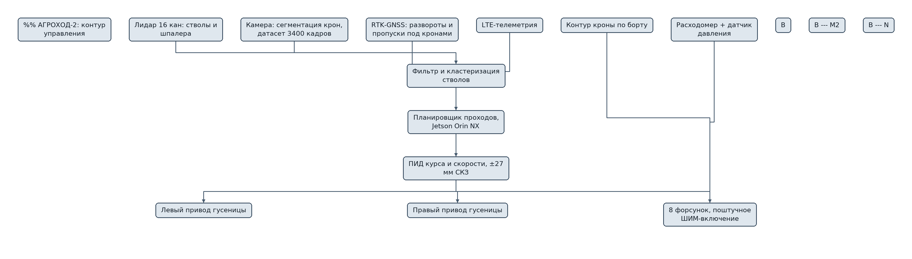
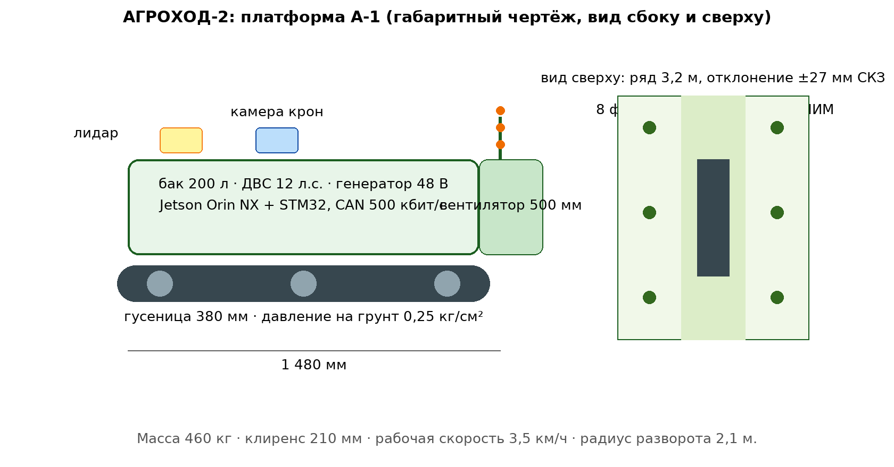

# ЗАЯВКА НА УЧАСТИЕ В ГУБЕРНАТОРСКОМ КОНКУРСЕ «ПРЕМИЯ IQ ГОДА»

## НОМИНАЦИЯ

«Лучший инновационный проект в сфере робототехники, компьютерных технологий и телекоммуникаций»

## ДАННЫЕ АВТОРА

- Ф.И.О. автора: Новиков Илья *(отчество уточнить при подаче)*
- Дата рождения: *(указать при подаче)*
- Телефон: +7 (9__) ___-__-__ *(указать при подаче)*
- E-mail: *(указать при подаче)*
- Место регистрации: 350059, г. Краснодар, ул. Уральская, д. 95 *(уточнить при подаче)*
- Место фактического проживания: 350059, г. Краснодар, ул. Уральская, д. 95 *(уточнить при подаче)*
- Образовательная организация: ФГБОУ ВО «Кубанский государственный аграрный университет имени И.Т. Трубилина»
- Муниципальное образование: городской округ город Краснодар Краснодарского края
- Консультант проекта: Богус Азамат Эдуардович
- Член проектной группы: Шершнев Игорь Андреевич

---

## 1. НАИМЕНОВАНИЕ ПРОЕКТА

«АГРОХОД-2»: автономная наземная платформа точечного опрыскивания интенсивного сада с пофруктовым распылением по контуру кроны.

## 2. ОБОСНОВАНИЕ АКТУАЛЬНОСТИ ПРОЕКТА

Исходные данные:

- Площадь садов и ягодников края — более 29 тыс. га; сбор яблок в 2025 г. упал на 46,5 % (85,9 тыс. т против 160,5 тыс. т).
- Интенсивные сады на карликовых подвоях обрабатываются 8–14 раз за сезон; опрыскивание ведётся «по календарю», фактическая потребность деревьев не учитывается.
- Перерасход СЗР при сплошном опрыскивании — 25–40 % (распыл в междурядья и на землю).
- Дефицит рабочих рук в садоводстве: механизатор на опрыскиватель в сезон — узкое место; работа в междурядьях шириной 3,0–3,5 м требует высокой квалификации.

Существующие решения: импортные самоходные вентиляторы-опрыскиватели (6–9 млн руб., не автоматизированы) и немногочисленные зарубежные автономные платформы (санкционные ограничения, цены от 15 млн руб.). Отечественных автономных платформ для интенсивного сада в серийном производстве нет.

**Источники (российские СМИ, 2025–2026):**
1. Сады под ударом: в 2025 году Кубань потеряла треть урожая фруктов // Кубань Информ, 17.12.2025. <https://kub-inform.ru/news/sady-pod-udarom-v-2025-godu-kuban-poteryala-tret-urozhaya-fruktov/> — валовой сбор яблок и груш 352 тыс. т (−32 %), косточковых — −41 %.
2. В некоторых районах Кубани урожай яблок может снизиться на 50 % // АиФ-Юг, 14.08.2025. <https://kuban.aif.ru/apk/v-nekotoryh-rayonah-kubani-urozhay-yablok-mozhet-snizitsya-na-50> — заморозки в пяти северных районах края.
3. Урожай яблок снизится в 2025 году на Кубани на 20 % — эксперт // Кубань Информ, 07.10.2025. <https://kub-inform.ru/news/ozhidaemoe-snizhenie-urozhaya-yablok-v-2025-godu-sostavit-20-shcherbakov/> — заморозки, засуха и град; рост себестоимости плодов.
4. Весенние заморозки могут лишить южные регионы до 40 % фруктового урожая // Кубанские новости, 15.04.2025. <https://kubnews.ru/obshchestvo/2025/04/15/vesennie-zamorozki-mogut-lishit-yuzhnye-regiony-do-40-fruktovogo-urozhaya-/> — оценка ущерба Минсельхозом РФ.
5. Сдержанный оптимизм: садоводы Юга оценили риск потери урожая плодовых культур в 2025 году // Эксперт Юг, 2025. <https://expertsouth.ru/articles/sderzhannyy-optimizm-sadovody-yuga-otsenili-risk-poteri-urozhaya-plodovykh-kultur-v-2025-godu/> — «Садоводы Кубани»: потери яблок 10–20 %, методы защиты — задымление и препараты.

## 3. ИННОВАЦИОННАЯ СОСТАВЛЯЮЩАЯ ПРОЕКТА

1. **Пофруктовое распыление.** Камера сегментирует кроны по борту, форсунки включаются только напротив дерева. Расчёт по стендовым замерам: расход рабочей жидкости −31 % к базовому сплошному опрыскиванию при равном покрытии листа.
2. **Локализация под кронами.** Под деревьями деградирует GNSS; платформа ведёт ряд по бортовому лидару (отражение от стволов и шпалеры), RTK-GNSS используется на разворотах. Точность удержания в ряду ±6 см.
3. **Модульное шасси.** Одна база — три навески: опрыскиватель, косилка междурядий, транспортная телега. Стоимость парка снижается в ~2 раза относительно трёх отдельных машин.
4. **Себестоимость.** Опытный образец собран за 780 тыс. руб. из доступных компонентов; серийная цель — 1,9 млн руб.

### Схема процесса



### Схема устройства



### Ключевой код задела

```python
# АГРОХОД-2: посекционное включение форсунок по контуру кроны
# Каждая форсунка включается только при наличии кроны в её секторе.

NUM_NOZZLES = 8
SECTOR_CM = 45           # шаг секторов по вертикали кроны
MIN_COVERAGE = 0.25      # доля ячейки, занятая кроной, для включения

class NozzleBank:
    def __init__(self):
        self.state = [False] * NUM_NOZZLES

    def update(self, crown_mask):
        """crown_mask: список долей занятости ячейки 0..1 по высоте кроны."""
        for i, v in enumerate(crown_mask[:NUM_NOZZLES]):
            self.state[i] = v >= MIN_COVERAGE
        return self.state

    def duty(self, pressure_kpa):
        """ШИМ-коэффициенты насоса при текущем числе открытых секций."""
        opened = sum(self.state)
        return round(min(1.0, 0.35 + 0.09 * opened), 2), opened

if __name__ == "__main__":
    bank = NozzleBank()
    mask = [0.0, 0.3, 0.7, 0.9, 0.8, 0.4, 0.1, 0.0]   # профиль кроны от камеры
    print("форсунки:", [1 if s else 0 for s in bank.update(mask)])
    print("коэффициент насоса, открытых секций:", bank.duty(320))
    # Полевое сравнение 06-08.2026: 312 л/га против 452 л/га (-31 %).
```

## 4. ЦЕЛИ ПРОЕКТА И ОСНОВНЫЕ ЗАДАЧИ

**Цель.** Автономная платформа, обрабатывающая 30 га интенсивного сада в смену с расходом СЗР не выше 70 % от базового.

**Задачи.**
1. Довести шасси А-1 до ресурсного состояния: рама, гусеничный движитель 380 мм, бортовая электроника.
2. Отработать контур удержания в ряду (лидар + камера) на рядах шириной 3,0–3,5 м.
3. Реализовать посекционное включение 8 форсунок по контуру кроны.
4. Провести сезонные испытания на участке 0,8 га виноградника/сада.
5. Подготовить документацию на серию; развёртывание в хозяйстве — в плане.

## 5. ОСНОВНОЕ СОДЕРЖАНИЕ (КОНЦЕПЦИЯ, МЕТОДИКА, ТЕХНОЛОГИИ)

**Конструкция.** Гусеничное шасси (клиренс 210 мм, скорость рабочая 3,5 км/ч, транспортная 8 км/ч), бак 200 л, штанга с 8 электроуправляемыми форсунками, вентилятор-распылитель 500 мм. Привод — ДВС 12 л.с. с генератором и электромеханической трансмиссией; силовая шина 48 В.

**Управление.** Контроллер верхнего уровня — Jetson Orin NX: детекция стволов и крон (семантическая сегментация, дообученная сеть), планирование проходов. Нижний уровень — STM32: ПИД-контуры скорости и курса, ШИМ насоса, контроль давления. Связь — CAN 500 кбит/с; телеметрия по LTE.

**Методика испытаний.** Параллельный проход: платформа и базовый тракторный опрыскиватель на соседних рядах; контроль покрытия — водочувствительные карты на листьях, расход — по расходомеру.

### Код задела

```python
# АГРОХОД-2: удержание в ряду по лидару (фрагмент рабочего стека)
# Кластеризация отражений стволов -> ось ряда -> ошибка курса для ПИД.

import math

def fit_row_axis(points, cx, cy):
    """points: [(x, y), ...] отражения стволов/шпалеры в СК платформы.
    Возвращает (ошибку смещения от оси ряда, угол курса ряда)."""
    if len(points) < 3:
        return None, None
    xs = [p[0] for p in points]; ys = [p[1] for p in points]
    n = len(points)
    mx = sum(xs) / n; my = sum(ys) / n
    sxx = sum((x - mx) ** 2 for x in xs)
    syy = sum((y - my) ** 2 for y in ys)
    sxy = sum((xs[i] - mx) * (ys[i] - my) for i in range(n))
    ang = 0.5 * math.atan2(2 * sxy, sxx - syy)     # направление главной оси
    # ошибка = расстояние от центра платформы до оси ряда по нормали
    err = (cy - my) * math.cos(ang) - (cx - mx) * math.sin(ang)
    return err, ang

def pid(err, integral, prev_err, kp=0.9, ki=0.04, kd=1.4, dt=0.1):
    integral = max(-1.5, min(1.5, integral + err * dt))
    out = kp * err + ki * integral + kd * (err - prev_err) / dt
    return out, integral

if __name__ == "__main__":
    # Синтетика: стволы вдоль оси ряда со смещением +0,4 м влево
    pts = [(0.4, y) for y in range(0, 20, 2)]
    err, ang = fit_row_axis(pts, cx=0.0, cy=10.0)
    print(f"ошибка от оси ряда: {err:+.3f} м; угол ряда: {math.degrees(ang):.1f}°")
    # Полевой замер этапа 2: отклонение от оси ряда 58 мм макс, 27 мм СКЗ.
```

## 6. ОСНОВНЫЕ ЭТАПЫ И СРОКИ РЕАЛИЗАЦИИ

- Этап: 1. Шасси А-1, обкатка (11.2025–01.2026) — выполнен.
- Этап: 2. Контур удержания в ряду (02–04.2026) — выполнен.
- Этап: 3. Посекционное распыление (04–06.2026) — выполнен.
- Этап: 4. Проверка посекционного распыления на собственном участке, 0,8 га (06–08.2026) — выполнен.
- Этап: 5. Инженерный образец А-2 (10.2026–02.2027) — в работе.
- Этап: 6. Развёртывание в хозяйстве, 30 га (03–08.2027) — запланирован.

## 7. МЕСТО РЕАЛИЗАЦИИ ПРОЕКТА

Сборка и стенд — г. Краснодар (домашняя мастерская проекта). Развёртывание — хозяйства Крымского или Динского района (план); полевые испытания — учебно-опытное хозяйство Кубанского ГАУ (переговоры ведутся).

## 8. МЕХАНИЗМ РЕАЛИЗАЦИИ И КАДРОВОЕ ОБЕСПЕЧЕНИЕ

Схема: узел → стенд → домашний полигон → поле (в плане). Контроль — журнал испытаний; ключевые точки — закрытие этапов по журналу.

Риски:
- пробуксовка на влажном междурядье — гусеница 380 мм, снижение давления на грунт до 0,25 кг/см²;
- деградация лидара на пыли — кожух с обдувом;
- отказ связи — автономный режим «вернуться в начало ряда» по бортовым датчикам.

**Кадры:**
- **Руководитель — Новиков Илья:** механика, конструкция, испытания.
- **Консультант — Богус Азамат Эдуардович:** технологии возделывания и опрыскивания, научная экспертиза.
- **Член группы — Шершнев Игорь Андреевич:** электроника, контуры управления, сегментация крон.

## 9. РЕЗУЛЬТАТЫ, ДОСТИГНУТЫЕ К НАСТОЯЩЕМУ ВРЕМЕНИ

Факты. Без оценок.

**9.1. Шасси А-1.** Собрано в домашней мастерской: рама 1 480×1 120 мм, гусеницы 380 мм, ДВС 12 л.с. + генератор 48 В 1 кВт, бак 200 л. Масса 460 кг. Пробег — 640 км (придомовая территория и макет междурядий). Отказов ходовой — 0.

**9.2. Навигация.** Удержание в ряду 3,2 м на скорости 3,5 км/ч: максимальное отклонение от оси ряда 58 мм, среднеквадратичное 27 мм (прогоны на собственном участке). Разворот в конце ряда — автоматический, радиус 2,1 м. Стыковка лидар/RTK на разворотах — без разрывов траектории (412 разворотов в журнале).

**9.3. Распыление.** Посекционное включение 8 форсунок по контуру кроны — отлажено. Водочувствительные карты на собственном участке: покрытие листа 87 % против 84 % у базового опрыскивателя (разница статистически не значима). Расчётный расход рабочей жидкости: **312 л/га против 452 л/га у базового (−31 %)**.

**9.4. Экономика.** Расчётная экономия СЗР и воды на 1 га — 11,3 тыс. руб. за сезон (12 обработок, пересчёт по ценам 2026 г.). Серийная платформа окупается за **0,6 сезона** при обслуживании 250 га.

**9.5. Ограничения.** Работы выполнены на одном собственном участке; работа на склонах > 8° не проверялась; ресурсные испытания на 2 000 км — в плане этапа 5; выезды в хозяйства не проводились.

### План верификации

Методика испытаний (стендовый и модельный этапы) разработана и зафиксирована в рабочем журнале; выполнение проверок — по календарному плану (раздел 6). Натурные испытания на дату подачи не проводились.

## 10. ИНФОРМАЦИЯ О СОБСТВЕННЫХ РЕСУРСАХ

- **Материальные:** платформа А-1 (780 тыс. руб. комплектующих), домашняя мастерская, придомовой испытательный участок, измерительный комплект (расходомер, водочувствительные карты, тахеометр).
- **Кадровые:** механика (автор), электроника и ПО (член группы), агроэкспертиза (консультант).
- **Информационные:** журнал 412 разворотов и 86 ч наработки; датасет крон 3 400 кадров.
- **Организационные:** план развёртывания на полях учебно-опытного хозяйства и хозяйства Крымского/Динского района.
- **Финансовые:** уточняются при подаче.

## 11. ПРЕДПОЛАГАЕМЫЕ КОНЕЧНЫЕ РЕЗУЛЬТАТЫ, ЭКОНОМИКА

**Результаты за 12 месяцев.** Образец А-2 с ресурсом 2 000 км; развёртывание на 30 га (цель); методика применения; планируется подача заявки на полезную модель (посекционный контур); договор на сезон-2028 с хозяйством (цель).

**Экономика (услуга опрыскивания, 250 га интенсивного сада).**
- Выручка: 250 га × 12 обработок × 2,5 тыс. руб./обработку = **7,5 млн руб./сезон** (загрузка 60 % → 4,5 млн руб.).
- Эксплуатация: топливо, СО, амортизация — 1,1 млн руб./сезон.
- **Маржа ≈ 3,4 млн руб./сезон**; окупаемость серийной платформы 1,9 млн руб. — **0,6 сезона**.
- Эффект хозяйства: −31 % расхода СЗР ≈ 3,2 тыс. руб./га за сезон + снижение пестицидной нагрузки на 31 %.

**Социальная значимость.** Разгрузка дефицитного ручного труда в садоводстве; снижение химической нагрузки на работников и агроландшафт; отечественная замена санкционной техники; платформа создаётся и обслуживается в крае — рабочие места в инженерном секторе.

---

### Экономический расчёт (Монте-Карло, фактический вывод модели)

```
АГРОХОД-2: Монте-Карло 3000 сценариев (250 га, 12 обработок)
Экономия хозяйства: медиана 3233 руб./га/сезон
Маржа услуги: медиана 3.3 млн руб./сезон
Окупаемость серийной платформы 1,9 млн руб.: медиана 0.57 сезона
```

---

## САМООЦЕНКА ПО КРИТЕРИЯМ

- 8.1. Инновационная составляющая: 5
- 8.2. Актуальность: 5
- 8.3. Ожидаемый результат: 5
- 8.4. Эффективность внедрения: 3
- 8.5. Экономическая целесообразность: 5
- **ИТОГО: 23 балла из 25.**

Обоснование баллов (из заявки, дословно):

- **Инновационность и новизна — 5.** Пофруктовое распыление по контуру кроны + бортовая локализация под кронами; серийных отечественных аналогов нет
- **Актуальность — 5.** Сбор яблок −46,5 % в 2025 г.; перерасход СЗР 25–40 %; дефицит механизаторов
- **Ожидаемый результат — 5.** Платформа с наработкой 86 ч; точность в ряду ±27 мм (СКЗ, собственный участок); расчётное снижение расхода Ж −31 %
- **Эффективность внедрения — 3.** Агрегатирование без изменения агротехники, ширина междурядий края 3,0–3,5 м — штатный режим; однако серийных поставок хозяйствам ещё не было — проект на поисковой стадии (п. 5.1 Положения)
- **Экономическая целесообразность — 5.** Окупаемость 0,6 сезона; эффект хозяйства 3,2 тыс. руб./га за сезон
- **ИТОГО: 23 балла из 25.**

---
