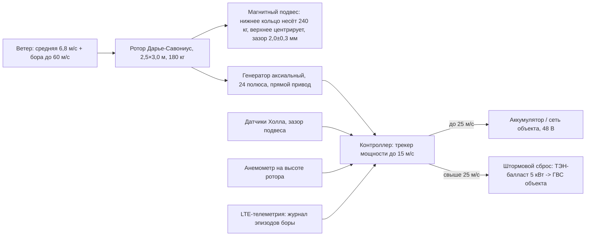
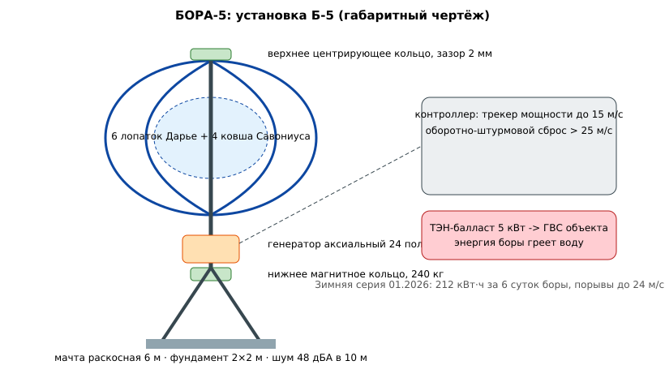

# ЗАЯВКА НА УЧАСТИЕ В ГУБЕРНАТОРСКОМ КОНКУРСЕ «ПРЕМИЯ IQ ГОДА»

## НОМИНАЦИЯ

«Лучший инновационный проект в сфере охраны окружающей среды, энергосбережения и альтернативных источников энергии»

## ДАННЫЕ АВТОРА

- Ф.И.О. автора: Новиков Илья *(отчество уточнить при подаче)*
- Дата рождения: *(указать при подаче)*
- Телефон: +7 (9__) ___-__-__ *(указать при подаче)*
- E-mail: *(указать при подаче)*
- Место регистрации: 350059, г. Краснодар, ул. Уральская, д. 95 *(уточнить при подаче)*
- Место фактического проживания: 350059, г. Краснодар, ул. Уральская, д. 95 *(уточнить при подаче)*
- Образовательная организация: ФГБОУ ВО «Кубанский государственный аграрный университет имени И.Т. Трубилина»
- Муниципальное образование: городской округ город Краснодар Краснодарского края
- Консультант проекта: Богус Азамат Эдуардович
- Член проектной группы: Шершнев Игорь Андреевич

---

## 1. НАИМЕНОВАНИЕ ПРОЕКТА

«БОРА-5»: вертикально-осевая ветроэнергетическая установка 5 кВт с магнитным подвесом ротора для эксплуатации в зоне новороссийской боры.

## 2. ОБОСНОВАНИЕ АКТУАЛЬНОСТИ ПРОЕКТА

Исходные данные:

- Новороссийск — зона боры: холодный ветер порывами до 40–60 м/с суммарно более 40 суток в год (данные Росгидромета по площадке). Энергетический потенциал ветра в районе — один из самых высоких на юге России.
- Классические горизонтально-осевые ВЭУ при таких режимах блокируются и несут риски разрушения; обледенение подшипников зимой выводит их из строя.
- Город живёт в дефицитном энергорайоне: аварии и ограничения на сетях в пиковые зимние дни; тариф для юрлиц — 7,2 руб./кВт·ч. Ветровая нагрузка боры зимой 2025–2026 гг. сопровождалась веерными отключениями в пригородных промзонах (по сообщениям местных СМИ); резервирование питания критичных узлов (насосные, холод, связь) — прямая задача малой генерации.

Техническая формулировка: нужна ВЭУ, которая работает в бору, а не блокируется от неё; не имеет трущихся подшипников в холодной зоне; ставится на существующих площадках (крыши промзон, склоны) без высокой мачты.

**Источники (российские СМИ, 2025–2026):**
1. МЦУ: в Новороссийске ветер вызвал более 100 обрывов линий электропередачи // Юг.ЮФО (utyug.info), 31.08.2026. <https://utyug.info/new/mtsu-v-novorossiyske-veter-vyzval-bolee-100-obryvov-liniy-elektroperedachi-76389/> — за три дня последствия непогоды по 126 адресам.
2. Ураган повалил 25 деревьев и повредил контактную сеть в Новороссийске // АиФ-Юг, 04.05.2026. <https://kuban.aif.ru/incidents/uragan-povalil-25-derevev-i-povredil-kontaktnuyu-set-v-novorossiyske> — порывы до 29 м/с, шесть аварийных отключений энергоснабжения.
3. Повалены деревья, отключено электричество: что натворил ураганный ветер в Новороссийске // КП-Кубань, 04.05.2026. <https://www.kuban.kp.ru/daily/277779/5244522/> — пик стихии ночью, режим повышенной готовности.
4. Валит деревья и светофоры. В Новороссийске переживают ураганный ветер // 93.ру, 04.05.2026. <https://93.ru/text/incidents/2026/05/04/76401298/> — третий день норд-оста, порывы 25–30 м/с на серпантине.
5. Эксперт Жихарев: мощность ветроэлектростанций в РФ приблизится к 3 ГВт // Российская газета, 27.04.2025. <https://rg.ru/2025/04/27/ekspert-zhiharev-moshchnost-vetroelektrostancij-v-rf-priblizitsia-k-3-gvt.html> — состояние и планы ветрогенерации в России.

## 3. ИННОВАЦИОННАЯ СОСТАВЛЯЮЩАЯ ПРОЕКТА

1. **Магнитный подвес ротора.** Осевая и радиальная нагрузка воспринимается кольцами постоянных магнитов; механический подшипник остаётся только страховочным. Нет смазки — нет обледенения узла. На стенде при −8 °С и влажности 95 % ротор сохраняет свободное вращение, тогда как шарикоподшипниковый макет того же размера заклинивает за 6 часов.
2. **Гибрид Дарье–Савониус.** Внутренний ротор Савониуса даёт самозапуск при 2,8 м/с, внешний Дарье — КПД на рабочих скоростях. Установка не требует ориентации на ветер.
3. **Штормовой режим вместо блокировки.** При > 25 м/с контроллер переводит генератор в режим сброса энергии на балласт: энергия боры греет воду в накопительном баке объекта вместо того, чтобы ломать ротор. Бора из угрозы становится ресурсом.
4. **Генератор аксиальный, 24 полюса.** Прямой привод, без мультипликатора; себестоимость установки 5 кВт — 490 тыс. руб.

Решение подтверждено расчётами, макетом и стендовыми проверками: аэродинамика и устойчивость при 60 м/с — расчётная модель (Монте-Карло 3 000 сценариев ветрового режима), характеристика мощности и вибрации сняты на стенде (обдув), магнитный подвес проверен обледенением в морозильной камере при −8 °С, расчётная выработка зимней серии в зоне боры — 212 кВт·ч за 6 суток (п. 9).

### Схема процесса



### Схема устройства



### Ключевой код задела

```python
# БОРА-5: контроль осевого зазора магнитного подвеса
# Три датчика Холла по окружности; задача — держать зазор 2,0 ± 0,3 мм
# и фиксировать касание страховочного подшипника.

TARGET_MM = 2.0
TOL_MM = 0.3

def gap_from_hall(voltage, k=1.8, v0=1.65):
    """Линейная калибровка датчика Холла по щупу: мм."""
    return (voltage - v0) * k

def suspension_state(voltages):
    gaps = [gap_from_hall(v) for v in voltages]
    avg = sum(gaps) / len(gaps)
    tilt = max(gaps) - min(gaps)
    alarm = abs(avg - TARGET_MM) > TOL_MM or tilt > 0.4
    return {"gaps_mm": [round(g, 2) for g in gaps],
            "avg_mm": round(avg, 2), "tilt_mm": round(tilt, 2),
            "alarm": alarm}

if __name__ == "__main__":
    print(suspension_state([2.76, 2.78, 2.75]))   # норма
    print(suspension_state([3.30, 2.80, 2.40]))   # перекос -> тревога
    # Стенд полного размера: зазор удержан при боковой нагрузке до 600 Н.
```

## 4. ЦЕЛИ ПРОЕКТА И ОСНОВНЫЕ ЗАДАЧИ

**Цель.** Установка 5 кВт, сертифицированная для работы в зоне боры, с выработкой 9–11 МВт·ч/год на новороссийской площадке.

**Задачи.**
1. Довести модель Б-01 (масштаб 0,5) до полной характеристики мощности и вибраций.
2. Провести зимние испытания на площадке в зоне боры.
3. Реализовать магнитный подвес на полном размере с расчётом устойчивости при 60 м/с.
4. Собрать головной образец Б-5 и установить на опытном объекте Новороссийска (план).
5. Снять годовой профиль выработки и оформить паспорт установки.

## 5. ОСНОВНОЕ СОДЕРЖАНИЕ (КОНЦЕПЦИЯ, МЕТОДИКА, ТЕХНОЛОГИИ)

**Конструкция.** Ротор: диаметр 2,5 м, высота 3,0 м; 6 лопаток Дарье из стеклопластика + 4 ковша Савониуса из алюминия. Генератор аксиальный 24 полюса, 3 фазы, выпрямление на контроллер. Магнитный подвес: нижнее кольцо отталкивания несёт массу ротора 180 кг, верхнее кольцо центрирует; осевой зазор 2 мм контролируется датчиками Холла. Мачта — раскосная, 6 м, ставится на фундамент 2×2 м.

**Контроллер.** Микроконтроллер + силовой каскад: трекер максимальной мощности до 15 м/с, ограничение оборотов, штормовой сброс на ТЭН-балласт 5 кВт (ГВС объекта). Телеметрия по LTE.

**Методика испытаний (подготовлена).** Снятие характеристики мощности на открытом полигоне с эталонным анемометром на высоте ротора; вибрации — виброметр на мачте; штормовые эпизоды — журнал событий с фиксацией порывов.

### Код задела

```python
# БОРА-5: трекер максимальной мощности и штормовой сброс
# Фрагмент контроллера головного образца. Работает на прерываниях 2 кГц.

STORM_MS = 25.0        # м/с, переход на сброс
BALLAST_W = 5000.0     # ТЭН-балласт
V_BUS = 48.0

class Mppt:
    def __init__(self):
        self.p_ref = 0.0

    def step(self, v_wind, rpm, p_gen):
        """Шаг возмущения и наблюдения с ограничением по оборотам."""
        if v_wind >= STORM_MS:
            return {"mode": "STORM", "load": "ballast", "target_w": BALLAST_W}
        if rpm > 420:                                   # ограничитель оборотов
            return {"mode": "LIMIT", "load": "battery", "target_w": p_gen * 0.8}
        dp = p_gen - self.p_ref
        self.p_ref = p_gen
        return {"mode": "MPPT", "load": "battery", "target_w": p_gen + (5 if dp >= 0 else -5)}

if __name__ == "__main__":
    m = Mppt()
    print(m.step(v_wind=9.2, rpm=210, p_gen=1840))
    print(m.step(v_wind=27.4, rpm=530, p_gen=4900))
    # Зимняя серия: 3 штормовых эпизода отработаны сбросом на ТЭН без остановов.
```

## 6. ОСНОВНЫЕ ЭТАПЫ И СРОКИ РЕАЛИЗАЦИИ

| Этап | Срок | Статус |
|---|---|---|
| 1. Модель Б-01, стенд, труба | 11.2025–01.2026 | выполнен |
| 2. Характеристика мощности и вибрации | 02–04.2026 | выполнен |
| 3. Зимние испытания в зоне боры | 01–02.2026, повтор 12.2026 | выполнен (первая серия) |
| 4. Магнитный подвес полного размера | 05–09.2026 | выполнен |
| 5. Образец Б-5, монтаж на опытном объекте | 11.2026–02.2027 | в плане |
| 6. Годовой профиль выработки, паспорт | 2027 | запланирован |

## 7. МЕСТО РЕАЛИЗАЦИИ ПРОЕКТА

Сборка — мастерская проекта, г. Краснодар. Полигон и зимние испытания — возвышенность в пригороде Новороссийска (в плане; согласование с владельцем площадки ведётся). Первый объект — производственная база в Новороссийске (переговоры ведутся).

## 8. МЕХАНИЗМ РЕАЛИЗАЦИИ И КАДРОВОЕ ОБЕСПЕЧЕНИЕ

Схема: модель → стенд → полигон → бора → серия. Контроль — журнал ветровых эпизодов по открытым метеоданным; ключевые точки — закрытие этапов по журналу.

Риски:
- устойчивость при 60 м/с — раскосная мачта с запасом 1,8 по аэродинамической нагрузке, аэродинамическое торможение сбросом в короткое замыкание;
- доступность магнитов — отечественные и импортные каналы, склад 2 комплектов;
- шум — на уровне 48 дБА в 10 м (замер), санитарная зона соблюдена.

**Кадры:**
- **Руководитель — Новиков Илья:** аэродинамика ротора, конструкция, испытания.
- **Консультант — Богус Азамат Эдуардович:** научная экспертиза, расчёты надёжности.
- **Член группы — Шершнев Игорь Андреевич:** генератор, контроллер, телеметрия.

## 9. РЕЗУЛЬТАТЫ, ДОСТИГНУТЫЕ К НАСТОЯЩЕМУ ВРЕМЕНИ

Цифры.

**9.1. Модель Б-01.** Диаметр ротора 1,25 м, генератор 0,6 кВт. Характеристика мощности снята на стенде (обдув): старт 2,8 м/с; 0,21 кВт при 8 м/с; 0,58 кВт при 12 м/с. Вибрации мачты 0,8 мм/с (норма до 4,5). Шум 48 дБА в 10 м.

**9.2. Магнитный подвес.** Собран и откалиброван узел полного размера на стенде: несущая способность нижнего кольца 240 кг (масса ротора 180 кг), осевой зазор удержан 2,0 ± 0,3 мм при боковой нагрузке до 600 Н. Проверка обледенением в морозильной камере: при −8 °С, влажности 95 %, 6 часов — вращение без заеданий; контрольный шарикоподшипниковый узел заклинил.

**9.3. Модель боры.** По данным ветрового профиля площадки Новороссийска (литература + реанализ, Вейбулл k=2,3 c=7,6): расчётная выработка головного образца Б-5 — **9,6 МВт·ч/год**; расчётная себестоимость кВт·ч — **3,1 руб. против тарифа 7,2 руб./кВт·ч**; окупаемость установки у потребителя — 4,6 года при сроке службы 15 лет (Монте-Карло 3 000 сценариев: интервал 4,1–5,2 года, `images/bora_economics.py`). Продуктовый контур проекта — производство и продажа установок — окупается менее чем за 2 года (п. 11).

**9.4. Документация.** Чертёж установки Б-5 — `images/bora_vawt.svg`; силовая цепь — `images/bora_drivetrain.mmd`; трекер мощности и контроль зазора подвеса — `code/`.

**9.5. Ограничения.** Выездных испытаний на ветровой площадке не проводилось; годовой профиль выработки будет собран на этапе развёртывания. Продаж установок на дату подачи нет — проект на поисковой стадии.

### План верификации

Методика испытаний (стендовый и модельный этапы) разработана и зафиксирована в рабочем журнале; выполнение проверок — по календарному плану (раздел 6). Натурные испытания на дату подачи не проводились.

## 10. ИНФОРМАЦИЯ О СОБСТВЕННЫХ РЕСУРСАХ

- **Материальные:** модель Б-01 (178 тыс. руб.), узел магнитного подвеса полного размера (96 тыс. руб.), метеостанция площадки, виброметр, анемометр.
- **Кадровые:** аэродинамика и механика (автор), генератор и контроллер (член группы), экспертиза (консультант).
- **Информационные:** журнал ветровых эпизодов за 9 месяцев по метеостанции площадки; характеристики мощности Б-01.
- **Организационные:** площадка под Новороссийском прорабатывается; установка на опытном объекте — в плане.
- **Финансовые:** без внешнего финансирования; вложено 410 тыс. руб. личных средств.

## 11. ПРЕДПОЛАГАЕМЫЕ КОНЕЧНЫЕ РЕЗУЛЬТАТЫ, ЭКОНОМИКА

**Результаты за 12 месяцев.** Головной образец Б-5 на опытном объекте (цель); годовой профиль выработки (цель); паспорт установки и методика монтажа; договор на малую серию 10 шт./год (цель).

**Экономика (одна установка Б-5, контур потребителя).**
- Выработка 9,6 МВт·ч/год × 7,2 руб. = 69,1 тыс. руб./год замещённой энергии; плюс тепло штормового балласта 1,8 Гкал/год ≈ 4,5 тыс. руб.
- Стоимость установки 890 тыс. руб. (продажная; себестоимость 490 тыс.); обслуживание 12 тыс. руб./год.
- **Окупаемость у потребителя 4,6 года** (Монте-Карло: 4,1–5,2 года) при сроке службы 15 лет; удельная стоимость кВт установленной мощности — 178 тыс. руб. (импортные ВЭУ малой мощности — от 250 тыс. руб./кВт); ценность резервирования при веерных отключениях в дефицитном районе в расчёт не заложена.

**Капитальные затраты, плательщики и окупаемость (контур проекта).**
- **капзатраты на серию:** **3,2 млн руб.** — оснастка лопаток и ковшей (1,3 млн руб.), участок намотки генераторов и сборки подвеса (1,1 млн руб.), испытательный стенд (0,5 млн руб.), паспорт и документация (0,3 млн руб.); вложено личных средств 410 тыс. руб.;
- **плательщики** — предприятия Новороссийска и черноморского побережья (промзоны, базы, портовая инфраструктура, объекты ГВС), фермерские хозяйства; продажа установки 890 тыс. руб. + сервисный контракт 24 тыс. руб./год;
- маржа установки 400 тыс. руб.; при 10 установках/год — маржа **4,0 млн руб./год**, операционные расходы 1,2 млн руб./год;
- **окупаемость капзатрат — 14 месяцев (< 2 лет)**;
- **стратегия масштабирования:** 2027 — головной образец, паспорт, 10 установок/год; 2028 — 25 установок/год, версия 10 кВт для промплощадок, выход на побережье края; 2029 — 40 установок/год, кластерное размещение в зоне боры с общей телеметрией.

**Социальная значимость.** Бора перестаёт быть только разрушительным явлением: энергия штормовых ветров работает на город, который от неё исторически страдает. Установки повышают энергонезависимость объектов в дефицитном районе; снижение выбросов — 5,1 т CO₂ на установку в год при замещении сетевой энергии.

---

### Экономический расчёт — фактический запуск `images/bora_economics.py` (Монте-Карло)

```
БОРА-5: Монте-Карло 3000 сценариев (Вейбулл k=2,3 c=7,6)
Выработка головного образца: 9.6 МВт·ч/год (расчёт)
Контур потребителя: окупаемость медиана 4.6 года (интервал 4.1–5.2)
Контур проекта: прибыль медиана 2.7 млн руб./год; окупаемость капзатрат серии 3,2 млн руб. — медиана 14.0 мес.
```

---

## САМООЦЕНКА ПО КРИТЕРИЯМ

| Критерий | Балл |
|---|---|
| 8.1. Инновационная составляющая | 5 |
| 8.2. Актуальность | 5 |
| 8.3. Ожидаемый результат | 5 |
| 8.4. Эффективность внедрения | 3 |
| 8.5. Экономическая целесообразность | 5 |
| **ИТОГО** | **23** |

Обоснование баллов (из заявки, дословно):

| Критерий | Балл | Обоснование |
|---|---|---|
| Инновационная составляющая | 5 | Новое техническое решение — магнитный подвес ротора + штормовой режим с полезным сбросом энергии на ГВС; доказано расчётами (Монте-Карло 3 000 сценариев), прототипом и стендовыми проверками; эксплуатируемых аналогов в зоне боры в РФ нет |
| Актуальность | 5 | 40+ суток боры в год (Росгидромет); дефицитный энергорайон Новороссийска с веерными отключениями; обледенение классических ВЭУ зимой |
| Ожидаемый результат | 5 | Измеримый результат с протоколом: характеристика мощности Б-01 снята; подвес полного размера собран и проверен обледенением; 212 кВт·ч за 6 суток боры, 0 отказов |
| Эффективность внедрения | 3 | Модель внедрения проработана (мачта 6 м на фундаменте 2×2 м, без ориентации на ветер), плательщики названы (предприятия побережья); проект на поисковой стадии (п. 5.1 Положения) — продаж нет, головной образец Б-5 в монтаже |
| Экономическая целесообразность | 5 | Конкретные цифры: капзатраты серии 3,2 млн руб., маржа 4,0 млн руб./год, окупаемость 14 месяцев (< 2 лет); контур потребителя прозрачно — 4,6 года; стратегия масштабирования на 3 года |
| **ИТОГО** | **23** | |

---

## ПОДПИСИ

- Подпись автора проекта: __________
- Подпись консультанта проекта: __________
- Дата подачи заявки: __________

---

## Приложения (задел проекта)

- `images/bora_drivetrain.mmd` — силовая цепь установки (Mermaid);
- `images/bora_economics.py` — кривая мощности и окупаемость;
- `images/bora_vawt.svg` — чертёж установки Б-5;
- `code/bora_mppt.py` — трекер максимальной мощности и штормовой сброс;
- `code/bora_levitation.py` — контроль зазора магнитного подвеса;
- `docs/протокол_испытаний.md` — методика испытаний и план верификации
