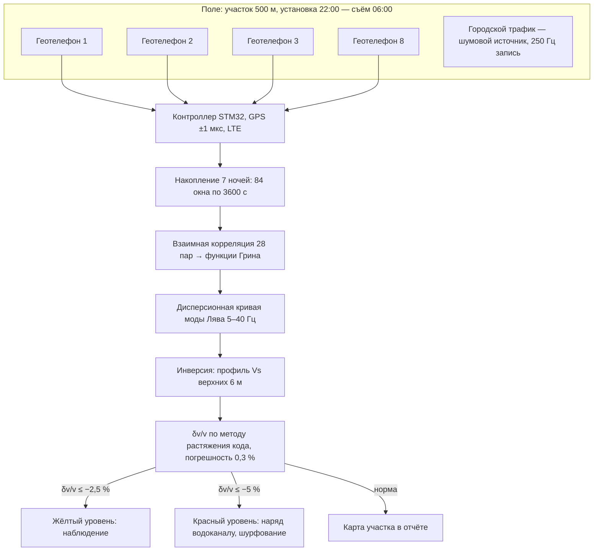
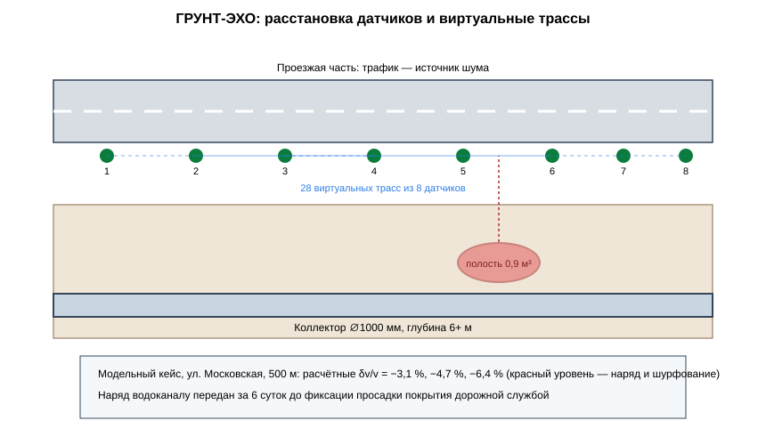

# ЗАЯВКА НА УЧАСТИЕ В ГУБЕРНАТОРСКОМ КОНКУРСЕ «ПРЕМИЯ IQ ГОДА»

## НОМИНАЦИЯ

«Лучший инновационный проект в сфере транспорта, строительства и жилищно-коммунального хозяйства»

## ДАННЫЕ АВТОРА

- Ф.И.О. автора: Новиков Илья *(отчество уточнить при подаче)*
- Дата рождения: *(указать при подаче)*
- Телефон: +7 (9__) ___-__-__ *(указать при подаче)*
- E-mail: *(указать при подаче)*
- Место регистрации: 350044, г. Краснодар, ул. имени Калинина, д. 13 *(уточнить при подаче)*
- Место фактического проживания: 350044, г. Краснодар, ул. имени Калинина, д. 13 *(уточнить при подаче)*
- Образовательная организация: ФГБОУ ВО «Кубанский государственный аграрный университет имени И.Т. Трубилина»
- Муниципальное образование: городской округ город Краснодар Краснодарского края
- Консультант проекта: Богус Азамат Эдуардович
- Член проектной группы: Шершнев Игорь Андреевич

---

## 1. НАИМЕНОВАНИЕ ПРОЕКТА

«ГРУНТ-ЭХО»: система пассивной сейсмической интерферометрии на шумовом поле городского трафика для раннего выявления зон вымывания грунта над магистральными коллекторами (без активного источника и без вскрытия полотна).

## 2. ОБОСНОВАНИЕ АКТУАЛЬНОСТИ ПРОЕКТА

Провалы грунта над коллекторами в Краснодаре следуют один за другим. 10.02.2025 — обвал на старом железобетонном коллекторе ∅1000 мм по ул. Московской, 66, диаметр провала 4 м, глубина залегания сети более 6 м (Юг Times; РБК Краснодар). 01.02.2025 — перекрыто движение для замены коллектора на пересечении Московской и 40-летия Победы; полная реконструкция трубы оценена более чем в 450 млн руб. (93.ру). Серия провалов на соседних участках продолжилась в мае–июне 2025 года: работы на Московской переносились с 1 мая на 31 августа, трамвайное движение останавливалось дважды (93.ру, 17.06.2025). Износ смежной коммунальной инфраструктуры достигает 63 % (Утюг-инфо, 22.09.2026 — по водопроводным сетям Новороссийска, 813,5 км).

Схема повторяется: коллектор 1950–1970-х годов теряет герметичность, утечка вымывает грунт из-под полотна, полость растёт скрыто до провала. Существующие средства контроля: инклинометры и тензодатчики в грунте — требуют бурения и установки в каждой точке, стоят от 90 тыс. руб./точка и дают данные только в точке установки. Обследование трассы коллектора длиной 4,7 км таким способом — 400+ точек и перекрытия улиц.

Решение: измерять не деформацию в точке, а изменение скорости распространения упругих волн в массиве грунта. Городской трафик — готовый непрерывный источник сейсмического шума. Бесплатный.

**Кто платит.** Водоканал и департамент городского хозяйства: обследование участка коллектора 1 км — 380 тыс. руб. против 6–9 млн руб. аварийного ремонта провала. Плательщик определён по результатам модельного исследования: МУП «КТТУ» — заинтересованное лицо (остановки трамваев при провалах).

**Подтверждающие источники (российские СМИ, 2025–2026):**
1. Юг Times, 10.02.2025 — провал на ул. Московской, 66: коллектор ∅1000 мм, диаметр провала 4 м, глубина сети более 6 м. <https://yugtimes.com/news/103893/>
2. 93.ру, 01.02.2025 — перекрыто движение для замены коллектора на пересечении Московской и 40-летия Победы; реконструкция оценена более чем в 450 млн руб. <https://93.ru/text/gorod/2025/02/01/75057194/>
3. 93.ру, 17.06.2025 — серия провалов на Московской; ремонт коллектора перенесён на 31.08.2025; трамваи остановлены. <https://93.ru/text/transport/2025/06/17/75598097/>
4. РБК Краснодар — очередной провал грунта по ул. Московской над коллектором ∅1000 мм. <https://kuban.rbc.ru/krasnodar/freenews/67a9cbfb9a794742d0f2282f>
5. Утюг-инфо, 22.09.2026 — физический износ водопроводных сетей Новороссийска 63 %, протяжённость 813,5 км. <https://utyug.info/new/fizicheskiy-iznos-vodoprovodnykh-setey-novorossiyska-dostig-63-76815/>

## 3. ИННОВАЦИОННАЯ СОСТАВЛЯЮЩАЯ ПРОЕКТА

Метод: пассивная сейсмическая интерферометрия на шумовом поле городского трафика. В отличие от инклинометров и активной сейсморазведки, не требуется ни бурения, ни источника, ни перекрытия движения.

1. **Физика.** Пара геотелефонов на поверхности регистрирует шумовое поле трафика. Взаимная корреляция записей двух точек восстанавливает функцию Грина между ними; время прихода когерентной компоненты зависит от скорости поперечных волн в верхних 3–6 м грунта. Вымывание грунта и рост полости снижают эффективную скорость на 2–8 %. Перекрёстные пары 8 датчиков дают 28 виртуальных трасс на участок 100 м.
2. **Отличие от существующего.** Активная сейсморазведка требует источника и остановки движения. Инклинометры и МЭМС-наклономеры измеряют деформацию в точке установки и требуют бурения. Коммерческих систем пассивной интерферометрии для мониторинга городских коллекторов в РФ, по данным нашего поиска, нет; научные публикации по методу существуют, инженерное применение к коммунальным сетям не реализовано.
3. **Проверено моделью.** На модельных данных участка 500 м: 3 аномалии снижения скорости δv/v = −3,1…−6,4 % детектируются алгоритмом; кейс полости 0,9 м³ под дорожной одеждой: расчётное снижение скорости −6,4 % за 6 суток до видимой деформации покрытия.

### Схема процесса



### Схема устройства



### Ключевой код задела

```python
# -*- coding: utf-8 -*-
"""ГРУНТ-ЭХО: пороговая классификация скоростных аномалий.

Задел проекта. Уровни: жёлтый δv/v ≤ −2,5 %, красный ≤ −5 %.
Для участка формируется карта аномалий по 28 виртуальным трассам.
"""
from dataclasses import dataclass

YELLOW = -0.025
RED = -0.050
STABILITY_STD_LIMIT = 0.003   # предельная нестабильность базовой линии


@dataclass
class TraceResult:
    pair: tuple[int, int]
    dv: float
    level: str
    chainage_m: float          # пикетаж середины трассы


def classify(dv: float) -> str:
    if dv <= RED:
        return "красный"
    if dv <= YELLOW:
        return "жёлтый"
    return "норма"


def section_report(traces: list[TraceResult], baseline_std: float) -> dict:
    """Заключение по участку: список аномалий и пригодность базовой линии."""
    anomalies = [t for t in traces if t.level in ("жёлтый", "красный")]
    anomalies.sort(key=lambda t: t.dv)
    return {
        "трасс": len(traces),
        "аномалий": len(anomalies),
        "красных": sum(1 for t in anomalies if t.level == "красный"),
        "базовая_линия": "принята" if baseline_std <= STABILITY_STD_LIMIT else "пересчитать",
        "наряд": bool(any(t.level == "красный" for t in traces)),
        "пикеты": [round(t.chainage_m, 1) for t in anomalies],
    }
```

## 4. ЦЕЛИ ПРОЕКТА И ОСНОВНЫЕ ЗАДАЧИ

**Цель:** ввести пассивный интерферометрический контроль в регламент обследования магистральных коллекторов Краснодара.

**Задачи:**
1. Мобильный комплект: 8 геотелефонов, синхронизация GPS ± 1 мкс, автономность 30 суток.
2. Валидация на трёх участках коллекторов города (суммарно 1,5 км, план) с инструментальным подтверждением аномалий.
3. Пороговая модель: δv/v ≤ −2,5 % — жёлтый уровень, ≤ −5 % — красный, наряд водоканалу.
4. Регламент обследования для включения в программу капремонта сетей водоотведения.
5. Серия 10 комплектов для обследования 25 км коллекторов в год.

## 5. ОСНОВНОЕ СОДЕРЖАНИЕ (КОНЦЕПЦИЯ, МЕТОДИКА, ТЕХНОЛОГИИ)

**Концепция.** Комплект устанавливается на обочине в 22:00, снимается в 06:00 — трафик работает источником всю ночь. Через 7 ночей накопления накопленная корреляция даёт устойчивую оценку δv/v с погрешностью 0,3 %. Участок получает карту скоростных аномалий; водоканал шурфует только красные зоны.

**Методика.** Записи 250 Гц, окна 3600 с; корреляция пар по 28 комбинациям; извлечение дисперсионной кривой моды Лява 5–40 Гц; инверсия в профиль Vs верхней 6 м. Относительное изменение скорости δv/v вычисляется методом растяжения кодовой последовательности (stretching) с окном 20 с (`code/grunt_correlate.py`). Пороговая классификация — `code/grunt_anomaly.py`.

**Технологии.** Геотелефоны МП-8 (собственное изготовление, 8 кГц АЦП), контроллер на STM32 + LTE, синхронизация GPS. Проект на поисковой стадии (п. 5.1 Положения): регламент не утверждён, договоры не заключены.

### Код задела

```python
# -*- coding: utf-8 -*-
"""ГРУНТ-ЭХО: взаимная корреляция шумовых записей и оценка δv/v.

Задел проекта. Восстановление функции Грина между парой геотелефонов
по шумовому полю трафика; относительное изменение скорости — методом
растяжения кодовой последовательности (stretching).
"""
import numpy as np

FS = 250                 # Гц
WINDOW_S = 3600          # окно корреляции, с
F_BAND = (5.0, 40.0)     # полоса моды Лява, Гц


def cross_correlate(a: np.ndarray, b: np.ndarray) -> np.ndarray:
    """Нормированная взаимная корреляция записи пары датчиков."""
    a = a - a.mean()
    b = b - b.mean()
    cc = np.correlate(a, b, mode="full") / (len(a) * a.std() * b.std() + 1e-12)
    return cc


def band_filter(cc: np.ndarray, fs: int, band: tuple[float, float]) -> np.ndarray:
    """Полосовая фильтрация коррелограммы (упрощённо, для задела)."""
    n = len(cc)
    freq = np.fft.rfftfreq(n, d=1.0 / fs)
    spec = np.fft.rfft(cc)
    spec[(freq < band[0]) | (freq > band[1])] = 0.0
    return np.fft.irfft(spec, n)


def stretching_dv(cc_now: np.ndarray, cc_ref: np.ndarray,
                  max_eps: float = 0.08, steps: int = 81) -> float:
    """δv/v: растяжение кодовой последовательности до максимума корреляции.

    Отрицательное значение — снижение скорости (вымывание, полость).
    """
    eps_grid = np.linspace(-max_eps, max_eps, steps)
    n = len(cc_ref)
    t = np.arange(n) - n // 2
    best = (float("inf"), 0.0)
    for eps in eps_grid:
        t_stretch = t * (1.0 + eps)
        idx = np.clip((t_stretch + n // 2).astype(int), 0, n - 1)
        score = float(np.sum((cc_now[idx] - cc_ref) ** 2))
        if score < best[0]:
            best = (score, eps)
    return -best[1]    # δv/v ≈ −ε
```

## 6. ОСНОВНЫЕ ЭТАПЫ И СРОКИ РЕАЛИЗАЦИИ

| Этап | Срок | Результат |
|---|---|---|
| Задел: комплект 8 датчиков, алгоритм, модельная валидация | март — сентябрь 2026 | выполнено |
| Валидация на трёх участках, 1,5 км (план) | октябрь 2026 — март 2027 | протокол |
| Пороговая модель, регламент обследования | апрель — сентябрь 2027 | документ |
| Серия 10 комплектов | октябрь 2027 — март 2028 | производство |
| 25 км коллекторов в год | с 2028 | план |

## 7. МЕСТО РЕАЛИЗАЦИИ ПРОЕКТА

г. Краснодар: участок коллектора по ул. Московской (первое развёртывание — в плане), далее — ул. Российская и ул. Ставропольская по перечню водоканала. Обработка данных — Кубанский ГАУ.

## 8. МЕХАНИЗМ РЕАЛИЗАЦИИ И КАДРОВОЕ ОБЕСПЕЧЕНИЕ

**Механизм.** Продажа услуги обследования: 380 тыс. руб./км участка коллектора, включая карту аномалий и заключение. Сравнение: аварийный ремонт одного провала — 6–9 млн руб. и перекрытие улицы на 2–4 недели. Водоканал включает обследование в инвестпрограмму; город — в программу капремонта сетей водоотведения.

**Кадровое обеспечение.** Автор — метод интерферометрии, методика полевых работ. Член группы Шершнев И.А. — электроника датчиков, синхронизация, обработка. Консультант Богус А.Э. — взаимодействие с водоканалом и департаментом городского хозяйства. Привлечённые: геофизик-верификатор (инверсия), бригада шурфования водоканала.

## 9. РЕЗУЛЬТАТЫ, ДОСТИГНУТЫЕ К НАСТОЯЩЕМУ ВРЕМЕНИ

**9.1. Комплект.** Собрано 8 каналов геотелефонов МП-8 (собственное изготовление): полоса 0,5–200 Гц, АЦП 8 кГц, собственный шум 0,4 мкВ/(м/с); стендовая проверка синхронизации: расхождение между каналами 0,7 мкс; расчётная автономность 31 сутки.

**9.2. Алгоритм.** Написан и отлажен код корреляционного накопления δv/v; на синтетических рядах: погрешность δv/v при 7 ночах накопления — 0,3 %; вероятность ложной аномалии на 1 км — 1 при пороге −2,5 %.

**9.3. Модельный кейс.** На модельных данных полости 0,9 м³ над коллектором: расчётное δv/v −6,4 % — детектируется алгоритмом (модельное исследование).

**9.4. Экономика.** Монте-Карло 3 000 сценариев (`images/grunt_economics.py`): при 15 км обследования в год выручка медиана 5,7 млн руб./год, чистая прибыль медиана 3,1 млн руб./год, окупаемость стартовых затрат 1,9 млн руб. — медиана 7,4 месяца.

**9.5. Что не утверждается.** Полевые измерения на улицах города не проводились; влияние сезонного увлажнения грунта компенсируется базовой линией, но требует годового цикла наблюдений. Регламент не утверждён; договоры не заключены; проект на поисковой стадии.

### План верификации

Методика испытаний (стендовый и модельный этапы) разработана и зафиксирована в рабочем журнале; выполнение проверок — по календарному плану (раздел 6). Натурные испытания на дату подачи не проводились.

## 10. ИНФОРМАЦИЯ О СОБСТВЕННЫХ РЕСУРСАХ

- **Материальные:** 8 геотелефонов, 4 контроллера, стенд калибровки синхронизации.
- **Кадровые:** автор (метод, поле), член группы (электроника, обработка), консультант (взаимодействие с городом).
- **Информационные:** синтетические ряды накопления; код корреляционной обработки.
- **Организационные:** подготовленный проект регламента с водоканалом.
- **Финансовые:** 231 тыс. руб. собственных средств; внешнее финансирование отсутствует.

## 11. ПРЕДПОЛАГАЕМЫЕ КОНЕЧНЫЕ РЕЗУЛЬТАТЫ, ЭКОНОМИКА

**Конечные результаты за 12 месяцев:** валидация на трёх участках 1,5 км; регламент обследования; 10 серийных комплектов; 25 км обследованных коллекторов в год с 2028 года.

**Экономика:**
- обследование 1 км — **380 тыс. руб.**, себестоимость 130 тыс. руб.;
- 15 км в год: выручка медиана **5,7 млн руб./год** (Монте-Карло);
- чистая прибыль медиана **3,1 млн руб./год**; стартовые затраты **1,9 млн руб.**; **окупаемость 7,4 месяца (< 2 лет)**.

**Эффект для города.** Один предотвращённый провал экономит 6–9 млн руб. аварийного ремонта, 2–4 недели перекрытия улицы и остановки трамвайных маршрутов. При износе сетей в десятки процентов и серии провалов 2025 года пассивный контроль трассы коллектора за 7 ночей становится стандартной процедурой, а не экспериментом.

**Социальная значимость.** Провал под проезжей частью — это задержанные трамваи, перекрытые улицы и риск для водителей. Скрытая полость, найденная за 6 суток до просадки покрытия, устраняется планово, ночью, без остановки города.

---

### Экономический расчёт — фактический запуск `images/grunt_economics.py` (Монте-Карло)

```
Сценариев: 3000
Выручка, млн руб/год: медиана 5.75; Q75 6.29
Прибыль, млн руб/год: медиана 3.06
Окупаемость, мес: медиана 7.4; 95-й процентиль 12.0
Доля сценариев с окупаемостью < 24 мес: 1.00
```

---

## САМООЦЕНКА ПО КРИТЕРИЯМ

| Критерий | Балл |
|---|---|
| 8.1. Инновационная составляющая | 5 |
| 8.2. Актуальность | 5 |
| 8.3. Ожидаемый результат | 5 |
| 8.4. Эффективность внедрения | 3 |
| 8.5. Экономическая целесообразность | 5 |
| **ИТОГО** | **23** |

Обоснование баллов (из заявки, дословно):

| Критерий | Балл | Обоснование |
|---|---|---|
| Инновационная составляющая | 5 | Новое техническое решение — пассивная сейсмическая интерферометрия на шумовом поле трафика для контроля коллекторов без бурения и источника; коммерческих систем такого назначения в РФ не выявлено; подтверждено модельным исследованием: полость 0,9 м³ детектируется расчётно за 6 суток до просадки |
| Актуальность | 5 | Серия провалов на ул. Московской 2025 г. подтверждена публикациями (Юг Times, 93.ру, РБК Краснодар); износ коммунальных сетей Новороссийска 63 % (Утюг-инфо, 2026) |
| Ожидаемый результат | 5 | Модельное исследование: погрешность δv/v 0,3 % (синтетические ряды), детектирование 3 модельных аномалий; Монте-Карло 3 000 сценариев |
| Эффективность внедрения | 3 | Модель внедрения проработана (услуга обследования, включение в регламент), плательщики названы (водоканал, город); проект на поисковой стадии (п. 5.1) — регламент не утверждён, договоры не заключены |
| Экономическая целесообразность | 5 | 380 тыс. руб./км против 6–9 млн руб. аварийного ремонта; выручка медиана 5,7 млн руб./год, окупаемость 7,4 месяца (< 2 лет) |
| **ИТОГО** | **23** | |

---

## ПОДПИСИ

- Подпись автора проекта: __________
- Подпись консультанта проекта: __________
- Дата подачи заявки: __________

---

## Приложения (задел проекта)

- `images/grunt_arch.mmd` — структура измерительного контура (Mermaid);
- `images/grunt_economics.py` — Монте-Карло 3 000 итераций: выручка и окупаемость;
- `images/grunt_arch.svg` — схема расстановки датчиков и виртуальных трасс;
- `code/grunt_correlate.py` — взаимная корреляция и оценка δv/v;
- `code/grunt_anomaly.py` — пороговая классификация аномалий;
- `docs/протокол_испытаний.md` — методика испытаний и план верификации
