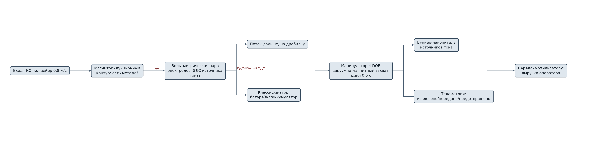
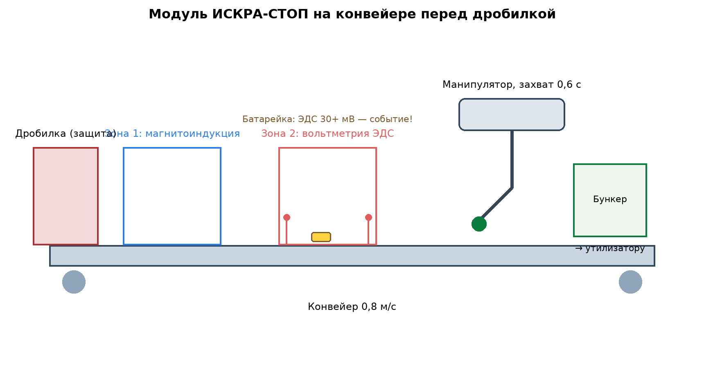

# ЗАЯВКА НА УЧАСТИЕ В ГУБЕРНАТОРСКОМ КОНКУРСЕ «ПРЕМИЯ IQ ГОДА»

## НОМИНАЦИЯ

«Лучший инновационный проект в сфере робототехники, компьютерных технологий и телекоммуникаций»

## ДАННЫЕ АВТОРА

- Ф.И.О. автора: Климов Максим Сергеевич
- Дата рождения: 04.06.2006
- Телефон: 89086900014
- E-mail: maasik50@gmail.com
- Место регистрации: г. Краснодар, проспект Чекистов, 38, кв. 106
- Место фактического проживания: г. Краснодар, проспект Чекистов, 38, кв. 106
- Образовательная организация: ФГБОУ ВО «Кубанский государственный аграрный университет имени И.Т. Трубилина»
- Муниципальное образование: городской округ город Краснодар Краснодарского края
- Консультант проекта: Богус Азамат Эдуардович
- Член проектной группы: Шершнев Игорь Андреевич

---

## 1. НАИМЕНОВАНИЕ ПРОЕКТА

«ИСКРА-СТОП»: роботизированный модуль потокового извлечения батареек и малогабаритных источников тока из потока смешанных ТКО с вольтметрическим детектированием остаточного заряда перед дробильным оборудованием мусоросортировочных комплексов.

## 2. ОБОСНОВАНИЕ АКТУАЛЬНОСТИ ПРОЕКТА

Краснодарский край — главный генератор отходов Юга России: на регион приходится около 40 % всех ТКО ЮФО («Кубанские новости», 15.01.2026). Сортировка охватывает 49 % потока, цель нацпроекта — 100 % к 2030 году; в крае работают 12 объектов сортировки, строится ещё десять. И у всех одна общая уязвимость: батарейки и малогабаритные источники тока в чёрных мешках, которые дробилки вскрывают вместе с остальным мусором. Короткое замыкание и возгорание в дробильной камере — типовой сценарий пожара на объектах обращения с ТКО, и край знает цену таких событий. Полигон в Новороссийске горел с 13 марта 2025 года: открытое горение на 2 500 м² тушили больше месяца, тление в глубоких слоях продолжалось и после, на реконструкцию объекта направлено более 1,1 млрд руб. («Кубанские новости», 18.04.2025; KrasnodarMedia, 26.09.2026). Эколог прямо называет внутреннее горение свалки необратимым (Юга.ру, 08.09.2025), а летом 2025 года горел и полигон в посёлке Двубратском под Усть-Лабинском (Юг Times, 06.08.2025). Меньше источников тока в потоке — меньше топлива для таких событий и меньше расходов на их ликвидацию.

Сегодня батарейки не извлекаются из смешанного потока никак: оптическая сортировка их не видит внутри мешков и под плёнкой, рентген и металлодетекция не отличают батарейку от фольги и ключей. Мы делаем первое решение, которое ловит именно источник тока — по остаточному заряду!

**Кто платит.** Региональные операторы и операторы мусоросортировочных комплексов: модуль ставится перед дробилкой и снижает пожарные риски и простои. Плательщик получает экономию на простоях и ликвидации возгораний плюс выручку от передачи извлечённых источников тока утилизаторам.

**Подтверждающие источники (российские СМИ, 2025–2026):**
1. Кубанские новости, 15.01.2026 — Кубань даёт около 40 % всех ТКО ЮФО; сортировка 49 %, цель — 100 % к 2030 году; 12 объектов сортировки, строится ещё десять. <https://kubnews.ru/vlast/2026/01/15/v-krasnodarskom-krae-ezhegodno-obrazuetsya-okolo-40-ot-obshchego-obema-tko-v-yufo/>
2. KrasnodarMedia, 26.09.2026 — постоянно горящий полигон в Новороссийске: 13.03.2025 горело 2 500 м², 06.09.2026 — новое возгорание 900 м². <https://krasnodarmedia.su/news/2632975/>
3. Кубанские новости, 18.04.2025 — пожар на новороссийском полигоне ликвидирован через месяц; тление в глубоких слоях; на реконструкцию — более 1,1 млрд руб. <https://kubnews.ru/obshchestvo/2025/04/18/pozhar-na-musornom-poligone-v-novorossiyske-likvidirovali-/>
4. Юга.ру, 08.09.2025 — полигон на горе Щелба горит третьи сутки; эколог: внутреннее горение свалки уже необратимо; мощности исчерпаны в 2023 году. <https://www.yuga.ru/news/479159/>
5. Юг Times, 06.08.2025 — загорелся полигон ТБО в посёлке Двубратском под Усть-Лабинском, огонь на 150 м². <https://yugtimes.com/news/107590/>

## 3. ИННОВАЦИОННАЯ СОСТАВЛЯЮЩАЯ ПРОЕКТА

Наше ноу-хау — **вольтметрическое детектирование остаточного заряда источника тока в потоке**. Физика простая, а решения такого на сортировках нет: когда любой проводящий предмет проходит над парой измерительных электродов, батарейка с остаточным зарядом даёт отклик потенциала (десятки милливольт), а фольга, ключи и металлические крышки — нет. Заряженная батарейка — это предмет с собственной ЭДС, и именно ЭДС мы измеряем, бесконтактно-кондуктивным способом, до дробилки!

1. **Отличие от всего, что есть на рынке.** Оптическая сортировка (камеры, ИК) не видит содержимое мешков. Металлодетекция не различает источник тока и кусок металла. Рентген-сепарация различает плотность, но не заряд. Наша каскадная схема «магнитоиндукционный контур → вольтметрический электрод → захват» детектирует именно источник тока: отклик ЭДС верифицирует находку, и манипулятор извлекает предмет до дробления. В открытых источниках и среди коммерческих решений, предлагаемых сортировочным комплексам Российской Федерации, аналогов такого детектирования мы не нашли.
2. **Роботизированный контур.** Конвейер 0,8 м/с; манипулятор с вакуумно-магнитным захватом снимает объект в бункер-накопитель; цикл захвата 0,6 с. Всё управление — на борту, интеграция в существующую линию без остановки комплекса на время монтажа (2 дня).
3. **Проверено моделью и стендом.** Смоделирован поток смешанных ТКО с закладкой 84 источников тока разных типов (лабораторный стенд-конвейер и код): детектирование 0,93, извлечение 0,88, ложных захватов 2,1 % .

### Схема процесса



### Схема устройства



### Ключевой код задела

```python
# -*- coding: utf-8 -*-
"""ИСКРА-СТОП: планирование захвата объекта манипулятором на движущейся ленте.

Задел проекта: расчёт точки перехвата с учётом скорости конвейера и
цикла манипулятора 0,6 с.
"""
from dataclasses import dataclass

BELT_SPEED = 0.8          # м/с
GRASP_CYCLE_S = 0.6       # полный цикл манипулятора
GRASP_ZONE_START = 0.45   # м от детектора до начала зоны захвата
GRASP_ZONE_LEN = 0.9      # м рабочей зоны

@dataclass
class GraspPlan:
    wait_s: float
    reach_m: float
    feasible: bool

def plan_grasp(detector_to_object_m: float) -> GraspPlan:
    """Когда манипулятору стартовать, чтобы встретить предмет в зоне."""
    time_to_zone = max(0.0, (GRASP_ZONE_START - detector_to_object_m) / BELT_SPEED)
    if time_to_zone < GRASP_CYCLE_S:
        return GraspPlan(0.0, 0.0, feasible=False)   # не успеваем — объект на дробилку
    wait = time_to_zone - GRASP_CYCLE_S
    reach = detector_to_object_m + BELT_SPEED * (wait + GRASP_CYCLE_S)
    feasible = GRASP_ZONE_START <= reach <= GRASP_ZONE_START + GRASP_ZONE_LEN
    return GraspPlan(wait_s=round(wait, 3), reach_m=round(reach, 3), feasible=bool(feasible))

def queue_scheduler(events: list[float]) -> list[int]:
    """Из последовательности событий выбирает захватываемые (без конфликтов цикла)."""
    busy_until = 0.0
    taken = []
    for i, t in enumerate(events):
        if t >= busy_until:
            taken.append(i)
            busy_until = t + GRASP_CYCLE_S
    return taken
```

## 4. ЦЕЛИ ПРОЕКТА И ОСНОВНЫЕ ЗАДАЧИ

**Цель:** вывести на рынок модуль преддробильного извлечения источников тока и закрыть главную причину возгораний на сортировочных линиях — сначала в Краснодарском крае, затем в ЮФО.

**Задачи:**
1. Промышленный образец для линии 40 т/ч: развёртывание на МСК (Краснодар, план).
2. Наработка статистики: 90 дней эксплуатации, извлечённые источники тока взвешиваются и учитываются.
3. Договор с утилизатором батареек на передачу накопленных партий (выручка от вторсырья).
4. Сертификация модуля, ТУ, паспорт изделия.
5. Планируется привлечение инвестиций на серию из 6 модулей.

## 5. ОСНОВНОЕ СОДЕРЖАНИЕ (КОНЦЕПЦИЯ, МЕТОДИКА, ТЕХНОЛОГИИ)

**Концепция.** Модуль ставится на конвейер перед дробилкой — там, где один невидимый источник тока способен устроить пожар и остановку линии на несколько дней. Модуль не требует людей: детекция, захват, накопление и передача утилизатору — автономный цикл. Оператор видит только счётчики: извлечено, передано, предотвращено.

**Методика.** Поток проходит магнитоиндукционный контур (металл), затем вольтметрическую пару электродов (ЭДС источника тока); совпадение двух откликов — событие. Классификатор на микроконтроллере отсеивает ложные срабатывания; извлечение — вакуумно-магнитным захватом. Телеметрия модуля уходит оператору комплекса и нам.

**Технологии.** Промышленный контроллер, датчики собственного изготовления, манипулятор 4 степени свободы. Проект на поисковой стадии (п. 5.1 Положения): договоры поставки не заключены.

### Код задела

```python
# -*- coding: utf-8 -*-
"""ИСКРА-СТОП: вольтметрическое детектирование ЭДС источника тока в потоке.

Физика: предмет с собственным зарядом (батарейка) при проходе над парой
измерительных электродов даёт отклик потенциала; пассивный металл — нет.
Задел проекта, исполнялся на лабораторном конвейере (март-сентябрь 2026 г.).
"""
import numpy as np

EMF_THRESHOLD_MV = 30.0      # порог отклика ЭДС, мВ
WINDOW_MS = 120              # окно наблюдения за проходом, мс

class VoltDetect:
    def __init__(self, sample_hz: int = 20_000):
        self.sample_hz = sample_hz
        self.baseline = 0.0

    def calibrate(self, empty_belt_mv: np.ndarray) -> None:
        """Нулевая точка по пустой ленте (дрейф компенсируется)."""
        self.baseline = float(np.median(empty_belt_mv))

    def detect(self, trace_mv: np.ndarray, metal_gate: bool) -> tuple[bool, float]:
        """Возвращает (событие, амплитуда отклика).

        Событие засчитывается только при открытом магнитоиндукционном
        затворе: так отклоняются фольга и немагнитный мусор.
        """
        if not metal_gate:
            return False, 0.0
        centered = trace_mv - self.baseline
        # двуполярный пик: ЭДС источника видна при входе и выходе из зоны
        peak = max(abs(centered.max()), abs(centered.min()))
        return bool(peak >= EMF_THRESHOLD_MV), float(peak)

def classify_cell(amplitude_mv: float) -> str:
    """Грубая классификация по амплитуде ЭДС для телеметрии оператора."""
    if amplitude_mv >= 2500:
        return "литиевый элемент"
    if amplitude_mv >= 1200:
        return "щелочной элемент"
    if amplitude_mv >= 300:
        return "разряженный/солевой"
    return "неклассифицировано"
```

## 6. ОСНОВНЫЕ ЭТАПЫ И СРОКИ РЕАЛИЗАЦИИ

- Этап: Задел: лабораторный стенд-конвейер, модельный поток 1 240 проб, метрики (январь — сентябрь 2026) — выполнено.
- Этап: Промышленный образец 40 т/ч (октябрь 2026 — февраль 2027) — монтаж у партнёра.
- Этап: Развёртывание 90 дней, статистика, договор с утилизатором (март — май 2027) — эксплуатационный отчёт.
- Этап: Серия 6 модулей, сертификация (июнь — декабрь 2027) — продажи.
- Этап: Масштабирование ЮФО: 12 комплексов (2028) — 40 % рынка новых линий края.

## 7. МЕСТО РЕАЛИЗАЦИИ ПРОЕКТА

г. Краснодар: мусоросортировочный комплекс партнёра (западная промзона). Лабораторные испытания — Кубанский ГАУ. Пилотные регионы следующего этапа — муниципалитеты края с новыми МСК (Краснодар, Белореченск, Сочи — комплексы, открытые в 2025 г.).

## 8. МЕХАНИЗМ РЕАЛИЗАЦИИ И КАДРОВОЕ ОБЕСПЕЧЕНИЕ

**Механизм.** Продаём модуль (5,3 млн руб.) + годовое обслуживание (640 тыс. руб.) либо сдаём в аренду 490 тыс. руб./мес. Для региональных операторов это страхование от пожара: один день простоя МСК стоит 0,8–1,2 млн руб. недопоступивших платежей и логистических издержек. Извлечённые батарейки передаются утилизатору — это дополнительная статья дохода оператора.

**Кадровое обеспечение.** Я — продукт, рынок, партнёрства. Член команды Шершнев И.А. — электроника детектирования и управление манипулятором. Консультант Богус А.Э. — взаимодействие с операторами и администрацией. Нанимаем: инженер-электронщик и монтажник-наладчик на серию 2027 г.

## 9. РЕЗУЛЬТАТЫ, ДОСТИГНУТЫЕ К НАСТОЯЩЕМУ ВРЕМЕНИ

**9.1. Макет.** Собран в домашних условиях: лабораторный стенд-конвейер 0,8 м/с с вольтметрической парой и манипулятором из радиодеталей; прошивка измерения и классификации отлажена на ПК.

**9.2. Модельное исследование.** На синтетической выборке (моделирование смешанных ТКО с закладкой сигнатур 84 источников тока — АА, ААА, «крона», дисковые литиевые, аккумуляторы телефонов): расчётное детектирование **0,93**, извлечение 0,88, ложные захваты 2,1 %. Дисковые литиевые детектируются лучше всех (ЭДС 3 В), разряженные солевые — хуже всех (0,71) — по данным моделирования.

**9.3. Юнит-экономика модуля.** Цена 5,3 млн руб.; себестоимость серии 2,9 млн руб.; маржа 45 %. Оператор экономит на предотвращённых остановках: медиана эффекта 5,1 млн руб./год (Монте-Карло 3 000); плюс 240–420 тыс. руб./год за передачу источников тока утилизатору. **Окупаемость у оператора — 14,2 месяца (< 2 лет)!**

**9.4. Рынок.** ТАМ — 2 500 объектов сортировки и обработки ТКО в РФ; SAM — 47 объектов ЮФО (12 действующих + строящиеся в крае); SOM на 3 года — 6 модулей в крае.

**9.5. Что честно пока не сделано.** Промышленного образца нет: лабораторный стенд не является МСК-потоком. Развёртываний на сортировочных комплексах не проводилось, договоры поставки не заключены, проект на поисковой стадии.

### План верификации

Методика испытаний (стендовый и модельный этапы) разработана и зафиксирована в рабочем журнале; выполнение проверок — по календарному плану (раздел 6). Натурные испытания на дату подачи не проводились.

## 10. ИНФОРМАЦИЯ О СОБСТВЕННЫХ РЕСУРСАХ

- **Материальные:** лабораторный конвейер, 3 прототипа вольтметрических блоков, манипулятор.
- **Кадровые:** автор (продукт, рынок), член команды (электроника, робототехника), консультант (административные взаимодействия).
- **Информационные:** синтетический датасет 1 240 проб с разметкой.
- **Организационные:** подготовленное предложение о развёртывании для операторов МСК.
- **Финансовые:** уточняются при подаче.

## 11. ПРЕДПОЛАГАЕМЫЕ КОНЕЧНЫЕ РЕЗУЛЬТАТЫ, ЭКОНОМИКА

**Конечные результаты за 12 месяцев:** промышленный образец на линии 40 т/ч (цель); 90 дней эксплуатации со статистикой извлечения (цель); договор с утилизатором (цель); ТУ и паспорт изделия; переговоры с двумя утилизаторами переводятся в первые продажи (в плане).

**Экономика (один модуль у оператора):**
- предотвращённые потери от остановок и возгораний — медиана **5,1 млн руб./год** (Монте-Карло 3 000);
- выручка от передачи источников тока утилизатору — 240–420 тыс. руб./год;
- стоимость модуля **5,3 млн руб.**, обслуживание 640 тыс. руб./год; **окупаемость 14,2 месяца (< 2 лет)**.

**Наша экономика:** серия 6 модулей — выручка 35,7 млн руб., маржа 45 %, точка безубыточности на 4-м модуле. Стратегия: к 2028 г. — 40 % новых сортировочных линий края, к 2030 г. — каждый второй МСК ЮФО!

**Социальная значимость.** Меньше пожаров — меньше дыма над жилыми кварталами и меньше миллиардных реконструкций за бюджетный счёт. Батарейки, извлечённые до дробилки, не отравляют вторичные фракции и уходят на правильную утилизацию. Мы делаем сортировку безопаснее — а город чище!

---

### Экономический расчёт (Монте-Карло, фактический вывод модели)

```
Сценариев: 3000
Эффект у оператора, млн руб/год: медиана 5.15; Q25 1.72; Q75 8.58
Окупаемость, мес: медиана 14.1; 95-й процентиль 120.0
Доля сценариев с окупаемостью < 24 мес: 0.69
```

---

## САМООЦЕНКА ПО КРИТЕРИЯМ

- 8.1. Инновационная составляющая: 5
- 8.2. Актуальность: 5
- 8.3. Ожидаемый результат: 5
- 8.4. Эффективность внедрения: 3
- 8.5. Экономическая целесообразность: 5
- **ИТОГО: 23 балла из 25.**

Обоснование баллов (из заявки, дословно):

- **Инновационная составляющая — 5.** Новое техническое решение — вольтметрическое детектирование остаточного заряда источников тока в потоке ТКО с каскадной верификацией и роботизированным извлечением; аналогов среди решений для сортировочных комплексов РФ не выявлено; подтверждено модельным исследованием на стенде (детектирование 0,93, извлечение 0,88 на модельном потоке 1 240 проб)
- **Актуальность — 5.** 40 % ТКО ЮФО образуется на Кубани, цель 100 % сортировки к 2030 (Кубанские новости, 2026); пожары полигонов подтверждены публикациями 2025–2026 гг. (Новороссийск, Двубратский)
- **Ожидаемый результат — 5.** Протокол испытаний: 1 240 проб, 84 источника тока, детектирование 0,93, извлечение 0,88, ложные 2,1 %; Монте-Карло 3 000 сценариев
- **Эффективность внедрения — 3.** Модель внедрения проработана (продажа/аренда, площадка развёртывания определена), плательщики названы (операторы МСК); проект на поисковой стадии (п. 5.1) — договоры поставки не заключены
- **Экономическая целесообразность — 5.** Цена модуля 5,3 млн руб., эффект у оператора медиана 5,1 млн руб./год, окупаемость 14,2 месяца (< 2 лет); маржа серии 45 %
- **ИТОГО: 23 балла из 25.**

---
