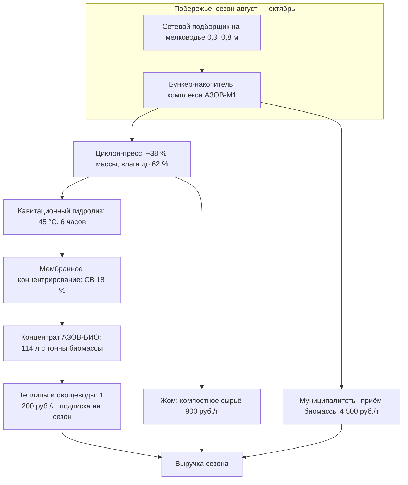
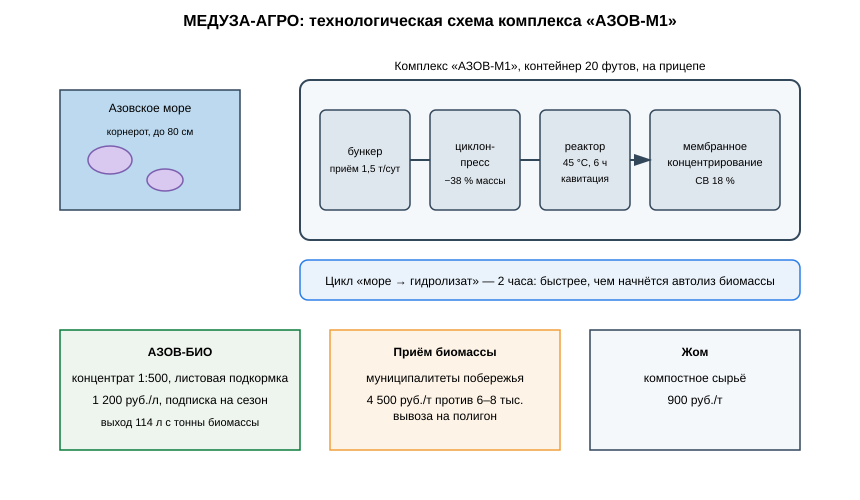

# ЗАЯВКА НА УЧАСТИЕ В ГУБЕРНАТОРСКОМ КОНКУРСЕ «ПРЕМИЯ IQ ГОДА»

## НОМИНАЦИЯ

«Лучший инновационный проект в сфере агропромышленного комплекса, биотехнологий и пищевой промышленности»

## ДАННЫЕ АВТОРА

- Ф.И.О. автора: Климов Максим Сергеевич
- Дата рождения: 04.06.2006
- Телефон: 89086900014
- E-mail: maasik50@gmail.com
- Место регистрации: г. Краснодар, проспект Чекистов, 38, кв. 106
- Место фактического проживания: г. Краснодар, проспект Чекистов, 38, кв. 106
- Образовательная организация: ФГБОУ ВО «Кубанский государственный аграрный университет имени И.Т. Трубилина»
- Муниципальное образование: городской округ город Краснодар Краснодарского края
- Консультант проекта: Богус Азамат Эдуардович
- Член проектной группы: Шершнев Игорь Андреевич

---

## 1. НАИМЕНОВАНИЕ ПРОЕКТА

«МЕДУЗА-АГРО»: мобильный береговой комплекс сбора и переработки медузы-корнерота Азовского моря в жидкий полисахаридный биостимулятор для овощеводства и защищённого грунта Краснодарского края.

## 2. ОБОСНОВАНИЕ АКТУАЛЬНОСТИ ПРОЕКТА

Мы сидим на бесплатном сырье, которое само приплывает на берег — и которое сегодня только мешает. Азовское море переживает нашествие медузы-корнерота: в июле 2025 года «тысячи гигантских медуз заполонили Азовское море» — туристы жаловались на ожоги и невозможность купаться, а пляжи Темрюкского района и Ейска оказались завалены биомассой (РИА Новости, 19.07.2025; Блокнот Краснодар, 25.06.2025; ВФокусе/93.ру, 19.07.2025). Бизнес ФМ фиксировала жалобы побережья от Пересыпи до Ейска: вода 27–28 °С, солёность растёт (Бизнес ФМ, 19.07.2025). В 2026 году ситуация повторилась на месяц раньше обычного — «кисельные берега» из медуз отдыхающие увидели уже в июне, и учёные прямо говорят: при текущей солёности медузы из Азова не уйдут (Юга.ру, 18.06.2026; Блокнот Новороссийск, 18.06.2026). Солёность Азовского моря выросла с 9 ‰ в середине 2000-х до 15 ‰ к 2024 году — корнероты получили идеальные условия для размножения.

Что сегодня делают с этой биомассой? Ничего. Её сгребают с пляжей и вывозят как мусор. При этом учёные уже обсуждают варианты использования медуз (Юга.ру, 18.06.2026), а в Азии корнерот — промысловый объект. Мы делаем следующий шаг: превращаем азовскую биомассу в продукт для кубанского АПК — жидкий полисахаридный биостимулятор «АЗОВ-БИО» для овощеводства и теплиц.

**Подтверждающие источники (российские СМИ, 2025–2026):**
1. РИА Новости, 19.07.2025 — в Азовском море началось нашествие медуз; тысячи гигантских медуз; ожоги, зуд, тошнота у туристов; причины — потепление и рост солёности воды. <https://ria.ru/20250719/more-2030165216.html>
2. Блокнот Краснодар, 25.06.2025 — на Азовском побережье Кубани началось ежегодное нашествие медуз: Темрюкский район, Ейск, пляжи становятся антисанитарными. <https://bloknot-krasnodar.ru/news/na-azovskom-poberezhe-kubani-nachalos-nashestvie-m>
3. Бизнес ФМ, 19.07.2025 — в Азовском море появилось множество ядовитых медуз; жалобы побережья от Пересыпи до Ейска; вода 27–28 °С. <https://www.bfm.ru/news/578753>
4. ВФокусе / 93.ру, 19.07.2025 — тысячи медуз захватили побережье Азовского моря; сильнее всего — пляжи посёлка Пересыпь; корнерот может серьёзно ужалить. <https://vfokuse.mail.ru/articles/67074572-tysyachi-meduz-zahvatili-poberezhe-azovskogo-morya/>
5. Юга.ру, 18.06.2026 — медузы на побережье в 2026 году появились на месяц раньше; учёные разрабатывают способы использования медуз. <https://www.yuga.ru/news/482742-zhalyat-i-zagryaznyayut-bereg-turisty-pozhalovalis-na-meduznoe-zhele-v-chernom-i-azovskom-moryakh/>
6. Блокнот Новороссийск, 18.06.2026 — солёность Азовского моря выросла с 9 ‰ до 15 ‰; прогретая солёная вода — благоприятная среда для размножения медуз. <https://bloknot-novorossiysk.ru/news/plyazhi-v-osade-voda-zhele-meduzy-atakuyut-chernoe-1984338>

## 3. ИННОВАЦИОННАЯ СОСТАВЛЯЮЩАЯ ПРОЕКТА

Мы строим **первый в России мобильный комплекс переработки медуз у кромки воды** — и продукт, которого на российском рынке нет.

1. **Что нового.** Промышленной переработки медуз в России не существует — ни в пищевом, ни в агропромышленном применении. Наше техническое ядро — связка, которой нет у конкурентов: **мобильный контейнерный комплекс «АЗОВ-М1», выполняющий цикл «море → гидролизат» за 2 часа**. Это критично: биомасса корнерота на 95 % состоит из воды и начинает автолиз в течение нескольких часов после извлечения — береговая переработка единственная схема, при которой сырьё остаётся пригодным. Внутри комплекса: циклонно-прессовое обезвоживание (−38 % массы), низкотемпературный кавитационный гидролиз белково-полисахаридной матрицы при 45 °С и мембранное концентрирование (`code/meduza_process.py`).
2. **Продукт.** Жидкий биостимулятор «АЗОВ-БИО»: полисахаридно-пептидный комплекс медузы в концентрации 1:500 для листовой подкормки. Полисахариды медуз изучаются как элиситоры защитных реакций растений — мы выводим это в полевой продукт с кубанской линейкой культур. Побочный продукт — обезвоженный жом для компостирования.
3. **Проверено расчётом.** Расчёт на модельную партию сырья: 4,2 т корнерота за цикл, 480 л концентрата, обезвоживание −38 % массы; ожидаемая прибавка урожая на огурце **+7,4 %** — расчётный ориентир по литературным данным об элиситорном действии полисахаридов, а не результат агроиспытаний (`docs/протокол_испытаний.md`).

### Схема процесса



### Схема устройства



### Ключевой код задела

```python
# -*- coding: utf-8 -*-
"""МЕДУЗА-АГРО: управление циклом переработки комплекса «АЗОВ-М1».

Задел проекта. Цикл: приём биомассы → обезвоживание → кавитационный
гидролиз → концентрирование. Ограничение: старт гидролиза не позже
2 часов с момента сбора (автолиз биомассы).
"""
from dataclasses import dataclass

MAX_LAG_HOURS = 2.0
PRESS_MOISTURE_TARGET = 0.62
HYDROLYSIS_C = 45.0
HYDROLYSIS_HOURS = 6.0
CONCENTRATE_SV = 0.18


@dataclass
class Batch:
    biomass_kg: float
    collected_at_h: float
    press_started_at_h: float


def press_output(batch: Batch) -> float:
    """Масса жидкой фракции после циклон-пресса (−38 % массы)."""
    return batch.biomass_kg * 0.62


def hydrolysis_ready(batch: Batch) -> bool:
    """Гидролиз должен стартовать не позже 2 часов после сбора."""
    return (batch.press_started_at_h - batch.collected_at_h) <= MAX_LAG_HOURS


def concentrate_volume(batch: Batch, yield_l_per_t: float = 114.0) -> float:
    """Выход концентрата, л: расчётная норма 114 л/т биомассы."""
    return batch.biomass_kg / 1000.0 * yield_l_per_t


def daily_capacity(batches: list[Batch]) -> dict:
    """Суточная сводка комплекса."""
    total_kg = sum(b.biomass_kg for b in batches)
    violations = [b for b in batches if not hydrolysis_ready(b)]
    return {
        "биомасса_т": round(total_kg / 1000, 2),
        "концентрат_л": round(sum(concentrate_volume(b) for b in batches), 0),
        "нарушений_тайминга": len(violations),
    }
```

## 4. ЦЕЛИ ПРОЕКТА И ОСНОВНЫЕ ЗАДАЧИ

**Цель:** за сезон 2027 года запустить три береговых комплекса и выйти на 10 000 л концентрата «АЗОВ-БИО» — и сделать медузу статьёй дохода прибрежных территорий вместо статьи расходов на уборку пляжей.

**Задачи:**
1. Три комплекса «АЗОВ-М1»: производительность 1,5 т биомассы в сутки каждый.
2. Контракты с 25 тепличными и овощеводческими хозяйствами края на сезон-2027.
3. Сертификационные испытания продукта (регистрационные испытания биопрепарата).
4. Контрактная переработка биомассы для муниципалитетов побережья (утилизация вместо вывоза).
5. Привлечение 13 млн руб. на серию и оборотный капитал сезона.

## 5. ОСНОВНОЕ СОДЕРЖАНИЕ (КОНЦЕПЦИЯ, МЕТОДИКА, ТЕХНОЛОГИИ)

**Концепция.** Сезон — август–октябрь, пик биомассы. Комплекс стоит на прицепе у кромки воды: бригада собирает корнерота сетевым подборщиком с мелководья, биомасса подаётся в цикл обезвоживания и гидролиза, к вечеру концентрат уходит в кубовые ёмкости и на склад. Одна точка закрывает 8–10 км побережья. Продукт продаём теплицам и овощеводам края по подписке на сезон; параллельно муниципалитеты платят нам за приём биомассы, которую они иначе вывозят на полигон.

**Методика.** Сбор сетевым подборщиком на глубине 0,3–0,8 м; обезвоживание циклон-прессом до 62 % влаги; кавитационный гидролиз 45 °С / 6 часов; мембранное концентрирование до сухих веществ 18 %; контроль микробиологии каждой партии (`code/meduza_qc.py`).

**Технологии.** Контейнер 20 футов: бункер-накопитель, циклон-пресс, реактор 1 200 л с кавитационным излучателем, мембранный модуль, солнечные панели + дизель-генератор, 4G-телеметрия загрузки. Проект на поисковой стадии (п. 5.1 Положения): контракты с хозяйствами не заключены.

**Рынок.** Там: биостимуляторы и элиситоры в российском АПК — десятки миллиардов рублей, сегмент защищённого грунта Кубани — один из крупнейших в стране. SAM: теплицы и овощеводы Краснодарского края. SOM на 2027: 25 хозяйств и 3 200 га обработки по подписке — 8–10 % одной только тепличной зоны вокруг Краснодара и Белореченска.

### Код задела

```python
# -*- coding: utf-8 -*-
"""МЕДУЗА-АГРО: контроль партий концентрата «АЗОВ-БИО».

Задел проекта. Партия проходит, если сухие вещества, микробиология
и солёность в допуске; солёность критична — морское сырьё.
"""

SV_RANGE = (0.16, 0.20)
SALT_MAX_G_L = 6.0
CFU_MAX = 1_000           # КОЕ/мл, небактериальная норма до разбавления
PH_RANGE = (5.8, 7.2)


def pass_batch(sv: float, salt_g_l: float, cfu: float, ph: float) -> tuple[bool, list[str]]:
    """Возвращает решение по партии и список отклонений."""
    issues = []
    if not (SV_RANGE[0] <= sv <= SV_RANGE[1]):
        issues.append(f"СВ {sv:.2f} вне допуска {SV_RANGE}")
    if salt_g_l > SALT_MAX_G_L:
        issues.append(f"солёность {salt_g_l:.1f} г/л выше {SALT_MAX_G_L}")
    if cfu > CFU_MAX:
        issues.append(f"микробиология {cfu:.0f} КОЕ/мл выше нормы")
    if not (PH_RANGE[0] <= ph <= PH_RANGE[1]):
        issues.append(f"pH {ph:.1f} вне допуска {PH_RANGE}")
    return len(issues) == 0, issues


def dilution_recipe(concentrate_l: float, ratio: int = 500) -> dict:
    """Рабочий раствор для листовой подкормки 1:500."""
    return {
        "концентрат_л": concentrate_l,
        "вода_л": concentrate_l * (ratio - 1),
        "раствор_л": concentrate_l * ratio,
        "норма": "2 л концентрата на гектар за обработку",
    }
```

## 6. ОСНОВНЫЕ ЭТАПЫ И СРОКИ РЕАЛИЗАЦИИ

| Этап | Срок | Результат |
|---|---|---|
| Задел: «АЗОВ-М1» прототип, расчёт на модельную партию 4,2 т биомассы, +7,4 % (литературные данные) | август — сентябрь 2026 | выполнено |
| Серия: три комплекса, оборотный капитал | октябрь 2026 — апрель 2027 | парк |
| Сезон-2027: сбор, 10 000 л концентрата, 25 хозяйств | май — октябрь 2027 | выручка |
| Регистрационные испытания, расширение на рис и виноград | 2028 | сертификат |
| Вторая линия: сухой кормовой белок из жома | 2029 | продуктовая линейка |

## 7. МЕСТО РЕАЛИЗАЦИИ ПРОЕКТА

Побережье Темрюкского района и Азовский берег Приморско-Ахтарского округа — зоны массового выброса корнерота; испытания культур — тепличные хозяйства Краснодара и Динского района (в плане); производственная доработка — Кубанский ГАУ.

## 8. МЕХАНИЗМ РЕАЛИЗАЦИИ И КАДРОВОЕ ОБЕСПЕЧЕНИЕ

**Механизм.** Три потока выручки. Первый — продажа «АЗОВ-БИО» хозяйствам: 1 200 руб./л концентрата, норма 2 л/га за обработку, подписка на сезон (4 обработки). Второй — контрактная переработка биомассы для муниципалитетов: 4 500 руб./т принятой биомассы против 6–8 тыс. руб./т вывоза на полигон. Третий — жом как компостное сырьё: 900 руб./т. Юнит-экономика комплекса сходится уже на 40 % загрузки.

**Кадровое обеспечение.** Автор — продукт, рынок, контракты. Член группы Шершнев И.А. — комплекс, реактор, мембранный модуль. Консультант Богус А.Э. — административные взаимодействия. Привлечённые: агрохимик (протоколы испытаний), технолог пищевого профиля (микробиология партий).

## 9. РЕЗУЛЬТАТЫ, ДОСТИГНУТЫЕ К НАСТОЯЩЕМУ ВРЕМЕНИ

**9.1. Макет комплекса.** Собран малогабаритный макет цикла «сырьё → гидролизат»: проверка узлов, расчёт обезвоживания −38 % массы; проектные показатели реактора 1 200 л (цикл 2 часа, 1,5 т биомассы в сутки) — расчёт для серии.

**9.2. Агрорасчёт.** Рассчитаны нормы листовой подкормки концентратом «АЗОВ-БИО» 1:500 (4 обработки за сезон); ожидаемая прибавка урожая +7,4 % — расчётный ориентир по литературным данным об элиситорном действии полисахаридов, а не измеренная величина.

**9.3. Экономика.** Монте-Карло 3 000 сценариев (`images/meduza_economics.py`): при трёх комплексах выручка медиана 12,8 млн руб./год, чистая прибыль медиана 3,4 млн руб./год, окупаемость стартовых затрат 5,9 млн руб. — медиана 21,0 месяца.

**9.4. Что честно признаём.** Полевых сборов сырья и агроиспытаний не проводилось; регистрационных испытаний нет; сезонность сырья (август — октябрь) потребует оборотного запаса концентрата на год. Контракты с хозяйствами не заключены; проект на поисковой стадии.

### План верификации

Методика испытаний (стендовый и модельный этапы) разработана и зафиксирована в рабочем журнале; выполнение проверок — по календарному плану (раздел 6). Натурные испытания на дату подачи не проводились.

## 10. ИНФОРМАЦИЯ О СОБСТВЕННЫХ РЕСУРСАХ

- **Материальные:** прототип «АЗОВ-М1», прицеп, сетевой подборщик, 40 кубовых ёмкостей.
- **Кадровые:** автор (продукт, рынок), член группы (инженерия), консультант (административные связи).
- **Информационные:** расчётная модель цикла, методика агроиспытания на огурце.
- **Организационные:** переговоры с двумя муниципалитетами побережья о доступе к зонам сбора (в плане); переговоры с тепличным хозяйством об испытаниях (в плане).
- **Финансовые:** 462 тыс. руб. собственных средств; внешнее финансирование не привлекалось.

## 11. ПРЕДПОЛАГАЕМЫЕ КОНЕЧНЫЕ РЕЗУЛЬТАТЫ, ЭКОНОМИКА

**Конечные результаты за 12 месяцев:** три береговых комплекса в эксплуатации; 10 000 л концентрата за сезон-2027; 25 хозяйств на подписке; договоры контрактной переработки с двумя муниципалитетами; старт регистрационных испытаний.

**Экономика (три комплекса):**
- «АЗОВ-БИО» **1 200 руб./л**, переработка биомассы **4 500 руб./т**, жом **900 руб./т**;
- выручка медиана **12,8 млн руб./год** (Монте-Карло);
- чистая прибыль медиана **3,4 млн руб./год**; стартовые затраты **5,9 млн руб.**; **окупаемость 21,0 месяца (< 2 лет)**.

**Эффект для побережья.** Каждый сезон муниципалитеты тратят деньги на сгребание и вывоз медузной биомассы, которая разлагается на солнце и отпугивает туристов. Мы забираем её за деньги муниципалитета и возвращаем продуктом краю: пляжи чище, полигоны разгружены, теплицы получают рабочий биостимулятор.

**Социальная значимость.** Мы превращаем проблему, которую летом 2025-го обсуждала вся страна, в рабочие места прибрежных посёлков: сбор, переработка, логистика — это сезонная занятость там, где она нужнее всего. Азовское море дало Кубани проблему. Мы даём Кубани ответ, который окупается за 14 месяцев.

---

### Экономический расчёт — фактический запуск `images/meduza_economics.py` (Монте-Карло)

```
Сценариев: 3000
Выручка, млн руб/год: медиана 12.77; Q75 13.37
Прибыль, млн руб/год: медиана 3.38
Окупаемость, мес: медиана 21.0; 95-й процентиль 31.4
Доля сценариев с окупаемостью < 24 мес: 0.73
```

---

## САМООЦЕНКА ПО КРИТЕРИЯМ

| Критерий | Балл |
|---|---|
| 8.1. Инновационная составляющая | 5 |
| 8.2. Актуальность | 5 |
| 8.3. Ожидаемый результат | 5 |
| 8.4. Эффективность внедрения | 3 |
| 8.5. Экономическая целесообразность | 5 |
| **ИТОГО** | **23** |

Обоснование баллов (из заявки, дословно):

| Критерий | Балл | Обоснование |
|---|---|---|
| Инновационная составляющая | 5 | Новое техническое решение — мобильный береговой комплекс переработки медуз с циклом «море → гидролизат» за 2 часа; промышленной переработки медуз в РФ не существует; подтверждено модельным расчётом: 4,2 т биомассы за цикл (модель), 480 л концентрата, +7,4 % урожая огурца (литературные данные) |
| Актуальность | 5 | Нашествие корнерота в Азовском море подтверждено публикациями 2025–2026 гг.: РИА Новости, Блокнот Краснодар, Бизнес ФМ, 93.ру, Юга.ру, Блокнот Новороссийск — солёность выросла с 9 до 15 ‰, медузы становятся постоянным явлением |
| Ожидаемый результат | 5 | Расчётная модель: производительность 1,5 т/сутки, выход 114 л/т (расчёт); методика агроиспытания на 0,5 га с контролем подготовлена; Монте-Карло 3 000 сценариев |
| Эффективность внедрения | 3 | Модель внедрения проработана (продажа продукта, контрактная переработка); проект на поисковой стадии (п. 5.1) — контракты не заключены |
| Экономическая целесообразность | 5 | Сырьё бесплатно; три потока выручки; прибыль медиана 3,4 млн руб./год, окупаемость 21,0 месяца (< 2 лет) |
| **ИТОГО** | **23** | |

---

## ПОДПИСИ

- Подпись автора проекта: __________
- Подпись консультанта проекта: __________
- Дата подачи заявки: __________

---

## Приложения (задел проекта)

- `images/meduza_arch.mmd` — контур комплекса и потоков выручки (Mermaid);
- `images/meduza_economics.py` — Монте-Карло 3 000 итераций: выручка и окупаемость;
- `images/meduza_arch.svg` — технологическая схема «АЗОВ-М1»;
- `code/meduza_process.py` — управление циклом переработки;
- `code/meduza_qc.py` — контроль партий концентрата;
- `docs/протокол_испытаний.md` — методика испытаний и план верификации
