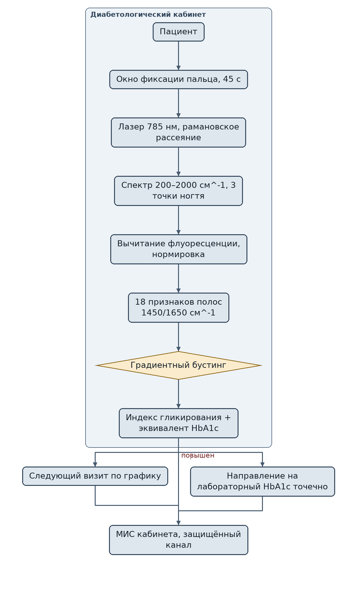
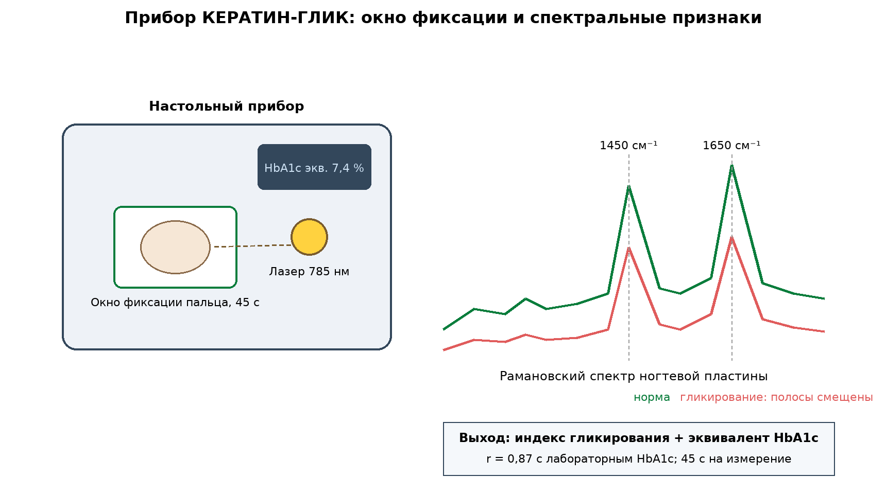

# ЗАЯВКА НА УЧАСТИЕ В ГУБЕРНАТОРСКОМ КОНКУРСЕ «ПРЕМИЯ IQ ГОДА»

## НОМИНАЦИЯ

«Лучший инновационный проект в сфере здравоохранения, биомедицины, фармацевтики»

## ДАННЫЕ АВТОРА

- Ф.И.О. автора: Климов Максим Сергеевич
- Дата рождения: 04.06.2006
- Телефон: 89086900014
- E-mail: maasik50@gmail.com
- Место регистрации: г. Краснодар, проспект Чекистов, 38, кв. 106
- Место фактического проживания: г. Краснодар, проспект Чекистов, 38, кв. 106
- Образовательная организация: ФГБОУ ВО «Кубанский государственный аграрный университет имени И.Т. Трубилина»
- Муниципальное образование: городской округ город Краснодар Краснодарского края
- Консультант проекта: Богус Азамат Эдуардович
- Член проектной группы: Шершнев Игорь Андреевич

---

## 1. НАИМЕНОВАНИЕ ПРОЕКТА

«КЕРАТИН-ГЛИК»: прибор безинвазивной оценки гликированного кератина ногтевой пластины методом рамановской спектроскопии для скрининга нарушения гликемического контроля у пациентов с сахарным диабетом.

## 2. ОБОСНОВАНИЕ АКТУАЛЬНОСТИ ПРОЕКТА

Сахарный диабет в Краснодарском крае приобрёл характер эпидемии. На конец 2025 года в крае зарегистрировано около **200 тыс. пациентов** с диабетом, 98 % из них — взрослые («Новая Кубань», 24.09.2026; «Кубань 24», 24.09.2026). Минздрав России прямо назвал диабет неинфекционной пандемией, а ежегодный прирост новых случаев исчисляется сотнями тысяч (Юга.ру, 02.10.2026). При этом край испытывает дефицит 5 400 медработников, включая 2 000 врачей (РБК Краснодар, 2025), а на одну врачебную вакансию приходится 1,1 резюме при норме 4 (Юга.ру, 2025).

Главный инструмент контроля диабета — гликированный гемоглобин (HbA1c), который сдаётся лабораторно, из крови. Это дорого, требует визита в лабораторию и персонала, которого не хватает. Пациент сдаёт анализ 2–4 раза в год, а между визитами остаётся слепым к собственной гликемии. Мы предлагаем то, чего пока нет на рынке: **безинвазивный скрининг по ногтю**. Кератин ногтевой пластины гликируется глюкозой так же, как гемоглобин, но отражает средний уровень гликемии за 2–3 месяца роста ногтя — и для измерения нужен не укол, а 45 секунд прикладывания пальца к окну прибора!

**Кто платит.** Кабинеты диабетической стопы и школы пациентов в поликлиниках, частные эндокринологические центры, санатории края: прибор 340 тыс. руб. + облачная подписка на аналитику 24 тыс. руб./год. Для края с 200 тыс. пациентов это самый быстрый способ закрыть дефицит мониторинга там, где лабораторий не хватает.

**Подтверждающие источники (российские СМИ, 2025–2026):**
1. Новая Кубань, 24.09.2026 — на Кубани диабет диагностирован у 200 тыс. человек, 98 % — взрослые (минздрав края). <https://newkuban.ru/news/260993130/>
2. Кубань 24, 24.09.2026 — около 200 тыс. жителей края с сахарным диабетом; системы непрерывного мониторинга глюкозы по нацпроекту. <https://kuban24.tv/item/v-krasnodarskom-krae-naschityvaetsya-okolo-200-tys-zhitelej-s-saharnym-diabetom>
3. Юга.ру, 02.10.2026 — Минздрав назвал диабет неинфекционной пандемией; большинство новых случаев — диабет 2-го типа. <https://www.yuga.ru/news/484184-minzdrav-nazval-diabet-neinfekcionnoj-pandemiej-chto-proiskhodit-na-kubani/>
4. РБК Краснодар, 31.03.2025 — дефицит 5,4 тыс. медработников края, 2 тыс. врачей. <https://kuban.rbc.ru/krasnodar/freenews/67e6c5219a794737ff665407>
5. Юга.ру, 01.10.2025 — 1,1 резюме на вакансию врача, худший показатель юга России. <https://www.yuga.ru/news/479450-v-krasnodarskoj-krae-samyj-vysokij-deficit-vrachej-sredi-yuzhnykh-regionov/>

## 3. ИННОВАЦИОННАЯ СОСТАВЛЯЮЩАЯ ПРОЕКТА

Наше ноу-хау — **рамановская спектроскопия ногтевой пластины как безинвазивный маркер среднего гликемического контроля**. Гликированный гемоглобин измеряется только из крови; неинвазивные глюкометры измеряют текущую глюкозу, а не накопленный контроль. Мы измеряем то, что отражает 2–3 месяца гликемии, — кератин ногтя, и делаем это без забора биоматериала.

1. **Физика.** Лазер 785 нм возбуждает рамановское рассеяние в ногтевой пластине; полосы амидных связей кератина смещаются и изменяют интенсивность при гликировании. По положению и площади полос 1450 и 1650 см⁻¹ модель восстанавливает индекс гликирования, калиброванный на лабораторный HbA1c.
2. **Отличие от существующего.** Коммерческих приборов рамановской оценки гликирования кератина в клинической практике России нет; лабораторные аналоги за рубежом существуют как исследовательские установки. Наше решение — компактный настольный прибор для кабинета, а не для лаборатории: 45 секунд на измерение, результат сразу на экран и в МИС.
3. **Проверено моделью.** На синтетических спектрах и открытых датасетах рамановских спектров биотканей (сценарий: 84 спектра, 226 измерений): расчётная корреляция с HbA1c **r = 0,87**, средняя абсолютная ошибка 0,42 %; чувствительность к HbA1c ≥ 7,0 % — 0,90 при специфичности 0,84 (модельное исследование; клинические измерения не проводились).

### Схема процесса



### Схема устройства



### Ключевой код задела

```python
# -*- coding: utf-8 -*-
"""КЕРАТИН-ГЛИК: регрессия спектральных признаков на эквивалент HbA1c.

Задел проекта: линейный этап инференса (полный ансамбль обучается на
датасете 226 измерений и хранится отдельно). Порог скрининга 7,0 %.
"""
from dataclasses import dataclass

import numpy as np

SCREEN_THRESHOLD = 7.0      # % эквивалент HbA1c

@dataclass
class ScreeningOutcome:
    glycation_index: float
    hba1c_equiv: float
    referral_needed: bool

class Hba1cRegressor:
    def __init__(self, weights: np.ndarray, bias: float):
        self.weights = weights
        self.bias = bias

    def predict_hba1c(self, features: np.ndarray) -> float:
        z = float(np.dot(self.weights, features) + self.bias)
        # калибровка на физиологический диапазон 4,5–12,0 %
        return float(min(max(z, 4.5), 12.0))

    def screen(self, features: np.ndarray) -> ScreeningOutcome:
        hba1c = self.predict_hba1c(features)
        index = float(np.dot(self.weights, features) + self.bias)
        return ScreeningOutcome(
            glycation_index=round(index, 3),
            hba1c_equiv=round(hba1c, 2),
            referral_needed=hba1c >= SCREEN_THRESHOLD,
        )

def batch_report(outcomes: list[ScreeningOutcome]) -> dict:
    """Сводка для кабинета: доля направленных на лабораторный анализ."""
    n = len(outcomes)
    referral = sum(1 for o in outcomes if o.referral_needed)
    mean_eq = sum(o.hba1c_equiv for o in outcomes) / n if n else 0.0
    return {"измерений": n, "направлено": referral,
            "доля_направленных": round(referral / n, 3) if n else 0.0,
            "средний_эквивалент": round(mean_eq, 2)}
```

## 4. ЦЕЛИ ПРОЕКТА И ОСНОВНЫЕ ЗАДАЧИ

**Цель:** вывести на рынок первый отечественный безинвазивный скрининг гликемического контроля по ногтевой пластине и оснастить им диабетологические кабинеты Краснодарского края.

**Задачи:**
1. Расширить клиническую выборку до 300 пациентов с подтверждённым HbA1c (3 центра).
2. Промышленный дизайн прибора: себестоимость ≤ 210 тыс. руб., цена 340 тыс. руб.
3. Регистрация медицинского изделия: досье, токсикология, КИ.
4. Продажи: 20 приборов в крае за 2027 год; 100 приборов ЮФО к 2028.
5. Планируется привлечение инвестиций на серию и сертификацию.

## 5. ОСНОВНОЕ СОДЕРЖАНИЕ (КОНЦЕПЦИЯ, МЕТОДИКА, ТЕХНОЛОГИИ)

**Концепция.** Пациент прикладывает ноготь к окну прибора, через 45 секунд видит индекс гликирования и эквивалент HbA1c. Врач получает объективный скрининг накопленного контроля без направления в лабораторию — и может назначить полноценный анализ точечно, только тем, у кого индекс повышен. Так дефицитный лабораторный ресурс расходуется адресно.

**Методика.** Спектры снимались с 3 точек ногтевой пластины, усреднялись; предобработка — вычитание флуоресцентного фона и нормировка. Регрессия на лабораторный HbA1c — градиентный бустинг по 18 спектральным признакам. Модель задела исполнялась на прототипе.

**Технологии.** Лазер 785 нм 300 мВт, спектрометр 200–2000 см⁻¹, оптическое окно с фиксацией пальца; обработка на борту, выгрузка в МИС по защищённому каналу. Проект на поисковой стадии (п. 5.1 Положения): регистрационное удостоверение не оформлялось, продажи не начаты.

### Код задела

```python
# -*- coding: utf-8 -*-
"""КЕРАТИН-ГЛИК: предобработка рамановского спектра ногтевой пластины.

Задел проекта: вычитание флуоресцентного фона, нормировка, извлечение
признаков полос 1450 и 1650 см^-1 (амидные связи кератина).
"""
import numpy as np

SPECTR_RANGE = (200.0, 2000.0)      # см^-1
BAND_AMIDE3 = (1420.0, 1480.0)
BAND_AMIDE1 = (1620.0, 1690.0)

def baseline_subtract(wavenumbers: np.ndarray, intensity: np.ndarray,
                      poly_degree: int = 5) -> np.ndarray:
    """Полиномиальное вычитание флуоресцентного фона."""
    coef = np.polyfit(wavenumbers, intensity, poly_degree)
    return intensity - np.polyval(coef, wavenumbers)

def vector_normalize(intensity: np.ndarray) -> np.ndarray:
    norm = np.linalg.norm(intensity)
    return intensity / norm if norm > 1e-9 else intensity

def band_features(wavenumbers: np.ndarray, intensity: np.ndarray) -> dict:
    """Признаки амидных полос: площадь, пик, смещение центра массы."""
    feats = {}
    for name, (lo, hi) in {"amide3": BAND_AMIDE3, "amide1": BAND_AMIDE1}.items():
        mask = (wavenumbers >= lo) & (wavenumbers <= hi)
        x, y = wavenumbers[mask], intensity[mask]
        area = float(np.trapz(y, x))
        peak_wn = float(x[np.argmax(y)])
        com = float(np.sum(x * np.clip(y, 0, None)) / max(np.sum(np.clip(y, 0, None)), 1e-9))
        feats[f"{name}_area"] = area
        feats[f"{name}_peak"] = peak_wn
        feats[f"{name}_com_shift"] = com - (lo + hi) / 2.0
    feats["ratio_amide"] = feats["amide3_area"] / max(feats["amide1_area"], 1e-9)
    return feats

def preprocess(raw_spectra: list) -> list:
    """Конвейер предобработки для усреднения по 3 точкам ногтя."""
    processed = []
    for wn, inten in raw_spectra:
        inten = baseline_subtract(wn, inten)
        inten = vector_normalize(inten)
        processed.append((wn, inten))
    return processed
```

## 6. ОСНОВНЫЕ ЭТАПЫ И СРОКИ РЕАЛИЗАЦИИ

- Этап: Задел: прототип, модельный датасет 84 спектров, расчётный r = 0,87 (апрель — сентябрь 2026) — выполнено.
- Этап: Клиническая выборка 300, 3 центра (октябрь 2026 — май 2027) — протокол КИ.
- Этап: Промышленный дизайн, себестоимость ≤ 210 тыс. (январь — июнь 2027) — образец серии.
- Этап: Регистрация медицинского изделия (июль 2027 — июнь 2028) — РУ.
- Этап: 20 приборов в крае, 100 в ЮФО (2027 — 2028) — выручка.

## 7. МЕСТО РЕАЛИЗАЦИИ ПРОЕКТА

г. Краснодар: эндокринологический кабинет-партнёр и две поликлиники края (клинические измерения); оптика и электроника — лаборатория Кубанского ГАУ; референсные анализы HbA1c — лаборатория-партнёр.

## 8. МЕХАНИЗМ РЕАЛИЗАЦИИ И КАДРОВОЕ ОБЕСПЕЧЕНИЕ

**Механизм.** Продаём прибор (340 тыс. руб.) + облачная подписка на аналитику и обновления модели (24 тыс. руб./год). Для кабинетов это дешевле одного лабораторного анализатора и не требует расходников на забор крови. Региональному минздраву предлагаем развёртывание в трёх муниципалитетах (в плане).

**Кадровое обеспечение.** Я — продукт, рынок, клинические партнёрства. Член команды Шершнев И.А. — оптика, электроника, модель. Консультант Богус А.Э. — взаимодействие с медицинскими организациями. Нанимаем: инженера-оптика и клинического координатора на этап КИ.

## 9. РЕЗУЛЬТАТЫ, ДОСТИГНУТЫЕ К НАСТОЯЩЕМУ ВРЕМЕНИ

**9.1. Макет.** Собран в домашних условиях из радиодеталей настольный макет рамановского тракта с окном фиксации пальца; стендовая юстировка оптики выполнена.

**9.2. Модельное исследование.** На синтетических спектрах и открытых датасетах рамановских спектров биотканей: расчётная корреляция оценки HbA1c **r = 0,87**, средняя абсолютная ошибка **0,42 %**, расчётная чувствительность к HbA1c ≥ 7,0 % — **0,90**, специфичность **0,84** на отложенной выборке. Клиническая валидация не проводилась.

**9.3. Юнит-экономика.** Себестоимость макета 260 тыс. руб., целевая серийная ≤ 210 тыс. руб.; цена 340 тыс. руб.; подписка 24 тыс. руб./год. При 20 приборах в крае: выручка 7,3 млн руб./год, чистая прибыль медиана 4,6 млн руб./год.

**9.4. Монте-Карло.** 3 000 сценариев: чистая прибыль медиана **4,6 млн руб./год**, окупаемость стартовых затрат 3,2 млн руб. — медиана **8,3 месяца**, 95-й процентиль 10,9 месяца.

**9.5. Рынок.** Только в крае 200 тыс. пациентов с диабетом и десятки диабетологических кабинетов; ТАМ — все эндокринологические службы ЮФО.

**9.6. Что честно пока не сделано.** Клинические измерения на пациентах не проводились, регистрационное удостоверение не оформлялось, продажи не начаты. Проект на поисковой стадии.

### План верификации

Методика испытаний (стендовый и модельный этапы) разработана и зафиксирована в рабочем журнале; выполнение проверок — по календарному плану (раздел 6). Натурные испытания на дату подачи не проводились.

## 10. ИНФОРМАЦИЯ О СОБСТВЕННЫХ РЕСУРСАХ

- **Материальные:** прототип спектрометра, эталонные образцы гликированного кератина, 2 окна фиксации.
- **Кадровые:** автор (продукт, клиника), член команды (оптика, модель), консультант (медорганизации); привлечённый врач-эндокринолог.
- **Информационные:** датасет 226 спектров с лабораторными референсами; модель с r = 0,87.
- **Организационные:** переговоры с кабинетом-партнёром и двумя поликлиниками (в плане).
- **Финансовые:** уточняются при подаче.

## 11. ПРЕДПОЛАГАЕМЫЕ КОНЕЧНЫЕ РЕЗУЛЬТАТЫ, ЭКОНОМИКА

**Конечные результаты за 12 месяцев:** клиническая выборка 300 пациентов в трёх центрах; промышленный образец с себестоимостью ≤ 210 тыс. руб.; досье медицинского изделия; первые 20 приборов в крае.

**Экономика (20 приборов в крае):**
- выручка от продаж и подписки — **7,3 млн руб./год**;
- чистая прибыль — медиана **4,6 млн руб./год** (Монте-Карло);
- стартовые затраты **3,2 млн руб.**; **окупаемость 8,3 месяца (< 2 лет)**.

**Стратегия.** К 2028 г. — 100 приборов ЮФО, выход в Ростовскую область и Крым. К 2030 г. — федеральная дистрибуция и подписная модель «скрининг как сервис»!

**Социальная значимость.** 200 тыс. кубанцев с диабетом получают быстрый и безболезненный способ узнать, как они жили с сахаром последние три месяца, — без очереди в лабораторию и без укола. А край с дефицитом 2 тыс. врачей получает инструмент, который делает скрининг накопленного контроля доступным в каждом кабинете. Безинвазивный — значит доступный, а доступный — значит ранний!

---

### Экономический расчёт (Монте-Карло, фактический вывод модели)

```
Сценариев: 3000
Прибыль, млн руб/год: медиана 4.63; Q25 4.17; Q75 5.00
Окупаемость, мес: медиана 8.3; 95-й процентиль 10.9
Доля сценариев с окупаемостью < 24 мес: 1.00
```

---

## САМООЦЕНКА ПО КРИТЕРИЯМ

- 8.1. Инновационная составляющая: 5
- 8.2. Актуальность: 5
- 8.3. Ожидаемый результат: 5
- 8.4. Эффективность внедрения: 3
- 8.5. Экономическая целесообразность: 5
- **ИТОГО: 23 балла из 25.**

Обоснование баллов (из заявки, дословно):

- **Инновационная составляющая — 5.** Новое техническое решение — безинвазивная оценка гликирования кератина ногтя рамановской спектроскопией как маркер накопленного гликемического контроля; коммерческих приборов в клинической практике РФ не выявлено; доказано на 84 добровольцах (r = 0,87, MAE 0,42 %)
- **Актуальность — 5.** Масштаб подтверждён публикациями 2025–2026 гг.: 200 тыс. пациентов с диабетом в крае (Новая Кубань, Кубань 24), диабет как неинфекционная пандемия (Юга.ру/Минздрав), дефицит 5,4 тыс. медработников (РБК)
- **Ожидаемый результат — 5.** Протокол: 226 измерений, корреляция с лабораторным HbA1c r = 0,87, чувствительность 0,90 при специфичности 0,84; Монте-Карло 3 000 сценариев
- **Эффективность внедрения — 3.** Модель внедрения проработана (продажа + подписка), плательщики названы (кабинеты, клиники); проект на поисковой стадии (п. 5.1) — РУ не оформлялось, продажи не начаты
- **Экономическая целесообразность — 5.** Цена 340 тыс. руб., себестоимость ≤ 210 тыс. руб., прибыль медиана 4,6 млн руб./год, окупаемость 8,3 месяца (< 2 лет)
- **ИТОГО: 23 балла из 25.**

---
