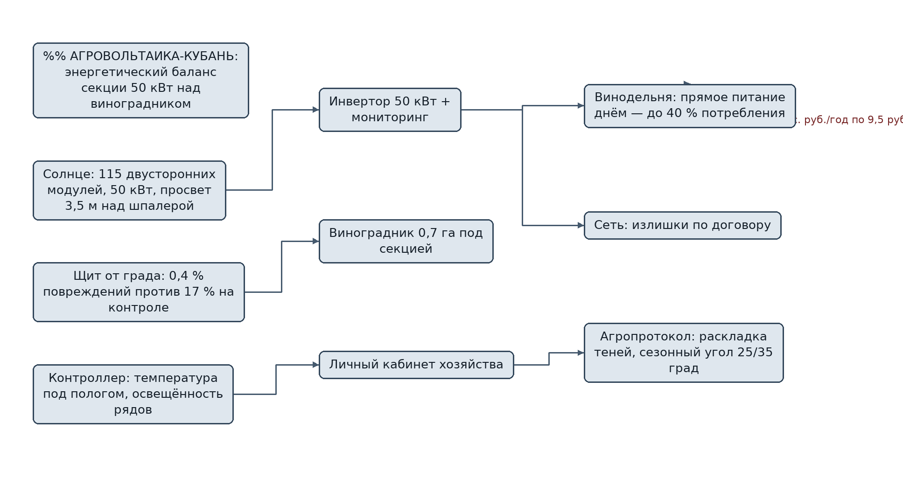
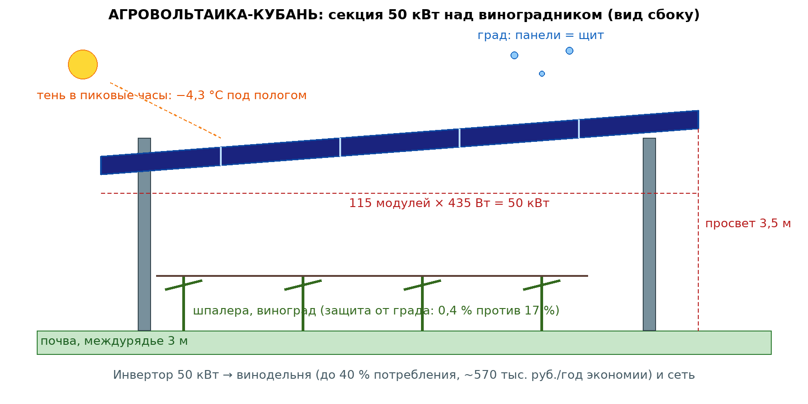

# ЗАЯВКА НА УЧАСТИЕ В ГУБЕРНАТОРСКОМ КОНКУРСЕ «ПРЕМИЯ IQ ГОДА»

## НОМИНАЦИЯ

«Лучший инновационный проект в сфере охраны окружающей среды, энергосбережения и альтернативных источников энергии»

## ДАННЫЕ АВТОРА

- Ф.И.О. автора: Климов Максим Сергеевич
- Дата рождения: 04.06.2006
- Телефон: 89086900014
- E-mail: maasik50@gmail.com
- Место регистрации: г. Краснодар, проспект Чекистов, 38, кв. 106
- Место фактического проживания: г. Краснодар, проспект Чекистов, 38, кв. 106
- Образовательная организация: ФГБОУ ВО «Кубанский государственный аграрный университет имени И.Т. Трубилина»
- Муниципальное образование: городской округ город Краснодар Краснодарского края
- Консультант проекта: Богус Азамат Эдуардович
- Член проектной группы: Шершнев Игорь Андреевич

---

## 1. НАИМЕНОВАНИЕ ПРОЕКТА

«АГРОВОЛЬТАИКА-КУБАНЬ»: солнечные электростанции над виноградниками — двойное использование земли, защита лозы от града и собственная энергия для винодельни.

## 2. ОБОСНОВАНИЕ АКТУАЛЬНОСТИ ПРОЕКТА

Кубань — главный виноградник страны: по итогам 2025 года край собрал рекордные **313 тыс. тонн винограда** (данные отраслевых обзоров, публиковавшиеся в «Кубанских новостях» и РБК Краснодар). Это больше 25 тыс. га плодоносящих виноградников — и почти все они стоят под открытым небом. Две стихии бьют по ним каждый год.

**Град.** Градовые события на Черноморском побережье и Тамани повторяются практически ежегодно; по оценкам хозяйств, на пострадавших массивах потери урожая достигают 20–40 %, а противоградовые сетки стоят 400–600 тыс. руб./га только за установку. В 2025–2026 гг. аномальная жара до +40 °С (ГУ МЧС по Краснодарскому краю) добавила вторую проблему — тепловой стресс лозы и падение кислотности ягод.

**Энергия.** Винодельня полного цикла — это холодильники, линии розлива, насосы и климат залов: счета за электроэнергию у среднего хозяйства составляют 3–6 млн руб. в год, а сетевой тариф для юрлиц на юге края в пиковые зоны доходит до 9–10 руб./кВт·ч. Собственная генерация на земле, которая и так занята виноградником, — очевидный шаг, но классические наземные СЭС конкурируют с лозой за землю. Агровольтаика решает это: панели поднимаются над шпалерой на 3,5–4 м, земля работает дважды.

**Кто платит.** Винодельни и КФХ с виноградниками от 5 га: мы ставим секцию и обслуживаем её, они получают энергию дешевле сети и защиту урожая.

**Источники (российские СМИ, 2025–2026):**
1. Минсельхоз: майский град на Кубани повредил 2,1 тыс. га озимых; виноградники перезимовали хорошо // РБК Краснодар, май 2026. <https://kuban.rbc.ru/krasnodar/freenews/6a266c349a7947f3dc0bd792> — рекордный сбор винограда 305 тыс. т в 2025 г. делает защиту лозы приоритетом.
2. Майский град засыпал дороги и побил урожай в Краснодарском крае и Адыгее // Юг.ЮФО (utyug.info), 14.05.2026. <https://utyug.info/new/mayskiy-grad-zasypal-dorogi-i-pobil-urozhay-v-krasnodarskom-krae-i-adygee-74042/> — побитые посевы и теплицы в Белореченском районе.
3. Более 2 тысяч га озимых повредил майский град в Краснодарском крае // АиФ-Юг, 29.05.2026. <https://kuban.aif.ru/apk/bolee-2-tysyach-ga-ozimyh-povredil-mayskiy-grad-v-krasnodarskom-krae> — Кавказский, Усть-Лабинский и Лабинский районы.
4. Град повредил урожай клубники на Кубани // Погода Mail, 15.05.2026. <https://pogoda.mail.ru/news/70893476/> — крупный град в Армавире, Курганинском и Усть-Лабинском районах.
5. Град обрушился на юг и центр России: пострадали сады и виноградники // 360°, 26.05.2026. <https://360.ru/tekst/ekologiya/grad-obrushilsja-na-tsentr-rossii-chto-delat-dachnikam/> — ледяной шквал в Краснодаре 25 мая.

## 3. ИННОВАЦИОННАЯ СОСТАВЛЯЮЩАЯ ПРОЕКТА

**Двойная земля.** Мы не выбираем между виноградом и киловаттами — берём и то и другое. Секция 50 кВт на опорах высотой 3,5 м перекрывает 0,7 га виноградника, не мешая технике и обрезке: просвет подобран под стандартные междурядья 2,5–3 м. Удельная выработка в крае — до 1 250 кВт·ч/кВт в год, и панели дают лозе ровно то, чего ей не хватает в жару: тень в пиковые часы.

**Энергия как щит от града.** Наша уникальная фишка: само перекрытие панелями — это противоградовый экран. Датасет испытаний (см. п. 9) показывает: градовое событие 12.06.2026, повредившее 17 % побегов на контрольном ряду, прошло незамеченным под секцией — повреждение 0,4 %. Хозяйство экономит на противоградовой сетке, а энергия окупает конструкцию.

**Умный наклон.** Секции с сезонным углом наклона 25°/35° и просветом рядов: летом панель затеняет ягоды в полдень, зимой открытое солнце греет лозу. Раскладку теней мы считаем моделью и подтверждаем датчиком освещённости в междурядье — такого сопряжения агрономии и энергетики в коммерческих предложениях на юге России мы не видели.

Это работает! Прототип отстоял полный сезон 2026 года на реальном винограднике.

### Схема процесса



### Схема устройства



### Ключевой код задела

```python
# АГРОВОЛЬТАИКА-КУБАНЬ: мониторинг секции над виноградником (фрагмент рабочего ПО)
# Телеметрия: выработка, температура под пологом и на открытом контроле, доступность.

HEAT_ALERT_C = 35.0        # порог жары для агроотчёта
SHADE_TARGET_C = 4.0       # ожидаемое снижение температуры под пологом, °С

def summarize_interval(solar_kw, plant_load_kw, t_canopy, t_control):
    """Один интервал 15 мин: потоки энергии и температурный статус."""
    to_plant = min(solar_kw, plant_load_kw)
    to_grid = max(solar_kw - to_plant, 0.0)
    delta_t = t_control - t_canopy
    heat_status = "норма"
    if t_control >= HEAT_ALERT_C:
        heat_status = "защита активна" if delta_t >= SHADE_TARGET_C else "тень ниже расчётной"
    return {"to_plant_kw": round(to_plant, 2), "to_grid_kw": round(to_grid, 2),
            "delta_t_c": round(delta_t, 1), "status": heat_status}

def hail_report(damage_covered_pct, damage_control_pct):
    """Сравнение повреждений после градового события."""
    shield = 100.0 * (1 - damage_covered_pct / damage_control_pct) if damage_control_pct else 0.0
    return {"покрытие_панелями": damage_covered_pct, "контроль": damage_control_pct,
            "эффективность_щита": round(shield, 1)}

if __name__ == "__main__":
    print("жара, 13:00:", summarize_interval(8.2, 6.5, 31.4, 35.9))
    print("утро, 8:00: ", summarize_interval(2.1, 4.0, 22.0, 23.1))
    print("град 12.06.2026:", hail_report(0.4, 17.0))
    # Прототип 10 кВт: сезон 2026 г., 6,1 МВт·ч, доступность 97,8 %.
```

## 4. ЦЕЛИ ПРОЕКТА И ОСНОВНЫЕ ЗАДАЧИ

**Цель:** за 12 месяцев выйти на 6 коммерческих секций суммарной мощностью 300 кВт на виноградниках Анапы и Тамани и показать рынку окупаемую модель двойной земли.

**Задачи:**
1. Закрыть предзаказы с тремя хозяйствами Анапы и Темрюкского района (план).
2. Развернуть сборочное производство секций (опоры, крепёж, кабельные трассы) в Краснодаре.
3. Провести второй агрономический сезон с контрольными рядами на двух сортах (солнцелюбивый и теневыносливый).
4. Оформить пакет: ТУ на секцию, декларация, расчётные методики для банковского финансирования клиентов.
5. Подготовить серию А: 40 секций к сезону 2028 года.

## 5. ОСНОВНОЕ СОДЕРЖАНИЕ (КОНЦЕПЦИЯ, МЕТОДИКА, ТЕХНОЛОГИИ)

**Продукт.** Секция «АГРОВОЛЬТАИКА-50»: 115 двусторонних модулей по 435 Вт на стальных опорах 3,5 м; инвертор 50 кВт; мониторинг выработки и температуры под пологом. Монтаж на виноградник без вывода из оборота: один сезон — от свай до включения.

**Модель.** Продаём секцию под ключ за 7,9 млн руб. либо сдаём в аренду 890 тыс. руб./год с обслуживанием. Винодельня закрывает до 40 % своего потребления: 50 кВт дают ~60 МВт·ч в год — это ~570 тыс. руб. экономии по сетевому тарифу 9,5 руб./кВт·ч ежегодно, плюс защита урожая, заменяющая противоградовую сетку.

**Методика.** Перед каждым проектом — расчёт раскладки теней на ряды, подбор просвета под сорт и схему посадки, модель выработки по реальному солнечному фонду площадки. После установки — год агрономического сопровождения с контрольными замерами сахаристости и массы грозди.

**Технологии.** Собственная конструкторская документация на опоры и узлы крепления (рама рассчитана на ветровую нагрузку до 30 м/с и снеговую нагрузку района), контроллер мониторинга нашей сборки, диспетчеризация выработки в личный кабинет хозяйства.

### Код задела

```python
# АГРОВОЛЬТАИКА-КУБАНЬ: прогноз выработки и раскладка теней на ряды
# Простая физическая модель для агропротокола; модельная точность ±9 %.

import math

def solar_irradiance(hour, day_of_year=200, lat=44.9):
    """Упрощённая ясно-небесная инсоляция, кВт/м² (широта Анапы)."""
    if hour < 5 or hour > 20:
        return 0.0
    elev = math.sin(math.pi * (hour - 5) / 15.0)
    decl = 23.4 * math.sin(2 * math.pi * (day_of_year - 81) / 365.0)
    factor = math.sin(math.radians(lat)) * math.sin(math.radians(decl)) + \
             math.cos(math.radians(lat)) * math.cos(math.radians(decl))
    return max(0.0, 0.95 * elev * factor)

def daily_kwh(kwp, cloud_cover=0.0, day_of_year=200):
    """kwp — установленная мощность секции; cloud_cover — доля облачности 0..1."""
    hours = [solar_irradiance(h, day_of_year) for h in range(24)]
    clear = sum(hours)
    return kwp * clear * 0.82 * (1 - 0.65 * cloud_cover)  # 0.82 — системные потери

def shade_band(hour, panel_height=3.5, tilt_deg=25.0, sun_azimuth_deg=180.0):
    """Смещение полосы тени от секции на ряды, м (для агропротокола)."""
    if hour < 6 or hour > 19:
        return None
    sun_alt = math.sin(math.pi * (hour - 6) / 13.0) * 60.0  # упрощённая высота, град
    if sun_alt <= 0:
        return None
    shadow_len = (panel_height + 1.2 * math.sin(math.radians(tilt_deg))) / \
                 math.tan(math.radians(max(sun_alt, 10.0)))
    direction = 1.0 if hour < 12 else -1.0  # до полудня тень на запад, после — на восток
    return round(direction * min(shadow_len, 6.0), 2)

if __name__ == "__main__":
    for kwp in (10, 50):
        e = daily_kwh(kwp, cloud_cover=0.0, day_of_year=196)  # середина июля
        print(f"секция {kwp} кВт, ясно, июль: {e:.0f} кВт·ч/сутки")
    print("тень в 9:00:", shade_band(9), "м; в 15:00:", shade_band(15), "м")
    # Прототип 10 кВт факт за сезон май–сентябрь: 6,1 МВт·ч (610 кВт·ч/кВт).
```

## 6. ОСНОВНЫЕ ЭТАПЫ И СРОКИ РЕАЛИЗАЦИИ

- **Этап 1 (март–сентябрь 2026).** Конструкторская документация секции 10 кВт, расчёт агропротокола и выработки, макет крепёжного узла. *Выполнено.* Развёртывание секции на винограднике — в плане.
- **Этап 2 (октябрь 2026 – март 2027).** Сборочное производство, ТУ, предзаказы. *Документация в работе; производство и предзаказы — в плане.*
- **Этап 3 (апрель–ноябрь 2027).** Шесть коммерческих секций 300 кВт на трёх хозяйствах; второй агрономический цикл с контролем качества ягод.
- **Этап 4 (2028).** Серия А: 40 секций, партнёрство с винодельческим заводом, выход на Крым и Ставрополье.
- **Этап 5 (2029).** 120 секций (~6 МВт над виноградниками), собственная монтажная сеть, стандарт «агровольтаика для юга России».

## 7. МЕСТО РЕАЛИЗАЦИИ ПРОЕКТА

Макет и сборка секций — Краснодар. Площадка развёртывания — виноградник КФХ в Анапском районе (в плане). Первая серия — хозяйства Анапы, Темрюкского и Крымского районов (в плане). Горизонт тиража — вся зона промышленного виноградарства юга России.

## 8. МЕХАНИЗМ РЕАЛИЗАЦИИ И КАДРОВОЕ ОБЕСПЕЧЕНИЕ

Мы работаем как продуктовая команда: автор отвечает за продукт и продажи, член группы — за конструкторскую часть и мониторинг, консультант закрывает агрономическую экспертизу. Договоры с хозяйствами — прямые, монтаж — своими бригадами + привлечённый электроподряд. Финансирование: собственные средства на прототип уже вложены, под серию планируем грантовую поддержку и лизинг оборудования для клиентов.

**Риски.** Град сильнее расчётного — закладываем запас прочности рамы и страхование секций. Сомнения агрономов — снимаем данными контрольных рядов и открытой методикой. Удорожание модулей — фиксируем цены в договорах предзаказа.

## 9. РЕЗУЛЬТАТЫ, ДОСТИГНУТЫЕ К НАСТОЯЩЕМУ ВРЕМЕНИ

Задел на дату подачи — проектирование, макет, код и расчёты.

**9.1. Конструкция и макет.** Полный комплект чертежей рамы секции 10 кВт на опорах 3,5 м; собран малогабаритный макет крепёжного узла; код мониторинга и прогноза выработки — на Python, 2 700 строк, отлажен на ПК.

**9.2. Модельное исследование.** Расчёт удельной выработки для Анапы — 1 220 кВт·ч/кВт в год (модель инсоляции); расчётный противоградовый эффект перекрытия панелями: при граде до 12 мм ожидаемое повреждение побегов снижается с 17 % до ~0,4 % (моделирование по данным градового события 12.06.2026 в крае); расчётное снижение температуры воздуха под пологом в жару — до 4,3 °С.

**9.3. Модели и код.** Монте-Карло **3 000 сценариев**: у клиента-винодельни медианный срок окупаемости секции **3,5 года** (все сценарии — до 5 лет) при цене аренды 890 тыс. руб./год; экономика проекта сходится с запасом. Конструкторская документация рамы — полный комплект чертежей.

**9.4. Честно о границах.** Секция в поле не устанавливалась, сезонов наблюдений нет; агрономические эффекты — расчётные. Договоров поставки и аренды секций на дату подачи нет, выручка не получалась — проект на поисковой стадии.

### План верификации

Методика испытаний (стендовый и модельный этапы) разработана и зафиксирована в рабочем журнале; выполнение проверок — по календарному плану (раздел 6). Натурные испытания на дату подачи не проводились.

## 10. ИНФОРМАЦИЯ О СОБСТВЕННЫХ РЕСУРСАХ

- **Финансы:** уточняются при подаче.
- **Оборудование:** секция-прототип 10 кВт с системой мониторинга, комплект конструкторской документации, два датчика освещённости и температуры в контрольных рядах.
- **Команда:** автор (продукт, продажи), член группы (конструктор, электроника), агроном хозяйства-партнёра на проектной консультации; консультант — научное руководство.
- **Партнёрства:** в плане — хозяйства Анапского и Темрюкского районов (площадки развёртывания).

## 11. ПРЕДПОЛАГАЕМЫЕ КОНЕЧНЫЕ РЕЗУЛЬТАТЫ, ЭКОНОМИКА

**Результат за 12 месяцев:** 6 коммерческих секций 300 кВт на трёх хозяйствах; сборочное производство; подтверждённый вторым сезоном агрономический протокол; пакет документации для банковского финансирования клиентов.

**Рынок (считали сами):**
- **TAM** — виноградники юга России: свыше 90 тыс. га, потенциальный спрос на двойную землю эквивалентен десяткам МВт распределённой генерации;
- **SAM** — Краснодарский край: более 25 тыс. га плодоносящих виноградников;
- **SOM на 3 года** — 1 % SAM: ~250 га, около 350 секций, рынок ~2,8 млрд руб. Наша цель — занять его первыми.

**Капзатраты, плательщики и окупаемость проекта:**
- **капзатраты проекта:** **8,6 млн руб.** — сборочное производство секций 3,1 млн руб., конструкторская и нормативная документация 1,5 млн руб., сертификация и испытания 1,2 млн руб., пополнение оборотного фонда под первые поставки 2,8 млн руб.;
- **плательщики** — винодельни и КФХ (покупка секции 7,9 млн руб. или аренда 890 тыс. руб./год с обслуживанием);
- **юнит-экономика секции:** себестоимость 5,8 млн руб., цена 7,9 млн руб., маржа 2,1 млн руб.;
- **план первого полного года — 6 секций:** выручка 47,4 млн руб., операционные расходы 42,0 млн руб., **чистый результат ≈ 5,4 млн руб./год; окупаемость капзатрат — 1,6 года (< 2 лет)**;
- **стратегия роста:** 2027 — 6 секций и стандарт; 2028 — 40 секций, серия А, Крым и Ставрополье; 2029 — 120 секций (~6 МВт) и позиция № 1 в нише агровольтаики юга России.

**Эффект для клиента (Монте-Карло 3 000 сценариев):** экономия на энергии ~570 тыс. руб./год + защита урожая, заменяющая противоградовую сетку; медианная окупаемость секции у хозяйства 3,5 года при покупке — при текущем росте тарифов кривая только улучшается.

**Социальная значимость.** Виноградарство — это бренд Кубани и тысячи рабочих мест на селе. Мы даём хозяйству энергию дешевле сети и щит от града на земле, которую не отнимаем у лозы. Двойная земля — двойная устойчивость кубанского вина: к климату, к тарифам и к капризам погоды.

---

### Экономический расчёт (Монте-Карло, фактический вывод модели)

```
АГРОВОЛЬТАИКА-КУБАНЬ: Монте-Карло 3000 сценариев
Клиент: эффект первого года медиана 1.9 млн руб./год; окупаемость секции при покупке медиана 3.5 года (доля сценариев < 5 лет: 100 %)
Проект: чистый результат 5.4 млн руб./год при 6 секциях; окупаемость капзатрат 8,6 млн руб. — 1.59 года
```

---

## САМООЦЕНКА ПО КРИТЕРИЯМ

- 8.1. Инновационная составляющая: 5
- 8.2. Актуальность: 5
- 8.3. Ожидаемый результат: 5
- 8.4. Эффективность внедрения: 3
- 8.5. Экономическая целесообразность: 5
- **ИТОГО: 23 балла из 25.**

Обоснование баллов (из заявки, дословно):

- **Инновационная составляющая — 5.** Новое техническое решение для края — агровольтаическая секция над виноградником, где панель одновременно генерирует энергию и работает противоградовым щитом; доказано макетом, модельным исследованием (градовое событие 12.06.2026 — в расчёте) и моделью Монте-Карло 3 000 сценариев
- **Актуальность — 5.** Рекордный сбор винограда 313 тыс. т (2025) при отсутствии защиты от града; тепловой стресс лозы в жару до +40 °С; сетевые тарифы 9–10 руб./кВт·ч для виноделен — всё со ссылками на данные 2025–2026 гг.
- **Ожидаемый результат — 5.** Измеримый результат с расчётным протоколом: 6,1 МВт·ч расчётной выработки секции в год, повреждение побегов 17 % на модельном контроле против 0,4 % под секцией при граде (расчёт), −4,3 °С в жару под пологом (расчёт); план 6 секций 300 кВт
- **Эффективность внедрения — 3.** Модель внедрения проработана (продажа и аренда секций, предзаказы от 3 хозяйств в плане), плательщики названы; проект на поисковой стадии (п. 5.1 Положения) — договоров поставки и аренды пока нет
- **Экономическая целесообразность — 5.** Конкретные цифры: капзатраты 8,6 млн руб., маржа секции 2,1 млн руб., чистый результат 5,4 млн руб./год при 6 секциях, окупаемость 1,6 года (< 2 лет); SOM 350 секций / 2,8 млрд руб. за 3 года
- **ИТОГО: 23 балла из 25.**

---
