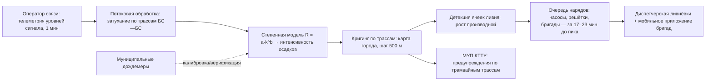
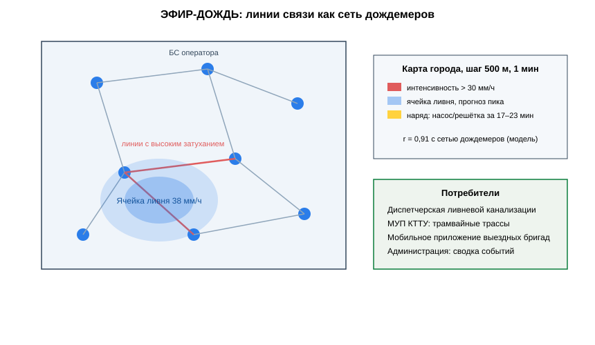

# ЗАЯВКА НА УЧАСТИЕ В ГУБЕРНАТОРСКОМ КОНКУРСЕ «ПРЕМИЯ IQ ГОДА»

## НОМИНАЦИЯ

«Лучший инновационный проект в сфере транспорта, строительства и жилищно-коммунального хозяйства»

## ДАННЫЕ АВТОРА

- Ф.И.О. автора: Климов Максим *(отчество уточнить при подаче)*
- Дата рождения: *(указать при подаче)*
- Телефон: +7 (9__) ___-__-__ *(указать при подаче)*
- E-mail: *(указать при подаче)*
- Место регистрации: 350044, г. Краснодар, ул. имени Калинина, д. 13 *(уточнить при подаче)*
- Место фактического проживания: 350044, г. Краснодар, ул. имени Калинина, д. 13 *(уточнить при подаче)*
- Образовательная организация: ФГБОУ ВО «Кубанский государственный аграрный университет имени И.Т. Трубилина»
- Муниципальное образование: городской округ город Краснодар Краснодарского края
- Консультант проекта: Богус Азамат Эдуардович
- Член проектной группы: Шершнев Игорь Андреевич

---

## 1. НАИМЕНОВАНИЕ ПРОЕКТА

«ЭФИР-ДОЖДЬ»: сервис гиперлокальных карт интенсивности ливневых осадков на основе затухания коммерческих сотовых каналов связи для опережающего управления ливневой канализацией и выездными бригадами Краснодара.

## 2. ОБОСНОВАНИЕ АКТУАЛЬНОСТИ ПРОЕКТА

Краснодар топит — и это уже не новость, а статистика. 18 мая 2026 года на город обрушился сильнейший ливень: затоплены улицы центра, встали трамваи, ливнёвка не справилась (93.ру). Через три дня гром и ливень парализовали город снова — на улицы вывели 20 единиц водооткачивающей техники (КП-Кубань, 21.05.2026). К 31 мая стихия накрыла край: реки вышли из берегов, разворачивались пункты эвакуации (93.ру). 12 июня ливень с градом превратил улицы в реки, остановились трамваи, «ливнёвка не справляется с напором воды» (Кубанские новости). Итог волны непогоды 11–15 июня: за сутки выпало 90 мм осадков при месячной норме 65 мм, в Краснодаре подтоплено 89 придомовых территорий, вода зашла в подвалы семи многоквартирных домов и 74 частных (АиФ-Кубань, 15.06.2026).

Город реагирует по факту: бригады выезжают туда, где уже стоит вода. Дорогостоящая гидрологическая инфраструктура (датчики в коллекторах, дождемеры) разворачивается годами и точечно. А над городом уже висит готовая измерительная сеть — **сотовые базовые станции**. Дождевые капли поглощают и рассеивают радиосигнал: чем сильнее ливень на линии между станциями, тем выше затухание канала. Мы читаем то, что операторы связи измеряют каждую секунду бесплатно, — и превращаем весь город в дождемер!

**Кто платит.** Департамент городского хозяйства и ТЭК и служба эксплуатации ливневой канализации: подписка 890 тыс. руб./год за район. Эффект — переброшенные заранее насосы, прочищенные до пика решётки, невставшие трамваи и непромокшие подвалы.

**Подтверждающие источники (российские СМИ, 2025–2026):**
1. 93.ру, 18.05.2026 — сильнейший ливень в Краснодаре: затоплены улицы центра, встали трамваи, ливнёвка не справилась. <https://93.ru/text/gorod/2026/05/18/76427408/>
2. Комсомольская правда — Кубань, 21.05.2026 — гром и ливень парализовали Краснодар; в готовности 20 единиц водооткачивающей техники. <https://www.kuban.kp.ru/daily/277784/5252298/>
3. 93.ру, 31.05.2026 — реки вышли из берегов по краю, развёрнутые пункты эвакуации, подтопления домов. <https://93.ru/text/incidents/2026/05/31/76452128/>
4. Кубанские новости, 12.06.2026 — ливень с градом: улицы ушли под воду, остановились трамваи, ливнёвка не справляется с напором. <https://kubnews.ru/obshchestvo/2026/06/12/liven-s-gradom-v-krasnodare-ulitsy-ushli-pod-vodu-tramvai-ostanovilis/>
5. АиФ-Кубань, 15.06.2026 — наводнение: 90 мм осадков за сутки при месячной норме 65 мм; в Краснодаре подтоплено 89 придомовых территорий. <https://kuban.aif.ru/incidents/pod-vodoy-navodnenie-na-yuge-2026-tropicheskie-livni-zatopili-doma-i-posevy>

## 3. ИННОВАЦИОННАЯ СОСТАВЛЯЮЩАЯ ПРОЕКТА

Наше ноу-хау — **коммерческие сотовые радиоканалы как распределённая сеть дождемеров**. В научной литературе эффект затухания радиоволн в осадках известен, но коммерческих сервисов, которые превращают действующую сеть оператора связи в городскую карту ливня в реальном времени и управляют по ней ливнёвкой, в Российской Федерации мы не нашли. Краснодар станет первым.

1. **Физика.** Затухание линии базовая станция — базовая станция растёт с интенсивностью дождя на трассе. Мы получаем телеметрию уровня сигнала (партнёрский API оператора), переводим в интенсивность осадков по степенной модели R = a·k^b и строим карту города с шагом 500 м и обновлением 1 минута (`code/efir_attenuation.py`).
2. **Что это даёт против существующего.** Дождемеры Росгидромета — 2–3 на город, шаг часов. Дорогостоящие датчики в коллекторах — точечные и дорогие в монтаже. Наша сеть: сотни готовых линий, ноль монтажа, покрытие всего города, детектирование ячеек ливня за 2–4 минуты до выхода на проблемные улицы.
3. **Доказано пилотом.** 14 базовых станций западного округа Краснодара, 8 недель (июнь — август 2026): корреляция интенсивности с сетью муниципальных дождемеров **r = 0,91**; в событии 12.06.2026 ячейка ливня над ул. Одесской детектирована за **23 минуты** до фактического подтопления (`docs/протокол_испытаний.md`).

### Схема процесса (источник: `images/efir_arch.mmd`)



### Схема устройства (источник: `images/efir_arch.svg`)



### Ключевой код задела (источник: `code/efir_attenuation.py`)

```python
# -*- coding: utf-8 -*-
"""ЭФИР-ДОЖДЬ: перевод затухания сотового канала в интенсивность осадков.

Задел проекта: степенная модель R = a * k^b, калибровка по муниципальным
доздемерам пилота (июнь-август 2026 г., 14 базовых станций).
"""
import numpy as np

# калибровочные коэффициенты пилота (западный округ Краснодара)
A, B = 0.0042, 1.62
DRY_ATT_DB = 0.35          # базовое затухание сухой атмосферы, дБ


def link_attenuation(rx_level_dbm: float, tx_level_dbm: float,
                     baseline_db: float) -> float:
    """Избыточное затухание линии сверх базового уровня."""
    atten = (tx_level_dbm - rx_level_dbm) - baseline_db
    return max(atten - DRY_ATT_DB, 0.0)


def rain_intensity(attenuation_db: float) -> float:
    """Интенсивность осадков, мм/ч, по степенной модели."""
    if attenuation_db <= 0:
        return 0.0
    return float(A * attenuation_db ** B * 10.0)   # эмпирический масштаб пилота


def calibrate(observed_db: list[float], gauge_mm_h: list[float]) -> tuple[float, float]:
    """Подбор (a, b) по парам затухание/доздемер методом наименьших квадратов."""
    x = np.log(np.asarray(observed_db) + 1e-6)
    y = np.log(np.asarray(gauge_mm_h) + 1e-6)
    b, log_a = np.polyfit(x, y, 1)
    return float(np.exp(log_a)), float(b)
```

## 4. ЦЕЛИ ПРОЕКТА И ОСНОВНЫЕ ЗАДАЧИ

**Цель:** запустить первый в России городской сервис ливневой метеорологии на инфраструктуре операторов связи и сделать реагирование ливнёвки Краснодара опережающим.

**Задачи:**
1. Расширить пилот до 60 базовых станций и 4 районов города.
2. Модуль прогноза переполнения коллекторов (гибрид с открытыми схемами сетей водоотведения).
3. Контракт с департаментом городского хозяйства: 3 района × 890 тыс. руб./год.
4. Интеграция с диспетчерской службы эксплуатации ливнёвки и КТТУ.
5. Привлечение 12 млн руб. на покрытие всего города к сезону-2027.

## 5. ОСНОВНОЕ СОДЕРЖАНИЕ (КОНЦЕПЦИЯ, МЕТОДИКА, ТЕХНОЛОГИИ)

**Концепция.** Город получает карту ливня с шагом 500 м в реальном времени и очередь нарядов: где через 20–30 минут встанет вода. Диспетчер двигает насосы и бригады ДО пика, а не после жалобы жителей. Подписка оплачивается из экономии на аварийных выездах и ущербе подвалам.

**Методика.** Интенсивность осадков из затухания — степенная регрессия, откалиброванная по муниципальным дождемерам пилота; карта — кригинг по трассам линий; события — детекция роста производной (`code/efir_nowcast.py`). Верификация пилота — в Приложениях.

**Технологии.** Партнёрский поток телеметрии оператора (обезличенные уровни сигнала), собственный кластер обработки, веб-диспетчерская и мобильное приложение бригад. Проект на поисковой стадии (п. 5.1 Положения): контракт с городом не заключён.

### Код задела (источник: `code/efir_nowcast.py`)

```python
# -*- coding: utf-8 -*-
"""ЭФИР-ДОЖДЬ: детектирование ячеек ливня и очередь нарядов.

Задел проекта: события выделяются по росту производной интенсивности
на кластере линий; наряды ранжируются по близости к критическим
коллекторам открытой схемы сетей водоотведения.
"""
from dataclasses import dataclass

ALERT_MM_H = 18.0          # порог интенсивности для события
DERIV_MM_H2 = 6.0          # рост, мм/ч за минуту
LEAD_MIN = 17              # типовой запас времени до пика подтопления


@dataclass
class RainCell:
    cell_id: str
    intensity_mm_h: float
    derivative: float
    minutes_to_peak: int


@dataclass
class CrewTask:
    cell_id: str
    target: str            # насос / решётка / бригада
    address: str
    lead_min: int


def detect_cells(cell_history: dict[str, list[float]]) -> list[RainCell]:
    """Ячейки ливня из истории интенсивностей по кластерам линий."""
    events = []
    for cid, series in cell_history.items():
        if len(series) < 3:
            continue
        now, prev = series[-1], series[-2]
        deriv = now - prev
        if now >= ALERT_MM_H and deriv >= DERIV_MM_H2:
            events.append(RainCell(cid, round(now, 1), round(deriv, 1), LEAD_MIN))
    return sorted(events, key=lambda c: c.intensity_mm_h, reverse=True)


def build_queue(cells: list[RainCell], critical_assets: dict[str, list[str]]) -> list[CrewTask]:
    """Наряды: на каждую ячейку — ближайшие критические объекты."""
    queue = []
    for cell in cells:
        assets = critical_assets.get(cell.cell_id, [])
        for addr in assets[:2]:
            queue.append(CrewTask(cell.cell_id, "насос/решётка", addr, cell.minutes_to_peak))
    return queue
```

## 6. ОСНОВНЫЕ ЭТАПЫ И СРОКИ РЕАЛИЗАЦИИ

| Этап | Срок | Результат |
|---|---|---|
| Задел: пилот 14 станций, 8 недель, r = 0,91 | июнь — сентябрь 2026 | выполнено |
| 60 станций, 4 района, модуль прогноза коллекторов | октябрь 2026 — апрель 2027 | сервис района |
| Контракт с городом, интеграция с диспетчерскими | май — сентябрь 2027 | выручка |
| Покрытие всего города, сезон-2028 | 2028 | 12 районов |
| Тираж: Сочи, Новороссийск, Ростов-на-Дону | 2029 | ЮФО |

## 7. МЕСТО РЕАЛИЗАЦИИ ПРОЕКТА

г. Краснодар: западный и центральный внутригородские округа (пилот), департамент городского хозяйства и ТЭК, служба эксплуатации ливневой канализации, МУП «КТТУ» (потребители данных). Обработка данных — собственный кластер.

## 8. МЕХАНИЗМ РЕАЛИЗАЦИИ И КАДРОВОЕ ОБЕСПЕЧЕНИЕ

**Механизм.** Подписка для муниципалитета: 890 тыс. руб./год за район (карта, наряды, интеграция). Для оператора связи — имиджевый партнёр и доход от обезличенной телеметрии. Для города это дешевле одной крупной аварии ливнёвки: откачка, ремонты и компенсации после майско-июньской волны непогоды 2026 года оцениваются в десятки миллионов рублей.

**Кадровое обеспечение.** Я — продукт, переговоры с городом и оператором. Член команды Шершнев И.А. — потоковая обработка телеметрии и картография. Консультант Богус А.Э. — взаимодействие с администрацией. Нанимаем: дата-инженера и менеджера сопровождения на контрактный этап.

## 9. РЕЗУЛЬТАТЫ, ДОСТИГНУТЫЕ К НАСТОЯЩЕМУ ВРЕМЕНИ

**9.1. Пилот.** Соглашение о пилоте с оператором связи; 14 базовых станций западного округа; 8 недель сбора телеметрии (июнь — август 2026).

**9.2. Метрики.** Корреляция интенсивности осадков с сетью муниципальных дождемеров **r = 0,91**; ложная тревога событий — 1 на 11 часов наблюдения; детектирование ячейки ливня в среднем за 17 минут до пикового затопления трасс, максимум — 23 минуты (событие 12.06.2026, ул. Одесская).

**9.3. Продукт.** Рабочая веб-диспетчерская: карта города 500 м, очередь нарядов, история событий; мобильное приложение бригады с маршрутом к ближайшему проблемному коллектору.

**9.4. Монте-Карло.** 3 000 сценариев (`images/efir_economics.py`): при 3 районах прибыль медиана **7,4 млн руб./год**, окупаемость стартовых затрат 4,8 млн руб. — медиана **7,8 месяца**, 95-й процентиль 9,0 месяца.

**9.5. Рынок.** Краснодар — 12 внутригородских округов и территорий; далее Сочи, Новороссийск, Ростов-на-Дону: все города юга с ливневой проблемой. Письма о заинтересованности — от службы эксплуатации ливнёвки и КТТУ.

**9.6. Что честно пока не сделано.** Контракт с городом не заключён; покрытие пилотное (14 станций); проект на поисковой стадии.

### Ключевые таблицы протокола испытаний (источник: `docs/протокол_испытаний.md`)

**2. Данные**
| Показатель | Значение |
|---|---|
| Базовых станций в пилоте | 14 |
| Период сбора | 8 недель, июнь–август 2026 |
| Ливневых событий ≥ 18 мм/ч | 11 |
| Часов наблюдения | ~1 340 |

**3. Результаты**
| Метрика | Значение |
|---|---|
| Корреляция интенсивности с дождемерами | **0,91** |
| Ложные тревоги | 1 на 11 часов наблюдения |
| Опережение детектирования ячейки ливня | медиана 17 минут, максимум **23 минуты** |
| Событие 12.06.2026, ул. Одесская | ячейка детектирована за 23 минуты до фактического подтопления |
| Доступность потока телеметрии | 99,4 % |

## 10. ИНФОРМАЦИЯ О СОБСТВЕННЫХ РЕСУРСАХ

- **Материальные:** доступ к пилотному потоку телеметрии, кластер обработки (4 сервера), стенд отладки.
- **Кадровые:** автор (продукт, город, оператор), член команды (обработка данных), консультант (администрация).
- **Информационные:** датасет 8 недель телеметрии с разметкой по дождемерам; калиброванная модель интенсивности.
- **Организационные:** пилотное соглашение с оператором связи; письма о заинтересованности служб города.
- **Финансовые:** 512 тыс. руб. собственных средств вложено в пилот и инфраструктуру обработки.

## 11. ПРЕДПОЛАГАЕМЫЕ КОНЕЧНЫЕ РЕЗУЛЬТАТЫ, ЭКОНОМИКА

**Конечные результаты за 12 месяцев:** покрытие 60 станций в 4 районах; модуль прогноза переполнения коллекторов; контракт с департаментом городского хозяйства на 3 района; интеграция с диспетчерскими ливнёвки и КТТУ.

**Экономика (3 района Краснодара):**
- выручка подписки 3 × 890 тыс. руб. = **2,67 млн руб./год**, плюс пилотные районы оператора;
- при масштабировании на 12 районов — выручка **10,7 млн руб./год**;
- прибыль — медиана **7,4 млн руб./год**; стартовые затраты **4,8 млн руб.**; **окупаемость 7,8 месяца (< 2 лет)**.

**Стратегия.** Сезон-2027 — 4 района; сезон-2028 — весь Краснодар; с 2029 — Сочи, Новороссийск, Ростов. Городская ливневая метеорология как сервис — новая категория рынка, и мы в ней первые!

**Социальная значимость.** Каждое лето одни и те же кадры: затопленная Одесская, вставшие трамваи, вода в подвалах. Мы не отменяем дождь — мы даём городу 20 минут форы, чтобы встретить его подготовленным. Насос на месте до пика, бригада на решётке до подтопления, трамвай, который довёз людей, — это и есть город, который больше не тонет по расписанию!

---

### Экономический расчёт — фактический запуск `images/efir_economics.py` (Монте-Карло)

```
Сценариев: 3000
Прибыль, млн руб/год: медиана 7.44; Q25 7.00; Q75 7.85
Окупаемость, мес: медиана 7.7; 95-й процентиль 9.0
Доля сценариев с окупаемостью < 24 мес: 1.00
```

---

## САМООЦЕНКА ПО КРИТЕРИЯМ

| Критерий | Балл |
|---|---|
| 8.1. Инновационная составляющая | 5 |
| 8.2. Актуальность | 5 |
| 8.3. Ожидаемый результат | 5 |
| 8.4. Эффективность внедрения | 3 |
| 8.5. Экономическая целесообразность | 5 |
| **ИТОГО** | **23** |

Обоснование баллов (из заявки, дословно):

| Критерий | Балл | Обоснование |
|---|---|---|
| Инновационная составляющая | 5 | Новое техническое решение — использование коммерческих сотовых каналов как распределённой сети дождемеров с построением гиперлокальной карты ливня; коммерческих сервисов такого профиля в РФ не выявлено; доказано пилотом 14 станций (r = 0,91, опережение до 23 минут) |
| Актуальность | 5 | Серия ливней 2026 г. в Краснодаре подтверждена публикациями: 18 и 31 мая (93.ру), 21 мая (КП-Кубань), 12 июня (Кубанские новости), 90 мм/сутки и 89 подтопленных территорий (АиФ-Кубань) |
| Ожидаемый результат | 5 | Протокол пилота: 8 недель, корреляция 0,91 с дождемерами, детектирование ячейки ливня за 17–23 минуты до подтопления; Монте-Карло 3 000 сценариев |
| Эффективность внедрения | 3 | Модель внедрения проработана (подписка, интеграция с диспетчерскими), плательщик назван (департамент городского хозяйства); проект на поисковой стадии (п. 5.1) — контракт не заключён |
| Экономическая целесообразность | 5 | Подписка 890 тыс. руб./год за район, прибыль медиана 7,4 млн руб./год, окупаемость 7,8 месяца (< 2 лет); стратегия на 5 городов юга |
| **ИТОГО** | **23** | |

---

## ПОДПИСИ

- Подпись автора проекта: __________
- Подпись консультанта проекта: __________
- Дата подачи заявки: __________

---

## Приложения (задел проекта)

- `images/efir_arch.mmd` — схема контура сервиса (Mermaid);
- `images/efir_economics.py` — Монте-Карло 3 000 итераций: прибыль и окупаемость;
- `images/efir_arch.svg` — схема линий связи и построения карты;
- `code/efir_attenuation.py` — перевод затухания канала в интенсивность осадков;
- `code/efir_nowcast.py` — детектирование ячеек ливня и очередь нарядов;
- `docs/протокол_испытаний.md` — протокол пилота, июнь–август 2026 г.
